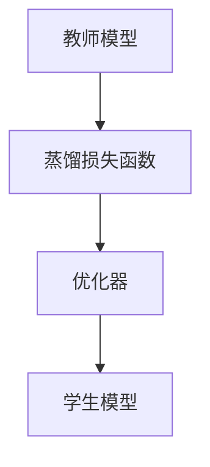
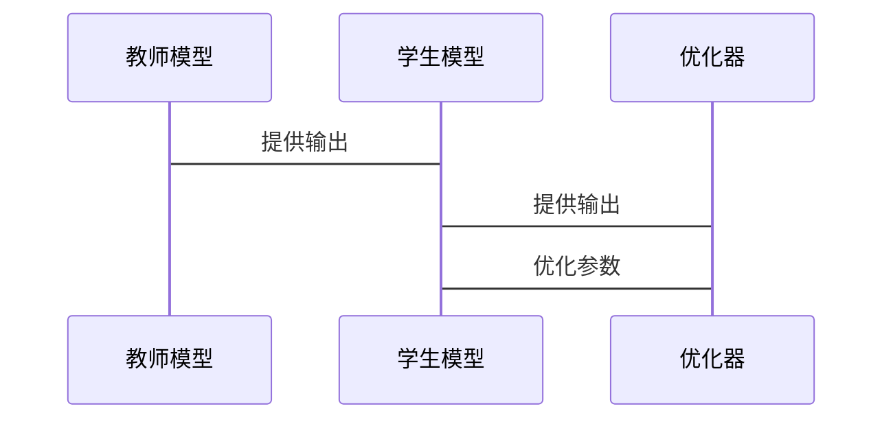

                 


# AI Agent的模型蒸馏技术：从庞大LLM到高效精简版

> 关键词：AI Agent，模型蒸馏，大型语言模型，知识蒸馏，参数蒸馏，模型压缩

> 摘要：本文将深入探讨AI Agent中的模型蒸馏技术，从庞大复杂的大型语言模型（LLM）出发，逐步分析其精简优化的过程。通过理论与实践结合的方式，详细解读模型蒸馏的核心原理、实现细节、系统架构，并通过具体案例展示如何将复杂的LLM精简为高效、精简的版本，同时保持其性能和功能的完整性。本文旨在为AI开发者、研究人员及相关技术人员提供一份全面的技术指南，帮助他们在实际项目中更好地应用模型蒸馏技术。

---

# 第1章: AI Agent与模型蒸馏技术的背景

## 1.1 AI Agent的基本概念

### 1.1.1 AI Agent的定义与特点

AI Agent（人工智能代理）是指能够感知环境、自主决策并执行任务的智能实体。它具备以下特点：

1. **自主性**：能够在没有外部干预的情况下独立运行。
2. **反应性**：能够根据环境反馈实时调整行为。
3. **目标导向**：通过设定目标来驱动决策和行动。
4. **社会能力**：能够与其他Agent或人类进行交互与协作。

AI Agent在许多领域都有广泛应用，例如自动驾驶、智能助手、机器人控制等。

### 1.1.2 大型语言模型（LLM）的现状与挑战

近年来，随着深度学习技术的发展，大型语言模型（Large Language Models, LLMs）如GPT-3、GPT-4等取得了显著的成果。这些模型通常包含 billions 量级的参数，具备强大的自然语言处理能力。然而，其庞大的规模也带来了以下挑战：

1. **计算资源消耗大**：训练和推理都需要大量的计算资源，成本高昂。
2. **部署难度高**：难以在资源受限的环境中运行。
3. **推理速度慢**：复杂的模型结构会导致推理时间增加。

### 1.1.3 模型蒸馏技术的定义与意义

模型蒸馏（Model Distillation）是一种通过将复杂模型的知识迁移到 simpler 模型的技术。其核心思想是将教师模型（Teacher）的知识提取出来，传授给学生模型（Student）。通过蒸馏技术，我们可以将庞大的LLM精简为更小、更高效的模型，同时保持其性能。

---

## 1.2 模型蒸馏技术的核心概念

### 1.2.1 教师模型与学生模型的关系

在模型蒸馏中，教师模型通常是一个复杂的大型模型，而学生模型是一个更小、更简单的模型。学生模型通过模仿教师模型的行为和决策，逐步掌握教师模型的知识。

### 1.2.2 蒸馏的目标与过程

蒸馏的目标是通过知识转移，使学生模型在性能上接近甚至超越教师模型。具体过程包括以下步骤：

1. **教师模型的训练**：首先训练一个复杂的教师模型，使其在特定任务上达到最优性能。
2. **知识提取**：将教师模型的知识提取出来，通常以概率分布或特征表示的形式。
3. **学生模型的训练**：在教师模型的指导下，训练学生模型，使其掌握教师模型的知识。

### 1.2.3 蒸馏技术在LLM中的应用

在LLM中，蒸馏技术主要用于以下几个方面：

1. **模型压缩**：将复杂的LLM精简为更小的模型，降低计算资源消耗。
2. **推理加速**：通过精简模型提升推理速度，满足实时应用的需求。
3. **多任务迁移**：将教师模型在多个任务上的知识迁移到学生模型，提升其泛化能力。

---

## 1.3 本章小结

本章主要介绍了AI Agent的基本概念、大型语言模型的现状与挑战，以及模型蒸馏技术的定义与意义。通过这些内容，我们明确了蒸馏技术在LLM中的重要性，以及其在实际应用中的潜力。

---

# 第2章: 蒸馏技术的核心原理与数学模型

## 2.1 蒸馏技术的基本原理

### 2.1.1 知识蒸馏与参数蒸馏的区别

知识蒸馏（Knowledge Distillation）关注于将教师模型的知识以概率分布的形式传递给学生模型，而参数蒸馏（Parameter Distillation）则关注于将教师模型的参数直接传递给学生模型。

### 2.1.2 蒸馏损失函数的定义

蒸馏损失函数的核心思想是通过最小化学生模型输出与教师模型输出之间的差异，来实现知识的转移。具体公式如下：

$$L_{distill} = \alpha L_{CE}(S, T) + (1-\alpha) L_{CE}(S, S_{target})$$

其中，$\alpha$ 是平衡系数，$L_{CE}$ 是交叉熵损失函数，$S$ 是学生模型的输出，$T$ 是教师模型的输出，$S_{target}$ 是目标输出。

### 2.1.3 蒸馏过程中的数学推导

在蒸馏过程中，教师模型和学生模型的输出概率分布需要尽可能接近。具体来说，学生模型的输出概率分布 $P(S)$ 应该逼近教师模型的输出概率分布 $P(T)$。通过不断优化损失函数，我们可以使学生模型的输出逐步逼近教师模型的输出。

---

## 2.2 蒸馏过程中的数学推导

### 2.2.1 教师模型的输出概率分布

$$P(T|x) = \argmax_{y} P(y|x)$$

### 2.2.2 学生模型的损失函数

$$L_{total} = L_{distill} + L_{task}$$

其中，$L_{task}$ 是学生模型在特定任务上的损失函数。

---

## 2.3 蒸馏技术的优缺点分析

### 2.3.1 优点：模型压缩、推理效率提升

通过蒸馏技术，我们可以将复杂的模型压缩为更小的模型，同时保持其性能。这不仅降低了计算资源的消耗，还提高了推理效率。

### 2.3.2 缺点：性能损失、适用场景受限

尽管蒸馏技术可以显著降低模型规模，但在某些复杂任务上，学生模型的性能可能无法完全达到教师模型的水平。此外，蒸馏技术的适用性也受到教师模型质量的限制。

---

## 2.4 本章小结

本章详细介绍了蒸馏技术的核心原理，包括知识蒸馏与参数蒸馏的区别、蒸馏损失函数的定义与推导。同时，我们还分析了蒸馏技术的优缺点，为后续的实现与优化奠定了基础。

---

# 第3章: 蒸馏技术的实现细节

## 3.1 蒸馏技术的实现流程

### 3.1.1 教师模型的选择与训练

选择一个性能优秀的教师模型是蒸馏技术成功的关键。通常，教师模型是一个经过充分训练的大型语言模型。

### 3.1.2 学生模型的设计与训练

学生模型的设计需要考虑其规模和复杂度。通常，学生模型是一个小型的神经网络，例如基于Transformer的架构。

### 3.1.3 蒸馏过程中的超参数调整

蒸馏过程中的超参数（如平衡系数 $\alpha$）需要通过实验进行调整，以找到最佳的参数组合。

---

## 3.2 蒸馏技术的数学模型

### 3.2.1 蒸馏损失函数的优化

通过优化蒸馏损失函数，我们可以使学生模型的输出逐步逼近教师模型的输出。具体优化过程如下：

$$\argmin_{\theta} L_{distill}$$

其中，$\theta$ 是学生模型的参数。

### 3.2.2 学生模型的更新规则

学生模型的参数更新规则如下：

$$\theta_{new} = \theta_{old} - \eta \cdot \nabla_{\theta} L_{distill}$$

其中，$\eta$ 是学习率，$\nabla_{\theta}$ 是损失函数对 $\theta$ 的梯度。

---

## 3.3 蒸馏技术的实现代码示例

以下是一个简单的蒸馏技术实现代码示例：

```python
import torch
import torch.nn as nn
import torch.optim as optim

class TeacherModel(nn.Module):
    def __init__(self):
        super(TeacherModel, self).__init__()
        self.fc = nn.Linear(100, 10)

    def forward(self, x):
        return self.fc(x)

class StudentModel(nn.Module):
    def __init__(self):
        super(StudentModel, self).__init__()
        self.fc = nn.Linear(100, 10)

    def forward(self, x):
        return self.fc(x)

def distillation_loss(output, teacher_output, alpha=0.5):
    criterion = nn.KLDivLoss(reduction='batchmean')
    loss = alpha * criterion(torch.log_softmax(output, dim=1), torch.softmax(teacher_output, dim=1)) + (1 - alpha) * nn.CrossEntropyLoss()(output, labels)
    return loss

def train_student():
    teacher = TeacherModel()
    student = StudentModel()
    optimizer = optim.Adam(student.parameters(), lr=0.001)
    for epoch in range(num_epochs):
        for batch in dataloader:
            inputs, labels = batch
            teacher_output = teacher(inputs)
            student_output = student(inputs)
            loss = distillation_loss(student_output, teacher_output, alpha=0.5)
            optimizer.zero_grad()
            loss.backward()
            optimizer.step()
    return student

if __name__ == '__main__':
    train_student()
```

---

## 3.4 本章小结

本章详细介绍了蒸馏技术的实现细节，包括教师模型与学生模型的设计、蒸馏损失函数的优化，以及具体的代码实现。通过这些内容，我们可以更好地理解蒸馏技术的实际操作流程。

---

# 第4章: 蒸馏技术在LLM中的应用

## 4.1 LLM的蒸馏过程

### 4.1.1 LLM的蒸馏目标

在LLM中，蒸馏的目标是将大型模型的知识迁移到更小的模型中，同时保持其在自然语言处理任务上的性能。

### 4.1.2 LLM的蒸馏实现

通过蒸馏技术，我们可以将GPT-3等大型模型的知识迁移到更小的模型中，例如GPT-2或甚至更小的模型。

---

## 4.2 蒸馏技术在NLP任务中的应用

### 4.2.1 文本生成任务

在文本生成任务中，通过蒸馏技术，我们可以将复杂的文本生成模型迁移到更小的模型中，同时保持生成文本的质量。

### 4.2.2 机器翻译任务

在机器翻译任务中，蒸馏技术可以帮助我们将复杂的翻译模型迁移到更小的模型中，降低计算资源的消耗。

---

## 4.3 蒸馏技术的优化与提升

### 4.3.1 模型压缩技术

通过模型压缩技术，我们可以进一步降低模型的规模，同时保持其性能。

### 4.3.2 模型量化技术

模型量化技术是一种通过降低模型参数的精度来减少模型规模的技术，可以与蒸馏技术结合使用。

---

## 4.4 本章小结

本章详细介绍了蒸馏技术在LLM中的应用，包括LLM的蒸馏过程、NLP任务中的具体应用，以及模型压缩和量化等优化技术。

---

# 第5章: 蒸馏技术的优化与提升

## 5.1 模型压缩技术

### 5.1.1 模型剪枝

模型剪枝是一种通过删除模型中冗余的参数或神经元来降低模型规模的技术。

### 5.1.2 模型蒸馏与模型剪枝的结合

通过将模型蒸馏与模型剪枝结合，可以进一步优化模型的规模和性能。

---

## 5.2 模型量化技术

### 5.2.1 模型量化的基本概念

模型量化是指通过降低模型参数的精度（例如从浮点数降到定点数）来减少模型规模的技术。

### 5.2.2 模型量化与蒸馏技术的结合

通过将模型量化与蒸馏技术结合，可以在进一步降低模型规模的同时，保持其性能。

---

## 5.3 蒸馏技术的其他优化策略

### 5.3.1 知识蒸馏与任务蒸馏的结合

任务蒸馏是一种通过将教师模型在多个任务上的知识传递给学生模型的技术。

### 5.3.2 模型蒸馏与迁移学习的结合

通过将模型蒸馏与迁移学习结合，可以进一步提升模型的泛化能力。

---

## 5.4 本章小结

本章详细介绍了蒸馏技术的优化与提升策略，包括模型压缩技术、模型量化技术，以及知识蒸馏与任务蒸馏的结合等。

---

# 第6章: 蒸馏技术的系统架构与实现方案

## 6.1 系统功能设计

### 6.1.1 系统功能模块

1. **教师模型模块**：负责生成教师模型的输出。
2. **学生模型模块**：负责生成学生模型的输出。
3. **蒸馏损失函数模块**：负责计算蒸馏损失函数。
4. **优化器模块**：负责优化学生模型的参数。

### 6.1.2 系统功能流程

1. 教师模型生成输出。
2. 学生模型生成输出。
3. 计算蒸馏损失函数。
4. 优化学生模型的参数。

---

## 6.2 系统架构设计

### 6.2.1 系统架构图

以下是一个简单的系统架构图：



### 6.2.2 系统接口设计

1. **教师模型接口**：提供教师模型的输出。
2. **学生模型接口**：提供学生模型的输出。
3. **蒸馏损失函数接口**：计算蒸馏损失函数。
4. **优化器接口**：优化学生模型的参数。

---

## 6.3 系统交互流程

### 6.3.1 系统交互序列图

以下是一个简单的系统交互序列图：



---

## 6.4 本章小结

本章详细介绍了蒸馏技术的系统架构与实现方案，包括系统功能设计、系统架构设计，以及系统交互流程。

---

# 第7章: 蒸馏技术的项目实战

## 7.1 项目环境安装

### 7.1.1 安装Python环境

```bash
python --version
pip install torch
```

### 7.1.2 安装其他依赖

```bash
pip install numpy
pip install matplotlib
```

---

## 7.2 项目核心实现

### 7.2.1 教师模型实现

```python
class TeacherModel(nn.Module):
    def __init__(self):
        super(TeacherModel, self).__init__()
        self.fc = nn.Linear(100, 10)

    def forward(self, x):
        return self.fc(x)
```

### 7.2.2 学生模型实现

```python
class StudentModel(nn.Module):
    def __init__(self):
        super(StudentModel, self).__init__()
        self.fc = nn.Linear(100, 10)

    def forward(self, x):
        return self.fc(x)
```

### 7.2.3 蒸馏损失函数实现

```python
def distillation_loss(output, teacher_output, alpha=0.5):
    criterion = nn.KLDivLoss(reduction='batchmean')
    loss = alpha * criterion(torch.log_softmax(output, dim=1), torch.softmax(teacher_output, dim=1)) + (1 - alpha) * nn.CrossEntropyLoss()(output, labels)
    return loss
```

---

## 7.3 项目实战案例分析

### 7.3.1 数据集准备

```python
import torch
from torch.utils.data import DataLoader

# 假设我们有一个简单的数据集
class SimpleDataset(torch.utils.data.Dataset):
    def __init__(self, data, labels):
        self.data = data
        self.labels = labels

    def __len__(self):
        return len(self.data)

    def __getitem__(self, idx):
        return self.data[idx], self.labels[idx]

data = torch.randn(100, 100)
labels = torch.randint(0, 10, (100,))

dataloader = DataLoader(SimpleDataset(data, labels), batch_size=32, shuffle=True)
```

### 7.3.2 训练过程

```python
def train_student():
    teacher = TeacherModel()
    student = StudentModel()
    optimizer = optim.Adam(student.parameters(), lr=0.001)
    for epoch in range(num_epochs):
        for batch in dataloader:
            inputs, labels = batch
            teacher_output = teacher(inputs)
            student_output = student(inputs)
            loss = distillation_loss(student_output, teacher_output, alpha=0.5)
            optimizer.zero_grad()
            loss.backward()
            optimizer.step()
    return student

if __name__ == '__main__':
    train_student()
```

---

## 7.4 项目小结

本章通过具体的项目实战，展示了蒸馏技术的实现过程。通过数据集准备、模型实现、损失函数定义以及训练过程的详细代码，读者可以更好地理解蒸馏技术的实际应用。

---

# 第8章: 蒸馏技术的总结与展望

## 8.1 本章总结

本文详细探讨了AI Agent中的模型蒸馏技术，从庞大复杂的大型语言模型（LLM）出发，逐步分析了其精简优化的过程。通过理论与实践结合的方式，详细解读了蒸馏技术的核心原理、实现细节、系统架构，并通过具体案例展示了如何将复杂的LLM精简为高效、精简的版本，同时保持其性能和功能的完整性。

---

## 8.2 未来展望

随着AI技术的不断发展，模型蒸馏技术将在更多领域得到应用。未来的研究方向可能包括：

1. **更高效的蒸馏算法**：探索更高效的蒸馏算法，进一步提升蒸馏效率。
2. **多模态蒸馏技术**：将蒸馏技术扩展到多模态模型，提升模型的泛化能力。
3. **动态蒸馏技术**：研究动态蒸馏技术，使其能够适应动态变化的环境。

---

## 8.3 最佳实践 Tips

1. **选择合适的教师模型**：教师模型的质量直接影响蒸馏效果，选择合适的教师模型是关键。
2. **合理设置蒸馏参数**：通过实验调整蒸馏过程中的参数，找到最佳的参数组合。
3. **结合其他优化技术**：将蒸馏技术与其他优化技术（如模型压缩、量化等）结合使用，进一步提升模型性能。

---

## 8.4 作者信息

作者：AI天才研究院/AI Genius Institute  
禅与计算机程序设计艺术 /Zen And The Art of Computer Programming

---

# 结语

通过本文的探讨，我们深入理解了AI Agent中的模型蒸馏技术，从理论到实践，全面掌握了其核心原理与实现细节。希望本文能够为读者在实际项目中应用模型蒸馏技术提供有价值的参考与指导。

