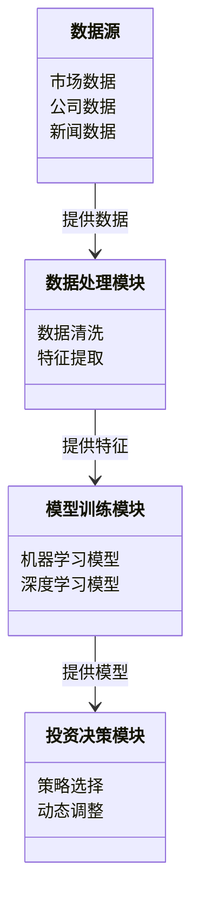
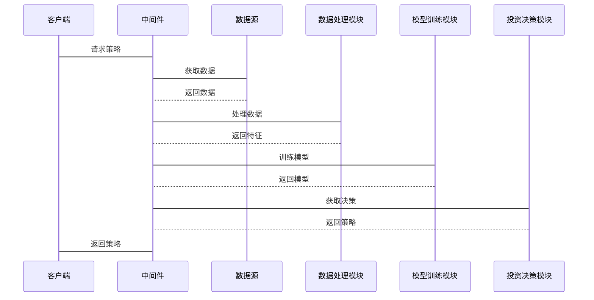

                 


# AI驱动的动态价值投资策略适应

> 关键词：AI，动态价值投资，策略适应，金融分析，机器学习，时间序列分析

> 摘要：本文详细探讨了AI在动态价值投资策略中的应用，分析了传统投资策略的局限性，介绍了AI驱动的动态价值投资的核心概念、算法原理、系统架构设计以及实战案例。通过数学模型、算法流程图和代码实现，深入剖析了AI如何提升投资策略的适应性和收益性。

---

# 第一部分: AI驱动的动态价值投资策略概述

## 第1章: AI驱动的动态价值投资策略概述

### 1.1 动态价值投资的基本概念

#### 1.1.1 传统价值投资的定义与特点
传统价值投资是一种以基本面分析为基础的投资策略，强调以低于内在价值的价格买入优质资产，长期持有，等待市场回归。其核心在于寻找被市场低估的企业，关注企业的财务状况、行业地位和长期盈利能力。

#### 1.1.2 动态价值投资的定义与特点
动态价值投资是对传统价值投资的延伸，强调在市场环境变化中，根据实时数据和市场动态调整投资策略。其特点是：
- 数据驱动：依赖实时数据和市场信息进行决策。
- 灵活性：能够根据市场变化快速调整投资组合。
- AI辅助：利用人工智能技术进行复杂的数据分析和预测。

#### 1.1.3 AI在动态价值投资中的角色与优势
AI在动态价值投资中的作用主要体现在数据处理、模式识别和预测建模方面：
- 数据处理：AI能够快速处理海量数据，提取有用的特征。
- 模式识别：通过机器学习算法识别市场中的潜在模式和趋势。
- 预测建模：利用深度学习模型预测市场走势和资产价格。

### 1.2 AI驱动的动态价值投资策略背景

#### 1.2.1 当前金融市场的复杂性与不确定性
现代金融市场受到多种因素的影响，包括宏观经济指标、政策变化、行业动态和突发事件等。这些因素使得市场具有高度的不确定性和复杂性，传统的静态投资策略难以适应快速变化的市场环境。

#### 1.2.2 传统投资策略的局限性
传统投资策略在以下方面存在明显不足：
- 依赖经验：依赖投资经理的个人经验和市场直觉，存在主观性和局限性。
- 反应迟缓：面对突发事件和市场变化，传统策略难以快速调整。
- 数据处理能力有限：传统分析方法难以处理海量数据，无法捕捉所有潜在机会和风险。

#### 1.2.3 AI在金融领域的应用现状
AI技术在金融领域的应用已经取得显著进展，特别是在以下几个方面：
- 量化交易：利用算法进行高频交易和套利。
- 风险管理：通过AI模型预测和管理投资风险。
- 市场预测：利用深度学习模型预测股票价格和市场趋势。

### 1.3 AI驱动的动态价值投资策略的核心要素

#### 1.3.1 数据驱动的投资决策
AI驱动的投资决策依赖于大量的数据，包括市场数据、公司财务数据、新闻数据等。通过数据挖掘和分析，AI能够发现潜在的投资机会和风险。

#### 1.3.2 AI算法在市场预测中的应用
AI算法（如机器学习和深度学习）能够分析历史数据，识别市场趋势和模式，从而帮助投资者做出更准确的预测。

#### 1.3.3 动态调整投资组合的机制
动态调整投资组合是AI驱动策略的核心，通过实时监控市场变化，AI能够自动调整资产配置，优化投资组合的风险收益比。

---

## 第2章: AI驱动的动态价值投资策略的核心概念与联系

### 2.1 核心概念原理

#### 2.1.1 时间序列分析
时间序列分析是一种统计方法，用于分析随时间变化的数据。在投资中，时间序列分析常用于预测股票价格和市场趋势。

#### 2.1.2 强化学习在投资决策中的应用
强化学习是一种通过试错和奖励机制来优化决策的算法。在投资中，强化学习可以用于动态调整投资组合和交易策略。

#### 2.1.3 聚类分析在市场分割中的作用
聚类分析是一种无监督学习方法，用于将数据分成相似的群组。在投资中，聚类分析可以用于识别市场中的相似资产和风险敞口。

### 2.2 核心概念属性对比表格

| 比较维度       | 传统投资策略 | AI驱动的动态价值投资 |
|----------------|--------------|-----------------------|
| 数据依赖性     | 低           | 高                   |
| 策略调整频率   | 低           | 高                   |
| 算法复杂度     | 低           | 高                   |
| 预测能力       | 有限         | 强                   |
| 反应速度       | 慢           | 快                   |

### 2.3 ER实体关系图架构

```mermaid
erd
    entity 投资者 {
        id: int
        名称: string
        资产: float
        投资策略: string
    }

    entity 数据源 {
        id: int
        数据类型: string
        数据来源: string
        数据时间: date
    }

    entity 投资决策 {
        id: int
        决策类型: string
        决策时间: date
        决策结果: string
    }

    投资者 -->> 数据源: 获取数据
    数据源 --> 投资决策: 支持决策
    投资者 <-->> 投资决策: 执行策略
```

---

## 第3章: AI驱动的动态价值投资策略的算法原理

### 3.1 时间序列分析算法

#### 3.1.1 ARIMA模型的原理与应用

ARIMA（AutoRegressive Integrated Moving Average）模型是一种常用的时间序列预测模型，适用于具有趋势和季节性的数据。其基本结构包括自回归部分、差分部分和移动平均部分。

$$ ARIMA(p, d, q) $$

- $p$：自回归阶数
- $d$：差分阶数
- $q$：移动平均阶数

#### 3.1.2 LSTM网络的结构与优势

LSTM（长短期记忆网络）是一种特殊的RNN结构，能够有效处理时间序列中的长期依赖关系。其核心在于引入记忆门控机制：

$$ f(t) = \sigma(W_f \cdot [h_{t-1}, x_t] + b_f) $$

其中：
- $W_f$：遗忘门权重
- $h_{t-1}$：前一时刻的隐藏状态
- $x_t$：当前输入
- $b_f$：遗忘门偏置

#### 3.1.3 GARCH模型在风险管理中的应用

GARCH（广义自回归条件异方差）模型用于预测金融资产的波动性，常用于风险管理。

$$ GARCH(p, q) $$

- $p$：自回归阶数
- $q$：条件异方差阶数

---

### 3.2 强化学习算法

#### 3.2.1 Q-Learning算法的基本原理

Q-Learning是一种基于值迭代的强化学习算法，通过更新Q值函数来优化决策策略。

$$ Q(s, a) = Q(s, a) + \alpha [r + \gamma \max Q(s', a')] $$

其中：
- $s$：当前状态
- $a$：当前动作
- $r$：奖励
- $\gamma$：折扣因子
- $\alpha$：学习率

#### 3.2.2 Deep Q-Networks在投资决策中的应用

Deep Q-Networks（DQN）将Q-Learning与深度神经网络结合，用于处理高维状态空间。

#### 3.2.3 策略网络的构建与训练

策略网络直接输出最优动作，常用于解决复杂的投资决策问题。

---

### 3.3 聚类分析算法

#### 3.3.1 K-Means算法的原理与应用

K-Means是一种经典的聚类算法，适用于将数据分成K个簇。

$$ \text{目标函数} = \sum_{i=1}^{K} \sum_{j=1}^{n_i} (x_j - \mu_i)^2 $$

其中：
- $K$：簇的数量
- $n_i$：第i个簇中的数据点数量
- $\mu_i$：第i个簇的中心

#### 3.3.2 层次聚类在市场分割中的应用

层次聚类是一种逐步合并或分割数据点的聚类方法，常用于市场细分。

#### 3.3.3 DBSCAN算法在异常检测中的应用

DBSCAN（Density-Based Spatial Clustering of Applications with Noise）是一种基于密度的聚类算法，适用于异常检测。

---

## 第4章: AI驱动的动态价值投资策略的数学模型与公式

### 4.1 时间序列分析的数学模型

#### 4.1.1 ARIMA模型的数学表达式

$$ ARIMA(p, d, q) $$

其中：
- $p$：自回归阶数
- $d$：差分阶数
- $q$：移动平均阶数

#### 4.1.2 LSTM网络的长短期记忆机制

$$ f(t) = \sigma(W_f \cdot [h_{t-1}, x_t] + b_f) $$

其中：
- $W_f$：遗忘门权重
- $h_{t-1}$：前一时刻的隐藏状态
- $x_t$：当前输入
- $b_f$：遗忘门偏置

---

## 第5章: AI驱动的动态价值投资策略的系统分析与架构设计

### 5.1 系统分析

#### 5.1.1 问题场景介绍

动态价值投资策略系统需要实时处理海量数据，包括市场数据、公司财务数据、新闻数据等。系统需要能够快速响应市场变化，动态调整投资组合。

#### 5.1.2 项目介绍

本项目旨在构建一个基于AI的动态价值投资策略系统，利用机器学习和深度学习技术，实现自动化投资决策和策略调整。

### 5.2 系统架构设计

#### 5.2.1 领域模型mermaid类图



#### 5.2.2 系统架构设计mermaid架构图


### 5.3 系统接口设计

#### 5.3.1 API接口

系统提供以下API接口：
- `/api/v1/data`：获取市场数据
- `/api/v1/model`：训练模型
- `/api/v1/decision`：获取投资决策

### 5.4 系统交互mermaid序列图



---

## 第6章: AI驱动的动态价值投资策略的项目实战

### 6.1 环境安装

#### 6.1.1 安装Python

```bash
python --version
pip install --upgrade pip
```

#### 6.1.2 安装必要的库

```bash
pip install numpy pandas scikit-learn tensorflow
```

### 6.2 系统核心实现源代码

#### 6.2.1 数据处理代码

```python
import pandas as pd
import numpy as np

def data_cleaning(data):
    # 删除缺失值
    data = data.dropna()
    # 处理异常值
    data = data[(data - data.mean()).abs().sum(axis=1) < 3 * data.std()]
    return data
```

#### 6.2.2 模型训练代码

```python
import tensorflow as tf
from tensorflow.keras import layers

def build_model(input_shape):
    model = tf.keras.Sequential()
    model.add(layers.LSTM(64, input_shape=input_shape))
    model.add(layers.Dense(1, activation='linear'))
    model.compile(optimizer='adam', loss='mean_squared_error')
    return model
```

### 6.3 实际案例分析与详细讲解

#### 6.3.1 数据准备

```python
data = pd.read_csv('market_data.csv')
cleaned_data = data_cleaning(data)
```

#### 6.3.2 模型训练

```python
model = build_model((cleaned_data.shape[1], 1))
model.fit(cleaned_data, epochs=10, batch_size=32)
```

#### 6.3.3 投资决策

```python
predictions = model.predict(cleaned_data)
```

---

## 第7章: AI驱动的动态价值投资策略的高级主题与未来趋势

### 7.1 高级主题

#### 7.1.1 强化学习在动态价值投资中的深度应用

强化学习可以用于动态调整投资组合和交易策略。

#### 7.1.2 多模态数据驱动的复杂策略

结合文本、图像等多种数据源进行投资决策。

#### 7.1.3 可解释性AI在投资策略中的重要性

确保投资决策的透明性和可解释性。

### 7.2 未来趋势

#### 7.2.1 更高级的AI算法

如Transformer和图神经网络的应用。

#### 7.2.2 更强的计算能力

通过云计算和分布式计算提升处理能力。

#### 7.2.3 更广泛的应用场景

如量化交易、风险管理等。

---

## 第8章: 最佳实践、小结与注意事项

### 8.1 最佳实践 Tips

- 数据清洗和特征工程是关键。
- 模型选择和调优需要经验。
- 实时监控和风险控制必不可少。

### 8.2 小结

本文详细介绍了AI驱动的动态价值投资策略的核心概念、算法原理、系统架构设计和实战案例。通过AI技术，投资策略的适应性和收益性得到了显著提升。

### 8.3 注意事项

- 数据质量和完整性直接影响模型性能。
- 模型需要定期更新和重新训练。
- 风险管理是投资策略成功的关键。

---

## 第9章: 拓展阅读与参考资料

### 9.1 拓展阅读

- 《机器学习实战》
- 《深度学习》
- 《Python机器学习》

### 9.2 参考资料

- TensorFlow官方文档
- Keras官方文档
- scikit-learn官方文档

---

作者：AI天才研究院/AI Genius Institute & 禅与计算机程序设计艺术 /Zen And The Art of Computer Programming

