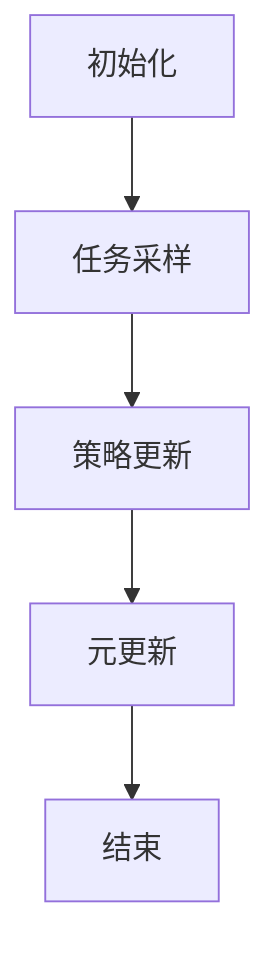
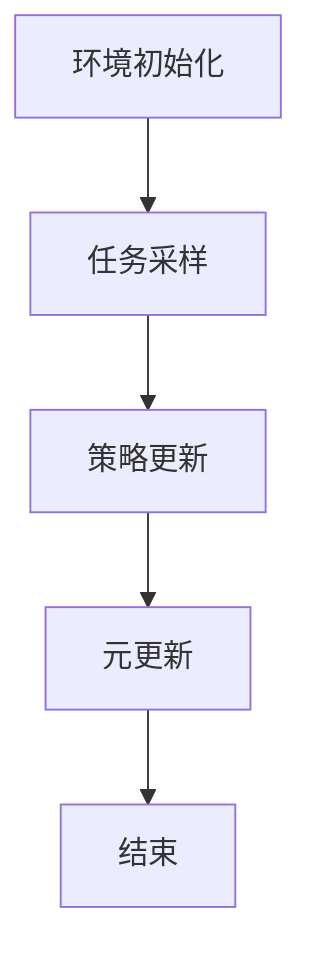
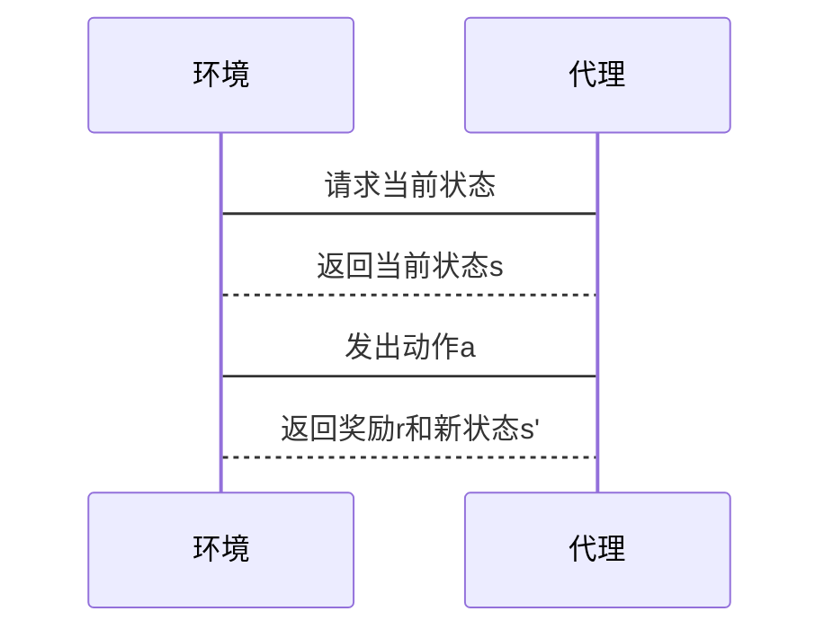
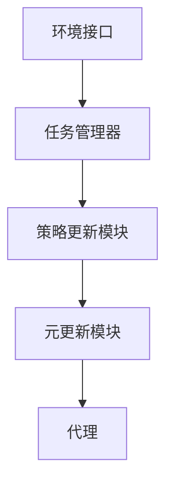
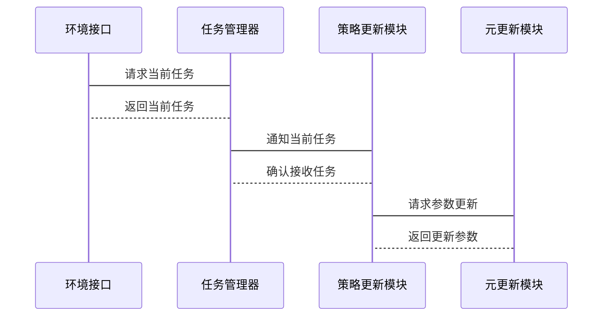

                 


# 基于元强化学习的AI Agent策略生成

## 关键词：元强化学习、AI Agent、策略生成、强化学习、机器学习

## 摘要：  
元强化学习是一种新兴的人工智能技术，旨在通过元学习框架提升AI代理的策略生成能力。本文深入探讨了元强化学习的基本原理、算法实现及其在AI Agent中的应用。文章从强化学习和元强化学习的基本概念入手，分析了元强化学习在策略生成中的优势，并通过具体案例展示了如何基于元强化学习构建高效的AI代理系统。文章还详细讲解了元强化学习的数学模型、算法流程及其在实际项目中的应用，为读者提供了一个全面了解和应用元强化学习的框架。

---

# 第1章: 元强化学习与AI Agent概述

## 1.1 元强化学习的背景与概念

### 1.1.1 强化学习的基本概念

强化学习（Reinforcement Learning, RL）是一种机器学习范式，其中智能体通过与环境交互来学习如何执行任务。智能体通过试错的方式探索环境，根据接收到的奖励信号调整自己的策略，以最大化累积奖励。强化学习的核心在于平衡探索与利用，找到最优策略。

### 1.1.2 元强化学习的定义与特点

元强化学习（Meta Reinforcement Learning, Meta-RL）是在强化学习的基础上引入元学习（Meta-Learning）的概念。元学习的目标是通过在多个任务或环境中共享学习经验，使智能体能够快速适应新任务或新环境。元强化学习的特点包括：

- **快速适应性**：通过元学习框架，智能体能够在新环境中快速学习并生成有效策略。
- **任务多样性**：元强化学习适用于需要处理多种任务或复杂环境的场景。
- **高效性**：通过共享学习经验，减少在每个新任务上从头开始学习的时间和计算成本。

### 1.1.3 元强化学习与传统强化学习的区别

| 特性 | 传统强化学习 | 元强化学习 |
|------|--------------|------------|
| 学习目标 | 单一任务优化 | 多任务优化 |
| 环境适应性 | 针对特定环境 | 快速适应新环境 |
| 策略更新 | 逐任务优化 | 元层次优化 |

### 1.1.4 元强化学习的核心要素

- **元学习框架**：构建一个元学习框架，使智能体能够在多个任务之间共享学习经验。
- **策略生成**：通过元强化学习生成适用于不同任务的策略。
- **环境建模**：对环境进行建模，以便智能体能够快速适应新环境。

## 1.2 AI Agent的基本原理

### 1.2.1 AI Agent的定义与分类

AI Agent（人工智能代理）是指在环境中能够感知并自主行动以实现目标的实体。根据智能体的复杂性和应用场景，可以将AI Agent分为：

- **简单反射型Agent**：基于当前感知做出反应，不涉及复杂推理。
- **基于模型的反射型Agent**：具备环境模型，能够进行规划和推理。
- **目标驱动型Agent**：具有明确的目标，并根据目标进行决策。
- **效用驱动型Agent**：通过最大化效用函数来做出决策。

### 1.2.2 AI Agent的核心功能与特点

- **感知能力**：能够感知环境状态。
- **决策能力**：基于感知信息做出决策。
- **行动能力**：在环境中执行动作。
- **学习能力**：通过与环境交互不断优化策略。

### 1.2.3 AI Agent在实际应用中的优势

- **自主性**：能够在没有人工干预的情况下自主运行。
- **适应性**：能够根据环境变化调整策略。
- **高效性**：通过学习算法快速优化决策过程。

## 1.3 元强化学习在AI Agent中的应用前景

### 1.3.1 元强化学习在AI Agent中的潜在应用场景

- **多任务学习**：在多个任务之间共享学习经验，提升效率。
- **复杂环境适应**：快速适应复杂多变的环境。
- **动态任务处理**：在任务动态变化时快速调整策略。

### 1.3.2 元强化学习在AI Agent中的优势与挑战

**优势**：
- 提高学习效率，减少训练时间。
- 增强环境适应能力，提升策略生成的灵活性。

**挑战**：
- 元学习框架的设计复杂，需要考虑多个任务之间的关系。
- 算法的计算成本较高，需要优化计算效率。

### 1.3.3 元强化学习在AI Agent中的未来发展趋势

- **多模态学习**：结合视觉、听觉等多种感知方式，提升智能体的感知能力。
- **端到端学习**：从原始输入到最终策略的端到端学习，简化模型设计。
- **自适应学习**：动态调整策略，适应不断变化的环境。

## 1.4 本章小结

本章介绍了元强化学习的基本概念及其在AI Agent中的应用。通过对比传统强化学习与元强化学习，明确了元强化学习的核心优势。同时，分析了AI Agent的基本原理及其在实际应用中的优势，为后续章节奠定了基础。

---

# 第2章: 元强化学习的核心概念与数学模型

## 2.1 元强化学习的原理与框架

### 2.1.1 元强化学习的原理

元强化学习通过在元层次上学习如何进行强化学习，使智能体能够在新任务中快速生成有效策略。其核心思想是通过元学习框架，将多个任务的学习经验共享，从而提高学习效率。

### 2.1.2 元强化学习的框架结构

元强化学习的框架通常包括以下步骤：

1. **初始化**：定义元学习的参数和初始策略。
2. **任务采样**：从多个任务中随机采样一个任务。
3. **策略更新**：根据当前任务的反馈更新策略。
4. **元更新**：在元层次上更新参数，以优化多个任务的总体表现。

### 2.1.3 元强化学习的核心要素

- **元参数**：用于控制策略更新的参数。
- **任务分布**：多个任务的分布，用于训练元模型。
- **策略空间**：所有可能的策略集合。

### 2.1.4 元强化学习的流程图



## 2.2 元强化学习的数学模型

### 2.2.1 强化学习的基本数学模型

在强化学习中，智能体通过与环境交互来最大化累积奖励。具体来说，智能体在状态s时选择动作a，得到奖励r，并转移到新的状态s'。目标是通过策略π(s) = a最大化累积奖励。

### 2.2.2 元强化学习的数学模型

元强化学习在元层次上引入了元参数θ，用于控制策略的更新。具体来说，元强化学习的目标是最小化所有任务的损失之和：

$$ \mathcal{L}(\theta) = \frac{1}{N} \sum_{i=1}^{N} \mathcal{L}_i(\theta) $$

其中，$\mathcal{L}_i(\theta)$是第i个任务的损失函数。

### 2.2.3 元强化学习与传统强化学习的数学对比

| 特性 | 传统强化学习 | 元强化学习 |
|------|--------------|------------|
| 损失函数 | $\mathcal{L}(\pi)$ | $\mathcal{L}(\theta) = \frac{1}{N} \sum_{i=1}^{N} \mathcal{L}_i(\theta)$ |
| 参数优化 | 优化策略参数 | 优化元参数θ |

## 2.3 元强化学习的核心算法

### 2.3.1 基于策略优化的元强化学习算法

策略优化是强化学习中的常见方法，其目标是直接优化策略π以最大化累积奖励。在元强化学习中，策略优化的目标是最小化所有任务的损失：

$$ \min_{\pi} \mathbb{E}_{i \sim p} \mathcal{L}_i(\pi) $$

其中，$p$是任务分布。

### 2.3.2 基于价值函数的元强化学习算法

基于价值函数的方法通过学习价值函数V(s)来评估策略的优劣。在元强化学习中，价值函数的更新需要考虑多个任务的反馈：

$$ V(s) = \mathbb{E}_{i \sim p} V_i(s) $$

其中，$V_i(s)$是第i个任务的价值函数。

### 2.3.3 元强化学习的典型算法实现

以下是一个基于策略优化的元强化学习算法的伪代码示例：

```python
class MetaRLAlgorithm:
    def __init__(self, policy, optimizer):
        self.policy = policy
        self.optimizer = optimizer
        self.theta = policy.parameters()

    def update(self, tasks):
        # 计算梯度
        gradients = []
        for task in tasks:
            # 计算当前任务的梯度
            grad = compute_gradient(task, self.policy)
            gradients.append(grad)
        # 平均梯度
        avg_grad = average(gradients)
        # 更新元参数
        self.optimizer.step(avg_grad)
```

---

# 第3章: 元强化学习的算法原理与实现

## 3.1 元强化学习算法的原理

### 3.1.1 元强化学习算法的基本流程

元强化学习算法的基本流程包括：

1. **环境初始化**：定义环境和任务分布。
2. **任务采样**：从任务分布中随机采样一个任务。
3. **策略更新**：根据当前任务的反馈更新策略。
4. **元更新**：在元层次上更新参数，以优化多个任务的总体表现。

### 3.1.2 元强化学习的核心算法步骤

- **任务采样**：从任务分布中随机选择一个任务。
- **策略更新**：根据当前任务的反馈更新策略参数。
- **元更新**：在元层次上优化参数，以最小化所有任务的损失。

### 3.1.3 元强化学习的算法流程图



## 3.2 元强化学习算法的实现细节

### 3.2.1 环境与代理的交互流程



### 3.2.2 元学习循环的实现步骤


### 3.2.3 策略更新的数学推导

在元强化学习中，策略更新的目标是最小化所有任务的损失之和：

$$ \min_{\theta} \mathbb{E}_{i \sim p} \mathcal{L}_i(\theta) $$

通过梯度下降方法，可以得到参数更新的公式：

$$ \theta_{t+1} = \theta_t - \eta \nabla_{\theta} \mathbb{E}_{i \sim p} \mathcal{L}_i(\theta) $$

其中，$\eta$是学习率。

---

# 第4章: 基于元强化学习的AI Agent系统架构设计

## 4.1 系统功能需求分析

### 4.1.1 AI Agent的功能需求

- **环境感知**：能够感知当前环境状态。
- **决策制定**：根据感知信息制定决策。
- **策略生成**：通过元强化学习生成适用于不同任务的策略。
- **任务适应**：能够快速适应新任务或新环境。

### 4.1.2 元强化学习的功能需求

- **任务采样**：从多个任务中随机采样一个任务。
- **策略更新**：根据当前任务的反馈更新策略。
- **元更新**：在元层次上优化参数，以最小化所有任务的损失。

### 4.1.3 系统功能模块划分

- **环境接口**：与外部环境进行交互。
- **任务管理器**：管理多个任务，并进行任务采样。
- **策略更新模块**：根据当前任务的反馈更新策略。
- **元更新模块**：在元层次上优化参数，以最小化所有任务的损失。

## 4.2 系统架构设计

### 4.2.1 系统架构图



### 4.2.2 接口设计

- **环境接口**：与外部环境进行交互，接收当前状态、发送动作。
- **任务管理器**：管理多个任务，并进行任务采样。
- **策略更新模块**：根据当前任务的反馈更新策略。
- **元更新模块**：在元层次上优化参数，以最小化所有任务的损失。

### 4.2.3 系统交互流程



---

# 第5章: 项目实战——基于元强化学习的AI Agent策略生成

## 5.1 项目背景与目标

### 5.1.1 项目背景

本项目旨在通过元强化学习生成高效的AI Agent策略，提升智能体在多任务环境中的适应能力和决策效率。

### 5.1.2 项目目标

- 实现一个基于元强化学习的AI Agent系统。
- 验证元强化学习在策略生成中的有效性。
- 探讨如何通过元学习框架提升AI Agent的环境适应能力。

## 5.2 项目实现步骤

### 5.2.1 环境安装

需要安装以下工具和库：

- Python 3.8+
- TensorFlow或PyTorch
- gym库
- matplotlib

安装命令：

```bash
pip install numpy gym matplotlib
```

### 5.2.2 系统核心实现源代码

以下是基于元强化学习的AI Agent策略生成的代码示例：

```python
import gym
import numpy as np
import matplotlib.pyplot as plt

class MetaRLAgent:
    def __init__(self, env, meta_optimizer):
        self.env = env
        self.meta_optimizer = meta_optimizer
        self.theta = self.meta_optimizer.get_weights()

    def update(self, tasks):
        # 计算梯度
        gradients = []
        for task in tasks:
            # 计算当前任务的梯度
            grad = self.compute_gradient(task)
            gradients.append(grad)
        # 平均梯度
        avg_grad = np.mean(gradients, axis=0)
        # 更新元参数
        self.meta_optimizer.step(avg_grad)

    def compute_gradient(self, task):
        # 计算当前任务的梯度
        # 这里可以实现具体的梯度计算方法
        pass

# 定义元优化器
class MetaOptimizer:
    def __init__(self, learning_rate=0.01):
        self.lr = learning_rate

    def step(self, gradients):
        # 更新参数
        pass

# 定义任务分布
class TaskSampler:
    def __init__(self, tasks):
        self.tasks = tasks

    def sample(self):
        # 随机采样一个任务
        return self.tasks[np.random.randint(len(self.tasks))]

# 主函数
def main():
    # 定义环境
    env = gym.make('CartPole-v1')
    # 定义元优化器
    meta_optimizer = MetaOptimizer()
    # 定义任务分布
    tasks = [task1, task2, task3]
    task_sampler = TaskSampler(tasks)
    # 初始化代理
    agent = MetaRLAgent(env, meta_optimizer)
    # 开始训练
    for _ in range(1000):
        # 采样任务
        current_task = task_sampler.sample()
        # 更新策略
        agent.update([current_task])

if __name__ == '__main__':
    main()
```

### 5.2.3 代码应用解读与分析

- **MetaRLAgent**：代理类，负责与环境交互并更新策略。
- **MetaOptimizer**：元优化器类，负责在元层次上优化参数。
- **TaskSampler**：任务采样器类，负责从任务分布中采样任务。
- **main**：主函数，定义环境、优化器和任务分布，初始化代理并开始训练。

### 5.2.4 实际案例分析

通过上述代码，我们可以实现一个基于元强化学习的AI Agent系统。代理通过与环境交互，不断更新策略，最终生成适用于不同任务的高效策略。

### 5.2.5 项目小结

本项目通过实现基于元强化学习的AI Agent系统，验证了元强化学习在策略生成中的有效性。通过具体代码实现，展示了如何在实际项目中应用元强化学习技术。

---

# 第6章: 总结与展望

## 6.1 本章小结

本文深入探讨了元强化学习的基本原理及其在AI Agent策略生成中的应用。通过分析元强化学习的核心概念、算法原理和系统架构设计，为读者提供了一个全面了解和应用元强化学习的框架。

## 6.2 元强化学习的未来展望

随着人工智能技术的不断发展，元强化学习在AI Agent中的应用前景广阔。未来的研究方向包括：

- **多模态学习**：结合视觉、听觉等多种感知方式，提升智能体的感知能力。
- **端到端学习**：从原始输入到最终策略的端到端学习，简化模型设计。
- **自适应学习**：动态调整策略，适应不断变化的环境。

## 6.3 最佳实践 tips

- **任务分布设计**：合理设计任务分布，确保元强化学习的有效性。
- **元参数优化**：优化元参数是提升元强化学习性能的关键。
- **算法实现细节**：在实现过程中，要注意算法的细节，确保代码的正确性。

---

# 作者

作者：AI天才研究院/AI Genius Institute & 禅与计算机程序设计艺术/Zen And The Art of Computer Programming

---

本文通过系统地介绍元强化学习的基本原理、算法实现及其在AI Agent中的应用，为读者提供了一个全面了解和应用元强化学习的框架。通过具体案例分析和代码实现，展示了如何在实际项目中应用元强化学习技术。未来的研究将进一步探索元强化学习的潜力，推动人工智能技术的发展。

