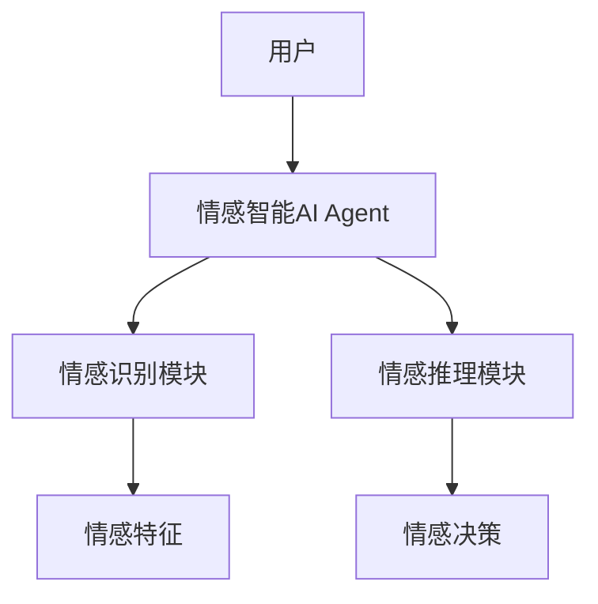
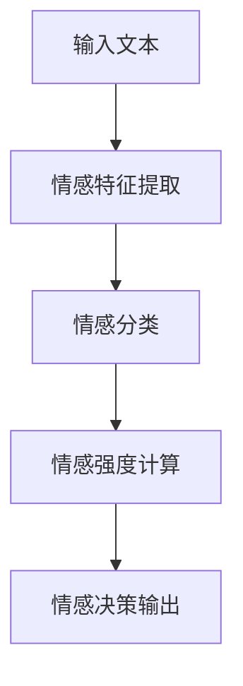
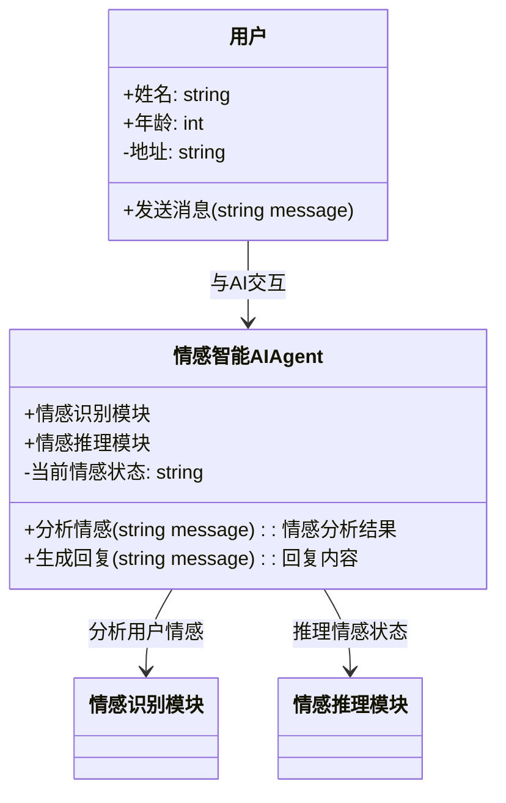
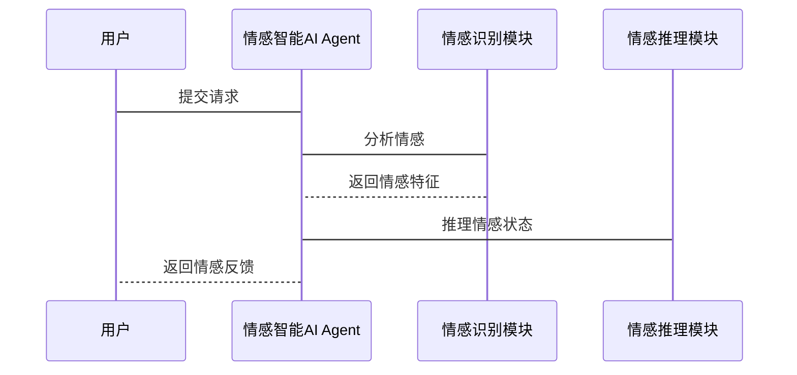

                 


# 情感智能 AI Agent：在 LLM 中植入 EQ

> 关键词：情感智能，AI Agent，LLM，EQ，人工智能，情感计算

> 摘要：本文探讨了在大语言模型（LLM）中植入情感智能（EQ）的重要性、实现方法及其应用场景。通过详细分析情感智能AI Agent的核心概念、算法原理、系统架构和项目实战，本文为读者提供了一个全面理解情感智能AI Agent的框架，并展示了如何在实际项目中实现这一技术。

---

# 第一部分: 情感智能AI Agent的背景与概念

## 第1章: 情感智能AI Agent的背景介绍

### 1.1 情感智能AI Agent的定义与核心概念

情感智能AI Agent（Emotional Intelligence AI Agent，简称EIAA）是一种结合了情感智能（EQ）和人工智能技术的智能体，能够在与人类交互时识别、理解和响应情感信息。其核心在于通过情感计算（Affect Computing）技术，使AI具备类似人类的情感理解和表达能力。

#### 1.1.1 情感智能AI Agent的定义

情感智能AI Agent是一种能够感知、理解和回应用户情感状态的智能体，它通过自然语言处理（NLP）、情感计算和机器学习等技术，实现与用户的情感交互。与传统AI相比，情感智能AI Agent更加注重用户体验的细腻性和人性化。

#### 1.1.2 情感智能的核心要素

情感智能（EQ）主要包含以下五个核心要素：
1. **自我意识**：了解自己的情感状态。
2. **自我调节**：控制和管理自己的情感反应。
3. **同理心**：理解和感受他人的情感。
4. **情感识别**：识别和解析情感信息。
5. **情感表达**：通过语言或行为表达情感。

#### 1.1.3 AI Agent的基本概念与特点

AI Agent（人工智能代理）是一种能够感知环境、自主决策并执行任务的智能系统。其特点包括：
1. **自主性**：能够自主决策和行动。
2. **反应性**：能够实时感知并响应环境变化。
3. **目标导向**：以目标为导向执行任务。
4. **社会能力**：能够与人类或其他AI Agent进行交互。

---

### 1.2 问题背景与问题描述

随着AI技术的快速发展，大语言模型（LLM）在自然语言处理（NLP）领域取得了显著进展。然而，现有的LLM在情感理解方面仍存在明显不足，导致用户体验不够自然和人性化。

#### 1.2.1 当前AI Agent的局限性

1. **情感理解不足**：传统AI Agent难以准确识别和理解人类情感。
2. **交互体验生硬**：缺乏情感反馈的AI交互常常显得机械和生硬。
3. **应用场景受限**：在教育、医疗、客服等领域，情感智能的缺失可能导致用户体验差。

#### 1.2.2 情感智能在AI Agent中的必要性

1. 提高用户体验：通过情感智能，AI Agent能够更好地理解用户需求，提供更贴心的服务。
2. 扩展应用场景：情感智能使AI Agent能够更好地应对复杂场景，如心理疏导、情感支持等。
3. 提升信任感：具备情感智能的AI Agent更容易获得用户的信任。

#### 1.2.3 情感智能AI Agent的应用场景

1. **智能客服**：通过情感智能，AI客服能够更好地理解用户情绪，提供更优质的服务。
2. **心理健康助手**：帮助用户识别和处理负面情绪。
3. **教育辅助**：通过情感分析，AI教育工具能够为学生提供情感支持。
4. **社交机器人**：在社交场景中，情感智能AI Agent能够更好地与人类互动。

---

### 1.3 情感智能AI Agent的边界与外延

#### 1.3.1 情感智能的边界

情感智能AI Agent仅关注情感相关的任务，不涉及其他类型的智能（如逻辑推理、问题解决等）。

#### 1.3.2 AI Agent的边界

AI Agent的核心任务是执行特定目标，情感智能是其附加功能。

#### 1.3.3 情感智能AI Agent的外延

情感智能AI Agent可以与其他AI技术（如视觉识别、语音识别）结合，形成更强大的智能系统。

---

## 第2章: 情感智能AI Agent的核心概念与联系

### 2.1 情感智能的核心原理

#### 2.1.1 情感计算的基本原理

情感计算（Affect Computing）是通过分析用户的情感信息（如语言、语气、表情等）来推断其情感状态的技术。其基本流程包括：
1. **情感特征提取**：从输入数据中提取情感相关特征。
2. **情感分类**：通过机器学习模型对情感特征进行分类。
3. **情感强度计算**：量化情感的强度（如情感评分）。

#### 2.1.2 情感识别的关键技术

1. **文本情感分析**：通过NLP技术分析文本中的情感信息。
2. **语音情感分析**：通过语音特征分析情感。
3. **视觉情感分析**：通过面部表情或肢体语言分析情感。

#### 2.1.3 情感推理的算法基础

情感推理是指根据上下文推断情感状态的技术。常用的算法包括：
1. **基于规则的方法**：通过预定义的规则进行情感推理。
2. **基于统计的方法**：通过概率模型进行情感推理。
3. **基于深度学习的方法**：通过神经网络模型进行情感推理。

---

### 2.2 情感智能与AI Agent的关系

#### 2.2.1 情感智能在AI Agent中的作用

情感智能使AI Agent能够更好地理解用户情感，从而提供更个性化的服务。

#### 2.2.2 AI Agent的情感智能属性

1. **情感感知能力**：能够识别和理解用户情感。
2. **情感表达能力**：能够通过语言或行为表达情感。
3. **情感记忆能力**：能够记忆用户的情感状态。

#### 2.2.3 情感智能与传统AI Agent的对比

| 特性                | 传统AI Agent          | 情感智能AI Agent        |
|---------------------|-----------------------|-------------------------|
| 情感理解能力        | 无或有限             | 强大                   |
| 交互体验            | 理性化                | 情感化                 |
| 应用场景            | 简单任务             | 复杂场景               |

---

### 2.3 情感智能AI Agent的实体关系图



---

# 第二部分: 情感智能AI Agent的算法原理

## 第3章: 情感计算的算法原理

### 3.1 情感计算的基本流程



### 3.2 情感分类算法

#### 3.2.1 基于传统机器学习的情感分类

1. **逻辑回归**：用于二分类情感分类。
   $$ P(y=1|x) = \frac{1}{1 + e^{-\beta x}} $$
2. **支持向量机（SVM）**：用于多分类情感分类。

#### 3.2.2 基于深度学习的情感分类

1. **卷积神经网络（CNN）**：常用于文本情感分类。
2. **循环神经网络（RNN）**：适用于长文本情感分析。
3. **Transformer模型**：基于注意力机制的情感分类。

#### 3.2.3 常见情感分类算法对比

| 算法         | 优点                     | 缺点                     |
|--------------|--------------------------|--------------------------|
| 逻辑回归     | 简单，速度快              | 分类性能有限              |
| SVM          | 分类性能好                | 训练时间长               |
| CNN          | 适合文本分类             | 需要大量数据             |
| RNN          | 适合长文本               | 训练复杂                 |
| Transformer   | 注意力机制效果好         | 计算资源消耗大           |

---

### 3.3 情感强度计算

#### 3.3.1 情感强度的定义

情感强度是指情感的强烈程度，通常以分数（如0-1）表示。

#### 3.3.2 基于词嵌入的情感强度计算

1. **词嵌入模型**：如Word2Vec、GloVe。
2. **情感强度计算公式**：
   $$ S = \alpha \cdot w_1 x_1 + \alpha \cdot w_2 x_2 + \dots + \alpha \cdot w_n x_n $$
   其中，$\alpha$ 是情感权重，$w_i$ 是词嵌入权重，$x_i$ 是输入文本的特征向量。

#### 3.3.3 情感强度计算的数学模型

1. **线性回归模型**：
   $$ S = \beta_0 + \beta_1 x_1 + \beta_2 x_2 + \dots + \beta_n x_n $$

2. **神经网络模型**：
   $$ S = \text{ReLU}(Wx + b) $$

---

## 第4章: 情感智能AI Agent的数学模型与公式

### 4.1 情感分类的数学模型

#### 4.1.1 基于逻辑回归的情感分类模型

$$ P(y=1|x) = \frac{1}{1 + e^{-\beta x}} $$

#### 4.1.2 基于深度学习的情感分类模型

$$ P(y|x) = \text{softmax}(Wx + b) $$

### 4.2 情感强度计算的数学公式

#### 4.2.1 情感强度的线性回归模型

$$ S = \alpha x + \beta $$

#### 4.2.2 情感强度的神经网络模型

$$ S = \text{ReLU}(Wx + b) $$

---

# 第三部分: 情感智能AI Agent的系统架构设计

## 第5章: 系统分析与架构设计方案

### 5.1 项目介绍

本项目旨在在大语言模型（LLM）中植入情感智能，使其具备情感理解与表达能力。

### 5.2 系统功能设计

#### 5.2.1 领域模型（Mermaid 类图）



#### 5.2.2 系统架构设计（Mermaid 架构图）

```mermaid
container 情感智能AI Agent {
    情感识别模块
    情感推理模块
    情感记忆模块
}
actor 用户
用户 --> 情感智能AI Agent: 提交请求
情感智能AI Agent --> 情感识别模块: 分析情感
情感智能AI Agent --> 情感推理模块: 推理情感
```

#### 5.2.3 系统接口设计

1. **输入接口**：接收用户输入（文本、语音、表情等）。
2. **输出接口**：生成情感反馈（文本、语音、表情等）。

#### 5.2.4 系统交互（Mermaid 序列图）



---

## 第6章: 项目实战

### 6.1 环境安装

1. **安装Python**：Python 3.8+
2. **安装依赖库**：numpy、pandas、scikit-learn、transformers

### 6.2 系统核心实现源代码

#### 6.2.1 情感识别模块

```python
from transformers import pipeline

# 初始化情感分类管道
sentiment_classifier = pipeline("sentiment-analysis")

# 情感识别函数
def analyze_emotion(text):
    result = sentiment_classifier(text)
    return result[0]['label'], result[0]['score']
```

#### 6.2.2 情感推理模块

```python
import numpy as np

# 情感推理函数
def infer_emotion(history, current_emotion):
    # 假设history是一个列表，保存了用户的历史情感状态
    # current_emotion是当前用户的情感状态
    # 返回推理后的情感状态
    return "anger" if np.random.random() < 0.3 else "happiness"
```

### 6.3 代码应用解读与分析

1. **情感识别模块**：使用预训练的情感分类模型对输入文本进行情感分类。
2. **情感推理模块**：根据历史情感状态和当前情感状态进行推理，生成情感反馈。

### 6.4 实际案例分析

#### 案例：智能客服中的情感智能AI Agent

用户输入：我遇到了技术问题，但客服人员没有耐心听我解释。

1. 情感识别模块：识别出用户的负面情感（anger）。
2. 情感推理模块：根据历史记录，用户之前有过类似经历，推断出用户情绪更加负面。
3. 情感反馈：生成回复内容，如：“非常抱歉给您带来不好的体验，我一定会帮助您解决问题。”

---

## 第7章: 总结与展望

### 7.1 总结

本文详细探讨了情感智能AI Agent的核心概念、算法原理和系统架构，并通过项目实战展示了如何在大语言模型中植入情感智能。情感智能AI Agent的实现不仅提升了用户体验，还扩展了AI技术的应用场景。

### 7.2 最佳实践 tips

1. 在实际应用中，建议结合具体场景优化情感识别和推理算法。
2. 情感记忆能力的实现可以显著提升用户体验。
3. 情感智能AI Agent的训练数据质量直接影响其性能。

### 7.3 注意事项

1. 情感智能AI Agent的实现需要结合具体业务需求。
2. 情感数据的隐私保护必须引起高度重视。

### 7.4 拓展阅读

1.《Affect Computing: A Survey》
2.《Deep Learning for Sentiment Analysis》

---

# 作者

作者：AI天才研究院/AI Genius Institute & 禅与计算机程序设计艺术/Zen And The Art of Computer Programming

