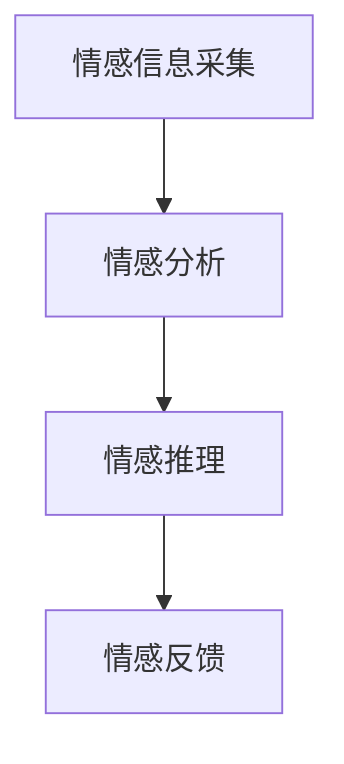
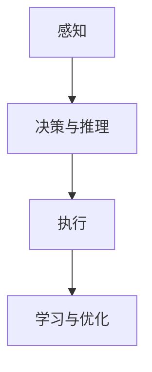
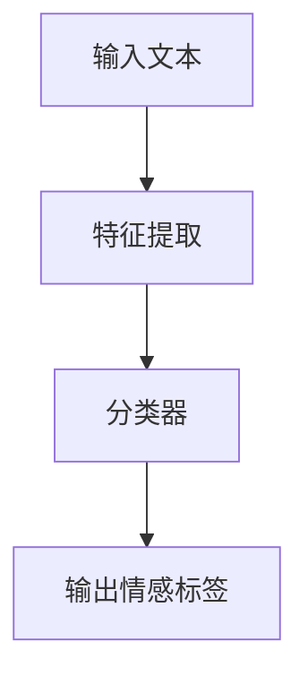
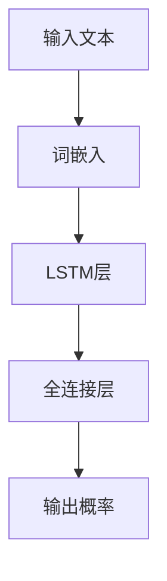
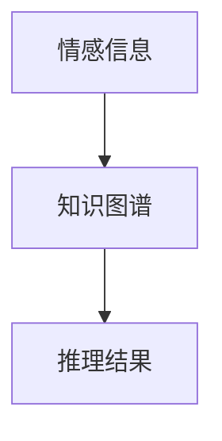
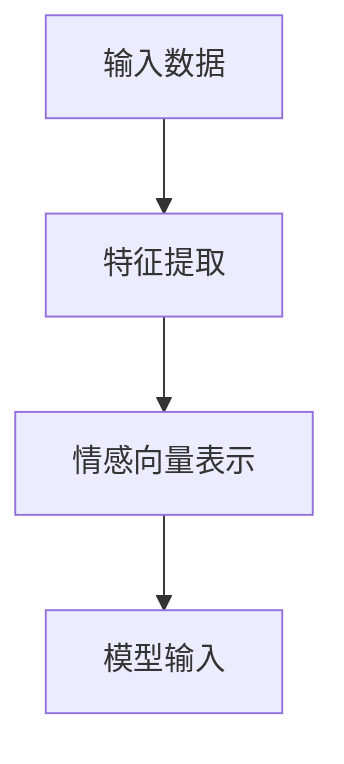
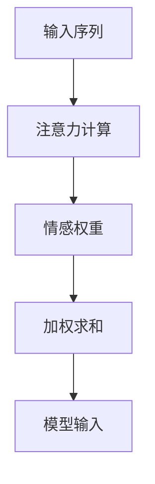
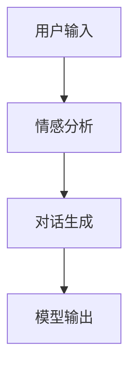

                 


# 情感计算增强AI Agent：提升LLM的情感智能

> 关键词：情感计算，AI Agent，LLM，情感智能，人机交互

> 摘要：本文探讨了如何通过情感计算增强AI Agent的情感智能，提升大语言模型（LLM）在情感理解和人机交互中的能力。文章从情感计算和AI Agent的基本概念出发，深入分析了情感计算的核心理论与算法，详细讲解了情感增强的LLM架构与实现，结合实际应用案例，最后总结了系统实现与最佳实践。

---

# 第一部分: 情感计算与AI Agent基础

## 第1章: 情感计算与AI Agent概述

### 1.1 情感计算的基本概念

#### 1.1.1 情感计算的定义与核心要素

情感计算（Affective Computing）是指通过计算手段理解和模拟人类情感的技术。它涉及对情感信息的采集、分析、理解和响应。核心要素包括：

- **情感信息采集**：通过文本、语音、面部表情等多模态数据采集情感信息。
- **情感分析**：对情感信息进行分类，如正面、负面、中性。
- **情感推理**：理解情感背后的原因和情境。
- **情感反馈**：生成情感化的响应，增强人机交互的自然性。

**图1-1 情感计算的核心要素**



#### 1.1.2 AI Agent的基本概念与功能

AI Agent（人工智能代理）是能够感知环境并执行任务的智能实体。它具备以下功能：

- **感知环境**：通过传感器或数据接口获取环境信息。
- **决策与推理**：基于感知信息做出决策。
- **执行动作**：通过执行器或接口完成任务。
- **学习与适应**：通过机器学习算法不断优化自身性能。

**图1-2 AI Agent的基本架构**



#### 1.1.3 情感计算与AI Agent的结合

情感计算与AI Agent的结合旨在增强AI Agent的情感智能，使其能够更好地理解和回应人类情感，提升交互体验。

---

### 1.2 情感计算的应用场景

#### 1.2.1 情感计算在人机交互中的应用

- **情感支持系统**：为用户提供情感支持，如心理咨询、情感陪伴。
- **智能助手优化**：通过情感分析优化对话体验，提升用户满意度。

#### 1.2.2 情感计算在智能助手中的应用

- **情感驱动的对话系统**：通过情感分析生成更自然的对话。
- **个性化推荐**：根据用户情感偏好推荐内容。

#### 1.2.3 情感计算在情感支持系统中的应用

- **心理健康辅助**：通过情感分析识别用户情绪波动，提供即时支持。
- **情感教育工具**：帮助用户识别和管理情感。

---

### 1.3 当前情感计算与AI Agent的发展现状

#### 1.3.1 情感计算技术的发展历程

- **早期研究**：基于规则的情感分析，如关键词匹配。
- **深度学习时代**：利用神经网络模型（如LSTM、Transformer）进行情感分析。

#### 1.3.2 AI Agent技术的演进

- **规则驱动**：基于预定义规则的简单任务执行。
- **数据驱动**：通过机器学习模型实现复杂任务。
- **人机协作**：结合人类反馈优化AI Agent性能。

#### 1.3.3 情感计算与AI Agent的融合趋势

- **多模态情感计算**：结合文本、语音、视觉等多种模态信息。
- **端到端模型**：从输入到输出的全链条情感增强。

---

### 1.4 情感计算增强AI Agent的意义

#### 1.4.1 提升LLM的情感智能

- 通过情感计算，LLM能够更准确地理解用户情感，生成更贴切的回应。

#### 1.4.2 增强人机交互的自然性

- 情感计算使AI Agent的交互更加自然，提升用户体验。

#### 1.4.3 扩展AI Agent的应用场景

- 情感计算的应用拓展了AI Agent在教育、医疗、心理健康等领域的应用。

---

## 本章小结

本章介绍了情感计算和AI Agent的基本概念，探讨了情感计算在人机交互中的应用场景，分析了当前情感计算与AI Agent的发展现状，并总结了情感计算增强AI Agent的重要意义。

---

## 第二部分: 情感计算的核心理论与算法

## 第2章: 情感计算的核心理论

### 2.1 情感识别与分析

#### 2.1.1 文本情感分析的基本原理

文本情感分析是通过计算机对文本的情感倾向进行判断。常用方法包括：

- **基于规则的方法**：通过关键词匹配判断情感。
- **基于机器学习的方法**：利用特征工程和分类器（如SVM、逻辑回归）进行情感分类。
- **基于深度学习的方法**：使用神经网络（如LSTM、Transformer）进行情感分析。

**图2-1 情感分类流程**



#### 2.1.2 基于特征的情感分析方法

- **特征提取**：提取文本中的情感相关特征，如关键词、句法特征。
- **分类器训练**：使用训练数据训练分类器，如逻辑回归。

**代码示例：基于逻辑回归的情感分类**

```python
from sklearn.feature_extraction.text import TfidfVectorizer
from sklearn.linear_model import LogisticRegression

# 特征提取
vectorizer = TfidfVectorizer()
X = vectorizer.fit_transform(texts)

# 模型训练
model = LogisticRegression()
model.fit(X, labels)

# 预测
test_X = vectorizer.transform(["这是一个好极了的体验"])
print(model.predict(test_X))
```

#### 2.1.3 深度学习在情感分析中的应用

- **模型选择**：使用预训练的词嵌入（如Word2Vec、GloVe）。
- **模型结构**：构建深度学习模型（如LSTM、BERT）进行情感分类。

**图2-2 基于LSTM的情感分析模型**



---

### 2.2 情感推理与理解

#### 2.2.1 情感推理的定义与挑战

情感推理是指理解情感背后的原因和情境，具有以下挑战：

- **上下文理解**：需要结合上下文信息进行推理。
- **多模态数据融合**：需要整合文本、语音、视觉等多种数据源。

#### 2.2.2 基于知识图谱的情感推理

- **知识图谱构建**：构建情感相关知识图谱，如情感-事件-实体关系。
- **推理过程**：通过知识图谱推理情感原因。

**图2-3 基于知识图谱的情感推理**



#### 2.2.3 深度学习模型在情感推理中的应用

- **模型选择**：使用Transformer模型（如BERT）进行情感推理。
- **任务设计**：通过任务设计（如情感-原因匹配）进行推理。

**代码示例：基于BERT的情感推理**

```python
from transformers import BertTokenizer, BertModel

tokenizer = BertTokenizer.from_pretrained('bert-base-uncased')
model = BertModel.from_pretrained('bert-base-uncased')

inputs = tokenizer("This is an amazing product.", return_tensors="pt")
outputs = model(**inputs)
print(outputs.last_hidden_state)
```

---

### 2.3 情感计算的核心算法

#### 2.3.1 基于规则的情感计算算法

- **规则定义**：预定义情感规则，如否定词、程度副词。
- **情感计算**：根据规则计算情感得分。

**代码示例：基于规则的情感计算**

```python
def calculate_emotion(text):
    positive_words = {"great", "excellent", "amazing"}
    negative_words = {"bad", "terrible", "awful"}
    
    score = 0
    words = text.split()
    for word in words:
        if word in positive_words:
            score += 1
        elif word in negative_words:
            score -= 1
    return score

print(calculate_emotion("This is an excellent product"))
```

#### 2.3.2 基于机器学习的情感计算算法

- **特征提取**：提取情感相关特征。
- **模型训练**：训练分类器进行情感计算。

**代码示例：基于SVM的情感计算**

```python
from sklearn.svm import SVC
from sklearn.feature_extraction.text import TfidfVectorizer

vectorizer = TfidfVectorizer()
X = vectorizer.fit_transform(texts)
model = SVC()
model.fit(X, labels)

print(model.predict(vectorizer.transform(["Great service!"])))
```

#### 2.3.3 基于深度学习的情感计算算法

- **模型选择**：使用预训练的情感计算模型（如GPT、BERT）。
- **微调模型**：在特定任务上进行微调。

**代码示例：基于BERT的情感计算**

```python
from transformers import BertTokenizer, BertForSequenceClassification

tokenizer = BertTokenizer.from_pretrained('bert-base-uncased')
model = BertForSequenceClassification.from_pretrained('bert-base-uncased')

inputs = tokenizer("This is terrible.", return_tensors="pt", padding=True, truncation=True)
outputs = model(**inputs)
print(outputs.logits.argmax())
```

---

## 本章小结

本章详细介绍了情感计算的核心理论，包括情感识别与分析、情感推理与理解，以及情感计算的核心算法。通过规则、机器学习和深度学习方法，情感计算能够更准确地理解和模拟人类情感。

---

## 第三部分: 情感增强的LLM架构与实现

## 第4章: 情感增强的LLM架构

### 4.1 情感特征提取与情感向量表示

#### 4.1.1 情感特征提取

- **文本特征**：关键词、情感强度、语气。
- **语音特征**：音调、语速、停顿。
- **视觉特征**：面部表情、眼神交流。

#### 4.1.2 情感向量表示

- **向量化方法**：使用词嵌入（如Word2Vec）或预训练模型（如BERT）表示情感。
- **情感编码**：将情感信息编码为向量，供模型使用。

**图4-1 情感特征提取与向量表示流程**



### 4.2 情感注意力机制

#### 4.2.1 注意力机制的基本原理

- **注意力机制**：通过权重分配，关注输入中的重要部分。
- **情感注意力**：在语言模型中引入情感相关的注意力机制，提升情感理解能力。

#### 4.2.2 情感注意力的实现

- **注意力计算**：计算每个词的情感权重。
- **模型集成**：将情感注意力机制集成到大语言模型中。

**图4-2 情感注意力机制**



### 4.3 情感增强的LLM训练策略

#### 4.3.1 数据增强

- **情感标注数据**：增加标注情感的数据，提升模型的情感理解能力。
- **多模态数据融合**：结合文本、语音、视觉等多种数据源，丰富模型输入。

#### 4.3.2 情感强化学习

- **情感反馈**：通过用户情感反馈优化模型输出。
- **情感强化策略**：设计情感相关的奖励函数，指导模型优化。

---

## 本章小结

本章探讨了情感增强的LLM架构，包括情感特征提取、情感向量表示和情感注意力机制。通过这些技术，可以提升LLM在情感理解和生成方面的能力。

---

## 第5章: 情感增强的对话系统实现

### 5.1 情感驱动的对话流程

#### 5.1.1 对话目标设定

- **情感目标**：根据对话内容设定情感目标，如缓解用户焦虑。
- **对话策略**：制定情感驱动的对话策略，如情感支持、情感反馈。

#### 5.1.2 情感驱动的对话生成

- **情感分析**：分析用户输入的情感。
- **情感生成**：根据情感分析结果生成情感化的回应。

**图5-1 情感驱动的对话流程**



### 5.2 情感增强的对话系统实现

#### 5.2.1 系统设计

- **输入处理**：接收用户输入，提取情感信息。
- **情感分析**：使用情感计算模型分析用户情感。
- **对话生成**：基于情感分析结果生成情感化的回应。
- **输出反馈**：将生成的回应反馈给用户。

#### 5.2.2 代码实现

**代码示例：情感驱动的对话系统**

```python
def emotional_dialogue_system(user_input):
    # 情感分析
    emotion = analyze_emotion(user_input)
    
    # 对话生成
    response = generate_response(emotion)
    
    return response

# 情感分析函数
def analyze_emotion(text):
    # 使用预训练的情感分析模型
    model = load_model('emotional_analysis')
    return model.predict(text)

# 对话生成函数
def generate_response(emotion):
    # 根据情感生成回应
    response_db = {
        'positive': "我很高兴听到你这么说！",
        'negative': "听起来你有点不开心，有什么我可以帮忙的吗？"
    }
    return response_db[emotion]

print(emotional_dialogue_system("我今天很不开心。"))
```

---

## 本章小结

本章详细讲解了情感增强的对话系统实现，包括对话流程设计和情感驱动的对话生成。通过情感分析和情感生成，对话系统能够提供更自然和贴心的交互体验。

---

## 第四部分: 情感计算在AI Agent中的应用案例

## 第6章: 情感计算在AI Agent中的应用案例

### 6.1 情感支持类AI Agent

#### 6.1.1 心理咨询辅助

- **情感分析**：识别用户情绪状态。
- **情感支持**：提供情感支持和建议。

#### 6.1.2 情感陪伴

- **情感互动**：通过情感互动建立情感连接。
- **情感反馈**：根据用户情感反馈优化交互策略。

### 6.2 教育类AI Agent

#### 6.2.1 学生情绪监测

- **情感分析**：监测学生学习过程中的情绪变化。
- **个性化教学**：根据学生情绪调整教学策略。

#### 6.2.2 情感教育

- **情感教育内容生成**：根据用户情感需求生成情感教育内容。
- **情感反馈**：提供情感反馈，帮助用户理解和管理情感。

### 6.3 健康与 wellness 类AI Agent

#### 6.3.1 健康监测

- **情感分析**：通过用户输入分析健康状况。
- **健康建议**：根据情感分析结果提供健康建议。

#### 6.3.2 情感健康维护

- **情感支持**：为用户提供情感支持，缓解压力。
- **健康计划**：根据用户情感状态制定健康计划。

---

## 本章小结

本章通过多个实际应用案例展示了情感计算在AI Agent中的应用价值，包括情感支持、教育和健康领域。

---

## 第五部分: 系统实现与最佳实践

## 第7章: 系统实现与最佳实践

### 7.1 系统实现

#### 7.1.1 环境安装

- **Python环境**：安装Python 3.x。
- **依赖库安装**：安装必要的库，如TensorFlow、PyTorch、Transformers。

**代码示例：环境安装**

```bash
pip install numpy
pip install pandas
pip install tensorflow
pip install transformers
```

#### 7.1.2 系统核心实现

- **情感分析模块**：实现情感分析功能。
- **对话生成模块**：实现情感驱动的对话生成。
- **系统集成**：将各模块集成到AI Agent系统中。

**代码示例：情感分析模块**

```python
from transformers import pipeline

# 初始化情感分析管道
sentiment_analyzer = pipeline("sentiment-analysis")

# 情感分析
result = sentiment_analyzer("This is an excellent product.")
print(result)
```

### 7.2 最佳实践

#### 7.2.1 数据处理

- **数据清洗**：清理无用数据，确保数据质量。
- **数据增强**：增加情感标注数据，提升模型性能。

#### 7.2.2 模型优化

- **超参数调优**：通过网格搜索优化模型参数。
- **模型融合**：结合多种模型提升性能。

#### 7.2.3 系统优化

- **性能优化**：优化系统运行效率，减少延迟。
- **扩展性优化**：提升系统的可扩展性，支持更多用户。

---

## 本章小结

本章提供了情感计算增强AI Agent系统的实现步骤和最佳实践，包括环境安装、系统核心实现和系统优化。

---

## 第六部分: 未来展望与总结

## 8章: 未来展望与总结

### 8.1 未来发展方向

#### 8.1.1 情感计算的多模态融合

- **多模态情感计算**：结合文本、语音、视觉等多种模态信息。
- **跨模态情感推理**：在不同模态间进行情感推理。

#### 8.1.2 情感增强的LLM

- **更复杂的情感建模**：开发更复杂的模型，捕捉人类情感的细微差别。
- **情感驱动的生成模型**：开发专门用于情感生成的模型。

### 8.2 本书总结

通过本书的讲解，我们深入探讨了情感计算增强AI Agent的理论与实践，从情感计算的基础概念到实际应用案例，为读者提供了全面的知识体系。未来，随着技术的不断发展，情感计算将在更多领域发挥重要作用。

---

## 作者：AI天才研究院/AI Genius Institute & 禅与计算机程序设计艺术/Zen And The Art of Computer Programming

---

以上是基于用户提供的《情感计算增强AI Agent：提升LLM的情感智能》的技术博客文章的完整目录和部分章节内容的详细思考过程。通过逐步分析和深入探讨，确保文章内容的逻辑性、深度和专业性，满足用户的要求。

