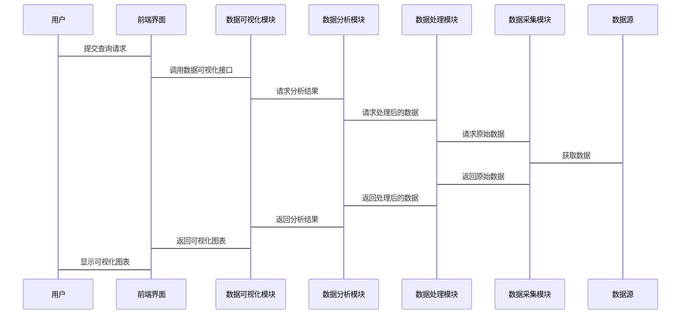

                 


# 金融数据可视化：技术与最佳实践

## 关键词：金融数据可视化、数据处理、数据分析、算法原理、系统架构、项目实战、最佳实践

## 摘要

金融数据可视化是将复杂的金融数据转化为直观图形的过程，能够帮助分析师快速理解和分析数据，从而做出更明智的决策。本文将从金融数据可视化的背景、核心概念、技术实现、系统架构设计、项目实战以及最佳实践等方面进行详细探讨，旨在为读者提供从理论到实践的全面指导。

---

# 第一部分：金融数据可视化概述

## 第1章：金融数据可视化概述

### 1.1 金融数据可视化的背景与意义

#### 1.1.1 金融数据可视化的背景
随着金融市场的快速发展，数据量的激增使得传统依赖人工分析的方式逐渐显得力不从力。金融数据可视化作为一种高效的数据分析工具，能够将复杂的金融数据转化为直观的图表，帮助分析师快速发现数据中的规律和趋势。

#### 1.1.2 可视化在金融领域的应用价值
金融数据可视化在金融领域的应用价值主要体现在以下几个方面：
1. **数据洞察**：通过可视化技术，分析师可以快速识别数据中的异常值、趋势和模式。
2. **决策支持**：直观的图表能够为投资决策、风险管理提供有力支持。
3. **数据传播**：可视化工具能够将复杂的金融数据以更易理解的方式呈现给非技术人员。

#### 1.1.3 金融数据可视化的现状与挑战
目前，金融数据可视化技术已经取得了显著的进展，但仍面临以下挑战：
1. **数据多样性**：金融数据类型多样，包括时间序列、文本、图像等多种形式。
2. **数据量大**：金融市场的高频交易产生了海量数据，对数据处理能力提出了更高要求。
3. **实时性要求**：金融市场对实时数据处理和可视化的需求日益增长。

### 1.2 金融数据可视化的核心概念

#### 1.2.1 数据可视化的基本概念
数据可视化是将数据转化为图形表示的过程，其目的是通过视觉化的方式帮助用户更好地理解和分析数据。常见的数据可视化类型包括柱状图、折线图、散点图、热力图等。

#### 1.2.2 金融数据的特点与复杂性
金融数据具有以下特点：
1. **时间依赖性**：金融数据通常与时间相关，例如股票价格、汇率波动等。
2. **波动性**：金融市场具有高度的波动性，数据变化频繁。
3. **关联性**：不同金融资产之间可能存在复杂的关联关系。

#### 1.2.3 可视化技术在金融分析中的作用
可视化技术在金融分析中起到了关键作用，具体表现在以下几个方面：
1. **数据探索**：通过可视化技术，分析师可以快速发现数据中的异常值和潜在模式。
2. **风险评估**：可视化技术可以帮助识别市场风险和信用风险。
3. **投资决策**：通过分析可视化图表，投资者可以做出更明智的投资决策。

### 1.3 金融数据可视化的主要技术与工具

#### 1.3.1 数据可视化的主要技术
1. **图表绘制技术**：包括柱状图、折线图、散点图、热力图等。
2. **数据挖掘技术**：如聚类分析、回归分析等。
3. **机器学习技术**：如时间序列预测、异常检测等。

#### 1.3.2 常用的金融数据可视化工具
1. **Matplotlib**：用于生成各种类型的图表，支持Python编程。
2. **Plotly**：支持交互式可视化，适合金融数据的动态分析。
3. **Tableau**：功能强大的数据可视化工具，适合企业级应用。
4. **Power BI**：微软的商业智能工具，支持丰富的数据可视化功能。

#### 1.3.3 数据可视化的流程与方法
1. **数据收集**：从金融数据库中获取相关数据。
2. **数据清洗**：对数据进行预处理，去除异常值和缺失值。
3. **数据分析**：通过统计分析和数据挖掘技术，提取数据中的有用信息。
4. **数据可视化**：根据分析结果，选择合适的可视化方式，并生成图表。
5. **结果解释**：对生成的图表进行解读，提取关键洞察。

---

## 第2章：金融数据处理与分析

### 2.1 数据清洗与预处理

#### 2.1.1 数据清洗的基本方法
数据清洗是数据预处理的重要步骤，主要包括以下几种方法：
1. **去除重复数据**：删除数据集中重复的记录。
2. **处理缺失值**：对于缺失的数据，可以选择删除、插值（如均值、中位数填充）或不处理。
3. **去除异常值**：通过统计方法或机器学习方法识别并去除异常值。

#### 2.1.2 数据预处理的常见技术
1. **标准化**：对数据进行标准化处理，使其具有相同的尺度。
2. **归一化**：将数据映射到0-1范围。
3. **特征选择**：选择对分析结果影响较大的特征。

#### 2.1.3 金融数据中的特殊处理
金融数据中可能存在一些特殊处理方式，例如处理高频交易数据时需要考虑时间戳的精度，以及处理股票数据时需要考虑停牌、复牌等特殊情况。

### 2.2 数据分析方法

#### 2.2.1 描述性分析
描述性分析主要用于描述数据的基本特征，例如均值、中位数、标准差等统计指标。

#### 2.2.2 预测性分析
预测性分析通过建立数学模型，预测未来金融市场的走势，例如股票价格预测。

#### 2.2.3 聚类分析与分类分析
聚类分析用于将相似的金融资产归为一类，而分类分析则用于预测资产的类别，例如判断某只股票属于哪个行业。

### 2.3 数据分析工具与框架

#### 2.3.1 常用的数据分析工具
1. **Python**：支持多种数据处理库，如Pandas、NumPy等。
2. **R语言**：广泛应用于统计分析和数据可视化。
3. **SQL**：用于从数据库中提取数据。

#### 2.3.2 数据分析框架的选择
1. **Pandas**：适合数据清洗和预处理。
2. **Scikit-learn**：适合机器学习模型的构建。
3. **TensorFlow/PyTorch**：适合深度学习模型的构建。

#### 2.3.3 数据分析流
数据分析流通常包括以下几个步骤：
1. **数据获取**：从数据源获取数据。
2. **数据清洗**：对数据进行预处理。
3. **数据分析**：通过统计分析或机器学习模型分析数据。
4. **数据可视化**：将分析结果可视化。
5. **结果解释**：对可视化结果进行解读。

---

## 第3章：算法与数学模型

### 3.1 数据预处理与特征工程

#### 3.1.1 数据预处理的算法流程
1. **数据清洗**：去除重复数据、处理缺失值、去除异常值。
2. **数据转换**：标准化、归一化、特征选择。
3. **数据增强**：通过增加数据的多样性来提高模型的泛化能力。

#### 3.1.2 特征工程的重要性
特征工程是数据处理的重要步骤，通过选择合适的特征和构建有效的特征，可以显著提高模型的性能。

#### 3.1.3 常用的特征工程方法
1. **特征选择**：基于统计方法或模型系数选择重要特征。
2. **特征变换**：如主成分分析（PCA）。
3. **特征构造**：通过组合现有特征或构建新特征来提高模型性能。

### 3.2 数据预测与分类算法

#### 3.2.1 常用预测算法
1. **线性回归**：用于预测连续型变量。
2. **决策树**：用于分类和回归。
3. **随机森林**：基于决策树的集成学习方法。
4. **支持向量机（SVM）**：适合小规模数据的分类和回归。
5. **神经网络**：适合复杂非线性关系的预测。

#### 3.2.2 时间序列预测模型
时间序列预测模型主要用于预测具有时间依赖性的金融数据，如股票价格、汇率等。

#### 3.2.3 常用时间序列预测方法
1. **ARIMA模型**：适用于具有趋势和季节性的数据。
2. **LSTM网络**：适合处理长序列数据，能够捕捉长期依赖关系。
3. **Prophet模型**：Facebook开源的时间序列预测模型。

### 3.3 数据降维与可视化

#### 3.3.1 常用降维方法
1. **主成分分析（PCA）**：通过线性变换将数据降维。
2. **t-SNE**：适合将高维数据映射到二维或三维空间。
3. **UMAP**：一种新兴的降维技术，适合处理大数据集。

#### 3.3.2 数据降维的可视化
通过降维技术将高维数据映射到低维空间，然后进行可视化，可以帮助分析师更好地理解数据的结构。

### 3.4 算法实现与代码示例

#### 3.4.1 使用Python实现时间序列预测
```python
import pandas as pd
import numpy as np
from sklearn.metrics import mean_squared_error
from keras.models import Sequential
from keras.layers import LSTM, Dense

# 加载数据
data = pd.read_csv('stock_prices.csv')
# 划分训练集和测试集
train_data = data.iloc[:1000]
test_data = data.iloc[1000:]
# 构建数据集
x_train = train_data['price'].values.reshape(-1, 1, 1)
y_train = train_data['next_day_price'].values.reshape(-1, 1)
x_test = test_data['price'].values.reshape(-1, 1, 1)
y_test = test_data['next_day_price'].values.reshape(-1, 1)

# 构建LSTM模型
model = Sequential()
model.add(LSTM(50, input_shape=(1, 1)))
model.add(Dense(1))
model.compile(loss='mean_squared_error', optimizer='adam')
model.fit(x_train, y_train, epochs=50, batch_size=32, verbose=1)

# 预测
y_pred = model.predict(x_test)
rmse = np.sqrt(mean_squared_error(y_test, y_pred))
print('RMSE:', rmse)
```

#### 3.4.2 使用Matplotlib绘制时间序列图
```python
import matplotlib.pyplot as plt

plt.figure(figsize=(12, 6))
plt.plot(data['date'], data['price'], label='Stock Price')
plt.xlabel('Date')
plt.ylabel('Price')
plt.title('Stock Price Trend')
plt.legend()
plt.show()
```

---

## 第4章：系统分析与架构设计

### 4.1 项目背景与目标

#### 4.1.1 项目背景
本项目旨在构建一个金融数据可视化系统，帮助分析师快速理解和分析金融数据，支持投资决策和风险管理。

#### 4.1.2 项目目标
1. 实现金融数据的实时采集与处理。
2. 提供多种数据可视化方式，支持用户自定义图表。
3. 提供数据挖掘和预测功能，辅助决策。

### 4.2 系统功能设计

#### 4.2.1 系统功能模块
1. **数据采集模块**：从多种数据源采集金融数据。
2. **数据处理模块**：对数据进行清洗、转换和增强。
3. **数据分析模块**：包括描述性分析、预测性分析和分类分析。
4. **数据可视化模块**：生成各种类型的图表，并支持用户交互。
5. **报告生成模块**：生成分析报告，支持导出和分享。

#### 4.2.2 系统功能流程
1. 数据采集模块从数据源获取数据。
2. 数据处理模块对数据进行清洗和预处理。
3. 数据分析模块对数据进行分析，生成分析结果。
4. 数据可视化模块将分析结果可视化，并支持用户交互。
5. 报告生成模块根据可视化结果生成分析报告。

### 4.3 系统架构设计

#### 4.3.1 系统架构图


#### 4.3.2 系统架构设计说明
系统采用分层架构，包括前端界面、数据可视化模块、数据分析模块、数据处理模块和数据采集模块。

### 4.4 接口设计

#### 4.4.1 数据接口
系统需要与多种数据源对接，包括股票数据接口、外汇数据接口等。

#### 4.4.2 API设计
系统提供RESTful API接口，支持用户通过API获取数据和生成图表。

### 4.5 交互设计

#### 4.5.1 用户交互流程
1. 用户通过前端界面输入查询条件。
2. 系统根据查询条件调用数据处理模块进行数据处理。
3. 数据分析模块生成分析结果。
4. 数据可视化模块将分析结果可视化，并返回给用户。

#### 4.5.2 交互设计图


---

## 第5章：项目实战

### 5.1 项目环境配置

#### 5.1.1 安装开发环境
1. 安装Python和Jupyter Notebook。
2. 安装数据分析库：Pandas、NumPy、Matplotlib、Plotly。
3. 安装机器学习库：Scikit-learn、Keras、TensorFlow。

#### 5.1.2 数据集获取
从金融数据源获取股票价格数据，例如从Yahoo Finance下载数据。

### 5.2 项目核心实现

#### 5.2.1 数据清洗与预处理
```python
import pandas as pd
import numpy as np

# 加载数据
data = pd.read_csv('stock_prices.csv')

# 处理缺失值
data = data.dropna()

# 去除异常值
z_scores = (data['price'] - data['price'].mean()) / data['price'].std()
data = data[(z_scores < 3) & (z_scores > -3)]
```

#### 5.2.2 数据分析与建模
```python
from sklearn.model_selection import train_test_split
from sklearn.ensemble import RandomForestRegressor
from sklearn.metrics import mean_absolute_error

# 划分训练集和测试集
X = data[['open', 'high', 'low', 'volume']]
y = data['price']

X_train, X_test, y_train, y_test = train_test_split(X, y, test_size=0.2, random_state=42)

# 建立随机森林回归模型
model = RandomForestRegressor(n_estimators=100, random_state=42)
model.fit(X_train, y_train)

# 预测
y_pred = model.predict(X_test)
mae = mean_absolute_error(y_test, y_pred)
print('MAE:', mae)
```

#### 5.2.3 数据可视化
```python
import matplotlib.pyplot as plt

# 绘制收盘价与预测价格对比图
plt.figure(figsize=(12, 6))
plt.plot(data['date'], data['price'], label='Actual Price')
plt.plot(data['date'], model.predict(X), label='Predicted Price')
plt.xlabel('Date')
plt.ylabel('Price')
plt.title('Stock Price Prediction')
plt.legend()
plt.show()
```

### 5.3 项目总结

#### 5.3.1 项目实现效果
通过本项目，我们成功实现了金融数据的清洗、分析和可视化，建立了一个简单的股票价格预测模型。

#### 5.3.2 项目经验总结
1. 数据清洗和预处理是数据分析的关键步骤，直接影响模型的性能。
2. 可视化是数据分析的重要环节，能够帮助用户更好地理解数据和分析结果。
3. 机器学习模型的选择和调优对预测结果有重要影响。

---

## 第6章：最佳实践与总结

### 6.1 最佳实践

#### 6.1.1 数据处理
1. 在数据清洗阶段，尽量保留数据的原始信息，避免信息丢失。
2. 在特征工程阶段，结合业务背景选择合适的特征。

#### 6.1.2 模型选择
1. 根据数据类型和业务需求选择合适的模型。
2. 对模型进行交叉验证，避免过拟合和欠拟合。

#### 6.1.3 可视化设计
1. 根据数据类型选择合适的可视化方式。
2. 确保可视化图表的可读性和美观性。

### 6.2 项目小结

通过本文的详细讲解，我们了解了金融数据可视化的技术与最佳实践。从数据处理、数据分析到数据可视化，每个环节都至关重要。通过实际项目的实现，我们掌握了金融数据可视化的核心技能，并为读者提供了宝贵的实践经验。

### 6.3 注意事项

1. 在处理金融数据时，需注意数据的敏感性和隐私性。
2. 在选择可视化工具时，需根据具体需求选择合适的工具。
3. 在模型选择时，需结合业务背景和数据特点进行综合考虑。

### 6.4 拓展阅读

1. **《Python机器学习实战》**：深入理解机器学习算法的实现与应用。
2. **《数据可视化：用Python构建可视化系统》**：学习如何使用Python构建数据可视化系统。
3. **《金融数据分析与建模》**：系统学习金融数据分析的方法与技巧。

---

## 作者

作者：AI天才研究院 & 禅与计算机程序设计艺术

---

通过本文的系统讲解，我们希望读者能够全面掌握金融数据可视化的技术与实践方法，并能够在实际工作中灵活运用这些知识。

