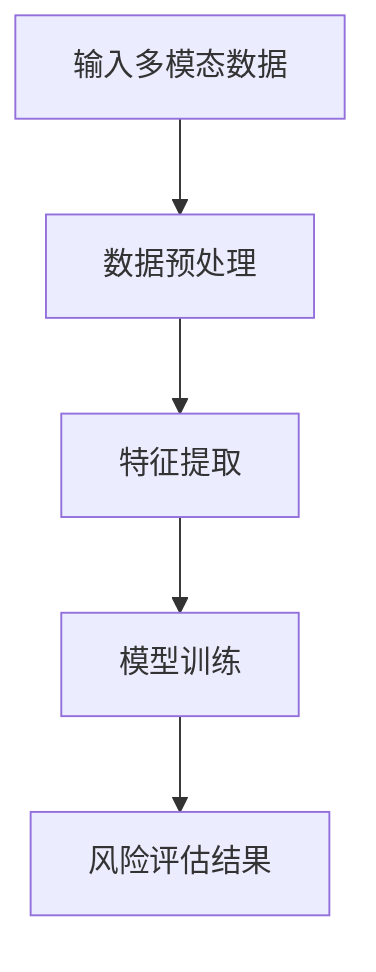
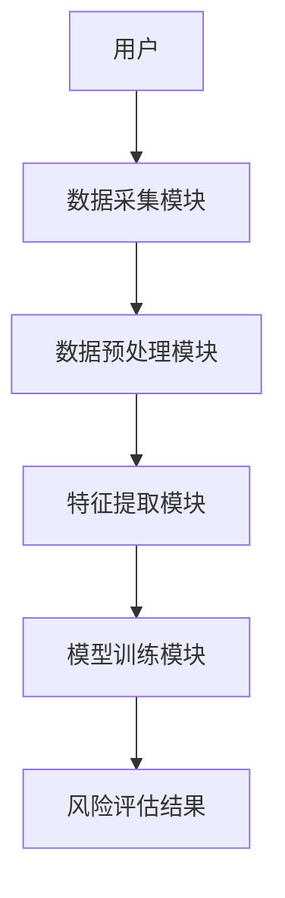

                 


```markdown
# 《金融领域多模态学习在风险评估中的应用》

> **关键词**：多模态学习、金融风险评估、机器学习、风险分析、数据融合

> **摘要**：本文深入探讨了多模态学习在金融风险评估中的应用，从理论基础到实际案例，系统分析了多模态学习如何通过整合多种数据源来提升风险评估的准确性和效率。文章结合背景介绍、核心概念、算法原理、系统设计和项目实战，全面解析了多模态学习在金融领域的潜力与实现路径。

---

## 第1章: 问题背景与核心概念

### 1.1 问题背景介绍

#### 1.1.1 金融风险评估的现状与挑战
金融风险评估是金融领域的重要任务，传统方法主要依赖于单一数据源（如财务数据）进行分析。然而，这种单一数据源的分析方式存在以下问题：
- 数据维度有限，难以捕捉到全面的风险信息。
- 对市场波动、用户行为等动态因素的敏感性不足。
- 无法充分利用多源数据的互补性。

#### 1.1.2 多模态数据在金融领域的潜力
随着技术的发展，金融领域积累了大量多模态数据，包括：
- **文本数据**：如新闻、财报、社交媒体评论。
- **市场数据**：如股票价格、成交量、指数。
- **社交数据**：如用户评论、互动数据。
这些数据的整合可以提供更全面的市场洞察，帮助发现潜在风险。

#### 1.1.3 风险评估中的多模态学习需求
多模态学习能够从多种数据源中提取特征，结合上下文信息，提升风险评估的准确性和实时性。具体需求包括：
- 综合分析多源数据，捕捉潜在风险信号。
- 通过数据融合降低单一数据源的局限性。
- 实现实时风险监控和预警。

### 1.2 核心概念与定义

#### 1.2.1 多模态学习的定义
多模态学习是指从多种数据类型（如文本、图像、语音等）中学习并融合信息，以提升模型性能的学习方法。在金融领域，多模态学习的核心在于整合不同数据源的信息，以更全面地评估风险。

#### 1.2.2 多模态数据的特征与类型
多模态数据具有以下特征：
- **异构性**：数据类型多样，格式不同。
- **互补性**：不同数据源可以相互补充，提供更全面的信息。
- **实时性**：部分数据（如市场数据、社交媒体数据）具有很强的时效性。

多模态数据的类型包括：
- **结构化数据**：如表格数据（财务报表）。
- **非结构化数据**：如文本、图像。
- **时序数据**：如股票价格、交易数据。

#### 1.2.3 风险评估中的多模态学习框架
多模态学习在风险评估中的框架通常包括以下步骤：
1. **数据采集**：收集多种数据源。
2. **数据预处理**：清洗和标准化数据。
3. **特征提取**：从多模态数据中提取有用特征。
4. **模型训练**：基于多模态特征训练风险评估模型。
5. **风险评估**：结合模型输出进行风险分析和预警。

### 1.3 问题描述与解决思路

#### 1.3.1 传统金融风险评估的局限性
传统金融风险评估主要依赖于单一数据源，存在以下局限性：
- **信息片面性**：无法捕捉到市场的全貌。
- **计算复杂性**：难以处理多源异构数据。
- **实时性不足**：难以实现实时风险监控。

#### 1.3.2 多模态学习在风险评估中的优势
多模态学习的优势体现在以下几个方面：
- **信息丰富性**：整合多源数据，提供更全面的分析视角。
- **实时性**：通过实时数据融合，提升风险预警的及时性。
- **准确性**：通过多模态数据的互补性，提高风险评估的准确性。

#### 1.3.3 多模态学习解决金融风险评估的核心思路
多模态学习的核心思路是通过以下步骤实现风险评估：
1. **数据融合**：将多源数据进行整合，消除数据孤岛。
2. **特征提取**：利用深度学习技术提取多模态特征。
3. **模型训练**：基于多模态特征训练风险评估模型。
4. **风险预测**：结合模型输出，进行风险预测和预警。

### 1.4 边界与外延

#### 1.4.1 多模态学习的适用范围
多模态学习适用于以下场景：
- **多源数据整合**：需要整合多种数据源的场景。
- **复杂问题分析**：需要从多角度分析问题的场景。
- **实时性要求高**：需要实时处理和分析数据的场景。

#### 1.4.2 风险评估中的边界条件
在风险评估中，多模态学习的边界条件包括：
- **数据质量**：数据需满足一定质量要求，如完整性、准确性。
- **模型性能**：模型需具备足够的准确性和实时性。
- **计算资源**：需要足够的计算资源支持多模态数据的处理。

#### 1.4.3 多模态学习与其他技术的结合
多模态学习可以与其他技术结合，如：
- **自然语言处理（NLP）**：用于处理文本数据。
- **计算机视觉（CV）**：用于处理图像数据。
- **强化学习（RL）**：用于动态决策场景。

### 1.5 概念结构与核心要素

#### 1.5.1 多模态学习的核心要素
多模态学习的核心要素包括：
- **数据源**：多种数据源的整合。
- **特征提取**：从多模态数据中提取特征。
- **模型训练**：基于多模态特征训练模型。

#### 1.5.2 风险评估中的关键指标
风险评估中的关键指标包括：
- **信用风险**：借款人违约的可能性。
- **市场风险**：资产价格波动带来的风险。
- **操作风险**：操作失误或欺诈行为带来的风险。

#### 1.5.3 多模态学习与风险评估的交互关系
多模态学习与风险评估的交互关系体现在：
- **数据输入**：多模态数据输入模型。
- **特征提取**：模型提取多模态特征。
- **风险预测**：模型输出风险评估结果。

### 1.6 本章小结

---

## 第2章: 多模态学习的核心概念与联系

### 2.1 多模态学习的原理

#### 2.1.1 多模态数据的融合方式
多模态数据的融合方式包括：
- **早期融合**：在特征提取前进行数据融合。
- **晚期融合**：在特征提取后进行数据融合。
- **混合融合**：结合早期和晚期融合的方式。

#### 2.1.2 多模态学习的基本原理
多模态学习的基本原理是通过以下步骤实现数据融合：
1. **特征提取**：从多模态数据中提取特征。
2. **特征融合**：将不同模态的特征进行融合。
3. **模型训练**：基于融合后的特征训练模型。

#### 2.1.3 多模态学习的核心算法
多模态学习的核心算法包括：
- **多任务学习**：同时学习多个相关任务，共享特征。
- **自注意力机制**：通过注意力机制捕捉数据间的关联性。
- **对比学习**：通过对比不同数据源的信息，提升模型性能。

### 2.2 核心概念对比与分析

#### 2.2.1 不同多模态学习模型的对比
以下是一些常见的多模态学习模型及其特点：

| 模型名称       | 特点                                                                 |
|----------------|----------------------------------------------------------------------|
| 多任务学习     | 同时学习多个相关任务，共享特征。                                       |
| 多模态自注意力网络 | 在自注意力机制中融合多模态数据。                                       |
| 对比学习       | 通过对比不同数据源的信息，提升模型的判别能力。                         |

#### 2.2.2 多模态学习与单模态学习的差异
多模态学习与单模态学习的差异体现在以下几个方面：
- **数据源**：多模态学习使用多源数据，单模态学习使用单一数据源。
- **特征提取**：多模态学习提取多模态特征，单模态学习提取单模态特征。
- **模型性能**：多模态学习通常具有更好的准确性和鲁棒性。

#### 2.2.3 多模态学习与其他技术的联系
多模态学习与其他技术的联系包括：
- **自然语言处理（NLP）**：用于处理文本数据。
- **计算机视觉（CV）**：用于处理图像数据。
- **强化学习（RL）**：用于动态决策场景。

### 2.3 实体关系图与流程图

#### 2.3.1 多模态学习的实体关系图
以下是一个简单的实体关系图，展示了多模态学习的关键实体及其关系：

```mermaid
graph LR
A[用户行为] --> B[文本数据]
C[市场数据] --> B
D[社交数据] --> B
E[模型输入] <-- B
F[风险评估结果] <-- E
```

#### 2.3.2 多模态学习的流程图
以下是一个多模态学习的流程图，展示了从数据输入到风险评估结果的流程：



### 2.4 本章小结

---

## 第3章: 多模态学习算法原理与数学模型

### 3.1 算法原理

#### 3.1.1 多模态学习的基本算法
多模态学习的基本算法包括：
- **多任务学习**：通过共享特征，同时学习多个任务。
- **多模态自注意力机制**：通过注意力机制，捕捉数据间的关联性。

#### 3.1.2 多任务学习与联合学习
多任务学习与联合学习的区别在于：
- **多任务学习**：同时学习多个相关任务，共享特征。
- **联合学习**：将多个任务的信息联合起来，共同优化模型。

#### 3.1.3 自注意力机制在多模态学习中的应用
自注意力机制在多模态学习中的应用包括：
- **文本数据**：通过自注意力机制捕捉文本中的语义信息。
- **图像数据**：通过自注意力机制捕捉图像中的物体关系。

### 3.2 算法流程图与代码实现

#### 3.2.1 多模态学习算法流程图
以下是一个多模态学习算法的流程图：


#### 3.2.2 多模态学习算法代码实现
以下是一个简单的多模态学习算法的Python代码实现：

```python
import numpy as np
import tensorflow as tf

# 输入数据
text_data = np.array([...])  # 文本数据
market_data = np.array([...])  # 市场数据

# 数据预处理
text_embeddings = model_text.encode(text_data)  # 文本嵌入
market_embeddings = model_market.encode(market_data)  # 市场嵌入

# 特征融合
features = tf.concat([text_embeddings, market_embeddings], axis=-1)

# 模型训练
model = tf.keras.Sequential([
    tf.keras.layers.Dense(64, activation='relu'),
    tf.keras.layers.Dense(1, activation='sigmoid')
])
model.compile(optimizer='adam', loss='binary_crossentropy')
model.fit(features, labels, epochs=10, batch_size=32)

# 风险评估结果
risk_scores = model.predict(features)
```

### 3.3 数学模型与公式

#### 3.3.1 多模态学习的损失函数
多模态学习的损失函数可以表示为：

$$
L = \lambda_1 L_1 + \lambda_2 L_2
$$

其中，$L_1$ 和 $L_2$ 分别是两个模态的损失函数，$\lambda_1$ 和 $\lambda_2$ 是对应的权重系数。

#### 3.3.2 多模态学习的优化器
多模态学习常用的优化器包括：
- **Adam**：自适应矩估计优化器。
- **SGD**：随机梯度下降优化器。

#### 3.3.3 风险评估的数学公式
风险评估的数学公式可以表示为：

$$
P(risk) = \sigma(w \cdot features + b)
$$

其中，$\sigma$ 是sigmoid函数，$w$ 是权重向量，$b$ 是偏置项，$features$ 是输入特征。

### 3.4 本章小结

---

## 第4章: 系统分析与架构设计

### 4.1 系统分析

#### 4.1.1 系统功能设计
系统的功能设计包括：
- **数据采集**：从多种数据源采集数据。
- **数据预处理**：清洗和标准化数据。
- **特征提取**：从多模态数据中提取特征。
- **模型训练**：基于多模态特征训练风险评估模型。
- **风险评估**：结合模型输出进行风险分析和预警。

#### 4.1.2 系统架构设计
系统的架构设计包括：
- **数据层**：存储多模态数据。
- **计算层**：进行数据处理和特征提取。
- **模型层**：训练和部署风险评估模型。
- **应用层**：展示风险评估结果。

### 4.2 系统架构图

#### 4.2.1 系统架构图
以下是一个系统的架构图：


#### 4.2.2 系统接口设计
系统的接口设计包括：
- **数据接口**：用于数据的输入和输出。
- **模型接口**：用于模型的训练和预测。
- **应用接口**：用于结果的展示和交互。

### 4.3 系统交互流程图

#### 4.3.1 系统交互流程图
以下是一个系统的交互流程图：



### 4.4 本章小结

---

## 第5章: 项目实战

### 5.1 环境安装

#### 5.1.1 系统需求
- 操作系统：Linux/Windows/MacOS
- 内存：至少8GB
- 处理器：支持多线程的CPU或GPU

#### 5.1.2 软件安装
- Python 3.8及以上
- TensorFlow 2.0及以上
- Keras 2.2.5及以上
- scikit-learn 0.24及以上

### 5.2 核心代码实现

#### 5.2.1 数据预处理代码
以下是一个数据预处理的Python代码：

```python
import pandas as pd
import numpy as np

# 读取数据
data = pd.read_csv('financial_data.csv')

# 数据清洗
data = data.dropna()
data = data.drop_duplicates()

# 数据标准化
from sklearn.preprocessing import StandardScaler
scaler = StandardScaler()
scaled_data = scaler.fit_transform(data)
```

#### 5.2.2 特征提取代码
以下是一个特征提取的Python代码：

```python
import tensorflow as tf
from tensorflow.keras.layers import Input, Dense, Concatenate
from tensorflow.keras.models import Model

# 输入层
input_text = Input(shape=(text_dim,))
input_market = Input(shape=(market_dim,))

# 特征提取层
dense_text = Dense(64, activation='relu')(input_text)
dense_market = Dense(64, activation='relu')(input_market)

# 特征融合
concat_features = Concatenate()([dense_text, dense_market])

# 输出层
output = Dense(1, activation='sigmoid')(concat_features)

# 模型定义
model = Model(inputs=[input_text, input_market], outputs=output)
model.compile(optimizer='adam', loss='binary_crossentropy')
```

#### 5.2.3 模型训练代码
以下是一个模型训练的Python代码：

```python
# 训练数据
X_train = [text_train, market_train]
y_train = labels_train

# 模型训练
model.fit(X_train, y_train, epochs=10, batch_size=32, validation_data=(X_val, y_val))
```

### 5.3 代码解读与分析

#### 5.3.1 数据预处理代码解读
数据预处理代码的作用包括：
- **数据清洗**：去除缺失值和重复值。
- **数据标准化**：对数据进行标准化处理，使数据具有可比性。

#### 5.3.2 特征提取代码解读
特征提取代码的作用包括：
- **输入层定义**：定义输入层，接收文本数据和市场数据。
- **特征提取层**：通过Dense层提取特征。
- **特征融合**：将不同模态的特征进行融合。

#### 5.3.3 模型训练代码解读
模型训练代码的作用包括：
- **模型定义**：定义模型结构。
- **模型编译**：指定优化器和损失函数。
- **模型训练**：训练模型，优化参数。

### 5.4 实际案例分析

#### 5.4.1 案例背景
假设我们有一个金融风险评估项目，需要对股票进行风险评估。

#### 5.4.2 数据准备
我们需要收集以下数据：
- **文本数据**：如公司财报、新闻。
- **市场数据**：如股票价格、成交量。
- **社交数据**：如社交媒体评论。

#### 5.4.3 模型训练与评估
训练模型并评估其性能：

```python
# 模型评估
y_pred = model.predict(X_test)
accuracy = accuracy_score(y_test, y_pred.round())
print(f'Accuracy: {accuracy}')
```

### 5.5 项目小结

---

## 第6章: 总结与展望

### 6.1 总结

#### 6.1.1 核心观点回顾
多模态学习在金融风险评估中的应用具有以下优势：
- **信息丰富性**：整合多源数据，提供更全面的分析视角。
- **实时性**：通过实时数据融合，提升风险预警的及时性。
- **准确性**：通过多模态数据的互补性，提高风险评估的准确性。

#### 6.1.2 实践经验总结
在实际应用中，需要注意以下几点：
- **数据质量**：确保数据的完整性和准确性。
- **模型性能**：优化模型结构，提高模型的准确性和实时性。
- **计算资源**：确保有足够的计算资源支持多模态数据的处理。

### 6.2 展望

#### 6.2.1 技术发展
未来，随着技术的发展，多模态学习在金融风险评估中的应用将更加广泛，可能出现以下趋势：
- **深度学习的进一步发展**：更复杂的深度学习模型将被应用。
- **多模态数据的进一步融合**：更多数据源将被整合，提供更全面的分析视角。
- **实时性要求的进一步提高**：需要更高效的算法和计算资源支持。

#### 6.2.2 应用场景扩展
多模态学习在金融领域的应用场景将更加多样化，包括：
- **智能投顾**：通过多模态数据为投资者提供个性化的投资建议。
- **风险预警系统**：通过实时监测多模态数据，实现风险的实时预警。
- **金融监管**：通过多模态数据分析，帮助监管机构发现和处理金融违规行为。

### 6.3 最佳实践 Tips

#### 6.3.1 数据处理
- 确保数据的完整性和准确性。
- 对数据进行清洗和标准化处理。

#### 6.3.2 模型选择
- 根据具体场景选择合适的多模态学习模型。
- 对模型进行充分的训练和验证。

#### 6.3.3 系统优化
- 优化模型结构，提高模型的准确性和实时性。
- 确保系统的稳定性和可扩展性。

### 6.4 小结

---

## 作者：AI天才研究院/AI Genius Institute & 禅与计算机程序设计艺术 /Zen And The Art of Computer Programming
```

