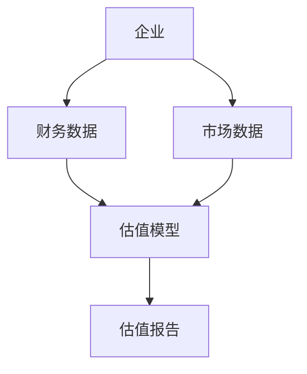
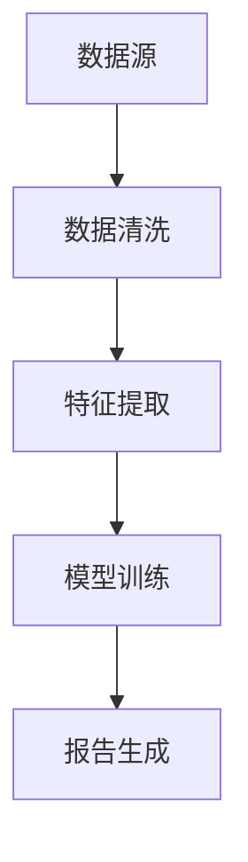
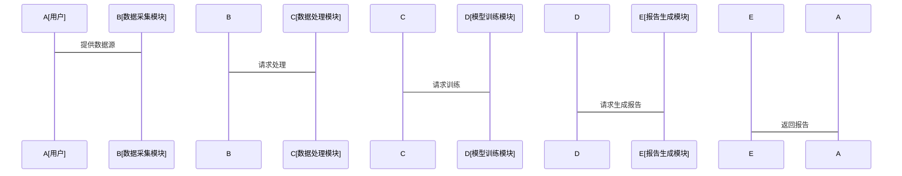
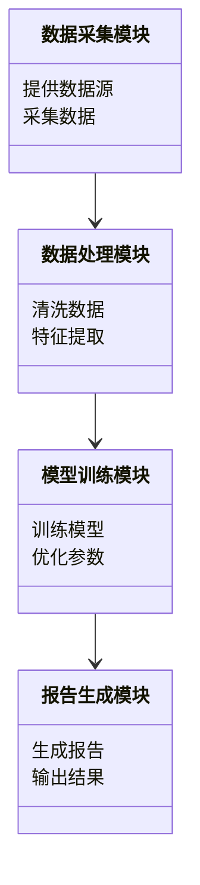
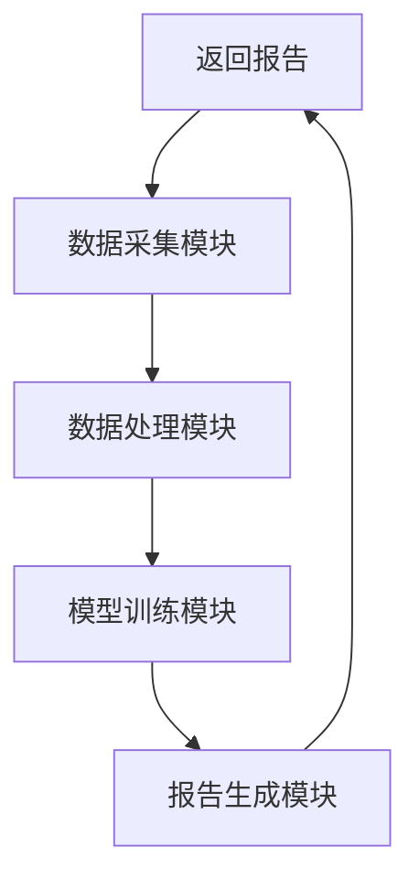
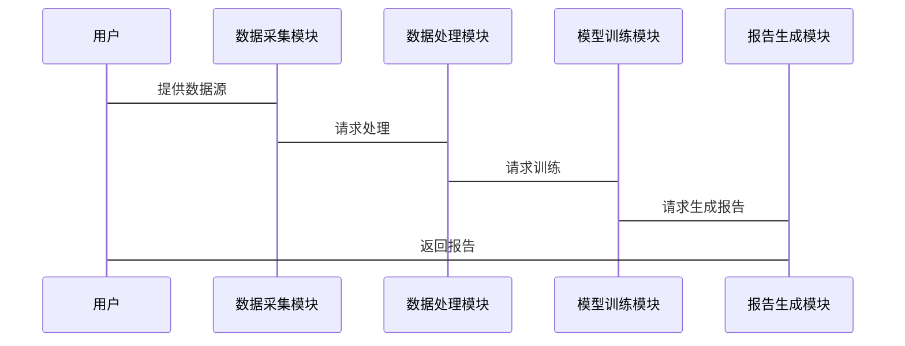

                 


# 《AI辅助的企业估值报告自动生成》

> 关键词：AI辅助、企业估值、自然语言处理、机器学习、企业报告生成

> 摘要：本文探讨了如何利用AI技术辅助生成企业估值报告，分析了自然语言处理和机器学习在企业估值中的应用，详细介绍了文本生成模型的原理和算法实现，通过实际案例展示了如何构建AI辅助的企业估值系统。

---

# 第一章: 企业估值与AI辅助的背景介绍

## 1.1 企业估值的重要性
### 1.1.1 企业估值的基本概念
企业估值是通过对企业的财务数据、市场表现和行业趋势等多方面因素进行分析，确定企业价值的过程。准确的估值对企业融资、并购、投资决策等具有重要意义。

### 1.1.2 传统企业估值方法的局限性
传统估值方法依赖于人工分析和经验判断，存在以下问题：
- 数据收集耗时且易出错
- 人工分析主观性强，难以标准化
- 高维数据处理复杂，难以全面考虑影响因素

### 1.1.3 AI技术如何改变企业估值
AI技术的引入，特别是自然语言处理（NLP）和机器学习（ML）模型，可以显著提高企业估值的效率和准确性：
- 自动化数据采集和处理
- 模型自动生成和优化
- 多维度数据的综合分析

## 1.2 AI在企业估值中的应用潜力
### 1.2.1 自然语言处理在企业报告生成中的作用
NLP技术可以帮助从企业年报、行业报告等文本数据中提取关键信息，生成初步的估值报告。

### 1.2.2 机器学习在估值模型中的应用
机器学习模型可以基于历史数据和市场趋势，预测企业的未来表现，辅助估值。

### 1.2.3 大数据分析对企业估值的支持
通过分析海量数据，包括财务数据、市场数据、新闻数据等，可以更全面地评估企业的价值。

## 1.3 本章小结
企业估值是企业管理和决策中的关键环节，传统方法存在效率低下和主观性强的问题。AI技术的应用，特别是NLP和ML模型，为解决这些问题提供了新的可能性。

---

# 第二章: AI辅助企业估值的核心概念与联系

## 2.1 AI大模型在企业估值中的应用原理
### 2.1.1 自然语言处理模型的文本生成能力
- 基于Transformer的模型（如GPT）具有强大的文本生成能力，可以自动生成企业估值报告的初稿。
- 使用预训练模型进行微调，以适应特定领域的需求。

### 2.1.2 机器学习模型的特征提取能力
- 利用深度学习模型（如BERT）提取企业财务数据和文本数据中的特征。
- 这些特征可以用于训练企业估值模型。

### 2.1.3 数据预处理与清洗的关键步骤
- 数据清洗：处理缺失值、异常值和重复数据。
- 数据标注：将文本数据转化为结构化数据，便于模型处理。

## 2.2 核心概念对比分析
### 2.2.1 企业估值模型与AI模型的对比
| **模型类型** | **输入** | **输出** | **优势** |
|--------------|-----------|-----------|-----------|
| 传统估值模型 | 财务数据 | 估值结果 | 依赖人工经验 |
| AI辅助模型   | 文本数据 + 财务数据 | 自动生成报告 | 高效、准确 |

### 2.2.2 不同AI模型的优缺点分析
- **GPT系列**：文本生成能力强，但缺乏对财务数据的直接处理能力。
- **BERT系列**：擅长特征提取，适合需要理解上下文的场景。
- **混合模型**：结合文本生成和特征提取能力，适合复杂的估值任务。

### 2.2.3 实体关系图中的核心要素


## 2.3 系统架构与数据流分析
### 2.3.1 系统整体架构图


### 2.3.2 数据流的处理流程


### 2.3.3 关键模块的交互关系


## 2.4 本章小结
AI模型在企业估值中的应用需要结合文本生成和特征提取能力，不同模型有其优缺点，系统架构设计需要考虑数据流的高效处理。

---

# 第三章: AI辅助企业估值的算法原理

## 3.1 文本生成模型的原理
### 3.1.1 基于Transformer的文本生成模型
- Transformer模型通过自注意力机制捕捉文本中的长距离依赖关系。
- 解码器端生成文本，逐步预测每个词的概率分布。

### 3.1.2 GPT系列模型的结构特点
- 基于自回归的生成方式。
- 使用交叉熵损失函数进行训练。

$$\text{损失函数} = -\frac{1}{N}\sum_{i=1}^{N} \log P(w_i|w_{i-1},...,w_1)$$

### 3.1.3 梯度下降与损失函数优化
- 使用Adam优化器进行参数更新。
- 学习率调整策略（如学习率衰减）。

## 3.2 企业估值模型的训练过程
### 3.2.1 数据清洗与特征提取
```python
import pandas as pd
import numpy as np

# 示例数据
data = pd.DataFrame({
    '文本': ['公司A的收入为100万', '公司B的收入为200万'],
    '标签': [1, 2]
})

# 数据清洗
data.dropna(inplace=True)
data['文本'].replace(r'\s+', ' ', regex=True)
```

### 3.2.2 模型训练的数学公式
$$\text{预测值} = \text{模型}(输入)$$
$$\text{损失} = \sum (\text{预测值} - \text{真实值})^2$$

### 3.2.3 超参数调整与优化
- 学习率：通常设置为$10^{-3}$到$10^{-5}$之间。
- 批大小：根据硬件资源调整，一般在32到256之间。

## 3.3 算法实现的代码示例
### 3.3.1 数据预处理代码
```python
def preprocess_data(data):
    # 假设data是一个包含文本和标签的DataFrame
    # 对文本进行分词处理
    from transformers import AutoTokenizer
    tokenizer = AutoTokenizer.from_pretrained('gpt2')
    inputs = tokenizer(data['文本'], return_tensors='np', padding=True, truncation=True)
    return inputs, data['标签']
```

### 3.3.2 模型训练代码
```python
from transformers import AutoModelForCausalLM, TrainingArguments, Trainer

model = AutoModelForCausalLM.from_pretrained('gpt2')
inputs, labels = preprocess_data(data)
training_args = TrainingArguments(...)
trainer = Trainer(model, training_args, data_collator=data_collator)
trainer.train()
```

### 3.3.3 模型推理代码
```python
def generate_report(model, tokenizer, prompt):
    inputs = tokenizer.encode(prompt, return_tensors='pt')
    outputs = model.generate(inputs, max_length=500)
    report = tokenizer.decode(outputs[0])
    return report
```

## 3.4 本章小结
文本生成模型的训练过程包括数据清洗、特征提取和超参数调整。通过数学公式和代码示例，我们详细讲解了模型的训练和推理过程。

---

# 第四章: 系统分析与架构设计方案

## 4.1 问题场景介绍
企业需要生成大量的估值报告，传统方法效率低下，容易出错。AI辅助系统可以自动完成数据处理和报告生成。

## 4.2 项目介绍
本项目旨在开发一个AI辅助的企业估值报告生成系统，利用NLP和ML技术提高效率和准确性。

## 4.3 系统功能设计
### 4.3.1 领域模型mermaid类图


### 4.3.2 系统架构设计mermaid架构图


### 4.3.3 系统接口设计
- 数据采集接口：接受外部数据源的输入。
- 模型训练接口：接收预处理后的数据，返回训练好的模型。
- 报告生成接口：根据输入的模型生成报告。

### 4.3.4 系统交互mermaid序列图


## 4.4 本章小结
系统设计包括数据采集、处理、模型训练和报告生成四个模块，通过模块化设计实现高效的企业估值报告生成。

---

# 第五章: 项目实战

## 5.1 环境安装
- 安装必要的库：`transformers`, `pandas`, `numpy`, `matplotlib`

## 5.2 系统核心实现源代码
### 5.2.1 数据预处理
```python
import pandas as pd
import numpy as np
from transformers import AutoTokenizer, AutoModelForCausalLM, TrainingArguments, Trainer

# 示例数据
data = pd.DataFrame({
    '文本': ['公司A的收入为100万', '公司B的收入为200万'],
    '标签': [1, 2]
})

# 数据清洗
data.dropna(inplace=True)
data['文本'].replace(r'\s+', ' ', regex=True)

# 分词处理
tokenizer = AutoTokenizer.from_pretrained('gpt2')
inputs = tokenizer(data['文本'], return_tensors='np', padding=True, truncation=True)
```

### 5.2.2 模型训练
```python
model = AutoModelForCausalLM.from_pretrained('gpt2')
training_args = TrainingArguments(...)
trainer = Trainer(model, training_args, data_collator=data_collator)
trainer.train()
```

### 5.2.3 报告生成
```python
def generate_report(model, tokenizer, prompt):
    inputs = tokenizer.encode(prompt, return_tensors='pt')
    outputs = model.generate(inputs, max_length=500)
    report = tokenizer.decode(outputs[0])
    return report
```

## 5.3 代码应用解读与分析
- 数据预处理：确保数据的完整性和一致性。
- 模型训练：利用预训练模型进行微调，提高模型的领域适应性。
- 报告生成：基于训练好的模型，自动生成企业估值报告。

## 5.4 实际案例分析
### 5.4.1 案例背景
以某科技公司为例，分析其财务数据和市场表现，生成估值报告。

### 5.4.2 数据准备
- 财务数据：收入、利润、研发投入等。
- 文本数据：公司年报、行业报告等。

### 5.4.3 模型训练
- 使用GPT模型生成初步报告。
- 结合财务数据进行模型优化。

### 5.4.4 报告生成与解读
- 自动生成的企业估值报告包括：收入预测、利润预测、行业分析等。
- 对报告进行解读，分析模型的准确性和可行性。

## 5.5 本章小结
通过实际案例分析，展示了AI辅助企业估值报告生成的完整流程，包括数据准备、模型训练和报告生成。

---

# 第六章: 最佳实践与总结

## 6.1 最佳实践
### 6.1.1 数据质量的重要性
- 数据清洗和标注是模型训练的基础。
- 数据多样性有助于提高模型的泛化能力。

### 6.1.2 模型调优的技巧
- 选择合适的模型架构。
- 合理设置超参数。
- 进行交叉验证和模型评估。

## 6.2 小结
AI技术的应用显著提高了企业估值的效率和准确性，通过本文的讲解和实践，读者可以掌握AI辅助企业估值的核心技术和实现方法。

## 6.3 注意事项
- 数据隐私和安全问题需要重视。
- 模型的可解释性需要进一步提升。
- 持续优化模型性能，适应不断变化的市场环境。

## 6.4 拓展阅读
- 《深度学习》——Ian Goodfellow
- 《自然语言处理实战》——周志华
- 《机器学习实战》——Peter Harrington

---

# 作者：AI天才研究院 & 禅与计算机程序设计艺术

