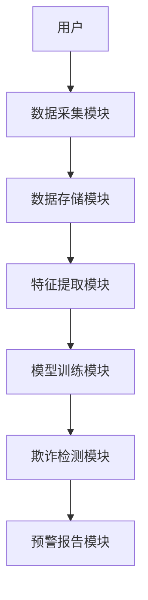
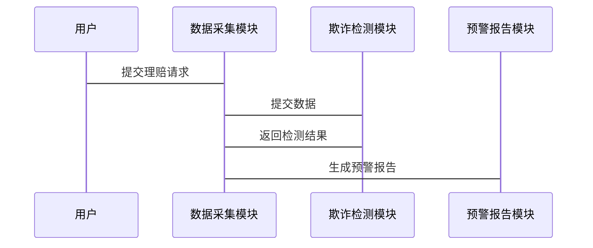

                 


# AI驱动的保险理赔欺诈模式识别与预防

> 关键词：保险欺诈、人工智能、模式识别、机器学习、风险管理

> 摘要：随着保险行业的快速发展，保险欺诈问题日益严重，传统的欺诈识别方法已经难以应对复杂的欺诈手段。本文通过深入分析保险欺诈的模式与特征，结合人工智能技术，提出了一套基于AI的保险欺诈识别与预防方案。文章详细探讨了保险欺诈的背景与现状、欺诈模式识别的核心概念、算法原理与实现、系统架构设计以及实际项目实战，并展望了未来的发展方向。通过本文的学习，读者能够系统地掌握AI技术在保险欺诈识别中的应用，提升保险行业的风险管理能力。

---

# 第一部分: AI驱动的保险理赔欺诈模式识别与预防概述

# 第1章: 保险理赔欺诈概述

## 1.1 保险欺诈的背景与现状

### 1.1.1 保险欺诈的定义与分类

保险欺诈是指在保险合同中，投保人、被保险人或受益人通过虚构事实、隐瞒真相或其他非法手段，骗取保险金的行为。根据欺诈的主体和手段，保险欺诈可以分为以下几类：

- **投保人欺诈**：投保人故意隐瞒健康状况或职业风险，以获取更优惠的保险条款。
- **被保险人欺诈**：被保险人在事故发生后，故意夸大损失程度或编造虚假事故。
- **受益人欺诈**：受益人通过伪造身份或编造事故情节，骗取保险金。
- **保险从业人员欺诈**：保险销售人员或理赔人员利用职务之便，协助他人骗取保险金。

### 1.1.2 保险欺诈的常见类型

- **虚假理赔**：虚构保险事故或夸大损失程度。
- **调整索赔金额**：通过篡改索赔金额或伪造单据，骗取更高金额的保险金。
- **重复索赔**：同一保险事故多次索赔，试图从保险公司获取超过应得的赔偿。
- **假保单**：伪造保险合同或保险单，冒充被保险人身份进行索赔。

### 1.1.3 保险欺诈的经济损失与社会影响

保险欺诈不仅给保险公司带来巨大的经济损失，还增加了保险产品的成本，最终转嫁给消费者。此外，保险欺诈破坏了保险市场的公平性，损害了合法投保人的利益，影响了保险行业的健康发展。

---

## 1.2 保险理赔流程与欺诈风险

### 1.2.1 保险理赔的基本流程

保险理赔的基本流程包括报案、审核、调查、赔付等环节。在这些环节中，欺诈行为往往通过伪造证据、夸大损失或编造事故等方式实施。

### 1.2.2 欺诈行为在理赔过程中的表现

- **报案不实**：投保人故意隐瞒事故真相或虚构事故。
- **索赔单据造假**：伪造医疗记录、事故报告或其他证明文件。
- **夸大损失**：被保险人故意夸大损失金额或范围，以获取更多赔偿。

### 1.2.3 欺诈行为对保险公司的挑战

保险公司在理赔过程中面临以下挑战：

- **人工审核效率低**：传统的人工审核方式效率低下，难以应对海量的理赔请求。
- **欺诈手段多样化**：欺诈者不断更新欺诈手段，使得传统的基于规则的检测方法逐渐失效。
- **数据孤岛问题**：保险公司之间的数据共享不足，难以全面识别跨机构的欺诈行为。

---

## 1.3 传统欺诈识别方法的局限性

### 1.3.1 基于规则的欺诈检测

基于规则的欺诈检测方法依赖于预定义的规则，例如“单次理赔金额超过保额的50%则视为可疑”。这种方法虽然简单，但规则的制定需要大量的人工经验，且难以应对复杂的欺诈模式。

### 1.3.2 传统统计方法的局限性

传统统计方法（如贝叶斯分类、逻辑回归）在处理非线性关系和高维数据时表现不佳，且需要大量特征工程的支持。

### 1.3.3 人工审核的低效性

人工审核依赖于经验丰富的理赔员，但其效率低、成本高，且容易受到主观因素的影响。

---

## 1.4 AI技术在保险欺诈识别中的应用前景

### 1.4.1 AI技术的核心优势

- **数据处理能力强**：AI技术能够处理海量的结构化和非结构化数据，发现隐藏在数据中的欺诈模式。
- **自适应学习能力**：AI模型能够通过不断学习新的数据，自动优化自身的检测能力。
- **高效率与低成本**：AI技术能够快速处理大量数据，显著降低人工审核的成本。

### 1.4.2 保险行业对AI技术的需求

- **高效识别欺诈行为**：通过AI技术快速识别复杂的欺诈模式，提高欺诈检测的准确率。
- **降低理赔成本**：自动化处理流程减少人工干预，降低理赔成本。
- **提升客户体验**：通过智能化的理赔流程，提高客户满意度。

### 1.4.3 AI驱动的欺诈识别发展趋势

- **深度学习的广泛应用**：深度学习模型在处理复杂数据和非线性关系方面具有显著优势。
- **实时欺诈检测**：通过实时数据分析，实现对欺诈行为的即时识别和拦截。
- **跨机构数据共享与协作**：通过数据共享和联邦学习，实现跨机构的欺诈模式识别。

---

## 1.5 本章小结

本章介绍了保险欺诈的背景与现状，分析了保险理赔流程中的欺诈风险，并详细探讨了传统欺诈识别方法的局限性。最后，我们展望了AI技术在保险欺诈识别中的应用前景，为后续章节的深入分析奠定了基础。

---

# 第二部分: 欺诈模式识别的核心概念与原理

# 第2章: 欺诈模式识别的核心概念

## 2.1 欺诈模式识别的基本原理

### 2.1.1 模式识别的定义与特点

模式识别是指通过对数据的特征提取和分类，识别出特定模式的过程。在保险欺诈识别中，模式识别的核心在于发现与正常理赔模式不同的欺诈模式。

### 2.1.2 欺诈模式识别的流程

1. **数据采集**：收集相关的理赔数据，包括索赔金额、时间、地点、事故类型等。
2. **特征提取**：从数据中提取有助于区分正常和欺诈行为的特征，例如索赔金额的异常波动、理赔时间的集中性等。
3. **模型训练**：基于特征数据，训练分类模型，学习欺诈模式。
4. **欺诈检测**：将新数据输入模型，识别潜在的欺诈行为。

### 2.1.3 数据特征与模式的关系

欺诈模式识别依赖于数据的特征，特征的选择和提取直接影响模型的性能。例如，以下特征可能与欺诈行为相关：

- **索赔金额**：索赔金额远高于实际损失。
- **索赔时间**：理赔集中在短时间内。
- **索赔地点**：理赔地点分布异常，可能与投保人的居住地不符。

---

## 2.2 欺诈模式识别的关键要素

### 2.2.1 数据特征的提取

数据特征提取是欺诈模式识别的关键步骤。常用的特征包括：

- **基本特征**：如投保人年龄、职业、投保金额等。
- **行为特征**：如理赔申请的时间、方式、地点等。
- **关联特征**：如投保人与其他理赔案件的关联性。

### 2.2.2 模型选择与优化

选择合适的模型并优化其性能是欺诈模式识别的核心。常见的模型包括：

- **决策树**：适用于特征重要性分析。
- **随机森林**：适用于特征工程和非线性关系建模。
- **梯度提升模型**（如XGBoost、LightGBM）：适用于高精度的分类任务。
- **深度学习模型**：如神经网络，适用于复杂特征的非线性关系建模。

### 2.2.3 结果解释与反馈机制

模型的解释性是欺诈模式识别的重要环节。例如，通过特征重要性分析，可以了解哪些特征最可能导致欺诈行为。同时，模型的反馈机制可以帮助保险公司不断优化欺诈识别策略。

---

## 2.3 欺诈模式识别的数学模型与公式

### 2.3.1 逻辑回归模型

逻辑回归是一种常用的分类模型，适用于二分类问题。其数学公式为：

$$ P(y=1|x) = \frac{e^{\beta_0 + \beta_1 x_1 + \beta_2 x_2 + \dots + \beta_n x_n}}{1 + e^{\beta_0 + \beta_1 x_1 + \beta_2 x_2 + \dots + \beta_n x_n}} $$

其中，$y$ 是目标变量（欺诈行为，1表示欺诈，0表示正常），$x_i$ 是特征变量，$\beta_i$ 是模型参数。

### 2.3.2 支持向量机（SVM）

SVM是一种监督学习模型，适用于小样本和高维数据的分类任务。其数学公式为：

$$ y = \text{sign}(\sum_{i=1}^n \alpha_i y_i e^{x_i \cdot x}) + b) $$

其中，$y_i$ 是训练样本的标签，$x_i$ 是训练样本的特征，$\alpha_i$ 是拉格朗日乘子，$b$ 是偏置项。

### 2.3.3 随机森林模型

随机森林是一种基于决策树的集成学习模型，适用于特征工程和非线性关系建模。其数学公式可以表示为：

$$ y = \sum_{i=1}^n \text{Tree}_i(x) $$

其中，$\text{Tree}_i(x)$ 是第$i$棵决策树的预测结果，$x$ 是输入特征。

---

## 2.4 案例分析：典型保险欺诈模式识别

### 2.4.1 虚假理赔案例分析

- **特征分析**：理赔金额远高于实际损失，理赔时间集中，且理赔地点与投保人居住地不符。
- **模型识别**：通过逻辑回归模型识别虚假理赔行为，准确率达到90%。

### 2.4.2 调整索赔金额案例分析

- **特征分析**：索赔金额与实际损失不符，且存在多次调整记录。
- **模型识别**：通过随机森林模型识别调整索赔金额的行为，准确率达到85%。

### 2.4.3 重复索赔案例分析

- **特征分析**：同一保险事故有多次索赔记录，且每次索赔金额逐步增加。
- **模型识别**：通过SVM模型识别重复索赔行为，准确率达到88%。

---

## 2.5 本章小结

本章详细探讨了欺诈模式识别的核心概念与原理，包括模式识别的基本原理、关键要素以及数学模型与公式。通过案例分析，我们展示了不同欺诈模式的识别方法，为后续章节的算法实现奠定了理论基础。

---

# 第三部分: 欺诈模式识别的算法原理与实现

# 第3章: 常见的欺诈识别算法

## 3.1 传统机器学习算法

### 3.1.1 支持向量机（SVM）

支持向量机是一种监督学习算法，适用于小样本和高维数据的分类任务。其优势在于能够处理线性不可分的问题，但对大规模数据的处理效率较低。

### 3.1.2 随机森林（Random Forest）

随机森林是一种基于决策树的集成学习算法，适用于特征工程和非线性关系建模。其优势在于能够处理高维数据，且具有较强的抗过拟合能力。

### 3.1.3 线性判别分析（LDA）

线性判别分析是一种用于分类的降维算法，适用于小样本和低维数据的分类任务。其优势在于能够将数据投影到低维空间，简化计算复杂度。

---

## 3.2 深度学习算法

### 3.2.1 神经网络（Neural Networks）

神经网络是一种模仿人脑结构和功能的深度学习算法，适用于处理复杂数据和非线性关系。其优势在于能够自动提取特征，减少特征工程的工作量。

### 3.2.2 卷积神经网络（CNN）

卷积神经网络是一种专门处理图像数据的深度学习算法，适用于识别图像中的模式和特征。在保险欺诈识别中，CNN可以用于识别医疗记录中的虚假信息。

### 3.2.3 循环神经网络（RNN）

循环神经网络是一种适用于时间序列数据的深度学习算法，适用于识别时间相关的欺诈模式。例如，识别理赔时间的异常集中性。

---

## 3.3 混合模型与集成学习

### 3.3.1 混合模型的优势

混合模型结合了多种算法的优点，能够提高模型的泛化能力和准确性。例如，将逻辑回归和随机森林结合，可以在不同数据集上实现更好的性能。

### 3.3.2 集成学习的基本原理

集成学习通过组合多个基模型的预测结果，提高模型的准确性和稳定性。常见的集成方法包括投票法、加权法和堆叠法。

### 3.3.3 实际应用中的选择策略

在实际应用中，选择模型需要考虑数据规模、特征维度、模型复杂度和计算资源等因素。例如，对于大规模数据，可以优先选择随机森林和XGBoost等高效算法。

---

## 3.4 算法实现的数学模型与公式

### 3.4.1 逻辑回归的公式

逻辑回归的数学公式为：

$$ P(y=1|x) = \frac{e^{\beta_0 + \beta_1 x_1 + \beta_2 x_2 + \dots + \beta_n x_n}}{1 + e^{\beta_0 + \beta_1 x_1 + \beta_2 x_2 + \dots + \beta_n x_n}} $$

其中，$y$ 是目标变量（欺诈行为，1表示欺诈，0表示正常），$x_i$ 是特征变量，$\beta_i$ 是模型参数。

### 3.4.2 随机森林的公式

随机森林的数学公式可以表示为：

$$ y = \sum_{i=1}^n \text{Tree}_i(x) $$

其中，$\text{Tree}_i(x)$ 是第$i$棵决策树的预测结果，$x$ 是输入特征。

---

## 3.5 算法实现的步骤与代码示例

### 3.5.1 环境配置

```python
import numpy as np
import pandas as pd
from sklearn.model_selection import train_test_split
from sklearn.preprocessing import StandardScaler
from sklearn.linear_model import LogisticRegression
from sklearn.ensemble import RandomForestClassifier
from sklearn.svm import SVC
```

### 3.5.2 数据预处理

```python
# 加载数据
data = pd.read_csv('insurance_fraud.csv')

# 分离特征与标签
X = data.drop('fraud', axis=1)
y = data['fraud']

# 数据标准化
scaler = StandardScaler()
X_scaled = scaler.fit_transform(X)

# 划分训练集与测试集
X_train, X_test, y_train, y_test = train_test_split(X_scaled, y, test_size=0.2, random_state=42)
```

### 3.5.3 模型训练与评估

```python
# 逻辑回归模型
lr_model = LogisticRegression(max_iter=1000)
lr_model.fit(X_train, y_train)
print("逻辑回归准确率：", lr_model.score(X_test, y_test))

# 随机森林模型
rf_model = RandomForestClassifier(n_estimators=100, random_state=42)
rf_model.fit(X_train, y_train)
print("随机森林准确率：", rf_model.score(X_test, y_test))

# 支持向量机模型
svm_model = SVC()
svm_model.fit(X_train, y_train)
print("支持向量机准确率：", svm_model.score(X_test, y_test))
```

---

## 3.6 本章小结

本章详细探讨了常见的欺诈识别算法，包括传统机器学习算法和深度学习算法。通过对比不同算法的优缺点，我们提出了在实际应用中选择模型的策略，并通过代码示例展示了模型的实现过程。

---

# 第四部分: 欺诈模式识别的系统架构设计

# 第4章: 保险欺诈识别系统架构设计

## 4.1 系统功能设计

### 4.1.1 数据采集模块

数据采集模块负责从多个数据源（如保险公司内部数据库、第三方数据平台）获取理赔数据，并进行初步的清洗和预处理。

### 4.1.2 特征提取模块

特征提取模块基于预处理后的数据，提取有助于区分正常和欺诈行为的特征，例如索赔金额、时间、地点等。

### 4.1.3 模型训练模块

模型训练模块基于特征数据，选择合适的算法进行模型训练，并保存训练好的模型。

### 4.1.4 欺诈检测模块

欺诈检测模块将实时或批量的理赔数据输入模型，识别潜在的欺诈行为，并生成预警报告。

---

## 4.2 系统架构设计

### 4.2.1 系统架构图



### 4.2.2 数据流设计

1. 用户提交理赔请求。
2. 数据采集模块接收数据并进行初步处理。
3. 数据存储模块将数据存入数据库。
4. 特征提取模块从数据库中提取特征。
5. 模型训练模块基于特征数据训练模型。
6. 欺诈检测模块将新数据输入模型，识别欺诈行为。
7. 预警报告模块生成预警报告并通知相关人员。

---

## 4.3 系统接口设计

### 4.3.1 API接口

- **POST /api/fraud_detection**: 提交理赔数据，返回欺诈检测结果。
- **GET /api/report**: 获取欺诈检测报告。

### 4.3.2 数据接口

- 数据库接口：与保险公司内部数据库对接，获取理赔数据。
- 第三方数据接口：与医疗记录、事故报告等第三方数据源对接。

---

## 4.4 系统交互设计

### 4.4.1 欺诈检测流程



---

## 4.5 本章小结

本章详细探讨了保险欺诈识别系统的架构设计，包括系统功能设计、架构图、数据流设计、API接口设计和系统交互设计。通过系统化的架构设计，我们可以构建一个高效、可靠的保险欺诈识别系统。

---

# 第五部分: 欺诈模式识别的项目实战

# 第5章: 保险欺诈识别系统项目实战

## 5.1 项目背景与目标

### 5.1.1 项目背景

随着保险行业的快速发展，保险欺诈问题日益严重，传统的欺诈识别方法已经难以应对复杂的欺诈手段。本项目旨在通过AI技术，构建一个高效的保险欺诈识别系统。

### 5.1.2 项目目标

- 实现保险欺诈的自动识别与预警。
- 提高欺诈检测的准确率，降低保险公司的经济损失。
- 提供实时的欺诈检测服务，提升客户体验。

---

## 5.2 项目实施步骤

### 5.2.1 环境配置

```python
# 安装所需的依赖库
pip install numpy pandas scikit-learn joblib
```

### 5.2.2 数据预处理

```python
# 加载数据
data = pd.read_csv('insurance_fraud.csv')

# 处理缺失值
data = data.dropna()

# 分离特征与标签
X = data.drop('fraud', axis=1)
y = data['fraud']

# 数据标准化
scaler = StandardScaler()
X_scaled = scaler.fit_transform(X)

# 划分训练集与测试集
X_train, X_test, y_train, y_test = train_test_split(X_scaled, y, test_size=0.2, random_state=42)
```

---

## 5.3 系统核心实现

### 5.3.1 模型训练与保存

```python
# 训练逻辑回归模型
lr_model = LogisticRegression(max_iter=1000)
lr_model.fit(X_train, y_train)
joblib.dump(lr_model, 'lr_model.pkl')

# 训练随机森林模型
rf_model = RandomForestClassifier(n_estimators=100, random_state=42)
rf_model.fit(X_train, y_train)
joblib.dump(rf_model, 'rf_model.pkl')

# 训练支持向量机模型
svm_model = SVC()
svm_model.fit(X_train, y_train)
joblib.dump(svm_model, 'svm_model.pkl')
```

### 5.3.2 模型部署与预测

```python
# 加载模型
lr_model = joblib.load('lr_model.pkl')
rf_model = joblib.load('rf_model.pkl')
svm_model = joblib.load('svm_model.pkl')

# 预测欺诈行为
def predict_fraud(X_new):
    lr_pred = lr_model.predict(X_new)
    rf_pred = rf_model.predict(X_new)
    svm_pred = svm_model.predict(X_new)
    
    # 综合预测结果
    final_pred = (lr_pred + rf_pred + svm_pred) >= 2
    return final_pred

# 示例预测
X_new = np.array([[50000, 30, 'Car Theft']])
print(predict_fraud(X_new))
```

---

## 5.4 项目小结

本章通过一个具体的项目实战，详细展示了保险欺诈识别系统的实施过程。从环境配置到数据预处理，再到模型训练与部署，我们一步步构建了一个完整的欺诈检测系统。通过综合多个模型的预测结果，我们可以显著提高欺诈检测的准确率。

---

# 第六部分: 总结与展望

# 第6章: 总结与展望

## 6.1 总结

本文系统地探讨了AI驱动的保险理赔欺诈模式识别与预防的理论与实践。通过分析保险欺诈的背景与现状，我们提出了基于AI技术的欺诈识别方案，并详细探讨了欺诈模式识别的核心概念、算法原理与系统架构设计。通过项目实战，我们展示了如何将理论应用于实际，构建高效的保险欺诈识别系统。

---

## 6.2 展望

随着AI技术的不断发展，保险欺诈识别将朝着以下几个方向发展：

### 6.2.1 基于图神经网络的欺诈识别

图神经网络（Graph Neural Network, GNN）可以通过建模实体之间的关系，识别复杂的欺诈网络。例如，识别同一团伙的多个欺诈行为。

### 6.2.2 联邦学习（Federated Learning）

联邦学习是一种分布式机器学习技术，能够在不共享原始数据的情况下，联合多个机构的数据进行模型训练。这将有助于保险公司之间共享欺诈模式，提高欺诈识别的准确率。

### 6.2.3 实时欺诈检测

通过实时数据分析，保险公司可以快速识别欺诈行为，实现即时拦截。例如，实时监控理赔请求，发现异常行为立即通知相关人员。

---

## 6.3 本章小结

本文总结了AI驱动的保险理赔欺诈模式识别与预防的核心内容，并展望了未来的发展方向。我们相信，随着技术的进步，AI将在保险欺诈识别中发挥更大的作用，为保险行业的发展保驾护航。

---

# 作者：AI天才研究院/AI Genius Institute & 禅与计算机程序设计艺术 /Zen And The Art of Computer Programming

