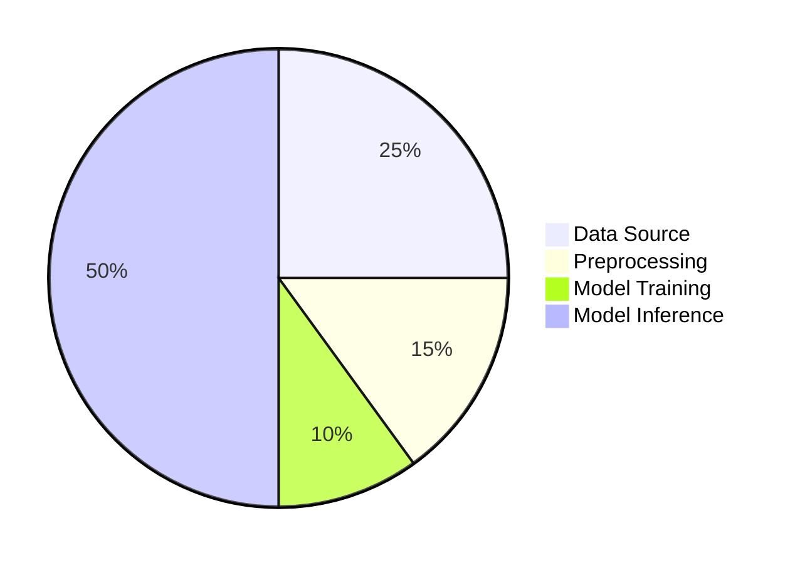
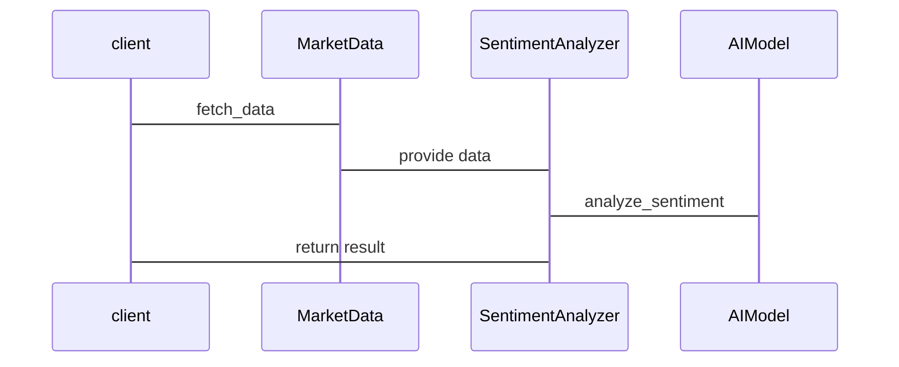

                 


# AI驱动的行为金融学分析：理解市场非理性

## 关键词：AI，行为金融学，市场非理性，认知偏差，机器学习，神经网络

## 摘要：  
本文探讨了AI在行为金融学中的应用，分析了市场中的非理性行为，并结合数学模型和算法，展示了如何利用AI技术预测和理解市场波动。通过前景理论、认知偏差、社会心理等核心概念，结合聚类分析、回归分析、神经网络等算法，本文提供了从理论到实践的详细分析。

---

## 第一部分：AI驱动的行为金融学基础

### 第1章：行为金融学与AI的结合

#### 1.1 行为金融学概述

##### 1.1.1 传统金融学的局限性  
传统金融学假设市场参与者是理性的，且市场是有效的。然而，2008年金融危机表明，市场的非理性行为远比我们想象的复杂。传统金融学无法解释市场泡沫、恐慌等现象。

##### 1.1.2 行为金融学的核心观点  
行为金融学研究投资者心理和行为如何影响市场。它认为，市场参与者是非理性的，他们的决策受到认知偏差、情绪和社会心理的影响。

##### 1.1.3 AI在行为金融学中的应用潜力  
AI能够处理海量数据，识别复杂模式，为行为金融学提供了新的工具。例如，AI可以分析社交媒体情绪，预测市场走势。

#### 1.2 AI驱动的分析优势

##### 1.2.1 数据处理能力  
AI可以处理大量非结构化数据（如文本、图像），提取情感和情绪信息。

##### 1.2.2 模式识别能力  
AI能够识别市场中的复杂模式，帮助发现非理性行为的规律。

##### 1.2.3 实时分析能力  
AI可以实时监控市场动态，快速做出反应。

---

### 第2章：行为金融学的核心理论

#### 2.1 前景理论

##### 2.1.1 前景理论的基本假设  
前景理论由Kahneman和Tversky提出，认为人们在决策时会权衡收益和损失，并对小概率事件过于悲观。

##### 2.1.2 偏好反转与概率加权  
前景理论中的概率加权函数表明，人们会过度重视小概率事件，低估大概率事件。

##### 2.1.3 前景理论的数学模型  
$$ V(p) = \text{sign}(p - 0.5) \times \frac{1}{\gamma} \left( -\ln\left(\frac{p}{1-p}\right) \right) $$  
其中，\( p \) 是概率，\( \gamma \) 是风险厌恶系数。

#### 2.2 认知偏差与决策错误

##### 2.2.1 常见的认知偏差类型  
- 过度自信偏差：高估自己判断的准确性。  
- 可得性偏差：根据容易回忆的信息做出判断。  
- 锚定效应：过度依赖初始信息。

##### 2.2.2 偏差对投资决策的影响  
认知偏差导致投资者做出非理性决策，如过度交易、追涨杀跌。

##### 2.2.3 偏差的量化分析  
通过统计方法（如回归分析）量化认知偏差对投资收益的影响。

#### 2.3 社会心理与市场情绪

##### 2.3.1 社会心理的基本概念  
社会心理是指个体在群体中的行为受到他人影响的心理状态。

##### 2.3.2 市场情绪的传播机制  
市场情绪通过社交媒体、新闻传播，影响投资者决策。

##### 2.3.3 情绪对市场波动的影响  
情绪波动会导致市场泡沫和崩盘。

---

### 第3章：AI驱动的行为金融学分析框架

#### 3.1 数据采集与处理

##### 3.1.1 数据来源  
- 股票价格数据：来自金融数据库。  
- 社交媒体数据：如Twitter、Reddit的帖子。  
- 新闻数据：来自财经媒体。

##### 3.1.2 数据清洗与预处理  
- 删除噪声数据。  
- 标准化处理。

##### 3.1.3 数据特征提取  
- 情感分析：使用NLP技术提取文本情感。  
- 市场情绪指数：计算整体情绪得分。

#### 3.2 模型构建与训练

##### 3.2.1 机器学习算法选择  
- 聚类分析：识别市场情绪群体。  
- 回归分析：预测股票价格。  
- 神经网络：深度学习情感分析。

##### 3.2.2 模型训练与优化  
- 调参：选择最佳超参数。  
- 交叉验证：评估模型性能。

##### 3.2.3 模型评估与验证  
- 准确率：预测与实际值的匹配程度。  
- 回调率：预测值与真实值的相似性。

---

### 第4章：基于AI的行为金融学分析算法

#### 4.1 聚类分析

##### 4.1.1 K-means算法

###### 算法步骤  
1. 初始化：随机选择K个中心点。  
2. 聚类：将数据点分配到最近的中心点。  
3. 更新：计算新中心点。  
4. 重复步骤2-3，直到收敛。

###### Python代码  
```python
from sklearn.cluster import KMeans
import numpy as np

data = np.array([[1, 2], [3, 4], [5, 6], [7, 8]])
kmeans = KMeans(n_clusters=2)
kmeans.fit(data)
print(kmeans.labels_)
```

##### 4.1.2 层次聚类算法

###### 算法步骤  
1. 初始化：将每个数据点视为一个簇。  
2. 合并：计算距离最近的两个簇，合并成一个新的簇。  
3. 重复步骤2，直到所有数据点合并成一个簇。

###### Python代码  
```python
from sklearn.cluster import AgglomerativeClustering
import numpy as np

data = np.array([[1, 2], [3, 4], [5, 6], [7, 8]])
clustering = AgglomerativeClustering(n_clusters=2)
clustering.fit_predict(data)
print(clustering.labels_)
```

##### 4.1.3 聚类在行为金融学中的应用  
聚类分析可以识别市场情绪群体，帮助投资者理解不同投资者的行为模式。

#### 4.2 回归分析

##### 4.2.1 线性回归模型

###### 算法步骤  
1. 确定自变量和因变量。  
2. 计算回归系数。  
3. 预测因变量。

###### Python代码  
```python
import statsmodels.api as sm

# 数据准备
X = sm.add_constant([1, 2, 3, 4])
y = [2, 4, 5, 6]

# 回归分析
model = sm.OLS(y, X)
results = model.fit()
print(results.summary())
```

##### 4.2.2 逻辑回归模型

###### 算法步骤  
1. 计算概率。  
2. 转换为类别标签。

###### Python代码  
```python
from sklearn.linear_model import LogisticRegression
import numpy as np

X = np.array([[1, 0], [2, 1], [3, 0], [4, 1]])
y = np.array([0, 1, 0, 1])

model = LogisticRegression()
model.fit(X, y)
print(model.predict(X))
```

##### 4.2.3 回归在市场预测中的应用  
回归分析可以预测股票价格走势，帮助投资者做出决策。

#### 4.3 神经网络

##### 4.3.1 卷积神经网络（CNN）

###### 算法步骤  
1. 提取特征。  
2. 池化。  
3. 分类。

###### Python代码  
```python
import tensorflow as tf
from tensorflow.keras import layers

model = tf.keras.Sequential([
    layers.Conv2D(32, (3,3), activation='relu', input_shape=(64, 64, 3)),
    layers.MaxPooling2D((2,2)),
    layers.Flatten(),
    layers.Dense(128, activation='relu'),
    layers.Dense(10, activation='softmax')
])
model.compile(optimizer='adam', loss='sparse_categorical_crossentropy', metrics=['accuracy'])
model.build(input_shape=(64, 64, 3))
model.summary()
```

##### 4.3.2 循环神经网络（RNN）

###### 算法步骤  
1. 处理序列数据。  
2. 预测下一步。

###### Python代码  
```python
import tensorflow as tf
from tensorflow.keras import layers

model = tf.keras.Sequential([
    layers.SimpleRNN(32, return_sequences=True, input_shape=(None, 1)),
    layers.Dense(10, activation='softmax')
])
model.compile(optimizer='adam', loss='sparse_categorical_crossentropy', metrics=['accuracy'])
model.build(input_shape=(None, 1))
model.summary()
```

##### 4.3.3 神经网络在行为金融学中的应用  
神经网络可以分析复杂的情感和市场模式，帮助预测市场情绪。

---

### 第5章：数学模型与公式

#### 5.1 前景理论的数学模型

##### 5.1.1 前

---

## 第二部分：AI驱动的行为金融学分析系统

### 第6章：系统分析与架构设计方案

#### 6.1 项目介绍

##### 6.1.1 项目目标  
开发一个基于AI的市场情绪分析系统。

##### 6.1.2 项目范围  
分析股票市场、加密货币市场。

#### 6.2 系统功能设计

##### 6.2.1 领域模型Mermaid类图  
```mermaid
classDiagram
    class MarketData {
        - data: array
        - fetch_data()
    }
    class SentimentAnalyzer {
        - model: AIModel
        - analyze_sentiment()
    }
    class AIModel {
        - weights: array
        - predict()
    }
    MarketData -> SentimentAnalyzer: provides data
    SentimentAnalyzer -> AIModel: uses model
```

#### 6.3 系统架构设计Mermaid架构图  


#### 6.4 系统接口设计

##### 6.4.1 API接口  
- `/fetch_data`: 获取市场数据。  
- `/analyze_sentiment`: 分析市场情绪。

#### 6.5 系统交互Mermaid序列图  


---

### 第7章：项目实战

#### 7.1 环境安装

##### 7.1.1 安装Python  
```bash
python --version
```

##### 7.1.2 安装依赖  
```bash
pip install numpy scikit-learn tensorflow
```

#### 7.2 系统核心实现源代码

##### 7.2.1 数据预处理  
```python
import pandas as pd
import numpy as np

data = pd.read_csv('market_data.csv')
data = data.dropna()
```

##### 7.2.2 情感分析  
```python
from sklearn.feature_extraction.text import TfidfVectorizer
from sklearn.naive_bayes import MultinomialNB

vectorizer = TfidfVectorizer()
X = vectorizer.fit_transform(data['text'])
model = MultinomialNB()
model.fit(X, data['label'])
```

##### 7.2.3 模型训练  
```python
from sklearn.model_selection import train_test_split

X_train, X_test, y_train, y_test = train_test_split(X, data['label'], test_size=0.2)
model.fit(X_train, y_train)
print("Accuracy:", model.score(X_test, y_test))
```

#### 7.3 代码应用解读与分析  
代码实现了从数据预处理到模型训练的全过程，展示了如何利用机器学习进行市场情绪分析。

#### 7.4 实际案例分析  
分析社交媒体上的股票评论，预测市场情绪，帮助投资者做出决策。

#### 7.5 项目小结  
通过项目实战，我们掌握了从数据处理到模型训练的全过程，为后续研究奠定了基础。

---

### 第8章：最佳实践

#### 8.1 小结  
AI在行为金融学中的应用潜力巨大，前景理论和认知偏差是核心理论。

#### 8.2 注意事项  
- 数据质量：确保数据准确。  
- 模型选择：根据场景选择合适算法。  
- 结果解释：避免过度依赖AI，结合人类判断。

#### 8.3 拓展阅读  
- Kahneman, D. (2011). *Thinking, Fast and Slow*.  
- Tversky, A., & Kahneman, D. (1992). *Judgment Under Uncertainty: Heuristics and Biases*.

---

## 作者：AI天才研究院/AI Genius Institute & 禅与计算机程序设计艺术 /Zen And The Art of Computer Programming

