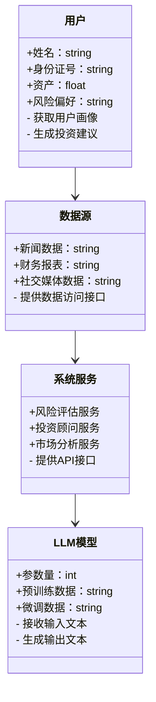
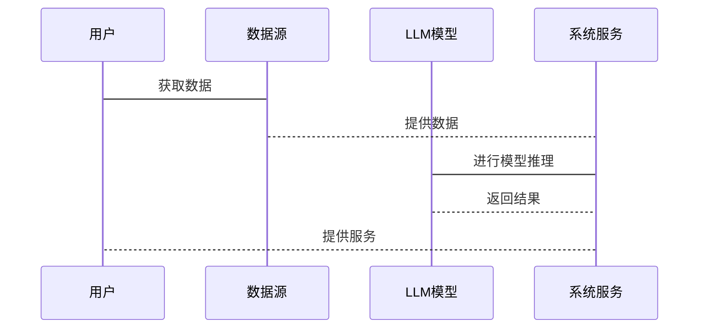

                 


# LLM大模型在金融领域的应用前景与挑战

> 关键词：大语言模型、LLM、金融应用、人工智能、机器学习、自然语言处理

> 摘要：本文将探讨大语言模型（LLM）在金融领域的应用前景与挑战。文章从背景介绍、核心概念、算法原理、系统架构设计、项目实战到总结，详细分析了LLM在金融领域的多方面应用，包括风险评估、智能投资顾问、 fraud detection等。通过系统分析与架构设计，结合实际项目案例，本文深入探讨了LLM在金融领域的技术实现和应用挑战。

---

# 第一部分: LLM大模型在金融领域的应用背景与核心概念

## 第1章: LLM大模型的定义与技术特点

### 1.1 LLM大模型的定义
#### 1.1.1 大语言模型的基本概念
大语言模型（Large Language Model, LLM）是指基于Transformer架构，经过大量文本数据预训练的深度学习模型。这些模型通常具有 billions 级别的参数量，能够理解和生成人类语言，具有强大的上下文理解和生成能力。

#### 1.1.2 LLM与传统NLP模型的区别
- **参数量**：LLM通常具有 billions 级别的参数，而传统NLP模型参数量较小。
- **预训练目标**：LLM采用无监督预训练，目标是最小化生成文本的困惑度（perplexity）。
- **应用场景**：LLM适用于多种任务，包括文本生成、问答系统、机器翻译等，而传统NLP模型通常针对特定任务优化。

#### 1.1.3 LLM的核心技术特点
1. **Transformer架构**：基于自注意力机制（self-attention），能够捕捉文本中的长距离依赖关系。
2. **巨量参数**：通过大量的参数，模型能够捕捉复杂的语言模式。
3. **预训练与微调**：LLM通常先进行无监督预训练，然后通过特定任务数据的微调（fine-tuning）进行优化。

### 1.2 LLM在金融领域的应用背景
#### 1.2.1 金融领域的复杂性与挑战
- **数据多样性**：金融市场数据包括股票价格、新闻、财务报表等，具有高度的复杂性和不确定性。
- **实时性要求**：金融交易需要快速决策，对模型的实时性要求高。
- **风险控制**：金融领域的核心任务之一是风险评估和管理，需要模型具备高精度和稳定性。

#### 1.2.2 LLM在金融中的潜在价值
- **自动化分析**：LLM可以自动分析大量文本数据，如新闻、财报，提取关键信息。
- **智能投顾**：通过LLM提供个性化的投资建议，帮助投资者做出决策。
- **欺诈检测**：LLM可以识别异常交易模式，帮助检测欺诈行为。

#### 1.2.3 金融行业对AI技术的需求
- **高效性**：金融行业需要快速处理大量数据，提高决策效率。
- **准确性**：金融决策的高风险性要求模型具有高精度。
- **可解释性**：金融领域的决策需要透明和可解释，以便监管和审计。

---

## 第2章: LLM大模型的核心原理与技术架构

### 2.1 LLM的模型结构
#### 2.1.1 Transformer模型的结构特点
- **编码器-解码器架构**：编码器负责将输入文本转换为向量表示，解码器负责根据编码器的输出生成目标文本。
- **自注意力机制**：允许模型在生成每个词时考虑整个输入序列的信息。

#### 2.1.2 多层自注意力机制
- **多头注意力**：通过并行计算多个注意力头，模型可以捕捉不同层次的语义信息。
- **位置编码**：通过引入位置编码（position encoding），模型可以理解文本的位置信息。

#### 2.1.3 巨量参数与训练方法
- **预训练目标**：LLM通常采用无监督预训练，目标是最小化生成文本的困惑度。
- **训练数据**：使用大规模通用文本数据进行预训练，如维基百科、书籍等。
- **微调策略**：针对特定任务，使用特定领域的数据进行微调，以优化模型性能。

### 2.2 LLM的训练与优化
#### 2.2.1 预训练目标函数
- **交叉熵损失函数**：用于衡量模型生成文本的概率与实际文本的概率之间的差异。
- **遮蔽语言模型任务（MLM）**：随机遮蔽部分输入词，要求模型预测被遮蔽词的概率。

#### 2.2.2 监督微调与适应性优化
- **监督微调**：在预训练的基础上，使用特定任务数据进行有监督微调。
- **适应性优化**：通过调整学习率、批量大小等参数，优化模型的训练效果。

#### 2.2.3 参数量对模型性能的影响
- **参数量与模型能力**：参数量越大，模型的表示能力越强，但训练和推理成本也越高。
- **模型压缩技术**：通过剪枝、量化等技术，减少模型参数量，降低计算成本。

### 2.3 LLM的推理机制
#### 2.3.1 解码策略与生成过程
- **贪心解码**：每次选择概率最高的词进行生成。
- **随机采样**：通过随机采样生成多样化的文本。
- **beam search**：通过保留多个候选词，生成多个可能的解码路径。

#### 2.3.2 模型的可解释性问题
- **可解释性的重要性**：金融领域的决策需要透明和可解释，以便监管和审计。
- **可解释性方法**：通过可视化注意力权重，解释模型的决策过程。

#### 2.3.3 多模态扩展的可能性
- **多模态模型**：将LLM与其他模态（如图像、语音）结合，扩展模型的应用场景。
- **跨模态理解**：通过跨模态理解，模型可以处理多种类型的数据，提高金融分析的全面性。

---

# 第二部分: LLM在金融领域的应用场景与系统架构

## 第3章: LLM在金融领域的核心应用场景

### 3.1 金融风险评估与预测
#### 3.1.1 信用风险评估
- **信用评分**：通过分析客户的信用历史、收入、负债等信息，评估客户的信用风险。
- **违约概率预测**：通过LLM分析客户的财务报表、新闻等信息，预测客户违约的概率。

#### 3.1.2 市场风险预测
- **市场波动预测**：通过分析历史市场数据和新闻，预测市场的波动情况。
- **资产价格预测**：通过LLM分析股票、债券等资产的价格走势，提供投资建议。

#### 3.1.3 金融事件的异常检测
- **异常交易检测**：通过分析交易数据，识别异常交易行为，防范欺诈风险。
- **市场操纵检测**：通过分析交易数据和新闻，识别可能的市场操纵行为。

### 3.2 智能投资顾问与资产配置
#### 3.2.1 个性化投资建议
- **客户画像**：通过分析客户的财务状况、风险偏好等信息，生成个性化的投资建议。
- **资产配置优化**：通过LLM分析市场数据和客户需求，优化客户的资产配置。

#### 3.2.2 自动化交易策略
- **交易信号生成**：通过LLM分析市场数据，生成交易信号，指导自动交易系统。
- **交易策略优化**：通过历史数据和市场分析，优化交易策略，提高交易收益。

### 3.3 金融信息抽取与知识图谱构建
#### 3.3.1 文本信息抽取
- **实体识别**：从金融文本中提取公司名称、金额、时间等实体信息。
- **关系抽取**：识别文本中的实体关系，构建金融知识图谱。

#### 3.3.2 知识图谱构建
- **知识图谱的应用**：通过构建金融知识图谱，支持金融分析和决策。
- **图谱推理**：通过图谱推理，识别潜在的市场机会和风险。

### 3.4 金融新闻分析与市场情绪预测
#### 3.4.1 金融新闻分析
- **新闻主题分类**：通过LLM对金融新闻进行主题分类，识别市场热点。
- **新闻情感分析**：分析新闻文本的情感倾向，预测市场情绪。

#### 3.4.2 市场情绪预测
- **市场情绪对资产价格的影响**：通过分析市场情绪，预测资产价格的波动。
- **情绪传播网络**：通过构建情绪传播网络，分析市场情绪的传播路径。

---

## 第4章: LLM在金融领域的系统架构设计

### 4.1 问题场景介绍
- **目标**：设计一个基于LLM的金融分析系统，支持多种金融应用场景，如风险评估、投资顾问等。
- **用户角色**：包括金融机构、投资者、数据分析师等。

### 4.2 系统功能设计
#### 4.2.1 系统功能模块
1. **数据采集模块**：从多种数据源（如新闻、财务报表、社交媒体）采集金融数据。
2. **模型训练模块**：对LLM进行微调，适应特定金融任务。
3. **应用服务模块**：提供多种金融应用服务，如风险评估、投资顾问等。
4. **用户界面模块**：提供友好的用户界面，方便用户使用系统服务。

#### 4.2.2 领域模型设计（Mermaid类图）


### 4.3 系统架构设计（Mermaid架构图）
```mermaid
container 金融分析系统 {
    authz 金融服务 {
        风险评估服务
        投资顾问服务
        市场分析服务
    }
    数据源 {
        新闻数据
        财务报表
        社交媒体数据
    }
    用户界面
}
```

### 4.4 系统接口设计
- **API接口**：系统通过RESTful API提供服务，方便其他系统调用。
- **数据接口**：系统与数据源通过数据接口进行交互，获取所需数据。

### 4.5 系统交互流程（Mermaid序列图）


---

## 第5章: LLM在金融领域的项目实战

### 5.1 环境搭建
- **工具安装**：安装Python、TensorFlow、PyTorch等深度学习框架。
- **数据源获取**：获取金融数据，如股票价格、财务报表等。
- **模型选择**：选择合适的LLM模型，如GPT-3、BERT等。

### 5.2 系统核心实现源代码
```python
import tensorflow as tf
from tensorflow.keras import layers

def build_model(vocabulary_size, embedding_dim, seq_length):
    inputs = layers.Input(shape=(seq_length,))
    embedding = layers.Embedding(vocabulary_size, embedding_dim)(inputs)
    attention_output = layers.SelfAttention(embedding_dim)(embedding)
    dense = layers.Dense(1, activation='sigmoid')(attention_output)
    model = tf.keras.Model(inputs=inputs, outputs=dense)
    return model

model = build_model(vocabulary_size=10000, embedding_dim=256, seq_length=512)
model.compile(optimizer='adam', loss='binary_crossentropy', metrics=['accuracy'])
```

### 5.3 代码应用解读与分析
- **模型训练**：通过金融数据对模型进行微调，优化模型在金融任务上的表现。
- **服务部署**：将训练好的模型部署为API服务，提供金融分析功能。

### 5.4 实际案例分析
- **案例一：风险评估**：通过分析客户的信用历史和财务数据，评估客户的信用风险。
- **案例二：投资顾问**：根据市场数据和客户的需求，提供个性化的投资建议。

### 5.5 项目小结
- **项目总结**：通过项目实战，验证了LLM在金融领域的应用潜力，但也暴露了一些问题，如模型的可解释性、计算资源需求等。
- **经验分享**：在实际项目中，需要结合具体业务需求，合理选择和优化模型。

---

## 第6章: 总结与展望

### 6.1 总结
- **技术总结**：本文详细探讨了LLM在金融领域的应用场景、系统架构设计和项目实现。
- **成果总结**：通过项目实战，展示了LLM在金融领域的巨大潜力，但也需要解决一些技术挑战。

### 6.2 未来展望
- **技术趋势**：未来，LLM在金融领域的应用将更加广泛，模型的性能和可解释性将得到进一步提升。
- **挑战与机会**：随着技术的发展，LLM在金融领域的应用将面临新的挑战，同时也将带来新的机会。

### 6.3 注意事项
- **数据隐私**：在金融领域，数据隐私和安全问题尤为重要，需要严格遵守相关法律法规。
- **模型可解释性**：金融决策需要透明和可解释，模型的可解释性是未来研究的重要方向。

### 6.4 拓展阅读
- **推荐书籍**：《Deep Learning》、《Hands-on Machine Learning with Scikit-Learn, Keras, and TensorFlow》
- **推荐论文**：关注最新的LLM和金融领域的相关研究论文。

---

# 作者

作者：AI天才研究院/AI Genius Institute  
 & 禅与计算机程序设计艺术 /Zen And The Art of Computer Programming

