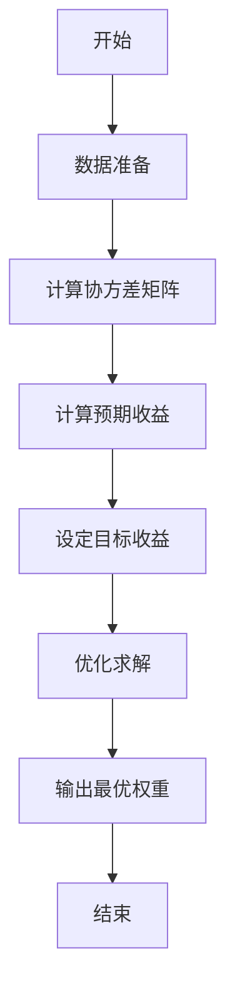
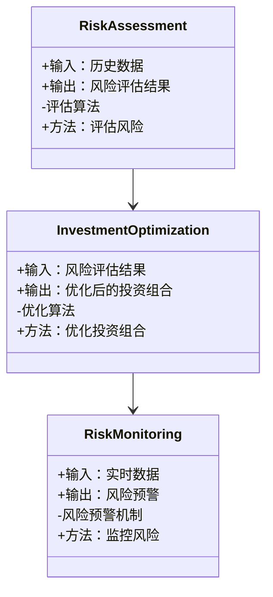

                 


# 《价值投资中的风险管理：分散投资的艺术》

## 关键词：
- 风险管理
- 价值投资
- 分散投资
- 投资组合优化
- 风险收益比
- 现代投资组合理论（MPT）
- 风险监控

## 摘要：
价值投资是一种以长期稳健的收益为目标的投资策略，其核心在于对企业的深入研究和对市场估值的准确判断。然而，再优秀的投资策略也难以避免市场的波动和不确定性。因此，风险管理在价值投资中扮演着至关重要的角色。本文将深入探讨风险管理的核心概念、数学模型、算法原理以及系统架构设计，并结合实际案例分析，帮助投资者掌握分散投资的艺术，从而在复杂多变的市场环境中实现稳健的投资回报。

---

# 第一部分：价值投资中的风险管理基础

## 第1章：价值投资与风险管理概述

### 1.1 价值投资的基本概念
#### 1.1.1 价值投资的定义
价值投资是一种长期投资策略，强调通过分析企业的基本面（如财务状况、行业地位、竞争优势等），寻找市场价格低于其内在价值的投资标的。其核心理念是“买入并持有”，追求长期稳定的收益。

#### 1.1.2 价值投资的核心理念
- **安全边际**：买入价格低于内在价值，以降低亏损风险。
- **长期视角**：关注企业的长期盈利能力，而非短期价格波动。
- **逆向思维**：在市场恐慌时寻找被低估的机会，在市场狂热时保持冷静。

#### 1.1.3 价值投资与传统投资的区别
| 特性       | 价值投资                 | 传统投资（如趋势交易）             |
|------------|--------------------------|------------------------------------|
| 时间框架   | 长期                     | 短期或中期                         |
| 分析方法   | 基于基本面分析             | 基于技术分析或市场趋势             |
| 风险管理   | 强调风险管理，注重安全边际| 侧重于交易策略，风险控制较为次要    |

### 1.2 风险管理的重要性
#### 1.2.1 风险的定义与分类
- **风险**：指在投资过程中，由于不确定性因素导致投资收益低于预期甚至出现亏损的可能性。
- **分类**：
  - **市场风险**：由于市场整体波动导致的资产价格下跌。
  - **流动性风险**：资产在短时间内难以以合理价格变现的风险。
  - **信用风险**：债券发行人或企业无法按时偿还债务的风险。
  - **操作风险**：由于人为错误或系统故障导致的损失。

#### 1.2.2 风险管理的核心目标
- 通过识别、评估和控制风险，确保投资组合在可承受风险范围内实现最大收益。
- 在价值投资中，风险管理是实现长期稳健收益的关键保障。

#### 1.2.3 风险管理在价值投资中的作用
- **降低整体风险**：通过分散投资，减少单一资产波动对整体组合的影响。
- **提高投资决策的可靠性**：通过风险评估，筛选出真正具备安全边际的投资标的。
- **实现长期稳健收益**：在市场波动中保持投资组合的稳定性，避免因短期亏损而盲目割肉。

### 1.3 分散投资的艺术
#### 1.3.1 分散投资的定义
分散投资是指将资金分配到不同的资产类别、行业或地区，以降低特定风险（非系统性风险）的投资策略。

#### 1.3.2 分散投资的原理
- **非相关性原则**：不同资产之间的价格波动具有较低的相关性，从而在组合中相互抵消风险。
- **有效分散**：通过科学的资产配置，使投资组合的风险收益比达到最优。

#### 1.3.3 分散投资与风险控制的关系
- 分散投资是降低风险的有效手段，但其效果取决于资产之间的相关性和组合的整体风险收益比。
- 过度分散可能导致收益下降，因此需要在分散与收益之间找到平衡点。

---

## 第2章：风险、收益与分散投资的关系

### 2.1 风险与收益的数学模型
#### 2.1.1 风险与收益的线性关系
在现代金融理论中，风险与收益通常呈正相关关系。投资者期望通过承担更高的风险来获得更高的收益。这种关系可以用资本资产定价模型（CAPM）来描述。

**公式**：
$$ E(r_i) = r_f + \beta_i (E(r_m) - r_f) $$

其中：
- $E(r_i)$：资产$i$的预期收益
- $r_f$：无风险利率
- $\beta_i$：资产$i$的贝塔系数（衡量其相对于市场的波动性）
- $E(r_m) - r_f$：市场风险溢价

#### 2.1.2 风险与收益的非线性关系
在实际市场中，风险与收益的关系并非总是线性的。特别是在极端市场条件下，非线性关系更为明显。例如，市场 crash 时，高风险资产的收益可能大幅下降，甚至出现亏损。

#### 2.1.3 风险与收益的均衡点
在投资组合优化中，寻找风险与收益的均衡点至关重要。这意味着在给定风险水平下，选择预期收益最高的组合，或者在给定收益下，选择风险最小的组合。

### 2.2 现代投资组合理论（MPT）
#### 2.2.1 MPT的核心假设
- 投资者是理性的，追求效用最大化。
- 市场是有效的，所有资产价格反映了所有可获得的信息。
- 投资者可以通过分散投资消除非系统性风险。

#### 2.2.2 MPT的数学公式
MPT的核心是通过优化投资组合的方差（风险）来最大化收益。优化问题可以表示为：

$$ \min_{w} \sigma_p^2 $$
$$ \text{subject to} \quad E(r_p) = \mu $$

其中：
- $w$：投资权重向量
- $\sigma_p^2$：投资组合的方差（风险）
- $E(r_p)$：投资组合的预期收益
- $\mu$：目标预期收益

#### 2.2.3 MPT在分散投资中的应用
- 通过计算资产之间的协方差矩阵，确定最优资产配置。
- 使用有效前沿（Efficient Frontier）概念，找到在给定风险水平下收益最高的组合。

### 2.3 风险收益比的计算
#### 2.3.1 风险收益比的定义
风险收益比（Risk-Reward Ratio）是衡量投资回报与承担风险之间关系的指标，计算公式为：

$$ \text{风险收益比} = \frac{\text{预期收益}}{\text{风险}} $$

#### 2.3.2 风险收益比的实际应用
- 通过比较不同投资组合的风险收益比，选择具有更高单位风险收益比的资产或组合。
- 在价值投资中，风险收益比是衡量投资标的吸引力的重要指标。

---

## 第3章：分散投资的算法原理与实现

### 3.1 风险评估算法
#### 3.1.1 风险评估的步骤
1. 数据采集：收集相关资产的历史价格、财务数据等。
2. 风险因子分析：识别影响资产风险的主要因素（如市场波动、行业风险等）。
3. 风险概率计算：使用统计模型（如VaR、CVaR）评估资产的风险水平。

#### 3.1.2 风险评估的数学模型
- VaR（在险价值）：在给定置信水平下，可能的最大损失。
- CVaR（条件在险价值）：VaR的延伸，衡量在VaR超过一定水平时的平均损失。

#### 3.1.3 风险评估的实现流程
1. 数据预处理：清洗和标准化数据。
2. 模型选择：根据具体情况选择合适的风险评估模型。
3. 参数估计：估计模型参数。
4. 风险评估：计算各资产的风险值。

#### 3.1.4 代码示例（VaR计算）
```python
import numpy as np
import pandas as pd

# 假设我们有资产的历史收益数据
returns = pd.Series([0.05, -0.02, 0.03, 0.01, -0.04])

# 计算VaR（95%置信水平）
# 排序收益数据
sorted_returns = sorted(returns)
# 确定VaR的分位数
alpha = 0.05
VaR = sorted_returns[int(alpha * len(sorted_returns))]
```

### 3.2 分散投资优化算法
#### 3.2.1 分散投资优化的目标
- 在给定风险约束下，最大化投资组合的预期收益。
- 或者，在给定预期收益下，最小化投资组合的风险。

#### 3.2.2 分散投资优化的约束条件
- 投资权重之和为1。
- 每个资产的投资权重非负。

#### 3.2.3 分散投资优化的数学模型
使用二次规划模型：

$$ \min_{w} w^T \Sigma w $$
$$ \text{subject to} \quad w^T \mu = \mu_t \quad \text{和} \quad w \geq 0 $$

其中：
- $w$：投资权重向量
- $\Sigma$：资产之间的协方差矩阵
- $\mu$：资产收益向量
- $\mu_t$：目标预期收益

#### 3.2.4 代码示例（使用Python的优化库进行投资组合优化）
```python
from scipy.optimize import minimize

# 假设我们有协方差矩阵 Sigma 和预期收益向量 mu
Sigma = np.array([[0.04, 0.02], [0.02, 0.03]])
mu = np.array([0.08, 0.05])

# 定义优化目标函数
def objective(w):
    return np.dot(w.T, np.dot(Sigma, w))

# 定义约束条件
def constraint(w, mu_t):
    return np.dot(w, mu) - mu_t

# 初始猜测
w_initial = np.array([0.5, 0.5])

# 使用scipy.optimize.minimize进行优化
result = minimize(objective, w_initial, method='SLSQP')

# 输出最优权重
print(result.x)
```

### 3.3 分散投资优化的流程图


---

## 第4章：投资组合风险管理系统的架构设计

### 4.1 系统功能模块划分
- **风险评估模块**：负责对各资产的风险进行评估和排序。
- **分散投资优化模块**：根据风险评估结果，优化投资组合。
- **风险监控模块**：实时监控投资组合的风险，及时调整。

### 4.2 系统架构设计


### 4.3 系统接口设计
- **输入接口**：接收历史数据和实时数据。
- **输出接口**：输出风险评估结果、优化后的投资组合和风险预警信息。

### 4.4 系统交互设计
```mermaid
sequenceDiagram
   参与者 用户
    actor 用户
    模块 风险评估模块
    模块 投资组合优化模块
    模块 风险监控模块
    用户 -> 风险评估模块：提交历史数据
    风险评估模块 -> 投资组合优化模块：传递风险评估结果
    投资组合优化模块 -> 风险监控模块：传递优化后的投资组合
    风险监控模块 -> 用户：输出风险预警
```

---

## 第5章：项目实战：投资组合优化工具的实现

### 5.1 项目背景与目标
- **背景**：在当前复杂多变的市场环境中，投资者需要有效的工具来优化投资组合，降低风险。
- **目标**：开发一个基于Python的投资组合优化工具，实现风险评估、分散投资优化和风险监控功能。

### 5.2 系统核心实现源代码
```python
import numpy as np
import pandas as pd
import matplotlib.pyplot as plt

# 数据准备
returns = pd.DataFrame({
    '资产1': [0.05, -0.02, 0.03, 0.01, -0.04],
    '资产2': [0.03, 0.02, -0.01, 0.02, 0.05]
})

# 计算协方差矩阵
Sigma = returns.cov()

# 计算预期收益
mu = returns.mean()

# 定义优化目标函数
def objective(w):
    return (w.T @ Sigma @ w)

# 初始猜测
w_initial = np.array([0.5, 0.5])

# 使用scipy.optimize.minimize进行优化
from scipy.optimize import minimize

result = minimize(objective, w_initial, method='SLSQP')

# 输出最优权重
print('最优权重：', result.x)

# 可视化投资组合的风险-收益曲线
w1 = np.linspace(0, 1, 100)
w2 = 1 - w1
returns_pfolio = w1 * mu[0] + w2 * mu[1]
risks_pfolio = np.sqrt(w1**2 * Sigma.iloc[0,0] + w2**2 * Sigma.iloc[1,1] + 2 * w1 * w2 * Sigma.iloc[0,1])

plt.plot(returns_pfolio, risks_pfolio)
plt.xlabel('预期收益')
plt.ylabel('风险')
plt.title('投资组合的风险-收益曲线')
plt.show()
```

### 5.3 代码解读与分析
- **数据准备**：收集并整理相关资产的历史收益数据。
- **协方差矩阵计算**：衡量各资产之间的相关性。
- **预期收益计算**：计算各资产的平均收益。
- **优化求解**：使用二次规划算法优化投资组合。
- **可视化**：绘制投资组合的风险-收益曲线，帮助投资者直观理解分散投资的效果。

### 5.4 案例分析与详细讲解
- **案例背景**：假设我们有两个资产，资产1和资产2，其历史收益数据如上。
- **优化结果**：最优权重为资产1和资产2的分配比例。
- **风险-收益曲线**：展示在不同权重下，投资组合的预期收益与风险的关系。

---

## 第6章：最佳实践与注意事项

### 6.1 分散投资的技巧
- **资产类别分散**：将资金分配到股票、债券、房地产等多种资产类别。
- **行业分散**：避免集中投资于单一行业，降低行业风险。
- **地域分散**：投资于不同地区的资产，降低区域风险。

### 6.2 风险管理中的注意事项
- **定期调整**：根据市场变化和个人风险承受能力，定期优化投资组合。
- **避免过度分散**：分散投资应基于合理的资产配置，避免因过度分散而导致收益下降。
- **关注流动性风险**：确保在需要时能够快速变现资产。

### 6.3 未来趋势与展望
- **智能投资工具**：随着人工智能和大数据技术的发展，智能投资工具将更加普及，帮助投资者实现更高效的分散投资。
- **风险管理技术的进步**：新的风险管理模型和算法将不断涌现，提升投资组合的风险控制能力。

---

## 结论
价值投资中的风险管理是实现长期稳健收益的关键。通过分散投资的艺术，投资者可以在复杂多变的市场环境中有效降低风险，同时抓住优质资产的投资机会。本文通过理论分析、算法实现和实际案例，全面探讨了风险管理的核心概念和实现方法，为投资者提供了科学的指导和实践参考。

---

## 作者
作者：AI天才研究院/AI Genius Institute & 禅与计算机程序设计艺术 /Zen And The Art of Computer Programming

