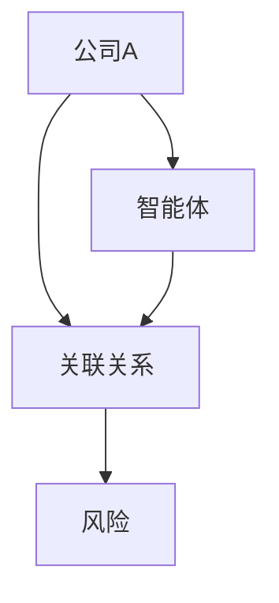
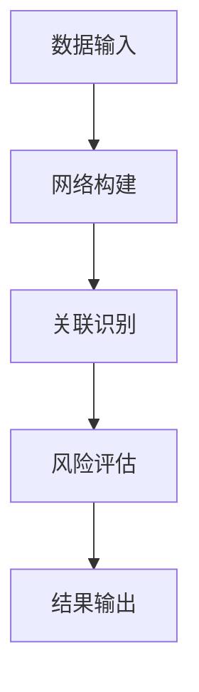
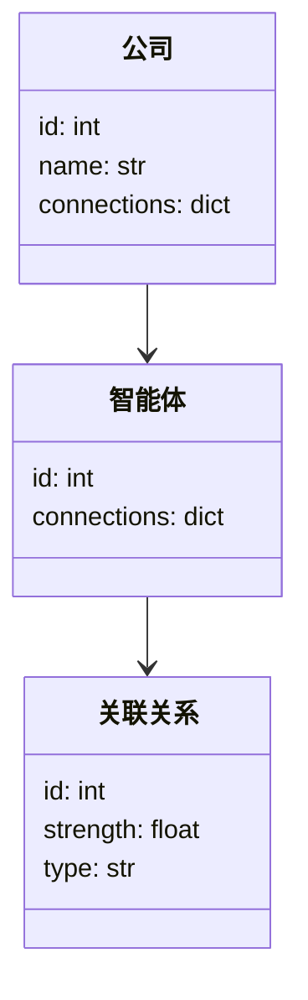

                 


# 利用智能体网络分析公司间的隐藏关联风险

## 关键词：智能体网络、公司关联风险、隐藏关联、算法原理、系统架构

## 摘要：本文探讨了利用智能体网络分析公司间隐藏关联风险的方法，从概念到算法实现，再到系统架构设计，结合实际案例，详细阐述了如何通过智能体网络技术识别和评估公司间的隐藏关联风险，为企业的风险管理提供新的视角和解决方案。

---

# 第1章 背景与问题概述

## 1.1 问题背景

### 1.1.1 公司间关联风险的现状与挑战
在现代商业环境中，公司之间的关联性日益复杂，这种关联可能通过直接的股权关系、供应链合作、共同的董事会成员或其他隐性方式体现。隐藏的关联关系可能导致利益输送、市场操纵、财务风险传递等问题，对市场公平性和企业稳定性构成威胁。传统的基于公开数据的分析方法难以捕捉这些隐藏的关联，因此需要更 sophisticated的技术手段来识别和评估这些风险。

### 1.1.2 隐藏关联风险对企业的影响
隐藏关联可能引发以下风险：
- **财务风险**：通过隐藏关联进行资金挪用或利益输送，可能导致企业财务状况恶化。
- **市场风险**：隐藏的关联可能影响市场价格，导致市场波动。
- **声誉风险**：一旦隐藏关联被曝光，相关企业可能会面临声誉损失。

### 1.1.3 智能体网络技术的应用潜力
智能体网络是一种能够模拟和分析复杂关系网络的工具，通过建模公司之间的关系，可以发现隐藏的关联。智能体网络的多智能体协作和动态交互特性使其非常适合用于分析公司间的复杂关系。

## 1.2 问题描述

### 1.2.1 隐藏关联风险的定义与特征
隐藏关联风险是指公司间通过未公开的途径建立的关联关系，这些关系可能对市场、企业或投资者造成负面影响。其特征包括：
- 隐秘性：未在公开渠道披露。
- 复杂性：可能涉及多层中间主体。
- 隐含风险：可能引发财务、市场或声誉风险。

### 1.2.2 智能体网络在关联分析中的作用
智能体网络通过模拟公司之间的关系，可以识别潜在的隐藏关联。具体作用包括：
- **关系建模**：将公司间的复杂关系转化为网络结构。
- **动态分析**：分析关系的动态变化，发现潜在风险。
- **风险评估**：评估隐藏关联可能带来的风险。

### 1.2.3 当前技术的局限性与改进方向
当前技术主要依赖于静态数据分析，难以捕捉动态变化的关联关系。智能体网络的优势在于其动态性和交互性，可以通过模拟关系的变化，发现隐藏关联。

## 1.3 问题解决思路

### 1.3.1 智能体网络的核心优势
智能体网络通过多智能体协作，可以模拟复杂的商业生态系统，发现隐藏关联。

### 1.3.2 数据驱动的关联分析方法
通过收集和分析公司间的各种数据，构建关联网络，识别隐藏关联。

### 1.3.3 结合智能体网络的解决方案
将智能体网络与大数据分析相结合，构建动态的关联网络，实时监控隐藏关联风险。

## 1.4 边界与外延

### 1.4.1 分析范围的界定
本文主要分析公司间的隐藏关联，不涉及个人或其他实体。

### 1.4.2 相关领域的区别与联系
与供应链管理、风险管理等相关领域有联系，但更专注于隐藏关联的风险分析。

### 1.4.3 技术适用场景的扩展
智能体网络技术不仅适用于公司间关联分析，还可应用于社交网络、交通网络等领域。

## 1.5 概念结构与核心要素

### 1.5.1 智能体网络的基本组成
智能体网络由智能体、关系和环境组成，智能体之间通过关系进行交互。

### 1.5.2 隐藏关联风险的关键要素
包括关联主体、关联方式、关联强度和风险类型。

### 1.5.3 概念之间的关系与作用
智能体网络通过关系建模，发现隐藏关联，进而评估风险。

---

# 第2章 智能体网络的核心概念与联系

## 2.1 智能体网络的基本原理

### 2.1.1 智能体的定义与特征
智能体是具有自主性、反应性、协作性和目标性的实体。

### 2.1.2 网络结构的构建与优化
通过图论方法构建网络，优化网络结构以提高关联识别的准确性。

### 2.1.3 智能体间的信息交互机制
智能体通过共享信息，动态调整网络结构，发现隐藏关联。

## 2.2 核心概念属性对比

| 概念       | 特征                     |
|------------|--------------------------|
| 智能体     | 自主性、反应性、协作性   |
| 关联关系   | 强度、类型、方向         |

### 2.2.3 ER实体关系图


---

# 第3章 算法原理与实现

## 3.1 算法概述

### 3.1.1 隐藏关联风险分
通过构建智能体网络，分析公司间的关联关系，评估隐藏关联风险。

### 3.1.2 算法步骤
1. 数据收集：收集公司间的关联数据。
2. 网络构建：构建智能体网络。
3. 关联识别：识别隐藏关联。
4. 风险评估：评估隐藏关联风险。

## 3.2 算法实现

### 3.2.1 数据结构
使用图论中的图结构表示智能体网络。

### 3.2.2 算法流程


### 3.2.3 数学模型
$$ P(r) = \sum_{i=1}^{n} w_i \cdot r_i $$
其中，\( w_i \) 为权重，\( r_i \) 为风险因子。

### 3.2.4 Python实现
```python
class Agent:
    def __init__(self, id):
        self.id = id
        self.connections = {}

    def add_connection(self, agent, weight):
        self.connections[agent.id] = weight

    def get_connections(self):
        return self.connections

class Network:
    def __init__(self):
        self.agents = {}

    def add_agent(self, agent):
        self.agents[agent.id] = agent

    def add_connection(self, agent1, agent2, weight):
        agent1.add_connection(agent2, weight)
        agent2.add_connection(agent1, weight)
```

---

## 3.3 本章小结

### 3.3.1 核心概念的总结
智能体网络通过构建网络结构，识别隐藏关联。

### 3.3.2 智能体网络的优势
动态性、交互性、复杂性。

### 3.3.3 下文应用的铺垫
为后续的系统设计和项目实战奠定基础。

---

# 第4章 系统分析与架构设计

## 4.1 问题场景介绍

### 4.1.1 需求分析
通过智能体网络识别公司间的隐藏关联风险。

### 4.1.2 项目介绍
构建一个智能体网络系统，用于分析公司间的隐藏关联风险。

## 4.2 系统功能设计

### 4.2.1 功能需求
- 数据采集模块：收集公司间的数据。
- 网络构建模块：构建智能体网络。
- 关联识别模块：识别隐藏关联。
- 风险评估模块：评估隐藏关联风险。

### 4.2.2 领域模型


## 4.3 系统架构设计

### 4.3.1 系统架构


### 4.3.2 接口设计
- 数据采集接口：接收公司数据。
- 分析接口：接收分析请求，返回结果。

## 4.4 本章小结

### 4.4.1 系统设计的总结
构建一个完整的智能体网络系统，实现隐藏关联风险的识别。

### 4.4.2 系统设计的优势
模块化、可扩展性、可维护性。

### 4.4.3 下文实战的铺垫
为后续的项目实战奠定基础。

---

# 第5章 项目实战

## 5.1 环境安装

### 5.1.1 系统环境
- 操作系统：Linux/Windows/MacOS
- Python版本：>=3.6
- 依赖库：networkx、matplotlib

## 5.2 核心代码实现

### 5.2.1 数据采集模块
```python
import requests
import json

def fetch_company_data(api_key):
    url = f"https://api.example.com/companies?api_key={api_key}"
    response = requests.get(url)
    return json.loads(response.text)
```

### 5.2.2 网络构建模块
```python
import networkx as nx

def build_network(companies):
    G = nx.Graph()
    for company in companies:
        G.add_node(company['id'])
        for relation in company['relations']:
            G.add_edge(company['id'], relation['id'], weight=relation['weight'])
    return G
```

### 5.2.3 关联识别模块
```python
def identify_hidden_associations(G):
    # 使用社区检测算法识别隐藏关联
    communities = nx.community.greedy_modularity_communities(G)
    return communities
```

### 5.2.4 风险评估模块
```python
def assess_risk(associations):
    # 计算每个关联的风险值
    risk_scores = {}
    for assoc in associations:
        score = sum(G[u][v]['weight'] for u, v in assoc.edges())
        risk_scores[assoc] = score
    return risk_scores
```

## 5.3 代码应用解读与分析

### 5.3.1 数据采集模块
通过API获取公司数据，构建基础数据集。

### 5.3.2 网络构建模块
使用NetworkX库构建智能体网络，表示公司间的关联关系。

### 5.3.3 关联识别模块
使用社区检测算法识别隐藏的关联关系。

### 5.3.4 风险评估模块
计算每个关联的风险值，评估隐藏关联的风险等级。

## 5.4 案例分析与详细讲解

### 5.4.1 案例背景
假设我们有五家公司，构建一个智能体网络，分析它们之间的隐藏关联风险。

### 5.4.2 数据分析过程
1. 数据采集：获取公司数据。
2. 网络构建：构建智能体网络。
3. 关联识别：识别隐藏关联。
4. 风险评估：评估隐藏关联风险。

### 5.4.3 结果解读
通过分析结果，识别出隐藏的关联关系，并评估其风险等级。

## 5.5 本章小结

### 5.5.1 项目实战的总结
通过实际案例，验证了智能体网络技术在识别隐藏关联风险中的有效性。

### 5.5.2 实战项目的应用价值
帮助企业发现隐藏的关联风险，提升风险管理能力。

### 5.5.3 技术的局限性与改进方向
当前算法可能不够精确，未来可以通过引入更多数据和改进算法提高准确性。

---

# 第6章 最佳实践与小结

## 6.1 最佳实践 tips

### 6.1.1 数据质量管理
确保数据的准确性和完整性，提高分析结果的可靠性。

### 6.1.2 模型优化
根据实际需求，优化智能体网络模型，提高关联识别的准确性。

### 6.1.3 风险管理
结合智能体网络分析结果，制定有效的风险管理策略。

## 6.2 小结

### 6.2.1 核心内容回顾
从概念到实现，详细介绍了如何利用智能体网络分析公司间的隐藏关联风险。

### 6.2.2 技术优势
动态性、交互性、复杂性，能够捕捉隐藏的关联关系。

## 6.3 注意事项

### 6.3.1 数据隐私
确保数据的隐私和安全，遵守相关法律法规。

### 6.3.2 模型解释性
提高模型的解释性，便于理解和应用。

### 6.3.3 技术局限性
智能体网络技术在处理大规模数据时可能面临性能问题。

## 6.4 拓展阅读

### 6.4.1 推荐书籍
- 《智能体网络：原理与应用》
- 《风险管理：理论与实践》

### 6.4.2 推荐博客
- [智能体网络技术博客](https://example.com)
- [风险管理博客](https://example.com)

---

# 作者信息

作者：AI天才研究院/AI Genius Institute & 禅与计算机程序设计艺术/Zen And The Art of Computer Programming

---

这篇文章详细探讨了利用智能体网络分析公司间的隐藏关联风险的方法，从背景介绍到算法实现，再到系统架构设计和项目实战，结合实际案例，详细阐述了如何通过智能体网络技术识别和评估公司间的隐藏关联风险，为企业的风险管理提供新的视角和解决方案。

