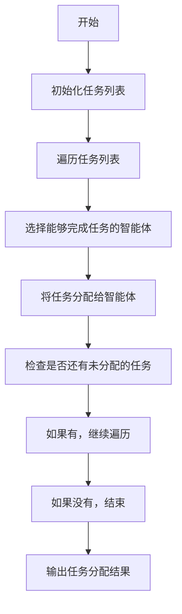
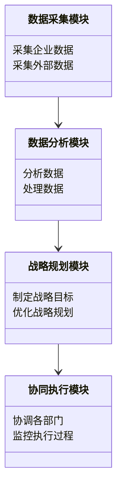

                 


# 基于多智能体的自动化公司战略规划分析系统

## 关键词：多智能体系统，公司战略规划，自动化分析，智能决策，系统架构

## 摘要：本文深入探讨了基于多智能体的自动化公司战略规划分析系统的核心概念、系统架构、算法原理和实际应用。通过分析多智能体系统的特性及其在企业战略规划中的优势，结合具体的算法实现和系统设计，展示了如何利用多智能体技术提升公司战略规划的效率和准确性。本文还通过实际案例分析，验证了该系统的可行性和有效性。

---

# 第1章: 多智能体系统概述

## 1.1 多智能体系统的基本概念

### 1.1.1 多智能体系统的定义
多智能体系统（Multi-Agent System, 简称MAS）是由多个智能体（Agent）组成的分布式系统，这些智能体通过协作和交互完成复杂的任务。每个智能体都是一个能够感知环境、做出决策并采取行动的实体。

### 1.1.2 多智能体系统的特征
- **自主性**：智能体能够自主决策，无需外部干预。
- **反应性**：智能体能够实时感知环境并做出反应。
- **协作性**：多个智能体通过协作完成共同目标。
- **分布性**：智能体分布在网络中，不存在中心化的控制节点。

### 1.1.3 多智能体系统与单智能体系统的区别
| 特性 | 单智能体系统 | 多智能体系统 |
|------|--------------|--------------|
| 决策中心化 | 是 | 否 |
| 系统复杂性 | 低 | 高 |
| 可扩展性 | 低 | 高 |
| 协作性 | 无 | 有 |

## 1.2 多智能体系统的体系结构

### 1.2.1 分层体系结构
分层体系结构将系统划分为多个层次，每个层次负责不同的功能。例如：
- **感知层**：负责感知环境数据。
- **决策层**：负责制定决策。
- **执行层**：负责执行决策。

### 1.2.2 分布式体系结构
分布式体系结构中，每个智能体独立运行，通过通信协议进行交互。这种结构适用于大规模分布式系统。

### 1.2.3 混合体系结构
混合体系结构结合了分层和分布式体系结构的特点，适用于复杂任务。

## 1.3 多智能体系统的优缺点

### 1.3.1 优点
- **高可扩展性**：可以通过增加智能体来扩展系统能力。
- **高容错性**：单个智能体故障不会导致整个系统崩溃。
- **灵活性**：智能体可以根据环境变化动态调整行为。

### 1.3.2 缺点
- **复杂性高**：多智能体系统的设计和维护较为复杂。
- **通信开销大**：智能体之间的通信可能增加系统开销。
- **协调困难**：多个智能体需要协调一致，可能导致冲突。

### 1.3.3 应用场景
多智能体系统广泛应用于机器人、自动驾驶、分布式计算等领域。

## 1.4 多智能体系统与传统企业战略规划的对比

### 1.4.1 传统企业战略规划的特点
- **人工主导**：依赖于人的经验和判断。
- **效率低**：规划过程耗时长，且容易受到人为因素的影响。
- **灵活性差**：难以快速应对环境变化。

### 1.4.2 多智能体系统在战略规划中的优势
- **自动化**：多智能体系统可以自动收集数据、分析信息并制定策略。
- **高效性**：通过分布式计算和协作，提高规划效率。
- **适应性**：能够实时感知环境变化并动态调整规划。

### 1.4.3 多智能体系统在战略规划中的挑战
- **复杂性**：战略规划涉及多个部门和业务，系统设计复杂。
- **数据孤岛**：各部门之间可能存在数据不共享的问题。
- **安全性**：智能体之间的通信可能存在安全风险。

## 1.5 本章小结
本章介绍了多智能体系统的基本概念、体系结构及其在企业战略规划中的应用优势和挑战。

---

# 第2章: 自动化公司战略规划分析系统的背景与需求

## 2.1 企业战略规划的现状与挑战

### 2.1.1 传统战略规划的局限性
- **人工依赖**：依赖于少数专家的经验，容易受到主观因素影响。
- **效率低下**：规划过程耗时长，且容易出错。
- **灵活性差**：难以快速应对市场变化。

### 2.1.2 数字化转型对企业战略规划的影响
随着数字化转型的推进，企业需要更加高效、灵活的规划方法。

### 2.1.3 自动化战略规划的需求
企业对自动化战略规划的需求日益增长，尤其是在复杂多变的市场环境中。

## 2.2 多智能体系统在公司战略规划中的应用背景

### 2.2.1 企业战略规划的复杂性
- 涉及多个部门和业务。
- 需要协调内外部资源。
- 需要应对不确定性。

### 2.2.2 多智能体系统在复杂决策中的优势
- **分布式计算**：能够处理大规模数据。
- **协作能力**：多个智能体可以协同完成复杂任务。
- **实时性**：能够快速响应环境变化。

### 2.2.3 自动化战略规划系统的必要性
- **提高效率**：自动化系统可以快速分析数据并制定策略。
- **降低成本**：减少人工干预，降低运营成本。
- **增强决策能力**：通过数据驱动的决策提高准确性。

## 2.3 系统的需求分析

### 2.3.1 功能需求
- 数据采集与分析。
- 战略目标设定与优化。
- 部门协同与资源分配。
- 风险评估与应对。

### 2.3.2 性能需求
- 高效性：快速处理大量数据。
- 稳定性：系统运行稳定，不易崩溃。
- 可扩展性：能够根据需求扩展功能。

### 2.3.3 用户需求
- 企业高管：需要全局性的战略规划。
- 各部门负责人：需要部门级的策略支持。
- 数据分析师：需要数据支持决策。

## 2.4 本章小结
本章分析了企业战略规划的现状与挑战，探讨了多智能体系统在战略规划中的应用背景，并提出了系统的功能需求和性能需求。

---

# 第3章: 多智能体系统的核心概念与联系

## 3.1 多智能体系统的核心概念

### 3.1.1 智能体的定义与特征
智能体（Agent）是一个能够感知环境、做出决策并采取行动的实体。其主要特征包括：
- **自主性**：智能体能够自主决策。
- **反应性**：智能体能够实时感知环境并做出反应。
- **协作性**：智能体能够与其他智能体协作完成任务。

### 3.1.2 多智能体系统中的角色与职责
- **决策者**：负责制定战略目标和决策。
- **执行者**：负责执行决策并完成任务。
- **协调者**：负责协调各智能体之间的协作。

### 3.1.3 多智能体系统中的通信机制
智能体之间的通信可以通过多种方式实现，例如：
- **直接通信**：智能体之间直接交换信息。
- **间接通信**：通过中间媒介进行信息传递。

## 3.2 多智能体系统的核心概念与联系

### 3.2.1 多智能体系统的核心概念
- **智能体**：系统的基本单元。
- **通信**：智能体之间信息交换的基础。
- **协作**：智能体共同完成任务的关键。

### 3.2.2 多智能体系统的核心要素组成
- **智能体**：负责具体任务的执行。
- **通信协议**：规范智能体之间的信息交换。
- **协作机制**：协调智能体之间的协作。

## 3.3 本章小结
本章详细阐述了多智能体系统的核心概念和组成部分，为后续章节的系统设计和实现奠定了基础。

---

# 第4章: 自动化公司战略规划分析系统的算法原理

## 4.1 多智能体系统中的任务分配算法

### 4.1.1 任务分配的基本原理
任务分配是多智能体系统中的关键问题，需要根据智能体的能力和资源分配情况动态调整任务。

### 4.1.2 基于最大公约数的分配算法


### 4.1.3 任务分配的数学模型
$$ \text{目标函数：最大化任务分配的效率} $$
$$ \text{约束条件：} $$
$$ \sum_{i=1}^{n} x_{i} = 1 $$

## 4.2 多智能体系统中的信息共享机制

### 4.2.1 信息共享的基本原理
信息共享是多智能体系统中协作的基础，需要通过通信机制实现。

### 4.2.2 基于分布式数据库的信息共享
智能体之间的信息可以通过分布式数据库进行共享，例如：
$$ \text{数据一致性：确保所有智能体看到的数据一致} $$

### 4.2.3 信息共享的安全性
需要通过加密和权限控制确保信息共享的安全性。

## 4.3 多智能体系统中的决策机制

### 4.3.1 决策的基本原理
决策机制是多智能体系统中协调协作的关键，需要根据环境和任务需求动态调整决策。

### 4.3.2 基于贝叶斯网络的决策算法
$$ P(A|B) = \frac{P(B|A)P(A)}{P(B)} $$

### 4.3.3 决策的数学模型
$$ \text{目标函数：最大化决策的收益} $$
$$ \text{约束条件：} $$
$$ \sum_{i=1}^{n} y_{i} \leq C $$

## 4.4 本章小结
本章详细介绍了多智能体系统中的任务分配、信息共享和决策机制，为系统实现提供了理论基础。

---

# 第5章: 自动化公司战略规划分析系统的系统架构设计

## 5.1 系统总体架构

### 5.1.1 系统架构概述
系统架构包括以下几个部分：
- **数据采集模块**：负责采集企业内外部数据。
- **数据分析模块**：负责对数据进行分析和处理。
- **战略规划模块**：负责制定和优化战略规划。
- **协同执行模块**：负责协调各部门的执行。

### 5.1.2 系统架构的mermaid图


## 5.2 系统功能设计

### 5.2.1 数据采集模块
- **功能**：采集企业内外部数据，例如市场数据、财务数据、客户数据等。
- **输入**：原始数据。
- **输出**：处理后的数据。

### 5.2.2 数据分析模块
- **功能**：对数据进行分析和处理，例如数据清洗、数据分析、数据可视化等。
- **输入**：处理后的数据。
- **输出**：分析结果。

### 5.2.3 战略规划模块
- **功能**：根据分析结果制定和优化战略规划。
- **输入**：分析结果。
- **输出**：战略规划方案。

### 5.2.4 协同执行模块
- **功能**：协调各部门的执行，监控执行过程。
- **输入**：战略规划方案。
- **输出**：执行结果。

## 5.3 系统架构设计

### 5.3.1 系统架构的mermaid图


### 5.3.2 系统架构的特点
- **模块化**：系统模块化设计，便于维护和扩展。
- **可扩展性**：系统可以根据需求扩展功能。
- **可维护性**：系统设计清晰，便于维护。

## 5.4 本章小结
本章详细介绍了自动化公司战略规划分析系统的总体架构和功能设计，为后续的实现提供了指导。

---

# 第6章: 自动化公司战略规划分析系统的项目实战

## 6.1 环境安装与配置

### 6.1.1 系统环境要求
- 操作系统：Windows、Linux、macOS。
- 开发工具：Python、Java、C++等。
- 数据库：MySQL、PostgreSQL等。
- 其他工具：Jupyter Notebook、PyCharm等。

### 6.1.2 系统安装步骤
1. 安装Python和相关库（例如：pandas、numpy、scipy）。
2. 安装数据库和连接器。
3. 安装其他开发工具。

## 6.2 系统核心实现

### 6.2.1 数据采集模块实现
```python
import requests

def collect_data():
    url = "https://example.com/api"
    response = requests.get(url)
    data = response.json()
    return data
```

### 6.2.2 数据分析模块实现
```python
import pandas as pd

def analyze_data(data):
    df = pd.DataFrame(data)
    # 数据分析逻辑
    return df
```

### 6.2.3 战略规划模块实现
```python
def制定战略目标(data):
    # 制定战略目标的逻辑
    return strategy
```

### 6.2.4 协同执行模块实现
```python
def 协调各部门(strategy):
    # 协调各部门的逻辑
    return execution_result
```

## 6.3 系统实现的注意事项

### 6.3.1 数据安全
- 数据采集和传输过程中需要加密。
- 数据存储需要权限控制。

### 6.3.2 系统性能
- 确保系统在高并发情况下的性能。
- 优化算法以提高效率。

### 6.3.3 系统维护
- 定期更新系统和数据。
- 监控系统运行状态。

## 6.4 本章小结
本章通过具体实现步骤展示了如何构建自动化公司战略规划分析系统，为实际应用提供了参考。

---

# 第7章: 总结与展望

## 7.1 系统总结

### 7.1.1 系统的特点
- **高效性**：自动化处理数据，提高规划效率。
- **准确性**：基于数据驱动的决策，提高准确性。
- **灵活性**：能够动态调整规划，适应环境变化。

### 7.1.2 系统的优势
- **降低人工成本**：减少对人工的依赖。
- **提高决策效率**：快速制定和优化战略。
- **增强企业竞争力**：通过高效的战略规划提升企业竞争力。

## 7.2 系统的局限性

### 7.2.1 系统复杂性
多智能体系统的复杂性可能导致设计和维护难度增加。

### 7.2.2 数据依赖
系统高度依赖数据的准确性和完整性，数据不足或不准确可能影响决策。

### 7.2.3 安全风险
系统可能存在数据泄露和网络攻击的风险。

## 7.3 系统的未来展望

### 7.3.1 系统优化方向
- **算法优化**：进一步优化多智能体系统的算法，提高效率和准确性。
- **系统扩展**：扩展系统的功能，支持更多类型的战略规划。
- **智能化提升**：引入更高级的人工智能技术，如深度学习和自然语言处理。

### 7.3.2 技术发展趋势
- **云计算**：利用云计算技术提高系统的扩展性和灵活性。
- **边缘计算**：通过边缘计算实现更高效的实时处理。
- **物联网**：结合物联网技术，实现更全面的数据采集和分析。

## 7.4 本章小结
本章总结了系统的特点和优势，分析了系统的局限性，并展望了未来的发展方向。

---

# 作者：AI天才研究院/AI Genius Institute & 禅与计算机程序设计艺术 /Zen And The Art of Computer Programming

