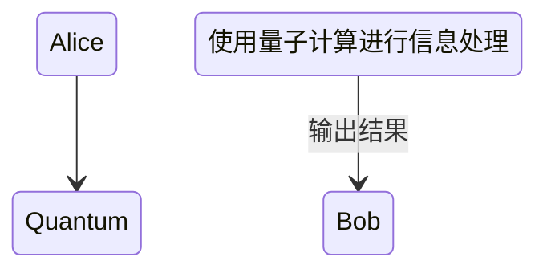
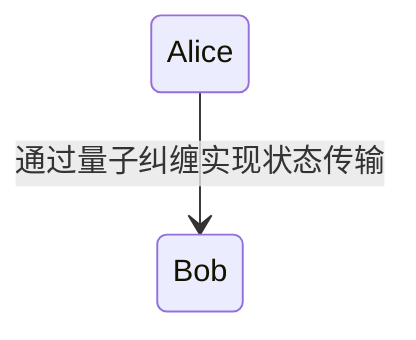

                 


```markdown
# 巴菲特-芒格的量子加密通信投资：后量子时代的数据安全

> 关键词：巴菲特，芒格，量子加密通信，后量子时代，数据安全，投资策略，风险管理

> 摘要：本文深入探讨了巴菲特和芒格在后量子时代对量子加密通信的投资策略。通过分析量子加密通信的技术原理、市场潜力以及投资价值，揭示了两位投资大师如何将长期主义和风险管理的理念应用于新兴技术领域。文章结合实际案例，详细阐述了量子加密通信的投资机会与挑战，并提供了实用的投资策略和风险管理建议。

---

## 第1章: 量子计算与后量子时代的数据安全

### 1.1 量子计算的基本概念

#### 1.1.1 量子计算的定义与基本原理
量子计算是一种基于量子力学原理的计算方式，利用量子叠加和量子纠缠等特性来处理信息。与经典计算机使用二进制位不同，量子计算机使用量子位（qubit），能够在同一时间处理大量状态。

**量子叠加原理**：量子位可以同时处于0和1的状态，这使得量子计算机在某些情况下比经典计算机快得多。

**量子纠缠原理**：当两个或多个量子位纠缠时，它们的状态会紧密相关，一个量子位的状态会立即影响另一个量子位的状态，无论它们之间的距离有多远。



#### 1.1.2 量子计算与经典计算的主要区别
- **并行性**：量子计算机可以同时处理大量可能的状态，而经典计算机需要逐一处理。
- **计算速度**：在某些特定问题上，量子计算机的计算速度远超经典计算机。
- **安全性**：量子计算机的出现对传统加密技术构成了威胁，尤其是基于RSA和椭圆曲线加密的公钥加密系统。

#### 1.1.3 后量子时代对传统加密技术的威胁
传统加密技术（如RSA）的安全性依赖于大数分解和离散对数问题的难度。而量子计算机在这些问题上的计算效率极高，这意味着传统加密技术在后量子时代将面临被破解的风险。

**后量子加密技术**：为应对量子计算机的威胁，研究者开发了新的加密算法，如 lattice-based cryptography（格密学）和 hash-based cryptography（哈希基密码学）。

---

### 1.2 量子加密通信的定义与特点

#### 1.2.1 量子加密通信的定义
量子加密通信是一种利用量子力学原理进行数据加密和传输的技术。其核心是通过量子密钥分发（QKD）协议，实现安全的密钥交换，从而保证通信的机密性和完整性。

**量子密钥分发（QKD）**：QKD是一种通过量子态传输密钥的技术，确保密钥的安全分发。即使有窃听者试图窃取密钥，也会被检测到并导致通信中断。

#### 1.2.2 量子加密通信的核心技术特征
- **安全性**：基于量子力学的不可克隆性和不可分割性，确保通信内容的安全。
- **高效性**：量子通信的传输速度接近光速，远超传统通信技术。
- **抗干扰性**：量子通信对环境干扰具有一定的抵抗能力，但需要在特定条件下实现。

#### 1.2.3 量子加密通信与传统加密技术的对比

| 特性                | 传统加密技术            | 量子加密通信          |
|---------------------|-------------------------|-----------------------|
| 安全性              | 易受量子计算机攻击      | 高安全性，抗量子攻击  |
| 密钥分发方式        | 基于数学算法            | 基于量子态传输        |
| 传输速度            | 受经典物理限制          | 高速，接近光速        |
| 适用场景            | 广泛应用于当前互联网    | 适用于高安全需求场景  |

---

### 1.3 量子加密通信的发展现状

#### 1.3.1 量子加密通信的技术进展
近年来，量子通信技术取得了显著进展，尤其是在量子密钥分发和量子隐形传态方面。例如，中国在量子通信领域的研究已经取得了世界领先的成果。

**量子隐形传态**：通过量子纠缠技术，将一个物体的量子状态传输到另一个远距离的物体上，而不需要实际传输物质。



#### 1.3.2 量子加密通信的商业化应用
量子通信技术已经在金融、军事和政府等领域得到了实际应用。例如，中国建设的量子通信干线网络已经实现了城市间的量子密钥分发。

#### 1.3.3 后量子时代的数据安全挑战
随着量子计算机的快速发展，传统加密技术的安全性逐渐下降，数据安全面临前所未有的挑战。企业和个人需要尽快过渡到后量子加密技术，以应对量子计算机的威胁。

---

## 第2章: 量子加密通信的核心原理

### 2.1 量子加密通信的数学模型

#### 2.1.1 量子密钥分发（QKD）的数学模型
QKD的数学模型基于量子态的不可克隆性。假设Alice和Bob通过共享一个随机密钥来加密和解密信息，QKD协议确保密钥的安全分发。

**数学公式**：假设Alice和Bob共享一个密钥k，加密算法为E(k, m)，解密算法为D(k, c)。QKD确保k的安全传输，即使在存在窃听者Eve的情况下。

$$ E(k, m) = c $$
$$ D(k, c) = m $$

#### 2.1.2 量子加密算法的数学表达
量子加密算法通常基于 lattice-based cryptography（格密学）等数学结构，具有抗量子攻击的特性。

**格密学基础**：基于格的最短向量问题（SVP），构造加密和签名算法。

$$ \text{SVP}：\text{找到格中最短的非零向量} $$

#### 2.1.3 量子加密通信的协议流程
QKD协议通常包括密钥生成、传输和验证三个阶段。

```mermaid
stateDiagram
    Alice --> Eve: Eve试图窃听
    Alice --> Bob: 通过量子态传输密钥
    Alice <-- Bob: 确认密钥完整性
```

---

### 2.2 量子加密通信的算法原理

#### 2.2.1 量子密钥分发（QKD）的实现流程
QKD的实现流程包括量子态的生成、传输和检测。Alice生成随机量子态，通过量子信道传输给Bob，双方通过经典通信确认密钥的完整性。

**协议步骤**：
1. Alice生成随机的量子态。
2. Alice将量子态通过量子信道传输给Bob。
3. Bob测量接收到的量子态。
4. Alice和Bob通过经典通信确认测量结果是否一致。
5. 如果一致，使用密钥进行加密和解密。

```mermaid
sequenceDiagram
    Alice ->+ Bob: 发送量子态
    Alice <-> Bob: 确认测量结果
    Alice -> Bob: 使用密钥进行加密
    Bob <-+ Alice: 解密信息
```

#### 2.2.2 量子加密算法的实现步骤
量子加密算法的实现基于特定的数学结构，如格密学或哈希基密码学。以格密学为例，加密和解密过程如下：

**加密过程**：
1. 输入明文m和随机数r。
2. 计算密文c = m + r * G（其中G是格基矩阵）。

**解密过程**：
1. 输入密文c和密钥k。
2. 计算解密值m = D(k, c)。

**代码示例**：
```python
import numpy as np

# 格基矩阵G
G = np.array([[2, 1], [1, 2]])

# 加密过程
def encrypt(m, r):
    return m + r * G

# 解密过程
def decrypt(k, c):
    return c - k * G
```

#### 2.2.3 量子加密通信协议的安全性分析
QKD协议的安全性基于量子力学的不可克隆性和不可分割性。即使存在窃听者Eve，也无法在不被检测到的情况下窃取密钥。

**安全性证明**：QKD协议的安全性可以通过信息论的方法证明，即任何窃听都会引入错误，从而被Alice和Bob检测到。

---

### 2.3 量子加密通信的协议设计

#### 2.3.1 量子密钥分发协议的分类
QKD协议主要分为基于编码的QKD和基于量子态的QKD两种类型。

- **编码QKD**：通过编码方式传输量子态，如BB84协议。
- **量子态QKD**：通过直接传输量子态，如EPR协议。

**BB84协议**：Alice和Bob分别使用不同的量子基进行测量，确保密钥的安全性。

```mermaid
stateDiagram
    Alice --> Bob: 使用BB84协议传输密钥
    Alice <-- Bob: 确认测量结果
```

#### 2.3.2 量子加密通信协议的安全性分析
协议的安全性分析包括对窃听者攻击的检测和应对策略。例如，通过错误检测机制发现窃听者并重新分发密钥。

**错误检测**：通过比较测量结果，检测窃听者引入的错误。

**代码示例**：
```python
# 错误检测
def detect_error(bitstream):
    error_rate = sum(bitstream[i] != bitstream[i+1] for i in range(len(bitstream)-1)) / len(bitstream)
    return error_rate > threshold
```

#### 2.3.3 量子加密通信协议的优化与改进
为了提高QKD协议的效率和安全性，研究者提出了多种优化方案，如提高传输距离和降低错误率。

**优化策略**：
1. 使用高效率的量子态传输媒介，如光纤或自由空间。
2. 采用纠错码技术减少传输错误。

**代码示例**：
```python
# 纠错码实现
def apply_fec(data):
    # 使用汉明码进行纠错
    encoded_data = data ^ hamming_code(data)
    return encoded_data
```

---

## 第3章: 巴菲特与芒格的投资理念与量子加密通信的结合

### 3.1 巴菲特与芒格的投资哲学

#### 3.1.1 巴菲特的价值投资理念
巴菲特的价值投资理念强调长期持有优质资产，关注企业的内在价值和管理层质量。他注重企业的财务健康状况和竞争优势，避免短期波动。

**价值投资的核心原则**：
- 投资于具有持续竞争优势的企业。
- 长期持有，避免频繁交易。
- 避免过度关注市场波动。

#### 3.1.2 芒格的多元思维模型
芒格强调多元思维模型的重要性，认为投资者应该从多个角度分析问题，避免单一维度的决策。

**多元思维模型**：
- 物理学：理解事物的基本原理。
- 经济学：分析市场和企业的经济行为。
- 心理学：理解人类行为和决策偏差。

#### 3.1.3 投资中的长期主义与风险管理
巴菲特和芒格都强调长期投资和风险管理的重要性。他们认为，成功的投资需要耐心和纪律，避免过度冒险。

**风险管理策略**：
- 分散投资：通过投资多种资产降低风险。
- 严格筛选：选择具有强大竞争优势的企业。
- 保持充足流动性：确保在市场下跌时有足够的资金应对。

---

### 3.2 量子加密通信的投资价值

#### 3.2.1 后量子时代的数据安全需求
随着量子计算机的快速发展，传统加密技术的安全性逐渐下降，市场对后量子加密技术的需求日益增长。

**数据安全市场的规模**：
- 全球数据安全市场规模预计将在未来几年内快速增长，年增长率超过10%。
- 后量子加密技术将成为数据安全领域的主流技术之一。

#### 3.2.2 量子加密通信技术的市场潜力
量子加密通信技术在金融、政府、军事等领域具有广泛的应用前景。随着技术的成熟和成本的降低，市场潜力巨大。

**市场应用案例**：
- 中国的量子通信网络已经实现了城市间的量子密钥分发。
- 美国和欧洲也在积极推动量子通信技术的研究和应用。

#### 3.2.3 量子加密通信行业的投资机会
量子加密通信行业的投资机会主要集中在以下几个方面：
- 量子通信设备制造：如量子中继器、量子交换机等。
- 量子密钥分发协议开发：如BB84、EPR协议的优化和改进。
- 量子加密算法研究：如格密学、哈希基密码学的开发和应用。

**投资机会分析**：
- 技术驱动型企业：选择具有强大研发能力和技术优势的企业。
- 市场领先企业：投资于市场份额高、客户基础广的企业。
- 创新型企业：关注具有创新技术和商业模式的企业。

---

### 3.3 巴菲特与芒格投资策略在量子加密通信领域的应用

#### 3.3.1 量子加密通信企业的核心竞争力分析
巴菲特和芒格在选择投资对象时，通常关注企业的核心竞争力和管理层质量。对于量子加密通信企业，他们会重点分析技术优势、市场地位和财务状况。

**核心竞争力指标**：
- 技术创新能力：企业的研发投入和技术储备。
- 市场份额：企业在市场中的占有率和品牌影响力。
- 财务健康状况：企业的盈利能力、资产负债率和现金流情况。

#### 3.3.2 量子加密通信行业的投资风险与机遇
量子加密通信行业面临技术和市场双重风险，但也存在巨大的投资机遇。

**投资风险**：
- 技术风险：量子计算机的技术突破可能会影响量子通信的安全性。
- 市场风险：市场需求可能受到经济周期和政策变化的影响。
- 竞争风险：行业内竞争激烈，可能导致利润率下降。

**投资机遇**：
- 技术创新带来的市场机会。
- 政策支持带来的行业增长。
- 应用领域的扩展带来的市场空间。

#### 3.3.3 巴菲特与芒格投资策略的适用性与调整
巴菲特和芒格的投资策略在量子加密通信领域的应用需要根据行业特点进行调整。

**投资策略调整**：
- 重视技术领先企业：选择具有技术优势和研发能力的企业。
- 关注政策支持：投资于得到政府支持和政策鼓励的企业。
- 长期持有：保持长期投资，避免短期波动。

---

## 第4章: 量子加密通信的投资策略与风险管理

### 4.1 量子加密通信领域的投资策略

#### 4.1.1 基于长期主义的投资策略
长期主义是巴菲特和芒格投资哲学的核心。在量子加密通信领域，投资者应该关注企业的长期发展潜力和持续竞争优势。

**长期投资的好处**：
- 避免短期市场波动的影响。
- 享受企业成长的长期收益。

**代码示例**：
```python
# 长期投资策略模拟
def long_term_investment(stocks):
    selected_stocks = [stock for stock in stocks if stock['profit'] > 10%]
    return selected_stocks
```

#### 4.1.2 基于风险管理的投资策略
风险管理是投资成功的关键。在量子加密通信领域，投资者需要关注市场风险、技术风险和财务风险。

**风险管理策略**：
- 分散投资：通过投资不同类型的资产降低风险。
- 定期评估：定期重新评估投资组合的风险和收益。
- 严格筛选：选择具有强大财务和竞争优势的企业。

#### 4.1.3 基于价值投资的策略
价值投资策略强调投资于具有内在价值的企业。在量子加密通信领域，投资者应该选择具有强大技术优势和市场地位的企业。

**价值投资的关键点**：
- 企业的内在价值：企业的盈利能力、成长能力和竞争优势。
- 市场价格与内在价值的差异：投资于市场价格低于内在价值的企业。

---

### 4.2 量子加密通信行业的风险管理

#### 4.2.1 技术风险
量子加密通信行业的技术风险主要来自量子计算机的技术突破和加密算法的漏洞。

**技术风险管理策略**：
- 关注行业技术动态：及时了解技术进展和趋势。
- 投资于技术领先企业：选择具有技术优势的企业。
- 保持技术更新：定期评估和更新投资组合中的技术含量。

#### 4.2.2 市场风险
市场风险是量子加密通信行业面临的主要风险之一，包括市场需求变化和价格波动。

**市场风险管理策略**：
- 分散投资：通过投资不同市场和不同类型的资产降低风险。
- 关注市场需求：分析市场容量和增长潜力。
- 选择具有强大品牌和客户基础的企业。

#### 4.2.3 财务风险
财务风险主要来自企业的财务状况和盈利能力。

**财务风险管理策略**：
- 分析企业的财务报表：关注利润、负债和现金流。
- 选择财务健康的企业：避免投资于财务状况不佳的企业。
- 监测财务指标：定期跟踪企业的财务表现。

---

## 第5章: 投资策略与风险管理的优化与总结

### 5.1 总结
量子加密通信是后量子时代数据安全的核心技术，具有巨大的市场潜力和投资价值。巴菲特和芒格的投资哲学为投资者提供了宝贵的指导，特别是在长期主义和风险管理方面。

**投资总结**：
- 关注技术领先和市场潜力的企业。
- 长期持有，避免短期波动。
- 严格控制风险，确保投资组合的健康。

### 5.2 展望
随着量子计算机的快速发展和量子通信技术的成熟，后量子时代的数据安全需求将不断增加。投资者应该密切关注行业动态和技术趋势，抓住投资机会。

---

## 作者信息

作者：AI天才研究院/AI Genius Institute & 禅与计算机程序设计艺术 /Zen And The Art of Computer Programming

---

感谢您的耐心阅读！如果需要进一步探讨或获取更多资料，请随时联系我。
```

