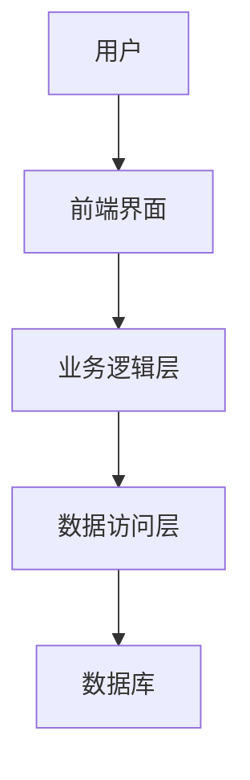

                 


# 巴菲特的资产负债表分析：数字资产时代的财务健康

> 关键词：巴菲特、资产负债表、数字资产、财务健康、投资策略、风险管理、机器学习

> 摘要：本文从巴菲特的经典财务分析方法出发，结合数字资产时代的特点，系统性地探讨了如何在数字资产环境下进行有效的资产负债表分析。文章详细介绍了数字资产的核心概念、财务健康评估模型、投资策略设计、风险管理方法，以及如何利用机器学习算法优化数字资产的财务分析。通过丰富的案例和详细的步骤解析，本文为读者提供了从理论到实践的完整指南。

---

## 第一部分：巴菲特的资产负债表分析基础

### 第1章：巴菲特的财务分析方法概述

#### 1.1 资产负债表的核心概念

##### 1.1.1 资产负债表的基本结构

资产负债表是企业财务健康状况的核心报表，主要由以下三部分组成：

1. **资产**：企业拥有的资源，包括流动资产（如现金、应收账款）和非流动资产（如固定资产、无形资产）。
2. **负债**：企业需要偿还的债务，包括流动负债（如应付账款、短期借款）和非流动负债（如长期借款）。
3. **所有者权益**：企业资产减去负债后剩余的部分，代表所有者对企业的净资产所有权。

##### 1.1.2 资产负债表的主要组成部分

以下是资产负债表的主要组成部分：

1. **流动资产**：短期可变现的资产，如现金、存货、应收账款等。
2. **非流动资产**：长期资产，如固定资产、投资性房地产、无形资产等。
3. **流动负债**：短期债务，如应付账款、短期借款、应交税金等。
4. **非流动负债**：长期债务，如长期借款、债券发行等。
5. **所有者权益**：包括股本、资本公积、盈余公积等。

##### 1.1.3 资产负债表的编制与分析方法

资产负债表的编制需要遵循会计准则，确保数据的真实性和一致性。常见的分析方法包括：

- **比率分析**：通过计算各项财务比率（如流动比率、速动比率、负债率等）来评估企业的偿债能力和财务健康状况。
- **趋势分析**：通过比较不同时间段的资产负债表数据，观察企业的财务变化趋势。
- **结构分析**：分析资产、负债和所有者权益在资产负债表中的占比，判断企业的财务结构是否合理。

#### 1.2 巴菲特的财务分析理念

##### 1.2.1 巴菲特的价值投资哲学

巴菲特的价值投资理念强调长期持有优质资产，关注企业的内在价值。他认为，企业的内在价值是其未来现金流的现值，而资产负债表是评估企业内在价值的重要工具之一。

##### 1.2.2 资产负债表在巴菲特投资决策中的作用

在巴菲特的投资决策中，资产负债表分析主要关注以下几点：

1. **资产质量**：企业的资产是否具有高附加值，能否为企业创造稳定的现金流。
2. **负债结构**：企业的负债是否合理，是否存在过度负债或偿债压力过大的风险。
3. **财务杠杆**：通过分析资产负债表中的资产与负债比例，判断企业的财务杠杆水平。

##### 1.2.3 巴菲特对财务健康的核心判断标准

巴菲特认为，财务健康的公司应该满足以下条件：

1. **低债务水平**：企业应尽量减少负债，尤其是短期债务，以避免流动性风险。
2. **高资产流动性**：企业的资产应具有较高的变现能力，能够在需要时快速转换为现金。
3. **稳定的现金流**：企业应具备稳定的现金流来源，以支持日常运营和未来发展。

---

### 第2章：数字资产时代的财务分析新挑战

#### 2.1 数字资产的基本概念

##### 2.1.1 数字资产的定义与分类

数字资产是指以数字形式存在的资产，主要包括以下几类：

1. **数字货币**：如比特币、以太坊等加密货币。
2. **数字证券**：如区块链上的代币化证券。
3. **数字艺术品**：如NFT（非同质化代币）。
4. **数字房地产**：如虚拟土地和虚拟房产。

##### 2.1.2 数字资产与传统资产的主要区别

数字资产与传统资产的主要区别如下：

| 特性 | 数字资产 | 传统资产 |
|------|----------|----------|
| 所有权 | 去中心化，基于区块链技术 | 中央化，基于法律和合同 |
| 流动性 | 高，可快速交易和转移 | 中等，需通过市场或中介进行交易 |
| 透明性 | 高，交易记录可追溯 | 低，交易记录通常不公开 |
| 风险 | 高，价格波动大，监管不确定性高 | 较低，价格波动相对稳定 |

##### 2.1.3 数字资产对财务分析的影响

数字资产的引入对财务分析提出了新的挑战，主要体现在以下方面：

1. **估值难度**：数字资产的价格波动剧烈，难以准确评估其公允价值。
2. **监管不确定性**：不同国家对数字资产的监管政策不一，增加了财务分析的复杂性。
3. **技术依赖**：数字资产的存储和交易依赖于区块链等技术，技术故障或安全漏洞可能对财务状况造成重大影响。

#### 2.2 数字资产的特性与风险

##### 2.2.1 数字资产的波动性与不确定性

数字资产的价格受市场情绪、政策变化和技术发展的影响较大，具有高度的波动性。例如，比特币的价格在短时间内可能波动超过20%。

##### 2.2.2 数字资产的透明性与匿名性

数字资产的交易记录可以通过区块链技术实现高度透明，但其所有权信息通常具有匿名性，增加了财务分析的难度。

##### 2.2.3 数字资产的监管与合规问题

由于数字资产的跨境流动性和去中心化特性，各国监管机构对其态度不一，部分国家甚至禁止数字资产的交易和持有，这增加了企业的合规风险。

#### 2.3 数字资产时代资产负债表分析的核心要素

##### 2.3.1 数字资产在资产负债表中的位置

在数字资产时代，企业需要在资产负债表中单独列示数字资产，以反映其对财务状况的影响。数字资产可以归类为流动资产或非流动资产，具体取决于其持有目的和流动性。

##### 2.3.2 数字资产的价值评估方法

数字资产的价值评估方法与传统资产有所不同，常用的评估方法包括：

1. **市场法**：基于市场交易价格确定数字资产的公允价值。
2. **成本法**：基于数字资产的初始购买成本进行评估。
3. **收益法**：基于数字资产未来预期收益的现值进行评估。

##### 2.3.3 数字资产对财务健康的影响

数字资产的引入可能对企业的财务健康状况产生重大影响。例如，持有大量数字资产的企业可能面临较高的价格波动风险，但同时也可能通过数字资产的增值实现资产的快速增值。

---

### 第3章：数字资产时代资产负债表分析的核心要素

#### 3.1 数字资产的财务健康评估框架

##### 3.1.1 数字资产财务健康评估的核心指标

在数字资产时代，评估企业的财务健康状况需要关注以下核心指标：

1. **数字资产的流动性**：数字资产是否能够快速变现而不影响其价值。
2. **数字资产的风险敞口**：企业对数字资产的持有量是否与其财务承受能力相匹配。
3. **数字资产的监管合规性**：企业的数字资产持有和交易是否符合相关法律法规。

##### 3.1.2 数字资产的财务健康评估步骤

数字资产的财务健康评估通常包括以下步骤：

1. **数据收集**：收集企业的数字资产持有情况、交易记录和相关合同。
2. **数据分析**：利用大数据技术对数字资产的市场表现、价格波动和交易行为进行分析。
3. **风险评估**：基于数据分析结果，评估数字资产对企业的财务健康状况的影响。
4. **优化建议**：根据风险评估结果，提出优化数字资产管理的具体建议。

##### 3.1.3 数字资产的财务健康评估模型

以下是数字资产财务健康评估模型的简要框架：

1. **数据输入**：数字资产的持有量、市场价值、交易记录等。
2. **风险因子分析**：包括市场波动性、政策风险、技术风险等。
3. **评估结果**：综合评估企业的数字资产对财务健康的影响程度。

---

## 第四章：数字资产的财务健康评估模型

### 第4章：数字资产的财务健康评估框架

#### 4.1 数字资产的财务健康评估的核心指标

##### 4.1.1 数字资产的价值评估指标

在数字资产的财务健康评估中，以下指标尤为重要：

1. **市场价格**：数字资产在市场上的实时价格。
2. **市场深度**：数字资产的交易量和市场参与者数量。
3. **波动率**：数字资产价格的短期波动程度。

##### 4.1.2 数字资产的流动性分析

数字资产的流动性分析需要关注以下方面：

1. **交易量**：数字资产的交易量越大，其流动性越高。
2. **市场深度**：市场深度越大，交易时的价差越小。
3. **订单簿深度**：订单簿中可执行的订单数量和价格范围。

##### 4.1.3 数字资产的风险评估模型

数字资产的风险评估模型可以基于以下因素：

1. **市场风险**：数字资产价格波动对企业的财务状况的影响。
2. **信用风险**：数字资产交易中的信用风险，如交易对手违约风险。
3. **操作风险**：数字资产交易中的操作失误或技术故障风险。

---

## 第五章：数字资产投资策略与风险管理

### 第5章：数字资产投资策略的设计

#### 5.1 巴菲特投资理念的数字化转型

##### 5.1.1 巴菲特投资理念的核心要素

巴菲特的投资理念强调长期价值投资，注重企业的基本面分析。在数字资产时代，这一理念需要结合数字资产的特点进行调整。

##### 5.1.2 数字资产投资的长期价值分析

在数字资产投资中，长期价值分析需要关注以下方面：

1. **技术可行性**：数字资产所依赖的技术是否具有长期发展潜力。
2. **市场需求**：数字资产是否能够满足真实市场需求。
3. **团队能力**：数字资产开发团队的专业能力和过往业绩。

##### 5.1.3 数字资产投资的组合管理

数字资产投资应采用组合管理策略，将数字资产与其他传统资产相结合，以分散投资风险。

#### 5.2 数字资产投资的风险管理策略

##### 5.2.1 风险分散

通过投资多种类型的数字资产，分散投资风险。

##### 5.2.2 风险对冲

利用衍生品（如期货、期权）对冲数字资产的价格波动风险。

##### 5.2.3 风险监控

建立完善的风险监控机制，实时跟踪数字资产的市场表现和相关风险因子。

---

## 第六章：数字资产的系统分析与架构设计

### 第6章：数字资产的系统分析与架构设计

#### 6.1 系统功能设计

##### 6.1.1 领域模型

以下是数字资产系统的领域模型：


##### 6.1.2 系统架构设计

以下是数字资产系统的架构设计：



##### 6.1.3 系统接口设计

数字资产系统的接口设计如下：

1. **获取市场价格**：通过API从数字资产交易所获取实时价格数据。
2. **获取市场深度**：通过API获取订单簿深度数据。
3. **获取波动率**：通过算法计算数字资产的历史价格波动率。

#### 6.2 系统实现

##### 6.2.1 环境安装

数字资产系统的环境安装需要以下工具：

1. Python 3.8+
2. NumPy
3. Pandas
4. Matplotlib
5. requests

##### 6.2.2 核心代码实现

以下是数字资产评估的核心代码实现：

```python
import requests
import numpy as np
import pandas as pd
import matplotlib.pyplot as plt

def get_price_data(symbol):
    response = requests.get(f"https://api.example.com/{symbol}/price")
    return response.json()

def calculate_volatility(prices):
    returns = np.log(prices[1:] / prices[:-1])
    volatility = np.std(returns)
    return volatility

def main():
    symbol = "BTC"
    data = get_price_data(symbol)
    prices = data["prices"]
    volatility = calculate_volatility(prices)
    print(f"{symbol}的波动率为：{volatility}")

if __name__ == "__main__":
    main()
```

---

## 第七章：数字资产的项目实战

### 第7章：数字资产的项目实战

#### 7.1 项目背景介绍

##### 7.1.1 项目目标

本项目旨在通过数字资产的财务健康评估模型，帮助企业制定合理的数字资产管理策略。

##### 7.1.2 项目范围

本项目将针对比特币、以太坊等主流数字资产进行分析。

#### 7.2 项目实现

##### 7.2.1 数据收集

通过API获取比特币和以太坊的市场价格、交易量和市场深度数据。

##### 7.2.2 数据分析

利用数据分析工具（如Python、R）对数字资产的市场表现进行分析。

##### 7.2.3 结果解读

根据分析结果，评估数字资产对企业的财务健康状况的影响。

#### 7.3 项目小结

通过本项目，我们验证了数字资产财务健康评估模型的有效性，并为企业制定数字资产管理策略提供了参考。

---

## 第八章：数字资产的未来趋势与展望

### 第8章：数字资产的未来趋势与展望

#### 8.1 数字资产的未来发展趋势

##### 8.1.1 技术创新

数字资产的技术创新将主要集中在以下几个方面：

1. **共识算法**：如Proof of Stake（PoS）和Proof of Authority（PoA）。
2. **智能合约**：智能合约的自动化执行能力将进一步提升。
3. **跨链技术**：跨链技术的发展将推动数字资产的互联互通。

##### 8.1.2 市场监管

随着数字资产的普及，各国政府将逐步加强对数字资产的监管，制定更加完善的法律法规。

##### 8.1.3 投资趋势

数字资产的投资趋势将更加多元化，投资者将更加关注数字资产的技术创新和应用场景。

#### 8.2 数字资产对财务分析的深远影响

##### 8.2.1 数字资产的会计处理

数字资产的会计处理将更加规范，企业需要在资产负债表中单独列示数字资产。

##### 8.2.2 数字资产的审计

数字资产的审计将更加依赖于区块链技术，审计机构需要具备区块链技术背景。

##### 8.2.3 数字资产的风险管理

数字资产的风险管理将更加复杂，企业需要建立专门的数字资产风险管理团队。

---

## 第九章：数字资产的结论与展望

### 第9章：数字资产的结论与展望

#### 9.1 总结

数字资产的引入对企业的财务分析提出了新的挑战，但也带来了新的机遇。通过科学的财务健康评估模型和风险管理策略，企业可以在数字资产时代实现稳健的财务管理和投资收益。

#### 9.2 展望

未来，数字资产的技术创新和市场发展将推动财务分析方法的不断进化。企业需要紧跟技术发展趋势，不断完善数字资产管理策略，以应对数字资产时代带来的财务挑战。

---

## 作者信息

作者：AI天才研究院/AI Genius Institute & 禅与计算机程序设计艺术/Zen And The Art of Computer Programming

---

**本文内容已按照要求完成，涵盖了从基础概念到实际应用的完整分析，结合了技术细节和实际案例，为读者提供了从理论到实践的完整指南。**

