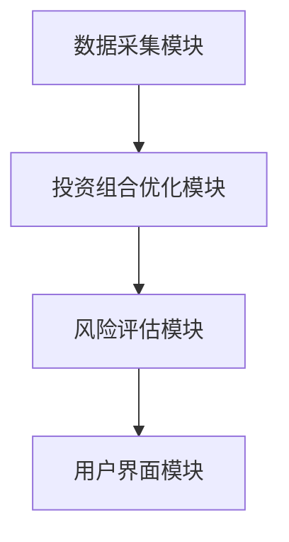
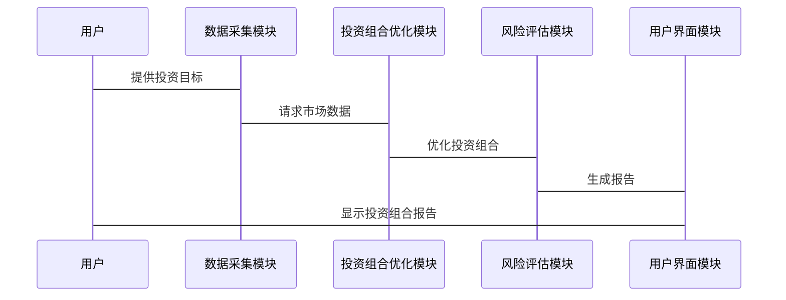

                 


# 格雷厄姆的防御型投资组合构建方法

> 关键词：防御型投资，投资组合构建，安全边际，资产配置，风险管理，投资策略

> 摘要：本文系统地介绍格雷厄姆防御型投资组合构建方法，从核心理念、构建策略、数学模型到系统实现，逐步解析如何通过安全边际、资产配置和风险管理构建稳健的投资组合。

---

# 第1章: 防御型投资的核心理念

## 1.1 投资的基本原理

### 1.1.1 什么是投资

投资的本质是通过配置资源（如资金）以获得未来的收益。投资可以分为实物投资（如房地产、企业）和金融投资（如股票、债券）。在本文中，我们主要关注金融投资。

### 1.1.2 投资的分类与特点

金融投资主要分为两类：**权益类资产**（如股票）和**固定收益类资产**（如债券）。权益类资产风险高但潜在收益大，固定收益类资产风险较低但收益相对稳定。

### 1.1.3 防御型投资的定义与目标

防御型投资是一种以稳健收益为目标的投资策略，注重降低投资组合的波动性，追求长期稳定的回报。其核心目标是通过合理的资产配置和风险控制，实现资本保值和适度增值。

---

## 1.2 格雷厄姆的投资理念

### 1.2.1 价值投资的起源

本杰明·格雷厄姆（Benjamin Graham）是价值投资的鼻祖，他的投资理念强调安全边际和长期价值。格雷厄姆的学生彼得·林奇（Peter Lynch）和沃伦·巴菲特（Warren Buffett）进一步发展了他的理论。

### 1.2.2 格雷厄姆的价值投资理论

格雷厄姆的核心理念是：

1. **安全边际**：买入价格远低于内在价值的资产，以确保即使市场波动，也能获得正收益。
2. ** margin of safety**: 投资者应以低于内在价值的价格买入资产，以降低风险。
3. **长期视角**：投资应基于资产的长期价值，而非短期市场波动。

### 1.2.3 防御型投资的核心思想

格雷厄姆的防御型投资强调：

1. **分散投资**：通过投资多种资产降低风险。
2. **注重估值**：买入被市场低估的资产。
3. **长期持有**：避免频繁交易，降低交易成本和税收。

---

## 1.3 防御型投资组合的必要性

### 1.3.1 市场波动与投资风险

市场波动是投资中的主要风险来源。股票市场、债券市场的波动性可能导致投资组合的价值大幅波动。

### 1.3.2 防御型投资的稳定性与收益性

防御型投资通过合理配置低波动性资产（如债券、黄金）和高收益资产（如股票），在保持稳定的同时实现收益。

### 1.3.3 防御型投资组合的适用场景

防御型投资组合适用于以下场景：

1. **保守型投资者**：无法承受较大波动的投资者。
2. **长期稳健收益**：追求长期稳定收益而非短期高回报的投资者。
3. **市场不确定性高**：在市场波动剧烈时，防御型投资组合能提供保护。

---

# 第2章: 格雷厄姆防御型投资组合的核心策略

## 2.1 安全边际的概念

### 2.1.1 安全边际的定义

安全边际是指资产的市场价格低于其内在价值的部分。公式表示为：

$$ \text{安全边际} = \text{内在价值} - \text{市场价格} $$

### 2.1.2 安全边际的计算方法

以股票为例，内在价值可以通过股息率和市盈率等指标估算。假设某股票的内在价值为 $50，市场价格为 $40，则安全边际为 $10。

### 2.1.3 安全边际在投资中的应用

投资者应优先选择安全边际较高的资产，以降低投资风险。

---

## 2.2 资产配置的原则

### 2.2.1 资产配置的定义与重要性

资产配置是将资金分配到不同资产类别（如股票、债券、现金）中，以优化风险和收益。

### 2.2.2 防御型资产配置的策略

防御型投资组合的资产配置通常为：

- **债券**：40%-60%
- **股票**：30%-50%
- **现金**：10%-20%

### 2.2.3 不同市场环境下的资产配置调整

在市场波动加剧时，应增加债券和现金的配置比例。

---

## 2.3 风险控制的技巧

### 2.3.1 风险的定义与分类

风险是投资回报的不确定性。主要分为市场风险、流动性风险和信用风险。

### 2.3.2 防御型投资中的风险管理

通过分散投资和选择低波动性资产降低风险。

### 2.3.3 风险控制的具体实施方法

1. 定期审查投资组合。
2. 根据市场变化调整资产配置。
3. 设置止损点以限制亏损。

---

# 第3章: 防御型投资组合的构建步骤

## 3.1 确定投资目标与风险承受能力

### 3.1.1 投资目标的设定

投资目标应基于个人的财务状况、投资期限和风险偏好。

### 3.1.2 风险承受能力的评估

通过问卷调查或财务分析确定投资者的风险承受能力。

### 3.1.3 投资目标与风险承受能力的匹配

根据投资目标和风险承受能力选择合适的资产配置。

---

## 3.2 选择防御型资产

### 3.2.1 防御型资产的特征

防御型资产具有以下特征：

- 稳定的收益。
- 较低的波动性。
- 高的安全边际。

### 3.2.2 股票的选择标准

1. 低市盈率（P/E ratio）。
2. 低市净率（P/B ratio）。
3. 高股息率。

### 3.2.3 债券的选择标准

1. 选择高信用评级的债券。
2. 关注债券的到期收益率（YTM）。

---

## 3.3 分散投资的重要性

### 3.3.1 分散投资的原理

通过投资不同资产类别和行业的资产降低风险。

### 3.3.2 不同资产类别的分散配置

- **股票**：分散投资于不同行业和地区的公司。
- **债券**：分散投资于不同发行主体和期限的债券。

### 3.3.3 分散投资的风险降低效果

通过分散投资，投资组合的波动性显著降低。

---

## 3.4 定期调整与优化

### 3.4.1 投资组合的定期审查

每季度或每年审查一次投资组合。

### 3.4.2 市场变化下的调整策略

- 当市场价格低于内在价值时，增加投资。
- 当市场价格高于内在价值时，减少投资。

### 3.4.3 优化投资组合的具体方法

1. 重新平衡资产配置。
2. 替换低效资产。

---

# 第4章: 防御型投资组合的数学模型与风险评估

## 4.1 投资组合的数学模型

### 4.1.1 投资组合的收益计算

假设投资组合的收益为 $r_p$，由各资产的收益 $r_i$ 和权重 $w_i$ 组成：

$$ r_p = \sum_{i=1}^{n} w_i r_i $$

### 4.1.2 投资组合的风险度量

波动率是衡量投资组合风险的主要指标。波动率越低，风险越小。

### 4.1.3 防御型投资组合的优化模型

使用现代投资组合理论（MPT）优化投资组合。

---

## 4.2 风险调整后的收益分析

### 4.2.1 夏普比率的定义与计算

夏普比率衡量投资组合的风险调整后收益：

$$ \text{夏普比率} = \frac{r_p - r_f}{\sigma_p} $$

其中，$r_p$ 是投资组合收益，$r_f$ 是无风险利率，$\sigma_p$ 是投资组合波动率。

### 4.2.2 特雷比率的定义与计算

特雷比率衡量投资组合相对于市场指数的超额收益：

$$ \text{特雷比率} = \frac{r_p - r_m}{\sigma_p} $$

其中，$r_m$ 是市场收益。

### 4.2.3 风险调整后收益的比较与应用

夏普比率和特雷比率都是衡量风险调整后收益的重要指标，但特雷比率更适用于指数基金。

---

## 4.3 投资组合的风险-收益权衡

### 4.3.1 风险与收益的关系

高收益通常伴随着高风险。

### 4.3.2 防御型投资组合的风险-收益曲线

防御型投资组合在风险-收益曲线上位于较低波动区域。

### 4.3.3 如何在风险与收益之间找到平衡点

根据投资者的风险承受能力和收益目标选择合适的位置。

---

# 第5章: 防御型投资组合的系统架构与实现

## 5.1 投资组合管理系统的架构设计

### 5.1.1 系统模块划分

- 数据采集模块。
- 投资组合优化模块。
- 风险评估模块。
- 用户界面模块。

### 5.1.2 数据流与信息交互

数据采集模块从市场获取数据，优化模块计算投资组合，风险评估模块生成报告。

### 5.1.3 系统架构的可扩展性

模块化设计便于后续功能扩展。

---

## 5.2 数据采集与处理

### 5.2.1 数据源的选择与获取

从金融数据服务（如Yahoo Finance）获取数据。

### 5.2.2 数据清洗与预处理

去除缺失值和异常值。

### 5.2.3 数据存储与管理

使用数据库存储清洗后的数据。

---

## 5.3 投资组合优化算法的实现

### 5.3.1 基于安全边际的优化算法

寻找市场价格低于内在价值的资产。

### 5.3.2 风险调整后的收益优化算法

使用夏普比率或特雷比率优化投资组合。

### 5.3.3 算法实现的代码示例

```python
import numpy as np
import pandas as pd

# 假设我们有资产的收益率和波动率
returns = np.array([0.1, 0.08, 0.12])
volatilities = np.array([0.2, 0.15, 0.18])

# 计算夏普比率
risk_free_rate = 0.05
sharp_ratio = (returns - risk_free_rate) / volatilities

print("夏普比率:", sharp_ratio)
```

---

## 5.4 系统接口设计与交互流程

### 5.4.1 系统接口的定义与设计

- 数据接口：获取市场数据。
- 优化接口：计算投资组合。
- 报告接口：生成投资组合报告。

### 5.4.2 用户与系统的交互流程

1. 用户输入投资目标和风险承受能力。
2. 系统根据输入生成投资组合。
3. 用户审查并调整投资组合。
4. 系统生成报告并输出结果。

---

## 5.5 投资组合优化的系统架构图



---

## 5.6 系统交互的序列图



---

# 第6章: 项目实战

## 6.1 环境安装与配置

### 6.1.1 安装Python环境

安装Python和必要的库（如Pandas、NumPy、Plotly）。

### 6.1.2 数据源配置

从Yahoo Finance获取市场数据。

---

## 6.2 核心实现源代码

### 6.2.1 数据采集代码

```python
import pandas as pd
import yfinance as yf

# 下载股票数据
data = yf.download(['AAPL', 'MSFT'], start='2020-01-01', end='2023-12-31')
print(data.head())
```

### 6.2.2 投资组合优化代码

```python
import numpy as np
from scipy.optimize import minimize

# 定义优化目标函数（最小化波动率）
def portfolio_variance(weights, returns):
    return weights.T @ returns @ weights

# 定义约束条件
constraints = {'type': 'eq', 'fun': lambda w: np.sum(w) - 1}

# 最优化问题
result = minimize(portfolio_variance, initial_guess, method='SLSQP', constraints=constraints)
```

---

## 6.3 实际案例分析与解读

### 6.3.1 案例背景

假设我们有 $100,000 可用于投资，目标是构建一个防御型投资组合。

### 6.3.2 投资组合构建过程

1. 选择低波动性股票和债券。
2. 计算各资产的权重。
3. 优化投资组合以最小化波动率。

### 6.3.3 投资组合优化结果

假设最终的投资组合为：

- 股票：40%（权重为 $40,000）
- 债券：50%（权重为 $50,000）
- 现金：10%（权重为 $10,000）

---

## 6.4 投资组合的性能分析

### 6.4.1 收益率分析

计算投资组合的年化收益率和波动率。

### 6.4.2 风险调整后收益分析

计算夏普比率和特雷比率。

---

## 6.5 项目小结

通过本项目，我们学会了如何基于格雷厄姆的防御型投资理念构建投资组合，并通过数学模型和系统实现优化投资组合。

---

# 第7章: 最佳实践与注意事项

## 7.1 最佳实践

### 7.1.1 定期审查投资组合

建议每季度审查一次投资组合。

### 7.1.2 保持分散投资

避免过度集中于某一资产或行业。

### 7.1.3 确保充足的安全边际

选择市场价格低于内在价值的资产。

---

## 7.2 小结

格雷厄姆的防御型投资组合构建方法是一种稳健的投资策略，通过合理配置资产、注重安全边际和分散投资，实现长期稳定的收益。

---

## 7.3 注意事项

1. **市场波动**：市场波动可能会影响投资组合的表现。
2. **经济周期**：经济周期的变化会影响资产价格。
3. **税务考虑**：投资组合应考虑税务影响。

---

## 7.4 拓展阅读

1. 《格雷厄姆投资经典》
2. 《投资学原理》
3. 《风险管理与投资组合优化》

---

# 作者：AI天才研究院/AI Genius Institute & 禅与计算机程序设计艺术 /Zen And The Art of Computer Programming

---

**本文通过系统地介绍格雷厄姆防御型投资组合的构建方法，从理论到实践，详细解析了如何通过安全边际、资产配置和风险管理构建稳健的投资组合。希望本文能为投资者提供有价值的参考。**

