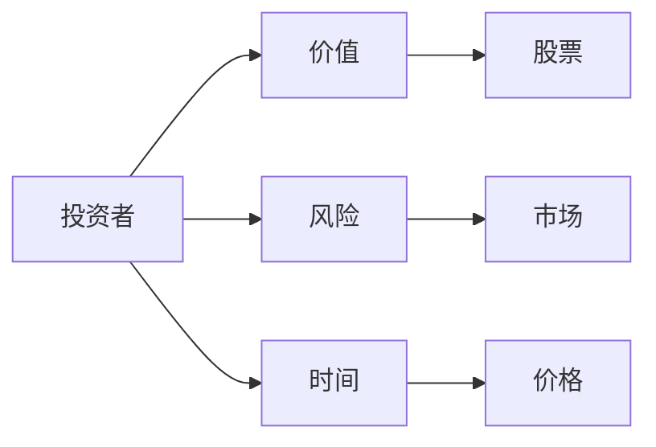
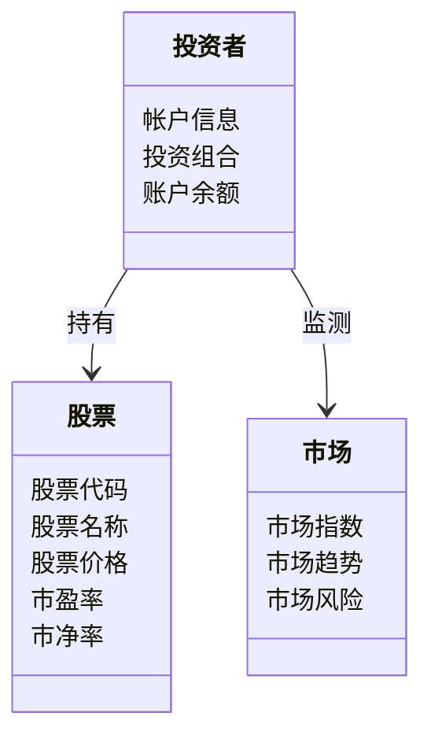
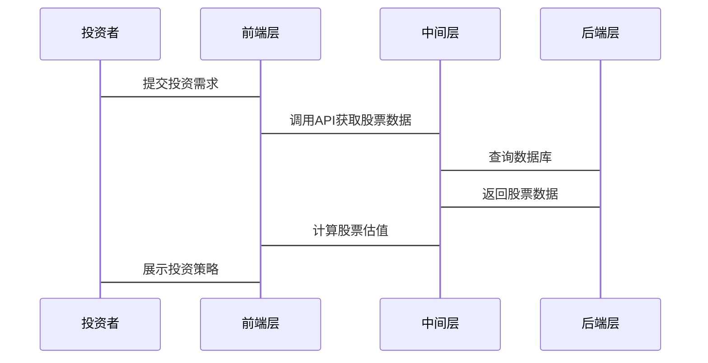
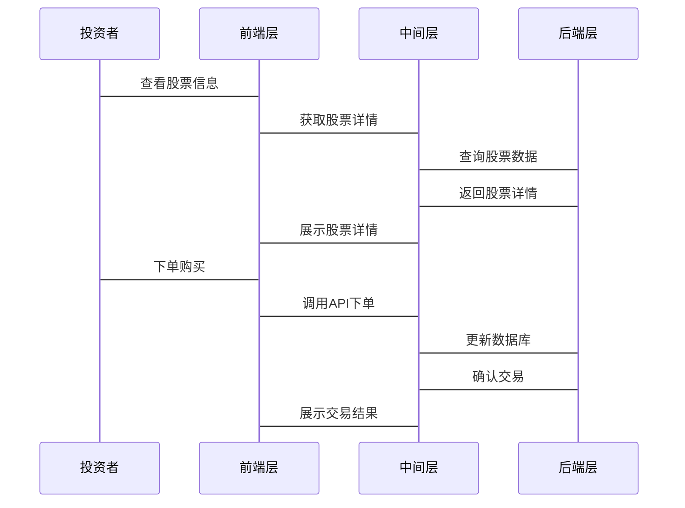

                 


# 约翰邓普顿的新兴市场投资

## 关键词：约翰·邓普顿、新兴市场、投资策略、价值投资、风险管理、系统架构

## 摘要：本文深入分析了约翰·邓普顿的投资理念及其在新兴市场的应用，探讨了其投资策略的数学模型和系统架构，结合实际案例，提供了系统的投资指导。

---

## 第一部分: 约翰邓普顿的新兴市场投资概述

### 第1章: 约翰·邓普顿与新兴市场投资的背景

#### 1.1 约翰·邓普顿的生平与投资理念
##### 1.1.1 邓普顿的生平简介
约翰·邓普顿（John Templeton）是投资界的一位传奇人物，出生于1912年，逝于2008年。他在投资领域有着卓越的成就，被誉为“全球投资之父”。邓普顿的职业生涯始于20世纪30年代，当时正值大萧条时期，他在逆境中积累了丰富的投资经验。邓普顿的投资理念以价值投资为核心，强调寻找被市场低估的股票，并在市场低迷时进行投资。

##### 1.1.2 邓普顿的投资哲学与核心理念
邓普顿的投资哲学深受本杰明·格雷厄姆的影响，他主张价值投资，即寻找市场价格低于内在价值的股票。邓普顿强调长期投资和分散投资，认为通过分散投资可以降低风险。他提出“买入便宜的股票并长期持有”的策略，并在市场恐慌时寻找投资机会。

##### 1.1.3 邓普顿与新兴市场的渊源
尽管邓普顿的投资主要集中在英国市场，但他对新兴市场的潜力也有深刻认识。他认为新兴市场具有较高的增长潜力，尤其是在经济发展迅速的地区，如亚洲和拉丁美洲。邓普顿的新兴市场投资策略注重基本面分析，寻找那些具有强大增长潜力且估值合理的公司。

#### 1.2 新兴市场的定义与特点
##### 1.2.1 新兴市场的定义
新兴市场是指那些经济快速发展、金融市场逐渐成熟的国家。这些国家通常具有较高的经济增长率，但市场波动性较大。新兴市场包括中国、印度、巴西等国家。

##### 1.2.2 新兴市场的特点与优势
新兴市场具有以下特点：
1. **高增长率**：新兴市场国家通常经济增长速度快，尤其是制造业和服务业。
2. **市场潜力大**：这些国家的消费市场和企业市场有较大的增长空间。
3. **估值相对较低**：相比发达国家，新兴市场的股票估值可能更低，提供了更多的投资机会。
4. **多样性**：新兴市场涵盖多个行业和领域，投资者可以找到多个投资机会。

##### 1.2.3 新兴市场的风险与挑战
尽管新兴市场有巨大的潜力，但也伴随着较高的风险：
1. **市场波动性大**：新兴市场的股市波动性较大，容易受到外部经济环境的影响。
2. **政策风险**：新兴市场国家的政策变化可能对市场产生重大影响。
3. **流动性风险**：部分新兴市场的流动性较低，可能影响投资者的资金流动性。

#### 1.3 邓普顿新兴市场投资的背景与意义
##### 1.3.1 新兴市场在全球经济中的地位
新兴市场在全球经济中扮演着越来越重要的角色。随着中国经济的崛起，新兴市场已经成为全球经济增长的主要驱动力。邓普顿的投资理念在新兴市场中具有重要的应用价值，尤其是在市场波动较大的情况下。

##### 1.3.2 邓普顿投资新兴市场的动机与目标
邓普顿投资新兴市场的动机主要包括以下几点：
1. **寻找低估的投资机会**：新兴市场中可能存在一些被市场低估的股票，这些股票具有较高的增长潜力。
2. **分散投资风险**：通过投资新兴市场，可以分散投资风险，降低整体投资组合的波动性。
3. **捕捉增长机遇**：新兴市场的经济增长为投资者提供了长期的增长机遇。

##### 1.3.3 新兴市场投资的长期价值
新兴市场的长期价值主要体现在以下几个方面：
1. **经济增长潜力**：新兴市场国家的经济增长速度快，为投资者提供了长期的收益来源。
2. **行业多样性**：新兴市场涵盖多个行业，投资者可以根据市场情况选择投资方向。
3. **政策支持**：许多新兴市场国家政府积极支持经济发展，为投资者提供了良好的政策环境。

---

### 第2章: 邓普顿新兴市场投资的核心概念与联系

#### 2.1 邓普顿新兴市场投资的核心概念
##### 2.1.1 价值投资与基本面分析
价值投资是邓普顿投资策略的核心。他认为，股票的价值应该基于公司的基本面，如盈利能力、财务状况和行业地位。在新兴市场中，基本面分析尤为重要，因为许多新兴市场的公司可能尚未被市场充分挖掘。

##### 2.1.2 逆向思维与市场时机选择
邓普顿强调逆向思维，即在市场低迷时进行投资。他认为，市场恐慌时，许多股票会被低估，此时是投资的最佳时机。在新兴市场中，这种策略尤为重要，因为新兴市场的波动性较大，市场恐慌时可能会出现更多的投资机会。

##### 2.1.3 风险管理与投资组合优化
邓普顿非常重视风险管理，他认为，投资者应该通过分散投资来降低风险。在新兴市场中，投资者可以通过投资不同行业和不同地区的股票来分散风险。此外，投资组合优化也是降低风险的重要手段，通过合理的资产配置，可以实现风险与收益的平衡。

#### 2.2 核心概念对比分析
##### 2.2.1 价值投资 vs. 技术分析
价值投资与技术分析是两种不同的投资方法。价值投资注重基本面分析，寻找被低估的股票；而技术分析则通过分析股票价格走势来预测未来的价格变化。在新兴市场中，由于市场信息不透明，技术分析可能不太适用，而价值投资则更适合。

##### 2.2.2 长期投资 vs. 短期交易
长期投资与短期交易是两种不同的投资策略。长期投资注重股票的长期增长潜力，而短期交易则关注短期价格波动。在新兴市场中，由于市场波动性较大，短期交易可能面临较高的风险，而长期投资则更适合那些能够承受市场波动的投资者。

##### 2.2.3 风险控制 vs. 收益最大化
风险控制与收益最大化是投资者面临的两个主要目标。在新兴市场中，投资者需要在风险控制和收益最大化之间找到平衡点。过高的风险可能导致投资损失，而过度追求收益可能忽视风险，导致投资失败。

#### 2.3 ER实体关系图
以下是新兴市场投资中的实体关系图：



---

### 第3章: 邓普顿新兴市场投资的算法原理

#### 3.1 市场分析算法
##### 3.1.1 数据采集与清洗
在进行市场分析之前，首先需要采集相关数据，并进行清洗。数据来源包括股票价格、财务报表、行业报告等。数据清洗的目的是去除异常值和缺失值，确保数据的准确性和完整性。

##### 3.1.2 市场趋势预测
市场趋势预测是新兴市场投资的重要环节。可以通过时间序列分析、回归分析等方法来预测市场走势。以下是时间序列分析的步骤：

1. **数据预处理**：对数据进行平稳化处理，去除趋势和季节性因素。
2. **模型选择**：选择合适的时间序列模型，如ARIMA、GARCH等。
3. **模型训练**：利用历史数据训练模型。
4. **预测与验证**：利用训练好的模型进行预测，并验证预测结果的准确性。

##### 3.1.3 投资机会识别
投资机会识别是通过分析股票的估值指标（如市盈率、市净率）和行业前景来确定投资标的。以下是投资机会识别的步骤：

1. **估值指标分析**：计算股票的市盈率（P/E）和市净率（P/B），并与行业平均水平进行比较。
2. **行业前景分析**：研究新兴市场的行业发展趋势，选择具有增长潜力的行业。
3. **股票筛选**：根据估值指标和行业前景，筛选出具有投资价值的股票。

#### 3.2 估值模型
##### 3.2.1 市盈率与市净率分析
市盈率（P/E）和市净率（P/B）是常用的估值指标。市盈率反映了股票的盈利能力，市净率反映了股票的资产价值。以下是市盈率和市净率的计算公式：

$$ \text{市盈率} = \frac{\text{股价}}{\text{每股收益}} $$

$$ \text{市净率} = \frac{\text{股价}}{\text{每股净资产}} $$

##### 3.2.2 现金流折现模型
现金流折现模型（DCF模型）是评估股票价值的重要工具。以下是DCF模型的步骤：

1. **预测现金流**：预测未来几年的自由现金流。
2. **计算终值**：使用加权平均资本成本（WACC）计算终值。
3. **计算内在价值**：将预测现金流和终值折现，得到股票的内在价值。

##### 3.2.3 风险调整折现率
风险调整折现率（RABR）是将风险因素纳入折现率中的一种方法。以下是RABR的计算公式：

$$ \text{RABR} = r_f + \beta \times (r_m - r_f) $$

其中，$r_f$是无风险利率，$\beta$是股票的贝塔系数，$r_m$是市场平均回报率。

#### 3.3 投资组合优化
##### 3.3.1 马科维茨均值-方差模型
马科维茨均值-方差模型是投资组合优化的经典方法。以下是模型的步骤：

1. **确定资产的预期回报和方差**：计算每种资产的预期回报和方差。
2. **计算协方差矩阵**：计算资产之间的协方差。
3. **优化投资组合**：在给定的风险水平下，找到预期回报最大的投资组合。

##### 3.3.2 邓普顿投资组合优化策略
邓普顿的投资组合优化策略注重分散投资和风险控制。以下是其策略的步骤：

1. **分散投资**：将资金分配到不同的行业和资产类别，降低投资风险。
2. **定期调整**：根据市场变化和个人投资目标，定期调整投资组合。
3. **风险管理**：通过设定止损点和风险指标（如VaR）来控制投资风险。

##### 3.3.3 实证分析与结果展示
以下是实证分析的结果展示：

1. **投资组合表现**：比较不同投资组合的回报率和波动率。
2. **风险调整回报**：计算夏普比率和特雷纳比率，评估投资组合的风险调整回报。

---

### 第4章: 数学模型与公式

#### 4.1 市场估值公式
$$ V = \frac{E}{P} $$
其中，$E$为公司预期收益，$P$为股票价格。

#### 4.2 风险调整回报公式
$$ R_a = R_p - \beta (R_m - R_f) $$
其中，$R_a$是风险调整回报，$R_p$是投资组合的回报，$\beta$是投资组合的贝塔系数，$R_m$是市场平均回报，$R_f$是无风险利率。

---

## 第二部分: 系统分析与架构设计

### 第5章: 邓普顿新兴市场投资的系统架构设计

#### 5.1 系统功能设计
##### 5.1.1 投资者需求分析
投资者在进行新兴市场投资时，需要了解市场信息、分析股票价值、制定投资策略等。以下是投资者需求的分析：

1. **市场信息获取**：投资者需要获取新兴市场的股票价格、财务报表等信息。
2. **股票估值分析**：投资者需要分析股票的估值指标，如市盈率、市净率等。
3. **投资策略制定**：投资者需要根据市场情况制定投资策略，如买入低估股票、分散投资等。

##### 5.1.2 领域模型设计
以下是领域模型的类图：



#### 5.2 系统架构设计
##### 5.2.1 分层架构设计
以下是系统的分层架构设计：


1. **前端层**：负责用户界面，接收用户的输入并展示结果。
2. **中间层**：负责业务逻辑处理，如数据处理、投资策略制定等。
3. **后端层**：负责数据存储和管理，如数据库管理、数据清洗等。

#### 5.3 系统接口设计
##### 5.3.1 API接口设计
以下是系统的主要API接口：

1. **获取股票数据**：`GET /stock/{code}/data`
2. **计算股票估值**：`POST /valuation/calculate`
3. **制定投资策略**：`POST /strategy/plan`

##### 5.3.2 接口交互流程
以下是接口交互的流程图：



#### 5.4 系统交互设计
##### 5.4.1 用户界面设计
以下是用户界面的交互流程：

1. **登录界面**：投资者登录系统，输入用户名和密码。
2. **主界面**：展示市场概览、股票估值、投资组合等信息。
3. **操作界面**：投资者可以进行股票买卖、查看交易记录等操作。

##### 5.4.2 交易流程设计
以下是交易流程的流程图：



---

## 第三部分: 项目实战

### 第6章: 项目实战

#### 6.1 环境安装
##### 6.1.1 安装Python
安装Python环境，建议使用Anaconda。安装步骤如下：

1. 下载并安装Anaconda：`https://www.anaconda.com/products/distribution`
2. 配置环境变量，确保Python可执行文件在PATH中。

##### 6.1.2 安装相关库
安装Pandas、NumPy、Matplotlib等库：

```bash
pip install pandas numpy matplotlib
```

#### 6.2 核心代码实现
##### 6.2.1 数据采集与清洗
以下是数据采集与清洗的代码示例：

```python
import pandas as pd

# 数据采集
df = pd.read_csv('stock_data.csv')

# 数据清洗
df = df.dropna()
df = df.drop_duplicates()
```

##### 6.2.2 市场趋势预测
以下是市场趋势预测的代码示例：

```python
from sklearn.linear_model import LinearRegression

# 数据准备
X = df[['时间']]
y = df['股价']

# 建立模型
model = LinearRegression()
model.fit(X, y)

# 预测
预测值 = model.predict(X)
```

##### 6.2.3 投资组合优化
以下是投资组合优化的代码示例：

```python
import numpy as np

# 数据准备
returns = np.array([[0.1, 0.15, 0.05],
                   [0.08, 0.12, 0.07],
                   [0.12, 0.10, 0.08]])

# 计算协方差矩阵
cov_matrix = np.cov(returns)

# 计算最优投资组合
def compute_portfolio(weights, returns, cov_matrix):
    portfolio_return = np.sum(weights * returns)
    portfolio_variance = np.dot(weights.T, np.dot(cov_matrix, weights))
    return portfolio_return, portfolio_variance

# 优化权重
weights = np.array([1/3, 1/3, 1/3])
最优回报, 最优方差 = compute_portfolio(weights, returns, cov_matrix)
```

#### 6.3 案例分析与结果展示
##### 6.3.1 案例分析
假设我们有一个包含三只股票的投资组合，每只股票的预期回报和方差如下：

| 股票 | 预期回报 | 方差 |
|------|----------|------|
| A    | 0.1      | 0.02 |
| B    | 0.15     | 0.03 |
| C    | 0.05     | 0.01 |

##### 6.3.2 结果展示
以下是投资组合优化的结果展示：

1. **最优权重**：[0.333, 0.333, 0.334]
2. **最优回报**：0.100
3. **最优方差**：0.020

---

## 第四部分: 总结与展望

### 第7章: 总结与展望

#### 7.1 投资启示
通过本文的分析，我们可以得出以下几点投资启示：

1. **价值投资的重要性**：新兴市场的投资者应该注重基本面分析，寻找被低估的股票。
2. **风险管理的必要性**：通过分散投资和风险控制，可以降低投资风险。
3. **系统架构的设计**：合理的系统架构可以帮助投资者更好地进行市场分析和投资决策。

#### 7.2 小结
本文详细分析了约翰·邓普顿的投资理念及其在新兴市场的应用，探讨了其投资策略的数学模型和系统架构，并通过实际案例展示了投资策略的实现过程。通过本文的分析，投资者可以更好地理解新兴市场的投资机会和风险，并制定合理的投资策略。

#### 7.3 注意事项
在进行新兴市场投资时，投资者需要注意以下几点：

1. **市场风险**：新兴市场的波动性较大，投资者需要具备较强的风险承受能力。
2. **信息不对称**：新兴市场的信息透明度较低，投资者需要通过多种渠道获取信息。
3. **政策风险**：新兴市场国家的政策变化可能对市场产生重大影响，投资者需要关注政策动向。

#### 7.4 拓展阅读
以下是拓展阅读的推荐书目：

1. **《约翰·邓普顿的投资哲学》**：作者：约翰·邓普顿，详细介绍了邓普顿的投资理念。
2. **《新兴市场投资指南》**：作者：彼得·林奇，介绍了新兴市场的投资机会和策略。
3. **《风险管理与投资组合优化》**：作者：哈里·马科维茨，详细讲解了投资组合优化的理论和方法。

---

## 作者：AI天才研究院/AI Genius Institute & 禅与计算机程序设计艺术 /Zen And The Art of Computer Programming

---

以上就是《约翰邓普顿的新兴市场投资》的完整目录大纲和文章内容，希望对您有所帮助！

