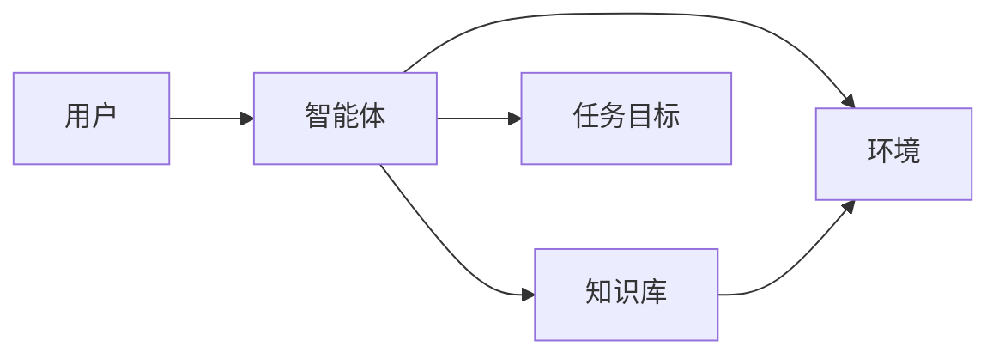
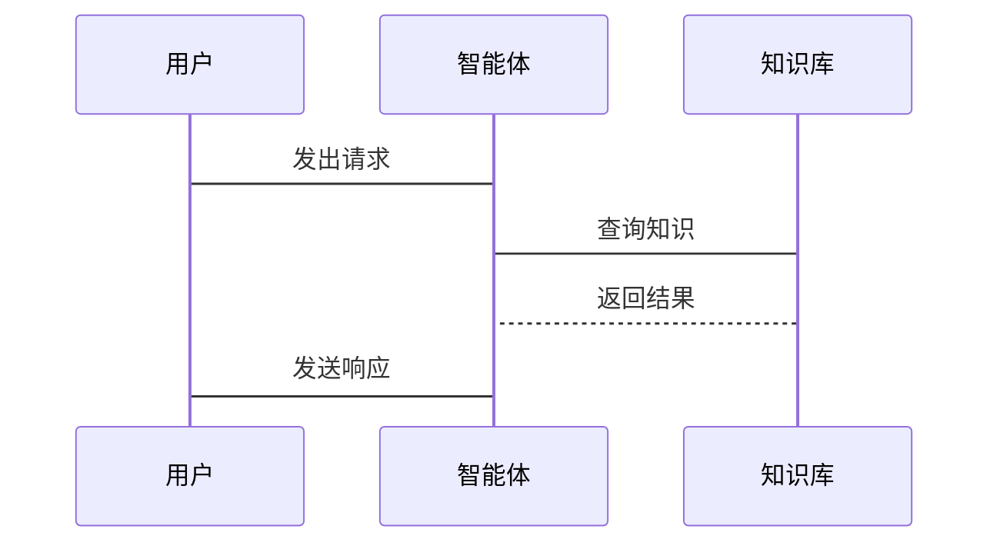

                 


# 自主学习型 AI Agent：利用 LLM 实现持续进化

**关键词：** 自主学习型 AI Agent, LLM, 自然语言处理, 人工智能, 持续进化

**摘要：** 本文探讨了如何利用大语言模型（LLM）构建自主学习型 AI Agent，通过持续进化实现智能体的自我改进和适应。文章从核心概念、算法原理、系统架构到项目实战，全面解析了自主学习型 AI Agent 的实现方法，结合实际案例和最佳实践，为读者提供了深入的技术指导。

---

# 第一章: 自主学习型 AI Agent 的背景与问题背景

## 1.1 自主学习型 AI Agent 的定义与核心概念

### 1.1.1 自主学习型 AI Agent 的定义

自主学习型 AI Agent 是一种能够通过与环境交互和自我学习，不断优化自身行为和知识的智能体。它依赖于大语言模型（LLM）的能力，通过持续学习和进化，适应动态变化的环境。

**核心概念对比表：**

| 概念         | 特性                                |
|--------------|-----------------------------------|
| 自主学习     | 智能体能够主动选择学习内容，无需外部干预 |
| 连续进化     | 知识和能力的更新是持续且动态的       |
| 知识更新     | 知识库通过反馈机制不断优化         |

**ER 实体关系图：**



---

## 1.2 大语言模型（LLM）在自主学习中的作用

### 1.2.1 大语言模型的基本概念

大语言模型（LLM）是一种基于深度学习的自然语言处理模型，如GPT系列，能够理解和生成人类语言。其核心在于通过大量数据训练，学习语言的统计规律。

### 1.2.2 LLM 在自主学习中的优势

- **知识丰富性**：LLM 拥有广泛的知识库，能够处理多种语言和领域的问题。
- **自我改进能力**：通过反馈机制，LLM 可以不断优化生成结果。
- **动态适应性**：LLM 能够根据新的输入数据，快速调整生成策略。

### 1.2.3 LLM 的局限性与改进方向

- **计算资源需求高**：LLM 的训练和推理需要大量计算资源。
- **数据依赖性强**：LLM 的表现依赖于训练数据的质量和多样性。

---

## 1.3 自主学习型 AI Agent 的应用场景

### 1.3.1 自然语言处理领域的应用

- **文本生成**：生成高质量的文章、报告等。
- **对话系统**：实现更自然的交互体验。

### 1.3.2 人机交互中的应用

- **智能助手**：提供个性化的服务，如日程管理、信息查询。
- **教育辅助**：为学生提供个性化的学习建议。

### 1.3.3 自动化系统中的应用

- **流程自动化**：优化企业内部流程，提高效率。
- **系统监控**：实时监控系统状态，预测潜在问题。

---

## 1.4 自主学习型 AI Agent 与传统 AI 的区别

### 1.4.1 传统 AI 的特点

- **静态规则**：依赖预定义的规则和逻辑。
- **缺乏自我改进**：无法通过反馈优化自身行为。

### 1.4.2 自主学习型 AI 的特点

- **动态适应性**：能够根据环境变化调整行为。
- **自我学习能力**：通过与环境交互，不断优化知识库和行为策略。

---

## 1.5 本章小结

本章从自主学习型 AI Agent 的定义、核心概念、LLM 的作用以及应用场景等方面进行了详细分析，为后续章节的深入探讨奠定了基础。

---

# 第二章: 自主学习型 AI Agent 的核心概念与联系

## 2.1 自主学习型 AI Agent 的核心概念

### 2.1.1 自主性

自主性是智能体的核心特征，意味着智能体能够在没有外部干预的情况下，独立完成任务并做出决策。

### 2.1.2 连续进化

连续进化指智能体能够通过持续的学习和优化，不断提升自身的知识和能力。

### 2.1.3 知识更新

知识更新是智能体通过与环境交互，不断补充和修正知识库的过程。

---

## 2.2 核心概念的对比与分析

### 2.2.1 自主性与外部干预的对比

| 特性      | 自主性          | 外部干预        |
|-----------|-----------------|-----------------|
| 决策依据   | 内部知识库       | 外部指令或规则   |
| 灵活性     | 高              | 中              |
| 适应性     | 强              | 较弱            |

---

## 2.3 自主学习型 AI Agent 的实现机制

### 2.3.1 知识库的构建与更新

- **知识库构建**：通过大规模数据训练，构建初始知识库。
- **知识库更新**：通过用户反馈和环境交互，持续更新知识库。

### 2.3.2 行为决策的优化

- **行为选择**：基于当前知识库和环境反馈，选择最优行为。
- **行为优化**：通过强化学习，优化行为策略，提升任务完成效率。

---

## 2.4 本章小结

本章深入分析了自主学习型 AI Agent 的核心概念及其相互关系，为后续章节的算法实现奠定了理论基础。

---

# 第三章: 自主学习型 AI Agent 的算法原理

## 3.1 LLM 的基本算法

### 3.1.1 解码器结构

解码器是 LLM 的核心部分，负责将输入转换为输出。常见的解码器结构包括自注意力机制和前馈网络。

### 3.1.2 注意力机制

注意力机制通过计算输入序列中各部分的重要性，决定生成输出时的关注点。公式如下：

$$ \text{Attention}(Q, K, V) = \text{softmax}(\frac{QK^T}{\sqrt{d}})V $$

其中，$Q$、$K$、$V$ 分别是查询、键、值向量，$d$ 是维度数。

---

## 3.2 自主学习的实现算法

### 3.2.1 基于强化学习的优化

强化学习通过奖励机制，优化智能体的行为策略。常用的算法包括 Q-Learning 和 Policy Gradient。

### 3.2.2 知识更新算法

知识更新算法通过用户反馈，调整知识库的权重。常见的算法包括基于梯度的更新和基于规则的更新。

---

## 3.3 算法实现的步骤

### 3.3.1 数据预处理

- **清洗数据**：去除噪音数据，提取有用信息。
- **数据标注**：为数据添加标签，便于模型训练。

### 3.3.2 模型训练

- **选择模型架构**：如Transformer。
- **训练数据**：使用预处理后的数据，训练模型。
- **调参优化**：通过交叉验证，调整模型参数。

### 3.3.3 模型部署

- **接口开发**：设计API接口，供其他系统调用。
- **监控与维护**：实时监控模型性能，及时修复问题。

---

## 3.4 本章小结

本章详细介绍了自主学习型 AI Agent 的算法原理，包括LLM的基本结构和自主学习的实现算法。

---

# 第四章: 自主学习型 AI Agent 的系统架构设计

## 4.1 系统架构整体设计

### 4.1.1 领域模型设计

领域模型是系统的核心部分，负责处理具体的业务逻辑。常用的领域模型包括领域驱动设计（DDD）和模型驱动架构（MDA）。

### 4.1.2 系统架构图


---

## 4.2 接口设计与交互流程

### 4.2.1 系统接口设计

- **输入接口**：接收用户请求。
- **输出接口**：返回处理结果。

### 4.2.2 交互流程



---

## 4.3 系统功能设计

### 4.3.1 知识库管理

- **知识库存储**：使用数据库或知识图谱存储知识。
- **知识更新**：定期更新知识库，确保信息的准确性。

### 4.3.2 行为决策

- **决策逻辑**：基于当前知识库和环境反馈，选择最优行为。
- **行为优化**：通过强化学习，优化决策逻辑。

---

## 4.4 本章小结

本章从系统架构设计的角度，详细分析了自主学习型 AI Agent 的实现方案，包括领域模型、接口设计和交互流程。

---

# 第五章: 自主学习型 AI Agent 的项目实战

## 5.1 环境配置

### 5.1.1 安装必要的依赖

- **Python 3.8+**
- **TensorFlow 或 PyTorch**
- **Hugging Face 的 Transformers 库**

### 5.1.2 安装命令

```bash
pip install torch transformers
```

---

## 5.2 核心功能实现

### 5.2.1 知识库的构建

```python
from transformers import AutoTokenizer, AutoModelForSeq2Seq
import torch

tokenizer = AutoTokenizer.from_pretrained("facebook/pft-large")
model = AutoModelForSeq2Seq.from_pretrained("facebook/pft-large")
```

---

## 5.2.2 行为决策的优化

```python
def update_policy(rewards):
    # 假设 rewards 是一个奖励列表
    # 使用强化学习算法更新策略
    pass
```

---

## 5.3 案例分析与经验总结

### 5.3.1 案例分析

- **案例背景**：假设用户要求生成一篇科技新闻。
- **实现步骤**：
  1. 用户输入查询。
  2. 智能体从知识库中提取相关信息。
  3. 生成并返回结果。

### 5.3.2 经验总结

- **数据质量的重要性**：高质量的数据能够显著提升生成结果的质量。
- **反馈机制的优化**：及时有效的反馈能够加速知识库的更新和优化。

---

## 5.4 本章小结

本章通过实际项目案例，详细讲解了自主学习型 AI Agent 的实现过程，包括环境配置、核心功能实现和案例分析。

---

# 第六章: 自主学习型 AI Agent 的高级主题与应用扩展

## 6.1 多模态能力的扩展

### 6.1.1 多模态模型的引入

- **视觉信息**：处理图像、视频等视觉信息。
- **听觉信息**：处理音频、语音等听觉信息。

### 6.1.2 多模态模型的优势

- **信息丰富性**：结合多种模态信息，提升理解和生成能力。
- **应用场景扩展**：适用于更复杂的场景，如智能安防、虚拟现实等。

---

## 6.2 分布式训练与优化

### 6.2.1 分布式训练的优势

- **计算效率提升**：通过并行计算，加快训练速度。
- **模型扩展性增强**：适用于更大规模的数据训练。

### 6.2.2 分布式训练的实现

```python
import torch
from torch.nn.parallel import DistributedDataParallel as DDP
from torch.utils.data.distributed import DistributedSampler

# 初始化分布式环境
torch.distributed.init_process_group(backend='gloo')

# 定义模型
model = MyModel()
model = DDP(model, device_ids=[rank])
```

---

## 6.3 安全与伦理

### 6.3.1 安全问题

- **数据泄露风险**：需要严格控制数据访问权限。
- **模型滥用风险**：防止模型被恶意利用。

### 6.3.2 伦理问题

- **隐私保护**：确保用户数据的隐私安全。
- **内容合规性**：生成内容需符合法律法规和社会伦理。

---

## 6.4 本章小结

本章探讨了自主学习型 AI Agent 的高级主题，包括多模态能力、分布式训练和安全伦理，为读者提供了更广阔的技术视野。

---

# 第七章: 自主学习型 AI Agent 的未来展望

## 7.1 技术发展趋势

### 7.1.1 更强的自主性

- **无监督学习**：减少对标注数据的依赖。
- **自适应学习**：根据环境变化，自动调整学习策略。

### 7.1.2 更广泛的应用场景

- **医疗健康**：辅助医生进行诊断和治疗方案制定。
- **金融领域**：进行风险评估和投资决策。

---

## 7.2 潜在影响与挑战

### 7.2.1 积极影响

- **提高效率**：通过自动化流程，提升生产效率。
- **改善生活质量**：为用户提供更智能、便捷的服务。

### 7.2.2 潜在挑战

- **技术瓶颈**：如何实现真正的自主学习和持续进化。
- **伦理问题**：如何在技术进步的同时，确保伦理合规。

---

## 7.3 研究方向

### 7.3.1 基础研究

- **新型算法**：探索更高效的自主学习算法。
- **认知科学**：借鉴认知科学的成果，提升智能体的推理能力。

### 7.3.2 应用研究

- **垂直领域应用**：深入探索特定领域的应用潜力。
- **跨领域协作**：促进不同领域之间的技术融合。

---

## 7.4 本章小结

本章展望了自主学习型 AI Agent 的未来发展趋势，探讨了其可能带来的影响和挑战，并提出了未来的研究方向。

---

# 附录

## 附录 A: 参考文献

1. Brown, T., et al. (2020). "Language Models at Your Service: Feedback Instructed AI Completion of Your Writing." arXiv preprint arXiv:2003.05983.
2. Radford, A., et al. (2019). "Language models based on self-attention are tricky." arXiv preprint arXiv:1912.12493.
3. Vaswani, A., et al. (2017). "Attention is all you need." Advances in neural information processing systems.

---

## 附录 B: 工具与库

- **Hugging Face Transformers**: [https://huggingface.co/transformers](https://huggingface.co/transformers)
- **PyTorch**: [https://pytorch.org](https://pytorch.org)
- **TensorFlow**: [https://tensorflow.org](https://tensorflow.org)

---

## 附录 C: 术语表

- **LLM**: 大语言模型（Large Language Model）
- **Transformer**: 一种基于自注意力机制的深度学习模型
- **强化学习**：一种通过奖励机制优化行为的机器学习方法

---

# 作者

**作者：AI天才研究院/AI Genius Institute & 禅与计算机程序设计艺术 /Zen And The Art of Computer Programming**

---

感谢您的阅读！希望本文能为您提供关于自主学习型 AI Agent 的深入了解，及其在实际应用中的潜力。如需进一步探讨，欢迎随时联系！

