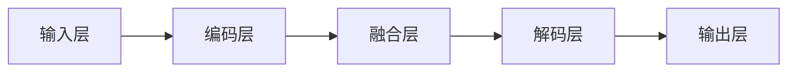
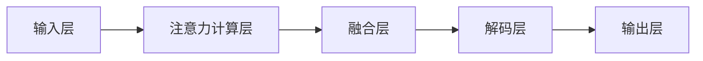
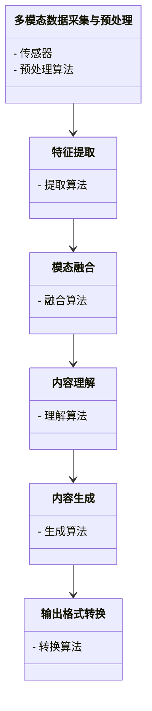
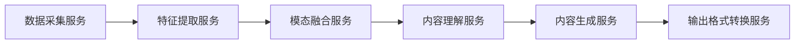

                 


# AI Agent的多模态内容理解与生成

> 关键词：AI Agent, 多模态内容, 内容理解, 内容生成, 人工智能

> 摘要：本文深入探讨AI Agent在多模态内容理解与生成领域的应用，从基础概念到算法原理，再到系统架构与项目实战，全面解析多模态内容处理的核心技术与实践方法。通过详细分析多模态数据的融合、AI Agent的认知模型、生成模型的设计与优化，以及实际项目的实现过程，为读者提供全面的技术指导。

---

# 第1章: AI Agent与多模态内容概述

## 1.1 AI Agent的基本概念

### 1.1.1 AI Agent的定义与特点

AI Agent（人工智能代理）是指具有感知环境、做出决策并执行任务的智能实体。AI Agent可以通过传感器获取信息，通过执行器与环境交互，并通过算法实现目标。其核心特点包括：

- **自主性**：能够自主决策和行动。
- **反应性**：能够实时感知环境并做出反应。
- **主动性**：主动采取行动以实现目标。
- **社会性**：能够与其他Agent或人类进行交互。

### 1.1.2 多模态内容的定义与特点

多模态内容指的是包含多种信息形式（如文本、图像、语音、视频等）的内容。其特点包括：

- **多样性**：包含多种数据类型。
- **互补性**：不同模态的信息可以互补，提供更全面的理解。
- **复杂性**：多模态数据的处理需要复杂的算法与模型。

### 1.1.3 AI Agent与多模态内容的结合意义

AI Agent与多模态内容的结合，使得AI Agent能够更全面地感知环境并做出更智能的决策。例如，在智能客服系统中，AI Agent可以通过文本和语音理解用户的需求，并通过图像提供相关的产品信息。

## 1.2 多模态内容理解与生成的背景

### 1.2.1 当前AI技术的发展趋势

当前AI技术的发展趋势包括：

- **深度学习的普及**：深度学习模型（如CNN、RNN、Transformer）在各种任务中表现出色。
- **多模态任务的需求增加**：随着应用场景的复杂化，多模态任务的需求不断增加。
- **AI Agent的广泛应用**：AI Agent在智能家居、自动驾驶、智能客服等领域的应用越来越广泛。

### 1.2.2 多模态内容在实际应用中的需求

在实际应用中，多模态内容的需求主要体现在以下几个方面：

- **信息丰富性**：多模态内容能够提供更丰富的信息，帮助用户更好地理解问题。
- **用户体验提升**：通过多模态交互，可以提升用户的体验，例如通过语音和图像的结合提供更自然的交互。
- **任务效率提升**：多模态数据的结合可以提高任务的效率，例如在医学影像分析中，结合文本和图像可以提高诊断的准确性。

### 1.2.3 AI Agent在多模态内容处理中的作用

AI Agent在多模态内容处理中的作用主要体现在以下几个方面：

- **信息融合**：AI Agent可以将多种模态的信息进行融合，提供更全面的理解。
- **智能决策**：通过多模态数据的分析，AI Agent可以做出更智能的决策。
- **人机交互**：AI Agent可以通过多模态交互方式与用户进行更自然的交流。

## 1.3 多模态内容理解与生成的核心问题

### 1.3.1 多模态数据的融合问题

多模态数据的融合问题是多模态内容处理的核心问题之一。如何有效地将文本、图像、语音等多种模态的数据进行融合，是当前研究的热点问题。常见的融合方法包括：

- **早期融合**：在特征提取的早期阶段进行融合。
- **晚期融合**：在特征提取的晚期阶段进行融合。
- **层次化融合**：在不同的层次上进行融合。

### 1.3.2 多模态内容的理解与生成挑战

多模态内容的理解与生成面临以下挑战：

- **模态间信息不一致**：不同模态的数据可能包含不一致的信息，如何协调这些信息是关键。
- **数据异构性**：不同模态的数据具有不同的结构和特征，如何处理这些异构性是一个挑战。
- **计算复杂度高**：多模态数据的处理通常需要较高的计算资源。

### 1.3.3 AI Agent在多模态任务中的应用边界

AI Agent在多模态任务中的应用边界主要体现在以下几个方面：

- **数据获取能力**：AI Agent需要能够获取多种模态的数据。
- **计算能力**：AI Agent需要有足够的计算能力来处理多模态数据。
- **决策能力**：AI Agent需要能够基于多模态数据做出合理的决策。

## 1.4 本章小结

本章主要介绍了AI Agent和多模态内容的基本概念，分析了多模态内容理解与生成的背景，并提出了当前面临的核心问题和挑战。通过本章的介绍，读者可以对AI Agent在多模态内容处理中的作用有一个全面的了解。

---

# 第2章: 多模态内容理解与生成的核心概念

## 2.1 多模态数据的表示与处理

### 2.1.1 文本、图像、语音等多模态数据的表示方法

文本、图像、语音等多模态数据的表示方法：

- **文本**：通常使用词袋模型、TF-IDF、Word2Vec、BERT等方法进行表示。
- **图像**：常用的表示方法包括CNN、FRCN、ResNet等。
- **语音**：常用的表示方法包括MFCC、Mel频谱、WaveNet等。

### 2.1.2 多模态数据的融合策略

多模态数据的融合策略包括：

- **基于特征的融合**：将不同模态的特征向量进行拼接、加权等操作。
- **基于模型的融合**：将不同模态的数据输入到同一个模型中进行融合。
- **基于任务的融合**：根据具体任务的需求进行融合。

### 2.1.3 多模态数据的预处理技术

多模态数据的预处理技术包括：

- **标准化**：对数据进行归一化处理。
- **降维**：使用PCA、t-SNE等方法降低数据的维度。
- **增强**：对数据进行增强处理，如旋转、裁剪、噪声添加等。

### 2.1.4 多模态数据的表示与处理对比（表格）

| 模态类型 | 表示方法 | 处理方法 |
|----------|----------|----------|
| 文本      | BERT      | 拼接、加权 |
| 图像      | CNN       | 拼接、融合 |
| 语音      | MFCC      | 拼接、叠加 |

## 2.2 AI Agent的感知与认知模型

### 2.2.1 AI Agent的感知模型

AI Agent的感知模型包括：

- **传感器**：用于获取环境中的多模态数据。
- **特征提取器**：用于将多模态数据转换为特征向量。
- **融合层**：用于将不同模态的特征向量进行融合。

### 2.2.2 AI Agent的认知模型

AI Agent的认知模型包括：

- **知识库**：存储多模态数据的相关知识。
- **推理引擎**：基于知识库进行推理，得出结论。
- **决策层**：基于推理结果做出决策。

### 2.2.3 多模态数据在AI Agent认知中的作用

多模态数据在AI Agent认知中的作用包括：

- **提供全面的信息**：多模态数据能够提供更全面的信息，帮助AI Agent更好地理解环境。
- **提高决策的准确性**：通过多模态数据的融合，可以提高决策的准确性。
- **增强交互的自然性**：多模态数据的结合可以增强人机交互的自然性。

## 2.3 多模态内容理解与生成的数学模型

### 2.3.1 多模态数据的联合分布模型

多模态数据的联合分布模型可以表示为：

$$ P(x_1, x_2, ..., x_n) $$

其中，$x_i$ 表示第i个模态的数据。

### 2.3.2 多模态内容理解的数学表达

多模态内容理解的数学表达可以表示为：

$$ y = f(x_1, x_2, ..., x_n) $$

其中，$y$ 是理解结果，$f$ 是理解模型。

### 2.3.3 多模态内容生成的数学模型

多模态内容生成的数学模型可以表示为：

$$ P(y|x_1, x_2, ..., x_n) $$

其中，$y$ 是生成的内容，$x_i$ 是输入的多模态数据。

## 2.4 本章小结

本章主要介绍了多模态数据的表示与处理方法，分析了AI Agent的感知与认知模型，并提出了多模态内容理解与生成的数学模型。通过本章的介绍，读者可以对多模态内容理解与生成的核心概念有一个清晰的认识。

---

# 第3章: 多模态内容理解与生成的算法原理

## 3.1 多模态数据的编码与解码算法

### 3.1.1 多模态编码器的设计

多模态编码器的设计包括：

- **输入层**：接收多模态数据。
- **编码层**：将多模态数据转换为隐层表示。
- **融合层**：对不同模态的隐层表示进行融合。

### 3.1.2 多模态解码器的设计

多模态解码器的设计包括：

- **解码层**：将融合后的隐层表示转换为目标输出。
- **输出层**：输出生成的内容。

### 3.1.3 编码器-解码器架构在多模态任务中的应用

编码器-解码器架构在多模态任务中的应用包括：

- **多模态翻译**：将一种模态的数据翻译成另一种模态的数据。
- **多模态生成**：基于多模态输入生成新的内容。

### 3.1.4 编码器-解码器架构的Mermaid图



## 3.2 多模态注意力机制

### 3.2.1 单模态注意力机制

单模态注意力机制的实现步骤：

1. **计算查询（Query）**：从输入数据中提取查询向量。
2. **计算键（Key）和值（Value）**：将输入数据转换为键和值向量。
3. **计算注意力权重**：通过查询与键的点积计算注意力权重。
4. **加权求和**：根据注意力权重对值向量进行加权求和，得到最终的注意力向量。

### 3.2.2 跨模态注意力机制

跨模态注意力机制的实现步骤：

1. **跨模态特征提取**：从不同模态的数据中提取特征向量。
2. **计算查询、键和值**：将不同模态的特征向量分别作为查询、键和值。
3. **计算注意力权重**：通过查询与键的点积计算注意力权重。
4. **加权求和**：根据注意力权重对值向量进行加权求和，得到融合后的特征向量。

### 3.2.3 多模态注意力机制的实现与优化

多模态注意力机制的实现与优化包括：

- **多头注意力**：通过引入多头机制，提高模型的表达能力。
- **位置编码**：通过引入位置编码，保持序列的时序信息。
- **残差连接**：通过引入残差连接，提高模型的稳定性。

### 3.2.4 多模态注意力机制的Mermaid图



## 3.3 多模态生成模型

### 3.3.1 基于Transformer的多模态生成模型

基于Transformer的多模态生成模型的实现步骤：

1. **输入数据预处理**：对多模态数据进行预处理，提取特征向量。
2. **编码器层**：将输入数据输入到编码器层，得到编码结果。
3. **解码器层**：将编码结果输入到解码器层，生成目标输出。
4. **输出层**：对生成的输出进行后处理，得到最终的结果。

### 3.3.2 多模态扩散模型

多模态扩散模型的实现步骤：

1. **输入数据预处理**：对多模态数据进行预处理，提取特征向量。
2. **正向过程**：逐步添加噪声到输入数据中。
3. **反向过程**：逐步去除噪声，生成目标输出。
4. **输出层**：对生成的输出进行后处理，得到最终的结果。

### 3.3.3 多模态生成模型的训练与优化

多模态生成模型的训练与优化包括：

- **损失函数设计**：设计合适的损失函数，例如交叉熵损失。
- **优化算法选择**：选择合适的优化算法，例如Adam。
- **模型调参**：通过实验调整模型的超参数，提高模型的性能。

### 3.3.4 多模态生成模型的数学表达

多模态生成模型的数学表达可以表示为：

$$ P(y|x_1, x_2, ..., x_n) = \prod_{i=1}^{n} P(y|x_i) $$

其中，$y$ 是生成的内容，$x_i$ 是输入的多模态数据。

## 3.4 本章小结

本章主要介绍了多模态内容理解与生成的算法原理，包括编码器-解码器架构、多模态注意力机制和多模态生成模型的实现与优化。通过本章的介绍，读者可以对多模态内容理解与生成的算法原理有一个全面的了解。

---

# 第4章: 多模态内容理解与生成的系统架构设计

## 4.1 系统功能设计

### 4.1.1 多模态数据采集与预处理

多模态数据采集与预处理包括：

- **数据采集**：通过传感器、摄像头、麦克风等设备采集多模态数据。
- **数据预处理**：对采集到的数据进行归一化、降维等预处理。

### 4.1.2 多模态内容理解模块

多模态内容理解模块包括：

- **特征提取**：将多模态数据转换为特征向量。
- **模态融合**：对不同模态的特征向量进行融合。
- **内容理解**：基于融合后的特征向量，理解输入内容。

### 4.1.3 多模态内容生成模块

多模态内容生成模块包括：

- **内容生成**：基于输入的内容，生成新的多模态内容。
- **输出格式转换**：将生成的内容转换为指定的输出格式。

### 4.1.4 系统功能设计的类图（Mermaid）



## 4.2 系统架构设计

### 4.2.1 基于微服务架构的系统设计

基于微服务架构的系统设计包括：

- **服务化设计**：将系统功能分解为多个微服务。
- **服务间通信**：通过API网关实现服务间的通信。
- **服务发现与负载均衡**：通过服务发现机制实现服务的动态发现与负载均衡。

### 4.2.2 系统组件之间的交互关系

系统组件之间的交互关系包括：

- **数据采集服务**：负责多模态数据的采集与预处理。
- **特征提取服务**：负责对多模态数据进行特征提取。
- **模态融合服务**：负责对不同模态的特征向量进行融合。
- **内容理解服务**：负责基于融合后的特征向量理解输入内容。
- **内容生成服务**：负责生成新的多模态内容。
- **输出格式转换服务**：负责将生成的内容转换为指定的输出格式。

### 4.2.3 系统的可扩展性与可维护性设计

系统的可扩展性与可维护性设计包括：

- **模块化设计**：将系统功能分解为多个模块，每个模块独立开发与维护。
- **接口标准化**：通过标准化接口实现模块间的通信与协作。
- **容器化部署**：通过容器化技术实现系统的快速部署与扩展。

### 4.2.4 系统架构设计的架构图（Mermaid）



## 4.3 系统接口设计

### 4.3.1 多模态数据接口

多模态数据接口包括：

- **输入接口**：接收多模态数据。
- **输出接口**：输出处理后的结果。

### 4.3.2 理解与生成接口

理解与生成接口包括：

- **理解接口**：接收多模态数据，输出理解结果。
- **生成接口**：接收输入内容，生成新的多模态内容。

### 4.3.3 用户交互接口

用户交互接口包括：

- **用户输入接口**：接收用户的输入指令。
- **用户输出接口**：输出处理结果给用户。

## 4.4 本章小结

本章主要介绍了多模态内容理解与生成系统的功能设计、架构设计和接口设计。通过本章的介绍，读者可以对多模态内容理解与生成系统的整体架构有一个全面的了解。

---

# 第5章: 多模态内容理解与生成的项目实战

## 5.1 环境搭建与工具安装

### 5.1.1 环境搭建步骤

环境搭建步骤包括：

1. **安装Python**：安装Python 3.8及以上版本。
2. **安装深度学习框架**：安装TensorFlow、PyTorch等深度学习框架。
3. **安装NLP库**：安装NLTK、spaCy等NLP库。
4. **安装图像处理库**：安装OpenCV、Pillow等图像处理库。
5. **安装语音处理库**：安装librosa、soundfile等语音处理库。
6. **安装其他依赖项**：安装其他所需的依赖项。

### 5.1.2 工具安装说明

工具安装说明包括：

- **Python环境管理工具**：使用virtualenv或conda管理Python环境。
- **深度学习框架安装**：使用pip安装TensorFlow、PyTorch等深度学习框架。
- **NLP库安装**：使用pip安装NLTK、spaCy等NLP库。
- **图像处理库安装**：使用pip安装OpenCV、Pillow等图像处理库。
- **语音处理库安装**：使用pip安装librosa、soundfile等语音处理库。

## 5.2 系统核心实现源代码

### 5.2.1 多模态数据处理代码

```python
import numpy as np
import cv2
import librosa

# 文本处理
def text_processing(text):
    return text.lower().split()

# 图像处理
def image_processing(image_path):
    image = cv2.imread(image_path)
    if image is not None:
        return cv2.cvtColor(image, cv2.COLOR_BGR2RGB)
    else:
        return None

# 语音处理
def audio_processing(audio_path):
    audio_data, sample_rate = librosa.load(audio_path, sr=None)
    return audio_data, sample_rate
```

### 5.2.2 多模态融合代码

```python
import tensorflow as tf
import numpy as np

def modality_fusion(text_embeddings, image_embeddings, audio_embeddings):
    input_shape = (None, text_embeddings.shape[-1], image_embeddings.shape[-1], audio_embeddings.shape[-1])
    input_layer = tf.keras.Input(shape=input_shape)
    fusion_layer = tf.keras.layers.TimeDistributed(tf.keras.layers.Dense(128, activation='relu'))(input_layer)
    fusion_layer = tf.keras.layers.TimeDistributed(tf.keras.layers.Dropout(0.5))(fusion_layer)
    fusion_layer = tf.keras.layers.TimeDistributed(tf.keras.layers.Dense(64, activation='relu'))(fusion_layer)
    fusion_layer = tf.keras.layers.TimeDistributed(tf.keras.layers.Dropout(0.5))(fusion_layer)
    model = tf.keras.Model(inputs=input_layer, outputs=fusion_layer)
    return model
```

### 5.2.3 多模态生成代码

```python
import tensorflow as tf
import numpy as np

def modality_generator(z_size=128):
    z = tf.keras.Input(shape=(z_size,))
    h = tf.keras.layers.Dense(256, activation='relu')(z)
    h = tf.keras.layers.Dropout(0.5)(h)
    h = tf.keras.layers.Dense(512, activation='relu')(h)
    h = tf.keras.layers.Dropout(0.5)(h)
    output = tf.keras.layers.Dense(1024, activation='sigmoid')(h)
    model = tf.keras.Model(inputs=z, outputs=output)
    return model
```

## 5.3 代码应用解读与分析

### 5.3.1 多模态数据处理代码解读

- **文本处理**：将输入文本转换为小写，并按空格分割成单词。
- **图像处理**：读取图像文件，将其转换为RGB格式。
- **语音处理**：读取语音文件，返回音频数据和采样率。

### 5.3.2 多模态融合代码解读

- **输入层**：定义一个多模态输入层，输入形状为（无限制，文本嵌入维度，图像嵌入维度，语音嵌入维度）。
- **融合层**：使用时间分布的密集层和Dropout层，逐步将多模态数据融合为一个低维向量。

### 5.3.3 多模态生成代码解读

- **输入层**：定义一个潜在向量层，形状为（z_size）。
- **生成层**：通过多个密集层和Dropout层，将潜在向量映射到高维空间，生成多模态数据。

## 5.4 实际案例分析与详细讲解剖析

### 5.4.1 案例背景

假设我们有一个智能客服系统，需要处理文本、图像和语音三种模态的数据。用户可以通过文本、图像和语音三种方式输入问题，系统需要理解用户的问题并生成相应的回答。

### 5.4.2 案例实现步骤

1. **数据采集**：通过文本框、摄像头和麦克风采集用户的输入数据。
2. **数据预处理**：对采集到的文本、图像和语音数据进行预处理。
3. **特征提取**：将预处理后的数据提取为特征向量。
4. **模态融合**：将不同模态的特征向量进行融合，得到融合后的特征向量。
5. **内容理解**：基于融合后的特征向量，理解用户的问题。
6. **内容生成**：基于理解结果，生成回答内容。
7. **输出格式转换**：将生成的回答内容转换为文本格式输出给用户。

### 5.4.3 案例分析与总结

通过上述案例，我们可以看到多模态内容理解与生成在实际应用中的流程。通过多模态数据的融合，可以提高系统的理解能力，从而提高系统的智能性。

## 5.5 本章小结

本章通过实际案例分析，详细讲解了多模态内容理解与生成的实现过程，包括环境搭建、代码实现和案例分析。通过本章的介绍，读者可以对多模态内容理解与生成的实现过程有一个全面的了解。

---

# 第6章: 多模态内容理解与生成的最佳实践

## 6.1 总结与回顾

### 6.1.1 多模态内容理解与生成的核心要点

- **多模态数据的融合**：如何有效地将不同模态的数据进行融合是关键。
- **AI Agent的认知模型**：AI Agent的认知模型需要能够处理多模态数据。
- **生成模型的设计**：生成模型的设计需要考虑多模态数据的特点。

### 6.1.2 多模态内容理解与生成的技术趋势

- **多模态模型的融合**：未来的研究方向是多模态模型的融合。
- **AI Agent的智能性提升**：通过多模态数据的处理，可以提升AI Agent的智能性。
- **生成模型的优化**：生成模型的优化是未来的重要研究方向。

## 6.2 小结

多模态内容理解与生成是一项具有挑战性的任务，但通过多模态数据的融合、AI Agent的认知模型和生成模型的设计与优化，可以有效地实现多模态内容的理解与生成。

## 6.3 注意事项

在实际应用中，需要注意以下几点：

- **数据的质量**：多模态数据的质量对系统的性能有重要影响。
- **模型的可解释性**：多模态模型的可解释性是实际应用中的重要考虑因素。
- **计算资源的需求**：多模态数据的处理需要较高的计算资源。

## 6.4 拓展阅读

推荐以下拓展阅读内容：

- **多模态数据处理的经典论文**：如“Multi-modal Deep Learning for Image Recognition”。
- **生成模型的最新研究**：如“Diffusion Models are Flow Models”。
- **AI Agent的相关书籍**：如《人工智能：一种现代的方法》。

---

# 作者

作者：AI天才研究院/AI Genius Institute & 禅与计算机程序设计艺术 /Zen And The Art of Computer Programming

