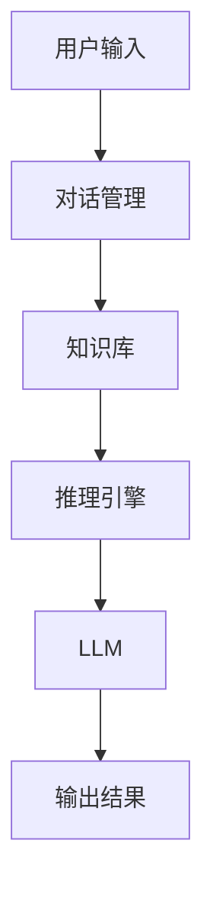
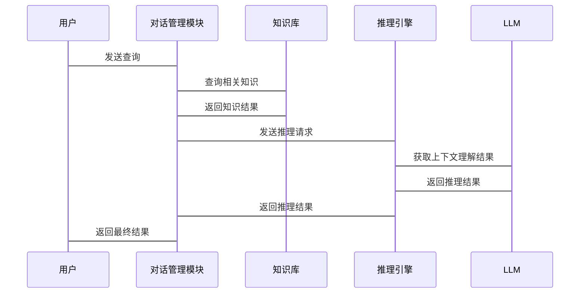

                 


# LLM在AI Agent上下文理解中的应用

> 关键词：LLM, AI Agent, 上下文理解, 自然语言处理, 智能对话系统, 大语言模型

> 摘要：本文深入探讨了大语言模型（LLM）在AI Agent上下文理解中的应用。首先介绍了LLM和AI Agent的基本概念，然后分析了上下文理解在AI Agent中的重要性。接着，详细讲解了LLM的算法原理、数学模型及其在上下文理解中的应用。最后，通过实际案例展示了如何利用LLM构建高效的AI Agent上下文理解系统。

---

# 第一部分: 背景介绍

## 第1章: LLM与AI Agent概述

### 1.1 LLM的基本概念
#### 1.1.1 大语言模型的定义
大语言模型（LLM, Large Language Model）是指基于深度学习技术训练的大型神经网络模型，能够理解和生成人类语言文本。LLM的核心是通过大量数据的训练，学习语言的语法、语义和上下文关系。

#### 1.1.2 LLM的核心特点
- **大规模训练数据**：LLM通常基于海量的文本数据进行训练，能够捕捉到语言的复杂模式。
- **深度学习架构**：主流的LLM采用Transformer架构，具有强大的上下文理解和生成能力。
- **多任务能力**：LLM可以通过微调（fine-tuning）适应多种NLP任务，如文本分类、问答系统、对话生成等。

#### 1.1.3 LLM与传统NLP模型的对比
| 特性               | LLM                          | 传统NLP模型                 |
|--------------------|------------------------------|------------------------------|
| 模型规模           | 大型或超大型                 | 小型或中型                   |
| 训练数据           | 海量多语言数据               | 较小规模的特定任务数据         |
| 上下文理解能力     | 强大，能够处理长上下文         | 较弱，通常依赖特定任务设计       |
| 适应性             | 强，可通过微调适应多种任务     | 较弱，通常针对单一任务设计       |

### 1.2 AI Agent的基本概念
#### 1.2.1 AI Agent的定义
AI Agent（智能体）是指能够感知环境、自主决策并执行任务的智能系统。AI Agent可以是软件程序，也可以是硬件设备，其核心目标是通过与环境的交互实现特定目标。

#### 1.2.2 AI Agent的核心功能
- **感知环境**：通过传感器或数据输入接口获取环境信息。
- **决策与推理**：基于感知的信息进行推理和决策。
- **执行动作**：根据决策结果执行物理或数字动作。
- **学习与适应**：通过与环境的交互不断优化自身的性能。

#### 1.2.3 AI Agent的应用场景
- **智能助手**：如Siri、Alexa等，能够与用户进行自然语言对话。
- **机器人控制**：在工业或服务机器人中，AI Agent负责路径规划和任务执行。
- **自动驾驶**：通过感知环境和决策算法实现车辆的自动驾驶。

### 1.3 LLM在AI Agent中的作用
#### 1.3.1 LLM如何赋能AI Agent
- **自然语言理解**：LLM能够理解用户的自然语言输入，提供更智能的交互方式。
- **上下文记忆**：通过LLM的上下文理解能力，AI Agent可以记住对话历史，提供连贯的服务。
- **多轮对话**：LLM支持多轮对话，能够处理复杂的上下文关系，提升用户体验。

#### 1.3.2 上下文理解在AI Agent中的重要性
- **提升用户体验**：通过上下文理解，AI Agent能够提供更精准的服务，减少用户重复输入。
- **增强任务执行能力**：上下文理解使AI Agent能够更好地理解任务需求，提高任务执行的准确性。
- **支持复杂场景**：在多任务或多场景的AI Agent中，上下文理解能力是实现复杂逻辑的关键。

#### 1.3.3 LLM与上下文理解的关系
- **LLM的上下文理解能力**：LLM通过自注意力机制（self-attention）能够捕捉文本中的长距离依赖关系，从而实现强大的上下文理解能力。
- **上下文理解的优化**：通过优化LLM的训练目标和架构，可以进一步提升上下文理解的准确性。

---

# 第二部分: 核心概念与联系

## 第2章: LLM与上下文理解的核心概念

### 2.1 LLM的上下文理解能力
#### 2.1.1 上下文理解的基本概念
上下文理解是指模型能够理解当前输入文本与之前输入文本之间的关系。在AI Agent中，上下文理解能力是实现智能交互的基础。

#### 2.1.2 LLM如何处理上下文信息
- **自注意力机制**：通过自注意力机制，LLM能够捕捉文本中的全局依赖关系，理解上下文的语义信息。
- **位置编码**：通过位置编码（position encoding），模型能够区分不同位置的信息，从而更好地处理序列数据。

#### 2.1.3 上下文理解的挑战
- **信息丢失**：在长对话中，信息可能会被模型遗忘。
- **噪声干扰**：在嘈杂的对话中，模型可能无法准确理解上下文。
- **任务多样性**：在多任务场景中，上下文理解可能受到任务切换的影响。

### 2.2 LLM与上下文理解的关系
#### 2.2.1 LLM在上下文理解中的优势
- **强大的语义理解能力**：LLM能够理解复杂语义关系，支持多轮对话。
- **通用性**：LLM可以在多种场景下应用，无需针对特定任务进行定制化开发。
- **可扩展性**：通过微调或提示工程（prompt engineering），LLM可以适应新的上下文理解任务。

#### 2.2.2 上下文理解对LLM性能的影响
- **性能提升**：上下文理解能力的提升可以提高LLM在对话任务中的准确率和用户体验。
- **资源消耗**：复杂的上下文理解任务需要更多的计算资源和内存。

#### 2.2.3 LLM如何提升AI Agent的智能性
- **智能对话**：通过上下文理解，AI Agent能够提供更智能的对话服务。
- **任务执行**：上下文理解能力使AI Agent能够更好地理解任务需求，提高任务执行的准确性。
- **学习能力**：通过上下文理解，AI Agent可以学习用户的偏好和习惯，提供个性化的服务。

### 2.3 核心概念对比
#### 2.3.1 LLM与传统NLP模型的对比
| 特性               | LLM                          | 传统NLP模型                 |
|--------------------|------------------------------|------------------------------|
| 模型规模           | 大型或超大型                 | 小型或中型                   |
| 上下文理解能力     | 强大，能够处理长上下文         | 较弱，通常依赖特定任务设计       |
| 适应性             | 强，可通过微调适应多种任务     | 较弱，通常针对单一任务设计       |

#### 2.3.2 上下文理解与任务型对话的对比
| 特性               | 上下文理解                   | 任务型对话                 |
|--------------------|-----------------------------|-----------------------------|
| 目标               | 理解对话的上下文关系         | 完成特定任务                 |
| 依赖性             | 高度依赖上下文信息           | 依赖任务目标和规则           |
| 应用场景           | 多轮对话、智能助手            | 单任务对话、特定任务处理       |

#### 2.3.3 AI Agent与传统对话系统的对比
| 特性               | AI Agent                     | 传统对话系统               |
|--------------------|-----------------------------|-----------------------------|
| 功能               | 感知环境、决策、执行         | 简单对话生成               |
| 智能性             | 高，具备自主决策能力         | 低，依赖预定义规则           |
| 适应性             | 强，能够适应复杂场景         | 较弱，通常针对单一任务设计       |

### 2.4 本章小结
本章通过对比分析，阐述了LLM与上下文理解的核心概念及其在AI Agent中的应用。LLM的强大上下文理解能力是实现智能对话和任务执行的关键，而AI Agent通过结合LLM的语义理解能力和自主决策能力，能够提供更智能、更个性化的服务。

---

# 第三部分: 算法原理讲解

## 第3章: LLM的算法原理与上下文理解

### 3.1 LLM的算法原理
#### 3.1.1 Transformer架构
- **编码器（Encoder）**：将输入的文本序列映射到一个中间向量空间。
- **解码器（Decoder）**：根据编码器的输出生成目标序列。
- **自注意力机制**：通过自注意力机制，模型能够捕捉文本中的全局依赖关系。

#### 3.1.2 LLM的训练目标
- **交叉熵损失函数**：衡量模型预测概率与真实标签之间的差异。
- **训练过程**：通过反向传播算法优化模型参数，最小化损失函数。

#### 3.1.3 上下文理解的实现
- **位置编码**：通过位置编码，模型能够区分不同位置的信息，从而更好地处理序列数据。
- **自注意力机制**：通过自注意力机制，模型能够捕捉文本中的长距离依赖关系，理解上下文的语义信息。

#### 3.1.4 模型训练流程
1. 数据预处理：对训练数据进行清洗、分词和标注。
2. 模型构建：搭建Transformer架构的神经网络模型。
3. 模型训练：使用训练数据优化模型参数，最小化交叉熵损失函数。
4. 模型推理：使用训练好的模型进行文本生成和上下文理解。

#### 3.1.5 上下文理解的损失函数
$$ \text{损失函数} = \text{交叉熵损失} + \text{上下文理解损失} $$

### 3.2 上下文理解的数学模型
#### 3.2.1 LLM的训练目标函数
$$ L = -\sum_{i=1}^{n} \log p(y_i|x_{1..i}) $$
其中，$y_i$是第i个位置的标签，$x_{1..i}$是输入序列的前i个位置。

#### 3.2.2 上下文理解的损失函数
$$ L_{\text{context}} = \sum_{i=1}^{n} \log p(y_i|x_{i-k..i}) $$
其中，$k$是上下文窗口的大小，$x_{i-k..i}$表示当前位置i的上下文。

#### 3.2.3 模型的优化目标
通过优化目标函数，使得模型能够更好地理解上下文信息：
$$ \min_{\theta} L_{\text{total}} = L + \lambda L_{\text{context}} $$
其中，$\lambda$是调节参数，用于平衡交叉熵损失和上下文理解损失的影响。

---

# 第四部分: 系统分析与架构设计

## 第4章: AI Agent的系统架构设计

### 4.1 系统功能设计
#### 4.1.1 知识库
- **知识库结构**：存储与任务相关的知识和上下文信息。
- **知识表示**：使用图结构或向量表示，便于快速检索和推理。

#### 4.1.2 对话管理
- **对话历史记录**：记录用户与AI Agent之间的对话历史，用于上下文理解。
- **对话策略**：基于对话历史和当前输入，生成合适的回复。

#### 4.1.3 推理引擎
- **推理逻辑**：根据上下文信息，推理出下一步行动。
- **推理算法**：使用基于规则的推理或基于模型的推理，如基于LLM的推理。

### 4.2 系统架构设计
#### 4.2.1 系统架构图


#### 4.2.2 系统交互流程
1. 用户输入自然语言查询或命令。
2. 对话管理模块接收输入，记录对话历史。
3. 对话管理模块查询知识库，获取相关知识和上下文信息。
4. 推理引擎基于知识库和对话历史，推理出下一步行动。
5. LLM生成回复或执行命令。
6. 输出结果返回给用户。

### 4.3 系统接口设计
#### 4.3.1 输入接口
- **自然语言输入**：用户输入的文本或语音信号。
- **上下文信息**：对话历史、用户偏好等。

#### 4.3.2 输出接口
- **文本输出**：生成的回复文本。
- **动作执行**：触发预定义的系统动作或API调用。

### 4.4 系统交互序列图


---

# 第五部分: 项目实战

## 第5章: 利用LLM构建AI Agent上下文理解系统

### 5.1 项目环境安装
```bash
pip install transformers torch mermaid4j
```

### 5.2 系统核心实现
#### 5.2.1 对话管理模块
```python
class DialogManager:
    def __init__(self):
        self.history = []
    
    def record_input(self, input_str):
        self.history.append(input_str)
    
    def get_context(self):
        return self.history
```

#### 5.2.2 推理引擎模块
```python
class ReasoningEngine:
    def __init__(self, llm):
        self.llm = llm
    
    def infer(self, context, input_str):
        full_context = "\n".join(context) + "\n" + input_str
        return self.llm.generate(full_context)
```

#### 5.2.3 知识库模块
```python
from transformers import AutoTokenizer, AutoModelForSeq2Seq

class KnowledgeBase:
    def __init__(self, model_name):
        self.tokenizer = AutoTokenizer.from_pretrained(model_name)
        self.model = AutoModelForSeq2Seq.from_pretrained(model_name)
    
    def retrieve(self, query):
        inputs = self.tokenizer.encode(query, return_tensors="pt")
        outputs = self.model.generate(inputs, max_length=100)
        return self.tokenizer.decode(outputs[0], skip_special_tokens=True)
```

### 5.3 代码实现与解读
#### 5.3.1 对话管理模块实现
```python
class DialogManager:
    def __init__(self):
        self.history = []
    
    def record_input(self, input_str):
        self.history.append(input_str)
    
    def get_context(self):
        return self.history
```

#### 5.3.2 推理引擎模块实现
```python
class ReasoningEngine:
    def __init__(self, llm):
        self.llm = llm
    
    def infer(self, context, input_str):
        full_context = "\n".join(context) + "\n" + input_str
        return self.llm.generate(full_context)
```

#### 5.3.3 知识库模块实现
```python
from transformers import AutoTokenizer, AutoModelForSeq2Seq

class KnowledgeBase:
    def __init__(self, model_name):
        self.tokenizer = AutoTokenizer.from_pretrained(model_name)
        self.model = AutoModelForSeq2Seq.from_pretrained(model_name)
    
    def retrieve(self, query):
        inputs = self.tokenizer.encode(query, return_tensors="pt")
        outputs = self.model.generate(inputs, max_length=100)
        return self.tokenizer.decode(outputs[0], skip_special_tokens=True)
```

### 5.4 实际案例分析
#### 5.4.1 案例背景
假设我们正在构建一个智能助手AI Agent，用户可以通过自然语言与AI Agent交互，完成查询、任务执行等操作。

#### 5.4.2 案例分析
用户输入：“帮我查一下明天北京的天气。”
1. 对话管理模块记录输入，并查询知识库。
2. 知识库模块返回天气信息。
3. 推理引擎结合上下文，生成回复：“明天北京的天气是多云，气温在5℃到15℃之间。”

#### 5.4.3 案例总结
通过上下文理解，AI Agent能够准确理解用户的需求，并结合知识库提供准确的信息。

### 5.5 项目小结
本章通过实际案例，展示了如何利用LLM构建AI Agent的上下文理解系统。通过对话管理模块、推理引擎模块和知识库模块的协同工作，实现了智能的上下文理解和对话生成。

---

# 第六部分: 总结与展望

## 第6章: 总结与展望

### 6.1 本章小结
本文深入探讨了LLM在AI Agent上下文理解中的应用，从算法原理、系统架构到实际案例，全面分析了LLM如何赋能AI Agent的智能性。通过对比分析和实际案例，展示了LLM在上下文理解中的优势和应用前景。

### 6.2 最佳实践 Tips
- **数据质量**：确保训练数据的质量和多样性，提升模型的泛化能力。
- **模型优化**：通过微调或提示工程，进一步优化模型在特定任务中的表现。
- **系统设计**：在系统设计中，注重模块化和可扩展性，便于后续优化和功能扩展。

### 6.3 展望
随着大语言模型技术的不断发展，LLM在AI Agent中的应用前景广阔。未来，可以通过以下方向进一步研究和优化：
- **多模态融合**：结合视觉、听觉等多模态信息，提升AI Agent的感知能力。
- **实时推理**：优化模型的推理速度，提升AI Agent的实时响应能力。
- **个性化服务**：通过用户画像和偏好分析，提供更加个性化的上下文理解服务。

### 6.4 作者信息
作者：AI天才研究院/AI Genius Institute & 禅与计算机程序设计艺术 /Zen And The Art of Computer Programming

---

# 结语
感谢您的阅读！希望本文能够为您的研究和实践提供有价值的参考和启发。如果需要进一步探讨或获取更多资料，请随时联系作者。

