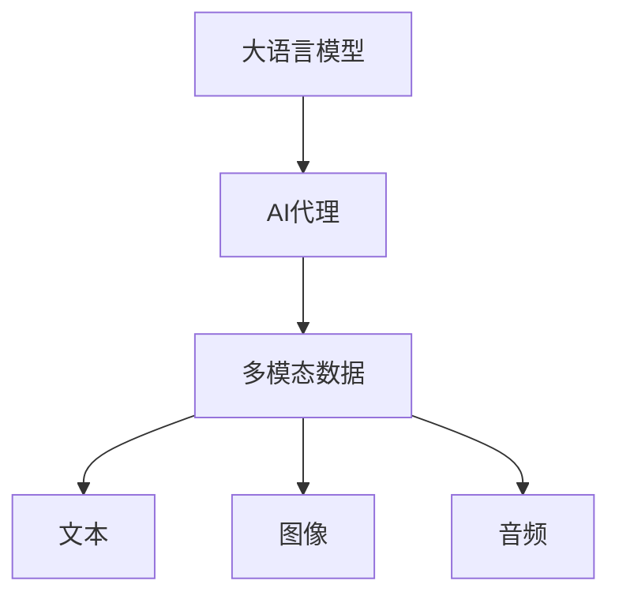
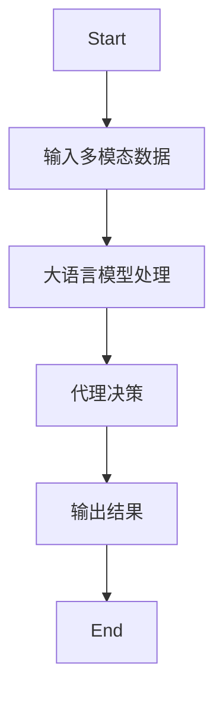
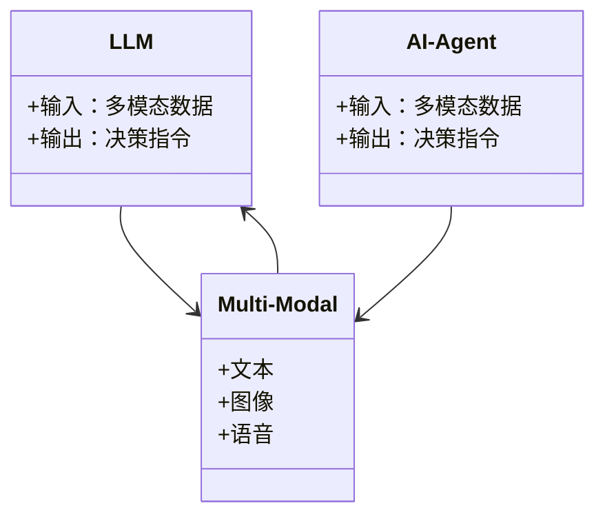
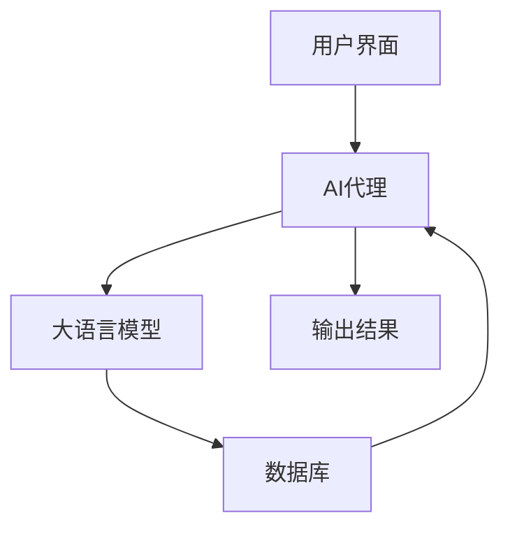
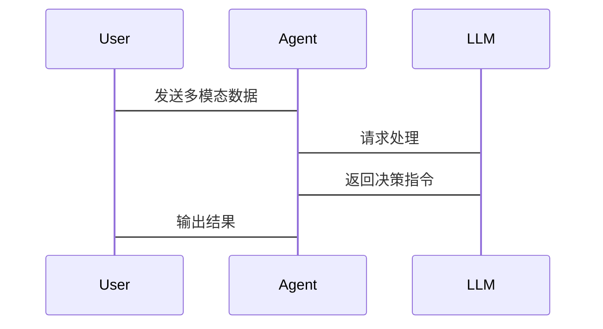

                 


# LLM驱动的AI Agent多模态融合处理

## 关键词：LLM, AI Agent, 多模态融合, 人工智能, 机器学习

## 摘要

在人工智能和机器学习的快速发展中，多模态数据的融合处理成为了提升AI系统性能的关键技术。本文将深入探讨如何利用大语言模型（LLM）驱动AI代理（AI Agent）进行多模态数据的融合处理。文章从背景介绍出发，详细讲解多模态融合的核心概念与联系，分析LLM驱动AI Agent的算法原理，并通过系统架构设计和项目实战，展示如何实现一个多模态融合的AI系统。本文旨在为读者提供从理论到实践的全面指导，帮助他们理解并掌握这一前沿技术。

---

## 第一部分: LLM驱动的AI Agent多模态融合处理背景与基础

### 第1章: LLM驱动的AI Agent概述

#### 1.1 多模态融合的基本概念

多模态数据指的是来自不同感知渠道的数据形式，例如文本、图像、语音、视频等。多模态融合的目标是将这些异构数据进行整合，以提升AI系统的理解和决策能力。

- **多模态数据的定义与特点**  
  多模态数据具有多样性、互补性和复杂性。例如，图像可以提供视觉信息，文本可以提供语义信息，语音可以提供情感信息。这些信息相互补充，能够提供更全面的上下文理解。

- **多模态融合的目标与意义**  
  多模态融合的目标是通过整合不同模态的数据，提升AI系统在复杂场景下的性能。例如，在智能客服系统中，结合用户的文本输入和语音情绪，可以更准确地理解用户的需求。

- **多模态融合的边界与外延**  
  多模态融合的边界在于如何有效处理不同模态数据的异构性和差异性。外延则包括如何在实际应用中平衡计算效率和融合效果。

#### 1.2 LLM与AI Agent的关系

- **LLM的基本原理**  
  大语言模型（LLM）是一种基于深度学习的自然语言处理模型，能够理解和生成人类语言。其核心是编码器-解码器结构，通过大量数据训练，能够捕捉语言中的语义和上下文信息。

- **AI Agent的核心功能**  
  AI代理是一种智能体，能够感知环境、执行任务并做出决策。AI Agent通常具备感知、推理、决策和执行四大功能模块。

- **LLM驱动AI Agent的实现机制**  
  LLM为AI Agent提供强大的语言理解和生成能力，AI Agent则通过LLM处理多模态数据，实现更智能的决策和交互。

### 第2章: 多模态融合的核心概念与联系

#### 2.1 多模态融合的核心原理

- **多模态数据的预处理**  
  预处理包括数据清洗、归一化和特征提取。例如，对于图像数据，可能需要进行灰度化或边缘检测处理。

- **多模态数据的特征提取**  
  特征提取是将多模态数据转化为可用于融合的特征向量。例如，文本数据可以使用词嵌入（如Word2Vec）提取特征，图像数据可以使用卷积神经网络（CNN）提取特征。

- **多模态数据的融合策略**  
  常见的融合策略包括特征级融合、决策级融合和混合融合。特征级融合是在特征层面直接进行加权或拼接，决策级融合是在决策层面进行投票或加权，混合融合则是两者的结合。

#### 2.2 实体关系图

以下是多模态融合的核心实体关系图：



从图中可以看出，AI代理通过大语言模型处理多模态数据，而多模态数据又由文本、图像和音频等多种形式组成。

#### 2.3 多模态融合的数学模型

- **多模态数据的概率分布**  
  $$ P(X|Y) = \prod_{i=1}^{n} P(x_i|Y) $$  
  其中，\( X \) 表示多模态数据，\( Y \) 表示目标输出。公式表示在给定目标输出 \( Y \) 的条件下，多模态数据 \( X \) 的联合概率分布。

- **多模态融合的损失函数**  
  $$ L = \sum_{i=1}^{n} (y_i - \hat{y_i})^2 $$  
  该损失函数用于衡量模型输出与真实值之间的差异，通过最小化损失函数来优化模型性能。

---

## 第二部分: LLM驱动的AI Agent算法原理

### 第3章: LLM驱动AI Agent的算法原理

#### 3.1 LLM驱动AI Agent的算法流程

以下是LLM驱动AI Agent的算法流程图：



从图中可以看出，AI Agent通过LLM处理输入的多模态数据，生成决策并输出结果。

#### 3.2 LLM与多模态融合的数学模型

- **LLM的编码器-解码器结构**  
  $$ encoder(x) = z $$  
  $$ decoder(z) = y $$  
  其中，\( x \) 表示输入数据，\( z \) 表示编码后的隐藏层表示，\( y \) 表示解码后的输出。

- **多模态融合的注意力机制**  
  $$ attention(Q,K,V) = softmax(\frac{QK^T}{\sqrt{d}})V $$  
  该机制用于在多模态数据融合中捕捉不同模态之间的关联性。

---

## 第三部分: 系统分析与架构设计方案

### 第4章: 系统分析与架构设计

#### 4.1 问题场景介绍

- **多模态数据处理的挑战**  
  多模态数据的异构性和复杂性给数据处理带来了挑战。例如，如何有效地将文本、图像和语音数据进行融合。

- **LLM驱动AI Agent的应用场景**  
  LLM驱动的AI Agent可以在智能客服、智能助手、自动驾驶等领域发挥作用。例如，在智能客服中，AI Agent可以通过分析用户的文本和语音情绪，提供更个性化的服务。

#### 4.2 系统功能设计

以下是系统功能设计的领域模型类图：



#### 4.3 系统架构设计

以下是系统架构设计的架构图：



从图中可以看出，AI代理通过用户界面接收输入，调用大语言模型进行处理，并将结果输出给用户。

#### 4.4 系统接口设计

以下是系统接口设计的序列图：



---

## 第四部分: 项目实战

### 第5章: 项目实战

#### 5.1 环境安装

以下是项目实战所需的环境安装步骤：

```bash
pip install transformers
pip install numpy
pip install matplotlib
pip install scikit-learn
```

#### 5.2 系统核心实现源代码

以下是系统核心实现的源代码：

```python
import torch
import torch.nn as nn
import torch.optim as optim
from transformers import AutoTokenizer, AutoModel
import numpy as np

class MultiModalAgent:
    def __init__(self, model_name):
        self.tokenizer = AutoTokenizer.from_pretrained(model_name)
        self.model = AutoModel.from_pretrained(model_name)
        self.device = torch.device("cuda" if torch.cuda.is_available() else "cpu")
        
    def process_text(self, text):
        inputs = self.tokenizer(text, return_tensors="np")
        outputs = self.model(**inputs)
        return outputs.last_hidden_state
    
    def process_image(self, image):
        # 假设image是预处理后的张量
        return self.model(image)
    
    def fuse_modalities(self, text_features, image_features):
        # 简单的特征拼接
        fused_features = np.concatenate([text_features, image_features], axis=1)
        return fused_features
    
    def generate_decision(self, fused_features):
        # 简单的决策生成
        decision = self.model.decode(fused_features)
        return decision

# 示例用法
agent = MultiModalAgent("bert-base-uncased")
text_input = "这是一个测试文本。"
image_input = torch.randn(1, 3, 224, 224)  # 示例图像张量
text_features = agent.process_text(text_input)
image_features = agent.process_image(image_input)
fused_features = agent.fuse_modalities(text_features, image_features)
decision = agent.generate_decision(fused_features)
print(decision)
```

#### 5.3 代码应用解读与分析

- **代码解读**  
  上述代码定义了一个`MultiModalAgent`类，用于处理多模态数据。`process_text`和`process_image`方法分别处理文本和图像数据，`fuse_modalities`方法将文本和图像特征进行融合，`generate_decision`方法生成最终的决策。

- **代码实现细节**  
  代码使用了Hugging Face的`transformers`库，以及PyTorch进行模型训练和推理。图像数据的处理需要进行预处理，例如归一化和调整尺寸。

- **代码优化建议**  
  在实际应用中，可以进一步优化特征融合策略，例如使用注意力机制或加权融合。同时，可以引入更多的模态数据，如语音数据，以提升系统的性能。

#### 5.4 实际案例分析

假设我们开发一个智能客服系统，用户可以通过文本和语音与AI代理交互。以下是系统的实现流程：

1. **用户输入**  
   用户发送一条包含文本和语音的请求，例如：“我遇到了一个问题，无法登录系统。”

2. **文本处理**  
   AI代理使用大语言模型处理用户的文本，理解其意图和情感。

3. **语音处理**  
   AI代理对用户的语音进行情感分析，判断用户的情绪状态。

4. **多模态融合**  
   AI代理将文本和语音的特征进行融合，生成更全面的用户需求。

5. **决策生成**  
   AI代理根据融合后的特征生成回复，例如：“请提供您的用户名和密码，我将帮助您解决问题。”

6. **输出结果**  
   AI代理将回复返回给用户，完成交互。

#### 5.5 项目小结

通过上述项目实战，我们可以看到，多模态融合的AI系统能够显著提升用户体验和系统性能。然而，实际应用中还需要考虑数据隐私、计算效率和模型可解释性等问题。

---

## 第五部分: 最佳实践 tips、小结、注意事项、拓展阅读

### 第6章: 最佳实践 tips

- **数据处理**  
  在处理多模态数据时，需要进行充分的预处理，确保数据的清洁和一致性。

- **模型选择**  
  根据具体应用场景选择合适的模型和算法，避免盲目追求模型的复杂性。

- **性能优化**  
  在实际应用中，可以通过并行计算和模型剪枝等技术优化系统的计算效率。

### 第7章: 小结

本文详细介绍了LLM驱动的AI Agent多模态融合处理的背景、核心概念、算法原理和系统架构设计，并通过项目实战展示了如何实现一个多模态融合的AI系统。通过本文的学习，读者可以掌握多模态融合的基本原理和实现方法。

### 第8章: 注意事项

- **数据隐私**  
  在处理多模态数据时，需要遵守相关法律法规，确保用户数据的安全和隐私。

- **模型可解释性**  
  多模态融合模型的可解释性对于实际应用至关重要，需要通过可视化和解释性分析提升模型的透明度。

### 第9章: 拓展阅读

- **多模态学习**  
  推荐阅读《Multimodal Learning with Deep Neural Networks》。

- **大语言模型**  
  推荐阅读《Large Language Models: A Survey》。

- **AI代理设计**  
  推荐阅读《Designing Intelligent Agents》。

---

## 作者：AI天才研究院/AI Genius Institute & 禅与计算机程序设计艺术 /Zen And The Art of Computer Programming

---

以上是《LLM驱动的AI Agent多模态融合处理》的技术博客文章的完整内容。希望本文能够为读者提供有价值的见解和指导。

