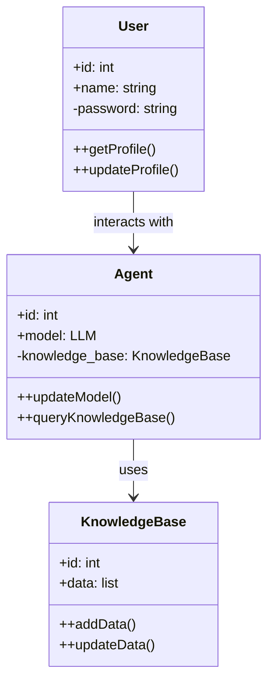
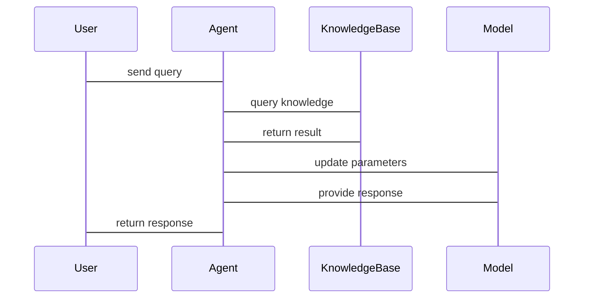

                 


# 增量学习AI Agent：LLM的持续知识更新机制

> 关键词：增量学习，AI Agent，大语言模型，知识更新，LLM

> 摘要：本文深入探讨了增量学习AI Agent的核心机制，特别是大语言模型（LLM）的持续知识更新方法。通过分析增量学习的基本原理、算法实现、系统架构以及实际应用，本文为技术开发者和研究人员提供了关于如何设计和实现具备持续学习能力的AI Agent的详细指导。

---

# 第1章: 增量学习AI Agent概述

## 1.1 问题背景

### 1.1.1 AI Agent的基本概念
AI Agent（人工智能代理）是指能够感知环境并采取行动以实现特定目标的智能体。AI Agent的核心能力包括感知、推理、学习和执行。

### 1.1.2 大语言模型（LLM）的发展现状
大语言模型（LLM）如GPT系列、BERT系列等，通过深度学习和大规模数据训练，具备强大的自然语言理解和生成能力。然而，LLM的知识更新机制尚不完善，无法实时适应新数据和新知识。

### 1.1.3 知识更新机制的重要性
知识更新机制是AI Agent持续进化的核心。在动态变化的环境中，AI Agent需要能够实时更新知识库，以保持其性能和适应性。

---

## 1.2 问题描述

### 1.2.1 LLM的知识更新需求
LLM需要具备持续学习的能力，能够根据新数据更新模型参数，提升性能。

### 1.2.2 增量学习的核心问题
增量学习的核心问题是如何在新数据到来时，高效地更新模型，同时避免遗忘旧知识。

### 1.2.3 当前LLM知识更新的挑战
当前LLM的知识更新面临以下挑战：
1. 计算资源消耗大。
2. 更新过程中可能出现知识遗忘。
3. 更新后的模型稳定性问题。

---

## 1.3 问题解决方法

### 1.3.1 增量学习的基本原理
增量学习是一种动态学习方法，模型在新数据到来时逐步更新，而非一次性训练整个模型。

### 1.3.2 增量学习在LLM中的应用
增量学习可以应用于LLM的参数微调、知识库更新和任务适应。

### 1.3.3 知识更新机制的设计思路
知识更新机制的设计思路包括：
1. 数据预处理与特征提取。
2. 模型更新策略。
3. 知识验证与评估。

---

## 1.4 边界与外延

### 1.4.1 增量学习的边界条件
增量学习的边界条件包括：
1. 数据量的限制。
2. 模型容量的限制。
3. 更新频率的限制。

### 1.4.2 LLM知识更新的范围界定
LLM知识更新的范围包括：
1. 模型参数更新。
2. 知识库更新。
3. 任务适应性更新。

### 1.4.3 相关概念的区分与联系
相关概念的区分与联系包括：
1. 增量学习与迁移学习的区别。
2. 知识更新与模型优化的区别。

---

## 1.5 核心要素组成

### 1.5.1 增量学习的核心要素
增量学习的核心要素包括：
1. 新数据输入。
2. 更新策略。
3. 模型评估。

### 1.5.2 LLM的知识表示方式
LLM的知识表示方式包括：
1. 矩阵表示。
2. 向量表示。
3. 图结构表示。

### 1.5.3 更新机制的关键组件
更新机制的关键组件包括：
1. 更新触发条件。
2. 更新算法。
3. 更新结果验证。

---

## 1.6 本章小结

本章介绍了增量学习AI Agent的核心概念和问题背景，分析了增量学习在LLM中的应用需求和挑战，为后续章节的深入探讨奠定了基础。

---

# 第2章: 增量学习与LLM的核心概念

## 2.1 增量学习的基本原理

### 2.1.1 增量学习的定义
增量学习是指模型在新数据逐步到来时，逐步更新模型参数的过程。

### 2.1.2 增量学习的核心特征
增量学习的核心特征包括：
1. 数据逐步到达。
2. 模型逐步更新。
3. 适应性强。

### 2.1.3 增量学习与传统学习方法的区别
区别包括：
1. 数据输入方式不同。
2. 模型更新方式不同。
3. 计算效率不同。

---

## 2.2 LLM的知识表示与更新机制

### 2.2.1 LLM的知识表示方式
LLM的知识表示方式包括：
1. 矩阵表示。
2. 向量表示。
3. 图结构表示。

### 2.2.2 知识更新机制的分类
知识更新机制的分类包括：
1. 参数微调。
2. 知识蒸馏。
3. 知识整合。

### 2.2.3 增量学习在LLM中的实现方式
增量学习在LLM中的实现方式包括：
1. 微调模型参数。
2. 更新知识库。
3. 适应新任务。

---

## 2.3 增量学习与LLM的关系

### 2.3.1 增量学习对LLM性能的影响
增量学习可以提升LLM的适应性和实时性。

### 2.3.2 LLM对增量学习的依赖性
LLM依赖增量学习来实现知识更新和任务适应。

### 2.3.3 增量学习在LLM中的应用优势
优势包括：
1. 实时更新。
2. 适应性强。
3. 资源消耗低。

---

## 2.4 核心概念对比表

| 对比项                | 增量学习            | 传统学习            |
|-----------------------|--------------------|--------------------|
| 数据输入方式          | 逐步输入           | 批量输入           |
| 模型更新方式          | 逐步更新           | 一次性更新         |
| 计算效率              | 较低               | 较高               |
| 适应性                | 强                | 弱                |

---

## 2.5 本章小结

本章详细阐述了增量学习的基本原理和LLM的知识表示与更新机制，分析了增量学习与LLM之间的关系，为后续章节的深入分析提供了理论基础。

---

# 第3章: 增量学习算法原理

## 3.1 增量学习算法的基本原理

### 3.1.1 增量学习的基本流程
增量学习的基本流程包括：
1. 数据预处理。
2. 模型更新。
3. 性能评估。

### 3.1.2 增量学习的核心算法
增量学习的核心算法包括：
1. 追踪梯度下降。
2. 动态参数更新。
3. 适应性优化。

### 3.1.3 增量学习的数学模型
增量学习的数学模型可以表示为：

$$
\theta_{t+1} = \theta_t + \eta (x_{t+1} - \theta_t)
$$

其中，$\theta_t$ 表示第 $t$ 轮的模型参数，$\eta$ 表示学习率，$x_{t+1}$ 表示第 $t+1$ 轮的新数据。

---

## 3.2 增量学习算法的实现步骤

### 3.2.1 数据预处理
数据预处理包括：
1. 数据清洗。
2. 特征提取。
3. 数据转换。

### 3.2.2 模型更新
模型更新步骤包括：
1. 读取新数据。
2. 计算梯度。
3. 更新参数。

### 3.2.3 性能评估
性能评估包括：
1. 准确率评估。
2. 召回率评估。
3. F1分数评估。

---

## 3.3 增量学习算法的数学

增量学习算法的数学模型可以表示为：

$$
\theta_{t+1} = \theta_t + \eta (y_{t+1} - \hat{y}_{t+1})
$$

其中，$\theta_t$ 表示第 $t$ 轮的模型参数，$\eta$ 表示学习率，$y_{t+1}$ 表示真实标签，$\hat{y}_{t+1}$ 表示模型预测值。

---

## 3.4 本章小结

本章详细讲解了增量学习算法的基本原理和实现步骤，分析了其数学模型，为后续章节的系统设计和项目实战奠定了基础。

---

# 第4章: 系统分析与架构设计方案

## 4.1 问题场景介绍

### 4.1.1 问题场景描述
本章以一个典型的增量学习AI Agent系统为背景，描述其应用场景和需求。

### 4.1.2 项目介绍
项目目标是设计一个基于增量学习的LLM知识更新系统。

---

## 4.2 系统功能设计

### 4.2.1 领域模型设计
领域模型设计包括：
1. 用户需求分析。
2. 系统功能模块划分。
3. 交互流程设计。

### 4.2.2 领域模型类图


---

## 4.3 系统架构设计

### 4.3.1 系统架构图
```mermaid
graph TD
    Client --> Agent: sends query
    Agent --> KnowledgeBase: queries knowledge
    KnowledgeBase --> Agent: returns result
    Agent --> Model: updates parameters
    Model --> Agent: provides response
```

---

## 4.4 系统接口设计

### 4.4.1 接口定义
接口定义包括：
1. 数据输入接口。
2. 模型更新接口。
3. 知识查询接口。

### 4.4.2 接口交互序列图


---

## 4.5 本章小结

本章从系统角度分析了增量学习AI Agent的架构设计，包括领域模型、系统架构和接口设计，为后续章节的项目实战提供了系统级的设计参考。

---

# 第5章: 项目实战

## 5.1 环境安装

### 5.1.1 系统要求
系统要求包括：
1. Python 3.8+
2. PyTorch 1.9+
3. transformers库 4.17+

### 5.1.2 安装依赖
安装依赖命令：
```bash
pip install torch transformers
```

---

## 5.2 系统核心实现

### 5.2.1 增量学习模型实现
增量学习模型实现代码：
```python
class IncrementalLearner:
    def __init__(self, model, learning_rate=0.01):
        self.model = model
        self.lr = learning_rate

    def update_model(self, x, y):
        # 计算梯度
        outputs = self.model(x)
        loss = (y - outputs).mean()
        loss.backward()
        # 更新参数
        for param in self.model.parameters():
            param.data += self.lr * param.grad
        # 清除梯度
        self.model.zero_grad()
```

### 5.2.2 知识更新模块实现
知识更新模块实现代码：
```python
class KnowledgeUpdater:
    def __init__(self, knowledge_base):
        self.knowledge_base = knowledge_base

    def add_new_knowledge(self, new_data):
        self.knowledge_base.append(new_data)

    def update_knowledge(self, old_data, new_data):
        index = self.knowledge_base.index(old_data)
        self.knowledge_base[index] = new_data
```

---

## 5.3 代码应用解读与分析

### 5.3.1 增量学习模型的代码解读
增量学习模型的代码解读包括：
1. 初始化模型和学习率。
2. 计算损失和梯度。
3. 更新模型参数。

### 5.3.2 知识更新模块的代码解读
知识更新模块的代码解读包括：
1. 添加新知识。
2. 更新已有知识。

---

## 5.4 实际案例分析

### 5.4.1 案例背景
案例背景包括：
1. 数据集描述。
2. 任务目标。
3. 实验结果。

### 5.4.2 案例分析
案例分析包括：
1. 数据预处理。
2. 模型训练。
3. 性能评估。

---

## 5.5 本章小结

本章通过实际项目实战，详细讲解了增量学习AI Agent的系统实现，包括环境安装、核心模块实现和案例分析，帮助读者掌握增量学习的实际应用。

---

# 第6章: 最佳实践与注意事项

## 6.1 小结

### 6.1.1 核心观点总结
核心观点总结包括：
1. 增量学习的重要性。
2. LLM知识更新的挑战。
3. 系统设计的关键点。

### 6.1.2 关键点回顾
关键点回顾包括：
1. 数据预处理。
2. 模型更新策略。
3. 知识验证与评估。

---

## 6.2 注意事项

### 6.2.1 实施中的注意事项
实施中的注意事项包括：
1. 数据质量控制。
2. 模型稳定性保障。
3. 计算资源优化。

### 6.2.2 常见问题及解决方案
常见问题及解决方案包括：
1. 知识遗忘问题。
2. 模型过拟合问题。
3. 计算效率问题。

---

## 6.3 拓展阅读

### 6.3.1 推荐阅读资料
推荐阅读资料包括：
1. 增量学习的经典论文。
2. LLM的最新研究进展。
3. 系统设计的最佳实践。

### 6.3.2 拓展学习方向
拓展学习方向包括：
1. 更高效的增量学习算法。
2. 更智能的知识更新机制。
3. 更灵活的系统架构设计。

---

## 6.4 本章小结

本章总结了增量学习AI Agent实施中的注意事项和最佳实践，为读者提供了宝贵的实践经验和未来研究方向。

---

# 作者：AI天才研究院 & 禅与计算机程序设计艺术

---

以上是《增量学习AI Agent：LLM的持续知识更新机制》的技术博客文章的完整目录和内容概要，您可以根据需要进一步扩展每个章节的具体内容。

