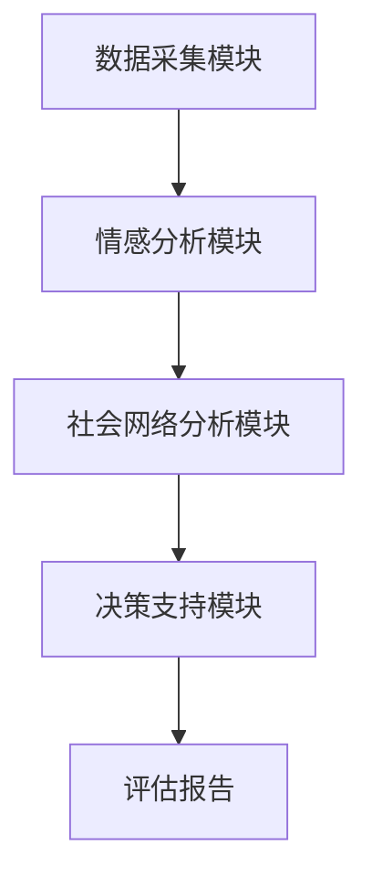
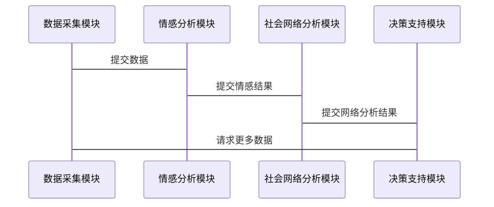

                 


# 多智能体系统在公司声誉动态评估中的应用

> 关键词：多智能体系统，公司声誉，动态评估，协同学习，社会网络分析，情感计算

> 摘要：本文探讨了多智能体系统（MAS）在公司声誉动态评估中的应用。通过分析MAS的核心概念、算法原理、系统架构及项目实战，详细阐述了如何利用MAS提升声誉评估的实时性、准确性和动态适应性。文章还提供了具体的实现方案和实际案例，为读者提供全面的技术指导。

---

## 第1章: 多智能体系统概述

### 1.1 多智能体系统的基本概念

#### 1.1.1 多智能体系统的定义
多智能体系统（Multi-Agent System，MAS）是由多个智能体（Agent）组成的分布式计算系统。每个智能体都是一个能够感知环境、自主决策、执行任务的实体。智能体之间通过通信与协作，共同完成复杂任务。

#### 1.1.2 多智能体系统的特征
- **自主性**：智能体能够自主决策，无需外部干预。
- **反应性**：智能体能够实时感知环境并做出反应。
- **协作性**：智能体之间通过通信与协作完成共同目标。
- **分布性**：智能体分布在网络中，不存在集中控制点。

#### 1.1.3 多智能体系统的分类
- **基于任务的MAS**：智能体协作完成特定任务。
- **基于模型的MAS**：基于领域知识构建智能体行为模型。
- **基于市场的MAS**：智能体通过市场机制进行资源分配。

### 1.2 公司声誉评估的背景与挑战

#### 1.2.1 公司声誉的定义
公司声誉是公司在市场中的社会形象和信任度，反映了公司在利益相关者心中的价值。

#### 1.2.2 公司声誉评估的重要性
- 帮助企业识别声誉风险。
- 优化企业声誉管理策略。
- 提升企业市场竞争力。

#### 1.2.3 传统声誉评估方法的局限性
- 数据来源单一，缺乏实时性。
- 评估维度有限，难以捕捉动态变化。
- 人工分析成本高，效率低。

### 1.3 多智能体系统在声誉评估中的应用价值

#### 1.3.1 多智能体系统的分布式计算优势
- 实时数据采集与处理。
- 分布式计算提升处理效率。
- 系统具备高度的可扩展性。

#### 1.3.2 多智能体系统在声誉评估中的潜在应用
- 实时监测社交媒体数据。
- 分析多源数据，捕捉声誉变化。
- 提供动态评估和预测。

#### 1.3.3 多智能体系统与公司声誉评估的结合点
- 利用MAS的协作性实现多源数据融合。
- 通过MAS的自主性实现实时声誉监控。
- 利用MAS的分布式计算提升评估效率。

---

## 第2章: 多智能体系统的核心概念与联系

### 2.1 多智能体系统的原理

#### 2.1.1 智能体的定义与特征
- **智能体**：具备感知、决策、执行能力的实体。
- **自主性**：智能体能够自主决策。
- **反应性**：智能体能够实时感知环境变化并做出反应。

#### 2.1.2 智能体之间的通信与协作
- **通信机制**：通过消息传递实现智能体之间的信息交换。
- **协作机制**：通过任务分配和协同完成共同目标。
- **冲突解决**：智能体之间通过协商解决冲突。

#### 2.1.3 多智能体系统的整体架构
- **智能体层**：包括多个智能体，每个智能体负责特定任务。
- **通信层**：实现智能体之间的信息交换。
- **协作层**：协调智能体的协作行为。

### 2.2 多智能体系统与公司声誉评估的核心要素

#### 2.2.1 声誉评估的主体与客体
- **主体**：评估主体包括社交媒体、新闻媒体、客户反馈等。
- **客体**：评估客体为公司及其产品、服务。

#### 2.2.2 声誉评估的指标体系
- **情感指标**：情感极性分析（正面、负面、中性）。
- **影响力指标**：信息传播的广度和深度。
- **可信度指标**：信息来源的可信度。

#### 2.2.3 多智能体系统在声誉评估中的角色分配
- **数据采集智能体**：负责采集社交媒体、新闻等数据。
- **情感分析智能体**：对数据进行情感分析。
- **社会网络分析智能体**：分析信息传播路径和影响力。

### 2.3 多智能体系统与声誉评估的关联性分析

#### 2.3.1 多智能体系统的分布式计算与声誉评估的动态性
- MAS的分布式计算能够实时处理大量数据。
- 声誉评估的动态性要求系统具备实时响应能力。

#### 2.3.2 多智能体系统的协作机制与声誉评估的多维度性
- MAS的协作机制能够整合多源数据。
- 声誉评估的多维度性需要多个智能体协同完成。

#### 2.3.3 多智能体系统的自适应性与声誉评估的实时性
- MAS的自适应性能够应对声誉变化的不确定性。
- 声誉评估的实时性要求系统具备快速响应能力。

---

## 第3章: 多智能体系统在公司声誉评估中的算法原理

### 3.1 多智能体协同学习算法

#### 3.1.1 协同学习的基本原理
- 协同过滤：基于用户行为相似性推荐内容。
- 集群分析：将用户分成不同群体，分析群体行为特征。

#### 3.1.2 协同学习的实现步骤
1. 数据预处理：清洗数据，提取特征。
2. 相似度计算：使用余弦相似度计算用户相似度。
3. 推荐生成：基于相似度进行推荐。

#### 3.1.3 协同学习的优缺点
- 优点：能够发现用户潜在需求。
- 缺点：计算复杂度高，冷启动问题。

### 3.2 基于社会网络分析的声誉评估

#### 3.2.1 社会网络分析的基本原理
- 网络结构分析：识别关键节点和信息传播路径。
- 社区发现：将用户分为不同社区，分析社区特征。

#### 3.2.2 社会网络分析的实现步骤
1. 数据采集：获取社交媒体数据。
2. 网络构建：构建用户关系图。
3. 社区发现：使用聚类算法发现社区。
4. 信息传播分析：分析信息在社区中的传播路径。

#### 3.2.3 社会网络分析的优缺点
- 优点：能够发现隐藏的网络结构。
- 缺点：计算复杂度较高，需要大量数据支持。

### 3.3 基于情感计算的声誉评估

#### 3.3.1 情感计算的基本原理
- 文本预处理：分词、去除停用词。
- 情感分析：使用机器学习算法预测文本情感极性。
- 情感强度分析：计算情感强度。

#### 3.3.2 情感计算的实现步骤
1. 数据清洗：去除噪音数据。
2. 特征提取：提取文本关键词。
3. 情感分析：使用SVM或随机森林算法进行分类。
4. 情感强度计算：使用情感词典或深度学习模型。

#### 3.3.3 情感计算的优缺点
- 优点：能够准确捕捉文本情感。
- 缺点：需要高质量的训练数据，计算复杂度较高。

---

## 第4章: 多智能体系统在公司声誉评估中的系统架构

### 4.1 系统功能设计

#### 4.1.1 功能模块划分
- 数据采集模块：采集社交媒体、新闻数据。
- 情感分析模块：分析文本情感极性。
- 社会网络分析模块：分析信息传播路径。
- 决策支持模块：提供声誉评估结果和建议。

#### 4.1.2 功能模块的交互流程
1. 数据采集模块采集数据并传递给情感分析模块。
2. 情感分析模块分析数据并传递给社会网络分析模块。
3. 社会网络分析模块分析数据并传递给决策支持模块。
4. 决策支持模块生成评估报告并输出结果。

#### 4.1.3 功能模块的实现细节
- 数据采集模块：使用爬虫技术采集数据。
- 情感分析模块：使用预训练的情感分析模型。
- 社会网络分析模块：使用图数据库存储和分析数据。

### 4.2 系统架构设计

#### 4.2.1 系统架构图


#### 4.2.2 模块之间的通信方式
- 数据采集模块通过API传递数据。
- 情感分析模块通过消息队列传递数据。
- 社会网络分析模块通过数据库存储数据。

#### 4.2.3 系统的可扩展性设计
- 模块化设计，便于功能扩展。
- 支持多种数据源的接入。
- 支持多种算法的集成。

### 4.3 系统接口设计

#### 4.3.1 数据采集模块的接口
- `get_data(source: str, start_time: str, end_time: str) -> list`
- `save_data(data: list, db: Database)`

#### 4.3.2 情感分析模块的接口
- `analyze_sentiment(text: str) -> str`
- `save_sentiment_results(results: list, db: Database)`

#### 4.3.3 社会网络分析模块的接口
- `build_network(data: list) -> Network`
- `analyze_communities(network: Network) -> list`

#### 4.3.4 决策支持模块的接口
- `generate_report(results: list) -> Report`
- `send_notification(report: Report)`

### 4.4 系统交互流程

#### 4.4.1 交互流程图


---

## 第5章: 多智能体系统在公司声誉评估中的项目实战

### 5.1 项目环境安装

#### 5.1.1 系统需求
- 操作系统：Linux/Windows/MacOS
- Python版本：3.6以上
- 依赖库：requests, beautifulsoup4, pymongo, networkx, textblob

#### 5.1.2 安装步骤
1. 安装Python
2. 安装依赖库：
   ```bash
   pip install requests beautifulsoup4 pymongo networkx textblob
   ```

#### 5.1.3 环境配置
- 配置数据库连接信息。
- 配置API接口密钥。

### 5.2 系统核心实现

#### 5.2.1 数据采集模块实现
```python
import requests
from bs4 import BeautifulSoup

def get_data(url):
    response = requests.get(url)
    soup = BeautifulSoup(response.text, 'html.parser')
    return [text for text in soup.find_all('div', class_='tweet')]
```

#### 5.2.2 情感分析模块实现
```python
from textblob import TextBlob

def analyze_sentiment(text):
    blob = TextBlob(text)
    return blob.sentiment.polarity
```

#### 5.2.3 社会网络分析模块实现
```python
import networkx as nx

def build_network(data):
    G = nx.Graph()
    for node in data:
        G.add_node(node)
    return G
```

#### 5.2.4 决策支持模块实现
```python
def generate_report(results):
    report = {}
    report['positive'] = sum(1 for score in results if score > 0)
    report['negative'] = sum(1 for score in results if score < 0)
    return report
```

### 5.3 项目实战案例

#### 5.3.1 案例背景
假设我们要评估某公司的声誉，数据来源包括社交媒体和新闻媒体。

#### 5.3.2 数据采集
```python
url = 'https://example.com/tweets'
tweets = get_data(url)
```

#### 5.3.3 情感分析
```python
sentiments = [analyze_sentiment(tweet) for tweet in tweets]
```

#### 5.3.4 社会网络分析
```python
network = build_network(tweets)
communities = find_communities(network)
```

#### 5.3.5 生成报告
```python
report = generate_report(sentiments)
print(report)
```

### 5.4 项目总结

#### 5.4.1 项目实现的关键点
- 数据采集的准确性和实时性。
- 情感分析的准确率和效率。
- 社会网络分析的深度和广度。

#### 5.4.2 项目的优缺点
- 优点：能够实时动态评估声誉，提供准确的评估结果。
- 缺点：需要大量的数据支持，计算复杂度较高。

#### 5.4.3 项目的实际应用价值
- 提高声誉评估的实时性和准确性。
- 降低声誉管理的成本和复杂度。
- 为企业提供科学的声誉管理决策支持。

---

## 第6章: 多智能体系统在公司声誉评估中的最佳实践

### 6.1 小结

#### 6.1.1 本文的核心观点
- 多智能体系统能够有效提升公司声誉评估的实时性和准确性。
- MAS的分布式计算和协作机制为声誉评估提供了新的解决方案。

#### 6.1.2 本文的主要贡献
- 提出了基于MAS的声誉评估方法。
- 提供了具体的实现方案和实际案例。

### 6.2 注意事项

#### 6.2.1 系统设计中的注意事项
- 确保系统的可扩展性和可维护性。
- 处理好智能体之间的通信和协作问题。
- 确保系统的安全性和稳定性。

#### 6.2.2 项目实施中的注意事项
- 数据来源的多样性和可靠性。
- 算法的准确性和效率。
- 系统的易用性和用户体验。

### 6.3 拓展阅读

#### 6.3.1 相关领域研究
- 多智能体系统的最新研究进展。
- 声誉评估的其他方法和技术。

#### 6.3.2 推荐阅读资料
- 《Multi-Agent Systems: Algorithmic, Complexity, and Theory》
- 《Network Analysis and Social Network Mining》

---

## 作者：AI天才研究院/AI Genius Institute & 禅与计算机程序设计艺术 /Zen And The Art of Computer Programming

