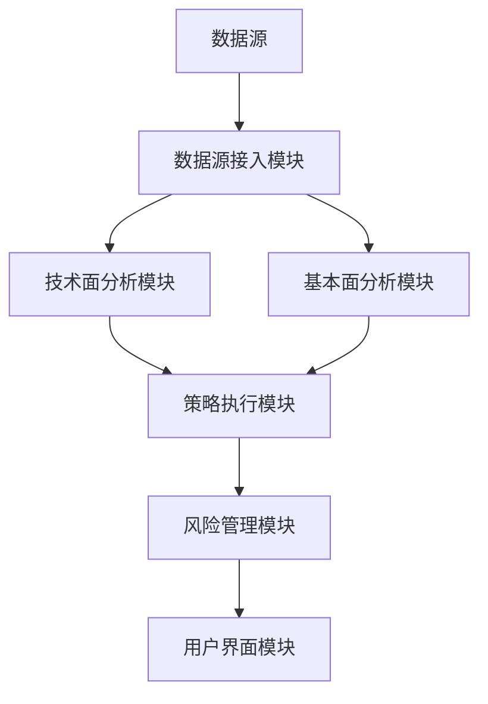

                 

# 威廉·欧奈尔的技术面与基本面结合策略

## 关键词：技术面分析，基本面分析，威廉·欧奈尔，投资策略，交易信号，风险管理

## 摘要：  
本文深入探讨了威廉·欧奈尔的技术面与基本面结合策略，分析了技术面分析和基本面分析的核心概念与方法，详细讲解了如何将两者有机结合，优化投资决策。文章结合数学模型、系统设计和实战案例，全面剖析了策略的实现细节与应用场景，为投资者提供了科学的投资方法论。

---

## 第1章: 技术面与基本面分析概述

### 1.1 什么是技术面分析
技术面分析是一种通过研究金融资产的历史价格走势，预测未来价格变动的方法。它主要关注市场行为的外在表现，如价格、成交量等。技术面分析的核心假设是市场价格反映了所有信息，因此可以通过分析价格和成交量的变化来识别市场趋势和潜在的买卖信号。

#### 1.1.1 技术面分析的定义  
技术面分析是通过对价格、成交量等市场行为数据的分析，预测未来价格走势的方法。它基于市场参与者的行为模式，试图识别价格波动的规律。

#### 1.1.2 技术面分析的核心要素  
- **价格（Price）**：价格是技术面分析的核心，反映市场对资产价值的判断。  
- **成交量（Volume）**：成交量是价格变动的确认指标，高成交量通常表明趋势的强度。  
- **趋势（Trend）**：趋势是价格运动的主要方向，技术面分析通过识别趋势来判断市场的主控力量。  
- **支撑与阻力**：支撑是价格下跌时的支撑点，阻力是价格上涨时的阻力点。  

#### 1.1.3 技术面分析的优缺点  
- **优点**：  
  - 及时反映市场情绪变化。  
  - 适合短期交易者。  
- **缺点**：  
  - 易受市场情绪影响，存在较大不确定性。  
  - 需结合其他分析方法才能提高准确性。  

### 1.2 什么是基本面分析
基本面分析是通过对企业的财务状况、行业地位、盈利能力等内在因素的分析，评估资产的内在价值。它关注的是资产的实际价值，而非市场的表象。

#### 1.2.1 基本面分析的定义  
基本面分析是通过研究企业的财务报表、行业环境、经济指标等内在因素，评估资产的内在价值和未来盈利能力。

#### 1.2.2 基本面分析的核心要素  
- **财务报表**：包括利润表、资产负债表、现金流量表。  
- **行业环境**：行业生命周期、竞争结构、政策环境等。  
- **公司基本面**：如市盈率、市净率、股息率等估值指标。  

#### 1.2.3 基本面分析的优缺点  
- **优点**：  
  - 能够发现资产的内在价值。  
  - 适合长期投资者。  
- **缺点**：  
  - 数据收集和分析较为复杂。  
  - 需要考虑宏观经济环境的影响。  

### 1.3 技术面与基本面结合的意义
技术面与基本面结合的策略，旨在利用技术面分析的短期价格预测能力，结合基本面分析的长期价值评估能力，从而提高投资决策的科学性和准确性。

#### 1.3.1 技术面与基本面结合的必要性  
- 技术面分析难以反映资产的内在价值，容易受到市场情绪的干扰。  
- 基本面分析虽然能够反映资产的内在价值，但无法捕捉短期的价格波动。  
- 两者结合能够兼顾短期价格波动和长期价值评估，帮助投资者制定更科学的投资策略。

#### 1.3.2 技术面与基本面结合的优势  
- **提高决策的准确性**：通过结合技术面和基本面分析，可以更全面地评估资产的价值和风险。  
- **优化投资组合**：结合技术面和基本面分析，可以帮助投资者筛选出具有长期增长潜力且短期价格走势向上的资产。  
- **降低投资风险**：通过结合技术面和基本面分析，可以更好地识别潜在的风险因素，从而制定更合理的风险管理策略。  

#### 1.3.3 技术面与基本面结合的适用场景  
- **股票投资**：尤其适用于长期价值投资和短期趋势交易的结合。  
- **资产配置**：通过结合技术面和基本面分析，可以优化资产配置策略。  
- **风险管理**：通过结合技术面和基本面分析，可以更好地识别和管理投资风险。  

### 1.4 本章小结  
本章介绍了技术面分析和基本面分析的核心概念、核心要素、优缺点以及两者结合的意义。通过技术面与基本面结合的策略，投资者可以更好地捕捉市场机会，降低投资风险，提高投资收益。

---

## 第2章: 技术面分析的核心方法

### 2.1 技术指标分析
技术指标分析是技术面分析的重要组成部分，通过对价格和成交量的数学计算，生成能够反映市场趋势和买卖信号的指标。

#### 2.1.1 移动平均线（MA）  
移动平均线是通过计算一定时期内的平均价格，反映价格趋势的指标。常见的移动平均线包括简单移动平均线（SMA）和指数移动平均线（EMA）。  

##### 简单移动平均线（SMA）  
SMA的计算公式为：  
$$ SMA = \frac{p_1 + p_2 + \cdots + p_n}{n} $$  

##### 指数移动平均线（EMA）  
EMA的计算公式为：  
$$ EMA_t = p_t \times \alpha + EMA_{t-1} \times (1 - \alpha) $$  
其中，$\alpha$ 是平滑因子，通常取0.1~0.3之间。  

#### 2.1.2 相对强弱指数（RSI）  
RSI是衡量价格超买或超卖状态的指标，计算公式为：  
$$ RSI = \frac{100}{1 + \frac{\text{平均上涨幅度}}{\text{平均下跌幅度}}} $$  

#### 2.1.3 MACD指标  
MACD是将两条不同周期的EMA结合在一起的技术指标，通常包括短期EMA、长期EMA和MACD柱状图。  

#### 2.1.4 威尔德相对强度指数（RSI）  
RSI是衡量价格相对强弱的指标，计算公式与RSI类似，但通常采用不同的参数设置。  

#### 2.1.5 技术指标分析的实战技巧  
- **确认趋势方向**：通过MA、RSI等指标判断价格趋势的方向和强度。  
- **寻找买卖信号**：通过指标的交叉、超买超卖等信号确认买卖点。  
- **风险控制**：结合技术指标和价格形态，制定合理的止损策略。  

### 2.2 K线图分析
K线图是技术面分析的重要工具，通过记录价格的开盘价、收盘价、最高价和最低价，反映市场的供需变化。

#### 2.2.1 K线图的构成  
- **实体**：代表收盘价和开盘价的差异。  
- **上影线**：代表最高价与收盘价的差异。  
- **下影线**：代表最低价与收盘价的差异。  

#### 2.2.2 常见K线形态  
- **看涨吞没**：一根大阳线吞没前一根阴线，表示买方力量增强。  
- **看跌吞没**：一根大阴线吞没前一根阳线，表示卖方力量增强。  
- **十字星**：实体较小，上下影线较长，表示市场方向不明。  

#### 2.2.3 趋势线与支撑阻力线  
- **趋势线**：连接价格的高点或低点，反映价格的主要趋势。  
- **支撑线**：价格下跌时的支撑点，通常出现在价格的低点。  
- **阻力线**：价格上涨时的阻力点，通常出现在价格的高点。  

#### 2.2.4 K线图分析的实战技巧  
- **确认趋势方向**：通过趋势线判断价格的主要趋势。  
- **寻找支撑阻力**：通过支撑线和阻力线判断价格的买卖点。  
- **结合技术指标**：将K线图与技术指标结合，提高分析的准确性。  

### 2.3 技术面分析的实战技巧  
#### 2.3.1 确认趋势方向  
通过技术指标和K线图分析，确认价格的主要趋势方向，制定相应的交易策略。  

#### 2.3.2 寻找买卖信号  
通过技术指标的交叉、超买超卖信号以及K线图的形态变化，寻找潜在的买卖信号。  

#### 2.3.3 风险控制与仓位管理  
制定合理的止损策略和仓位管理计划，控制投资风险，提高投资收益。  

#### 2.3.4 技术面分析的注意事项  
- **避免过度交易**：技术面分析容易导致过度交易，需结合基本面分析进行筛选。  
- **注意市场周期**：技术面分析需结合市场的周期性变化，避免误判市场趋势。  

### 2.4 本章小结  
本章详细介绍了技术面分析的核心方法，包括技术指标分析和K线图分析，并结合实战技巧，帮助投资者更好地应用技术面分析进行投资决策。

---

## 第3章: 基本面分析的核心方法

### 3.1 财务报表分析
财务报表分析是基本面分析的重要组成部分，通过分析企业的财务状况，评估企业的盈利能力、财务健康状况和未来发展前景。

#### 3.1.1 利润表分析  
利润表反映了企业在一定时期内的收入、成本和利润情况，计算公式为：  
$$ \text{净利润} = \text{营业收入} - \text{营业成本} - \text{费用} + \text{其他收入} $$  

#### 3.1.2 资产负债表分析  
资产负债表反映了企业在一定时期内的资产、负债和所有者权益情况，计算公式为：  
$$ \text{资产} = \text{负债} + \text{所有者权益} $$  

#### 3.1.3 现金流量表分析  
现金流量表反映了企业在一定时期内的现金流入和流出情况，分为经营活动、投资活动和筹资活动的现金流。

#### 3.1.4 财务报表分析的实战技巧  
- **关注财务指标**：如净利润率、毛利率、资产负债率等。  
- **分析财务报表的趋势**：通过比较不同期间的财务数据，评估企业的财务健康状况。  
- **结合行业特点**：不同行业的财务指标有不同的标准，需结合行业特点进行分析。  

### 3.2 行业分析
行业分析是基本面分析的重要组成部分，通过分析行业的发展趋势、竞争结构和政策环境，评估行业的发展前景和投资价值。

#### 3.2.1 行业生命周期分析  
- **导入期**：行业处于初步发展阶段，竞争较小，投资风险较高。  
- **成长期**：行业快速发展，企业盈利能力增强。  
- **成熟期**：行业增长放缓，竞争加剧。  
- **衰退期**：行业增长停滞或下降，企业盈利能力下降。  

#### 3.2.2 行业竞争结构分析  
- **波特五力模型**：包括潜在竞争者、替代品、供应商、买方和现有竞争者。  
- **市场集中度**：通过计算行业集中度指标（如CR4、CR8）评估行业竞争结构。  

#### 3.2.3 行业财务指标分析  
- **行业平均市盈率**：评估行业整体估值水平。  
- **行业平均净利润率**：评估行业盈利能力。  
- **行业平均负债率**：评估行业财务风险。  

#### 3.2.4 行业分析的实战技巧  
- **关注行业趋势**：通过分析行业发展趋势，判断行业的投资价值。  
- **结合宏观经济环境**：行业分析需结合宏观经济环境的变化，评估行业的发展前景。  
- **关注政策影响**：政策变化对行业的影响需重点关注，尤其是在政策敏感性较高的行业。  

### 3.3 公司估值
公司估值是基本面分析的重要环节，通过评估公司的内在价值，确定其股票的合理价格范围。

#### 3.3.1 市盈率（P/E）分析  
市盈率是股票价格与每股收益的比率，计算公式为：  
$$ P/E = \frac{\text{股价}}{\text{每股收益}} $$  

#### 3.3.2 市净率（P/B）分析  
市净率是股票价格与每股净资产的比率，计算公式为：  
$$ P/B = \frac{\text{股价}}{\text{每股净资产}} $$  

#### 3.3.3 股息率分析  
股息率是股票的股息与股价的比率，计算公式为：  
$$ \text{股息率} = \frac{\text{每股股息}}{\text{股价}} $$  

#### 3.3.4 公司估值的实战技巧  
- **关注公司基本面**：通过分析公司的财务报表和行业地位，评估公司的内在价值。  
- **结合市场环境**：公司估值需结合市场环境的变化，评估公司的相对估值水平。  
- **关注公司管理层**：公司管理层的素质和战略规划对公司的未来发展具有重要影响。  

### 3.4 本章小结  
本章详细介绍了基本面分析的核心方法，包括财务报表分析、行业分析和公司估值，并结合实战技巧，帮助投资者更好地应用基本面分析进行投资决策。

---

## 第4章: 技术面与基本面结合策略

### 4.1 策略概述
技术面与基本面结合策略是一种结合技术面分析和基本面分析的投资策略，旨在通过技术面分析捕捉短期价格波动，结合基本面分析评估资产的内在价值，优化投资决策。

#### 4.1.1 策略的核心思想  
- **短期价格预测**：通过技术面分析，预测短期内的价格走势。  
- **长期价值评估**：通过基本面分析，评估资产的内在价值。  
- **结合投资决策**：根据技术面和基本面分析的结果，制定投资策略。  

#### 4.1.2 策略的适用范围  
- **股票投资**：尤其适用于长期价值投资和短期趋势交易的结合。  
- **资产配置**：通过结合技术面和基本面分析，优化资产配置策略。  
- **风险管理**：通过结合技术面和基本面分析，识别潜在风险，制定合理的风险管理策略。  

#### 4.1.3 策略的优势与劣势  
- **优势**：  
  - 兼顾短期价格波动和长期价值评估，提高投资决策的科学性。  
  - 通过结合技术面和基本面分析，优化投资组合的风险收益比。  
- **劣势**：  
  - 实施难度较大，需要较高的技术面和基本面分析能力。  
  - 数据收集和分析较为复杂，需要较高的时间和成本投入。  

### 4.2 策略实施步骤
技术面与基本面结合策略的实施步骤包括：  
1. **确定投资目标**：明确投资目标、投资期限和风险承受能力。  
2. **基本面筛选股票**：通过基本面分析，筛选出具有长期增长潜力的资产。  
3. **技术面确认买卖点**：通过技术面分析，确认资产的短期价格走势和买卖点。  
4. **制定风险管理策略**：根据技术面和基本面分析的结果，制定合理的风险管理策略，包括止损、止盈和仓位管理等。  

#### 4.2.1 确定投资目标  
- **投资目标**：明确投资目标是长期价值投资还是短期趋势交易。  
- **投资期限**：根据投资目标确定投资期限，选择合适的投资策略。  
- **风险承受能力**：根据自身的风险承受能力，选择合适的风险管理策略。  

#### 4.2.2 基本面筛选股票  
- **行业分析**：通过行业分析，选择具有长期增长潜力的行业。  
- **公司估值**：通过公司估值，筛选出具有合理估值水平的公司。  
- **财务报表分析**：通过财务报表分析，评估公司的财务健康状况和盈利能力。  

#### 4.2.3 技术面确认买卖点  
- **趋势分析**：通过技术面分析，确认资产的主要趋势方向。  
- **买卖信号确认**：通过技术指标和K线图形态，确认买卖点。  
- **价格形态确认**：通过价格形态分析，判断价格的支撑和阻力位。  

#### 4.2.4 风险管理策略  
- **止损策略**：根据技术面和基本面分析的结果，设定合理的止损点，避免重大亏损。  
- **止盈策略**：根据技术面和基本面分析的结果，设定合理的止盈点，锁定投资收益。  
- **仓位管理**：根据市场的波动性和资产的相关性，合理分配仓位，分散投资风险。  

### 4.3 策略的数学模型
技术面与基本面结合策略的数学模型包括：  
- **技术指标计算公式**：如MA、RSI、MACD等。  
- **基本面指标计算公式**：如P/E、P/B、股息率等。  
- **综合评分模型**：通过技术面和基本面指标的综合评分，评估资产的投资价值。  

#### 4.3.1 技术指标计算公式  
- **简单移动平均线（SMA）**：  
  $$ SMA = \frac{p_1 + p_2 + \cdots + p_n}{n} $$  
- **相对强弱指数（RSI）**：  
  $$ RSI = \frac{100}{1 + \frac{\text{平均上涨幅度}}{\text{平均下跌幅度}}} $$  
- **MACD指标**：  
  $$ MACD_t = EMA_{12}_t - EMA_{26}_t $$  

#### 4.3.2 基本面指标计算公式  
- **市盈率（P/E）**：  
  $$ P/E = \frac{\text{股价}}{\text{每股收益}} $$  
- **市净率（P/B）**：  
  $$ P/B = \frac{\text{股价}}{\text{每股净资产}} $$  
- **股息率**：  
  $$ \text{股息率} = \frac{\text{每股股息}}{\text{股价}} $$  

#### 4.3.3 综合评分模型  
综合评分模型是通过技术面和基本面指标的综合评分，评估资产的投资价值。例如：  
$$ \text{综合评分} = 0.4 \times \text{技术面评分} + 0.6 \times \text{基本面评分} $$  

### 4.4 本章小结  
本章详细介绍了技术面与基本面结合策略的实施步骤和数学模型，帮助投资者更好地应用该策略进行投资决策。

---

## 第5章: 技术面与基本面结合的系统设计

### 5.1 系统架构设计
技术面与基本面结合系统的架构设计包括：  
1. **数据源接入**：接入实时的市场数据和财务数据。  
2. **数据分析模块**：包括技术面分析和基本面分析模块。  
3. **策略执行模块**：根据分析结果，生成交易信号。  
4. **风险管理模块**：根据交易信号，制定风险管理策略。  
5. **用户界面**：提供友好的用户界面，方便用户进行操作和查询。  

#### 5.1.1 系统功能模块划分  
- **数据源接入模块**：负责接入实时的市场数据和财务数据。  
- **技术面分析模块**：包括移动平均线、RSI、MACD等技术指标的计算和分析。  
- **基本面分析模块**：包括财务报表分析、行业分析和公司估值等基本面指标的计算和分析。  
- **策略执行模块**：根据技术面和基本面分析结果，生成交易信号。  
- **风险管理模块**：根据交易信号，制定风险管理策略，包括止损、止盈和仓位管理等。  
- **用户界面模块**：提供友好的用户界面，方便用户进行操作和查询。  

#### 5.1.2 数据流与信息流设计  
- **数据流**：市场数据和财务数据的流入，经过数据源接入模块，传输到数据分析模块进行处理，生成分析结果，传输到策略执行模块生成交易信号，最后传输到风险管理模块进行风险管理。  
- **信息流**：用户通过用户界面模块输入指令，传输到数据分析模块进行分析，生成分析结果，传输到策略执行模块生成交易信号，最后传输到用户界面模块进行展示。  

#### 5.1.3 系统架构图（Mermaid）  

### 5.2 系统实现细节
技术面与基本面结合系统的实现细节包括：  
1. **数据源接入**：通过API接口接入实时的市场数据和财务数据。  
2. **技术面分析模块**：实现技术指标的计算和分析，包括MA、RSI、MACD等。  
3. **基本面分析模块**：实现基本面指标的计算和分析，包括P/E、P/B、股息率等。  
4. **策略执行模块**：根据技术面和基本面分析结果，生成交易信号。  
5. **风险管理模块**：根据交易信号，制定风险管理策略，包括止损、止盈和仓位管理等。  

#### 5.2.1 数据源接入  
- **市场数据**：包括股票价格、成交量等实时数据，可通过API接口接入。  
- **财务数据**：包括财务报表、行业数据等，可通过数据供应商提供的API接口接入。  

#### 5.2.2 技术面分析模块  
- **技术指标计算**：实现MA、RSI、MACD等技术指标的计算。  
- **K线图绘制**：通过Matplotlib等工具，绘制K线图，分析价格形态。  

#### 5.2.3 基本面分析模块  
- **财务指标计算**：实现P/E、P/B、股息率等基本面指标的计算。  
- **行业分析**：通过波特五力模型等工具，分析行业竞争结构和生命周期。  

#### 5.2.4 策略执行模块  
- **交易信号生成**：根据技术面和基本面分析结果，生成买入、卖出或持有信号。  
- **交易策略优化**：通过回测和优化，提高交易策略的收益和稳定性。  

#### 5.2.5 风险管理模块  
- **止损策略**：根据技术面和基本面分析结果，设定合理的止损点，避免重大亏损。  
- **止盈策略**：根据技术面和基本面分析结果，设定合理的止盈点，锁定投资收益。  
- **仓位管理**：根据市场的波动性和资产的相关性，合理分配仓位，分散投资风险。  

### 5.3 本章小结  
本章详细介绍了技术面与基本面结合系统的架构设计和实现细节，帮助投资者更好地应用该系统进行投资决策。

---

## 第6章: 技术面与基本面结合策略的实战案例

### 6.1 技术面与基本面结合策略的案例分析
本章通过具体的实战案例，展示技术面与基本面结合策略的应用过程。

#### 6.1.1 案例背景  
以某股票为例，通过基本面分析和

