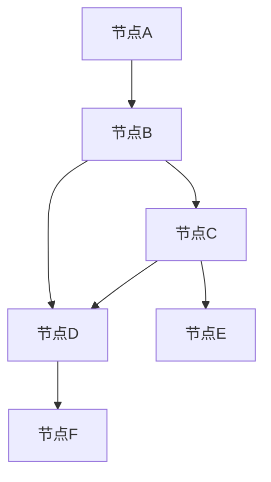
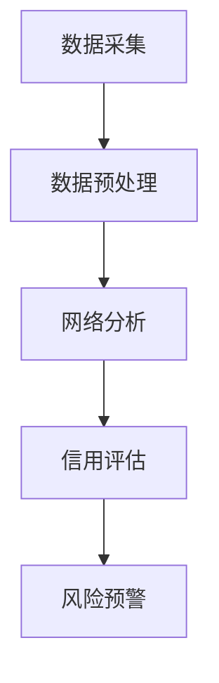
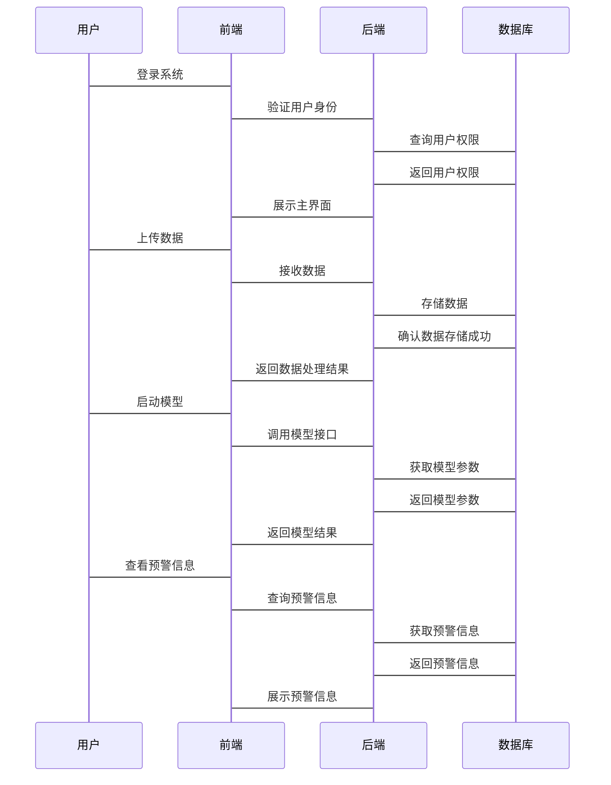

                 


# 开发智能化的供应链金融信用网络分析模型

> 关键词：供应链金融，信用网络分析，人工智能，算法原理，系统架构

> 摘要：本文旨在探讨如何开发智能化的供应链金融信用网络分析模型。通过分析供应链金融的核心概念、信用评估的挑战、网络分析的原理，结合机器学习和图论算法，构建一个能够实时评估供应链信用风险的智能化模型。本文详细阐述了模型的数学基础、算法实现、系统架构设计以及实际应用案例，为供应链金融领域的技术实践提供了理论支持和实践指导。

---

# 第1章 供应链金融信用网络分析模型的背景与意义

## 1.1 供应链金融的基本概念

供应链金融是指通过整合供应链上下游企业之间的资源和信息，提供资金支持和信用评估服务，以优化供应链的整体运作效率。其核心在于通过数据共享和风险分担机制，降低供应链各参与方的融资成本和信用风险。

### 1.1.1 供应链金融的定义与特点

供应链金融是一种金融模式，通过将供应链上的企业视为一个整体，为其提供融资服务。其特点包括：

1. **整体性**：关注供应链的整体运作，而非单一企业。
2. **协同性**：依赖于供应链上下游企业的协同合作。
3. **数据驱动**：依赖于供应链各环节的数据流和信息共享。

### 1.1.2 供应链金融的核心要素

供应链金融的核心要素包括：

1. **参与方**：供应商、制造商、分销商、零售商等。
2. **资金流**：融资需求、支付结算。
3. **信息流**：订单数据、物流数据、财务数据。
4. **信用评估**：企业信用评分、风险评估。

### 1.1.3 供应链金融的业务流程

供应链金融的业务流程通常包括以下几个步骤：

1. **需求申请**：企业向金融机构提出融资需求。
2. **数据收集**：收集供应链上下游企业的交易数据。
3. **信用评估**：基于数据进行信用评分。
4. **融资决策**：根据信用评估结果决定融资额度。
5. **资金发放与监控**：发放融资并实时监控资金使用情况。

## 1.2 供应链金融中的信用问题

### 1.2.1 供应链金融中的信用风险

供应链金融中的信用风险主要体现在以下几个方面：

1. **企业信用风险**：供应链上的某一家企业出现财务问题，可能会影响整个供应链的稳定。
2. **交易风险**：供应链中的交易可能因为信息不对称而产生欺诈行为。
3. **系统性风险**：整个供应链受到外部经济波动的影响，可能导致系统性信用风险。

### 1.2.2 信用评估的挑战与难点

供应链金融中的信用评估面临以下挑战：

1. **数据获取困难**：供应链上的数据分散在不同企业，获取难度大。
2. **数据质量参差不齐**：数据可能存在缺失、错误或不完整。
3. **模型复杂性**：需要考虑供应链网络的复杂关系，传统的单点信用评估模型难以适用。

### 1.2.3 信用网络分析的必要性

信用网络分析通过构建供应链网络模型，可以全面评估供应链中的信用风险，帮助金融机构做出更准确的信用评估决策。其必要性体现在：

1. **全面性**：能够综合考虑供应链中的多方关系和相互影响。
2. **实时性**：可以实时监控供应链中的信用变化，及时预警风险。
3. **准确性**：通过网络分析，能够发现传统模型难以捕捉的关联风险。

## 1.3 供应链金融智能化的必要性

### 1.3.1 传统供应链金融的局限性

传统供应链金融主要依赖于人工审核和简单的信用评分模型，存在以下局限性：

1. **效率低下**：人工审核耗时长，难以满足快速融资的需求。
2. **风险控制不足**：传统模型难以捕捉供应链中的复杂关联风险。
3. **信息孤岛**：数据分散在不同企业，难以进行有效的数据整合和分析。

### 1.3.2 智能化技术在供应链金融中的应用

随着人工智能和大数据技术的发展，智能化技术在供应链金融中的应用越来越广泛，主要体现在以下几个方面：

1. **数据挖掘与分析**：利用机器学习算法对海量数据进行挖掘和分析，提取有价值的信息。
2. **网络分析与建模**：通过图论和网络分析技术，构建供应链网络模型，评估信用风险。
3. **实时监控与预警**：利用实时数据流技术，监控供应链中的信用变化，及时预警风险。

### 1.3.3 智能化信用网络分析模型的优势

智能化信用网络分析模型相比传统模型具有以下优势：

1. **高准确性**：能够综合考虑供应链中的多维度信息，提高信用评估的准确性。
2. **高效率**：通过自动化数据处理和模型计算，显著提高评估效率。
3. **灵活性**：能够实时适应供应链中的动态变化，及时调整信用评估结果。

## 1.4 本章小结

本章介绍了供应链金融的基本概念、信用评估的挑战以及智能化信用网络分析模型的必要性。通过分析供应链金融的核心要素和业务流程，揭示了传统信用评估的局限性，并提出了智能化信用网络分析模型的优势，为后续章节的深入分析奠定了基础。

---

# 第2章 供应链金融信用网络分析模型的核心概念与联系

## 2.1 供应链网络分析的原理

### 2.1.1 供应链网络的结构特征

供应链网络的结构特征主要体现在以下几个方面：

1. **节点关系**：供应链中的节点代表企业，边代表企业之间的交易关系。
2. **网络密度**：网络中边的数量越多，网络密度越高，供应链的稳定性越强。
3. **中心性**：中心性高的节点在供应链中具有重要的地位，对整体信用风险的影响较大。

### 2.1.2 供应链网络的度量指标

供应链网络的度量指标包括：

1. **度数中心性**：表示节点在网络中的连接数量，反映节点的重要程度。
2. **中间中心性**：表示节点在网络中作为桥梁的作用，反映节点在信息传递中的地位。
3. **接近中心性**：表示节点到达其他节点的最短路径长度，反映节点的可达性。

### 2.1.3 供应链网络的分析方法

供应链网络的分析方法主要包括：

1. **网络可视化**：通过图论方法将供应链网络可视化，便于分析和理解。
2. **网络聚类分析**：将供应链网络中的节点进行聚类，识别出具有相似特征的群体。
3. **网络风险传播分析**：通过网络分析方法，评估风险在供应链网络中的传播路径和影响范围。

## 2.2 信用评估的核心概念

### 2.2.1 信用评分的定义与计算

信用评分是对企业的信用状况进行量化评估的过程，通常基于企业的财务数据、经营状况和市场表现等因素。信用评分的计算方法包括：

1. **单变量分析**：分析每个变量对信用评分的影响程度。
2. **多元回归分析**：建立多元回归模型，综合考虑多个变量对信用评分的影响。
3. **机器学习算法**：利用机器学习算法（如逻辑回归、随机森林等）进行信用评分。

### 2.2.2 信用风险的评估方法

信用风险的评估方法包括：

1. **定性分析**：通过专家判断和经验分析信用风险。
2. **定量分析**：基于数学模型和数据统计方法评估信用风险。
3. **混合分析**：结合定性和定量分析方法，综合评估信用风险。

### 2.2.3 信用评估的模型与算法

信用评估的模型与算法主要包括：

1. **线性回归模型**：用于预测企业的违约概率。
2. **逻辑回归模型**：用于分类企业的信用等级。
3. **随机森林模型**：通过集成学习方法提高信用评估的准确性。

## 2.3 数据建模与网络分析的联系

### 2.3.1 数据建模的基本原理

数据建模的基本原理包括数据清洗、特征提取、模型训练和结果评估等步骤。通过数据建模，可以提取出影响信用评分的关键特征，并建立预测模型。

### 2.3.2 网络分析在信用评估中的应用

网络分析在信用评估中的应用主要体现在以下几个方面：

1. **网络结构分析**：通过分析供应链网络的结构特征，识别关键节点和高风险区域。
2. **网络风险传播分析**：通过网络分析方法，评估风险在供应链网络中的传播路径和影响范围。
3. **网络聚类分析**：通过聚类分析，识别具有相似信用风险的企业群体。

### 2.3.3 数据建模与网络分析的结合

数据建模与网络分析的结合可以实现以下目标：

1. **提高信用评估的准确性**：通过网络分析方法，捕捉供应链中的关联风险，提高信用评估的准确性。
2. **优化信用风险管理**：通过数据建模和网络分析的结合，优化信用风险管理策略，降低整体信用风险。

## 2.4 核心概念与联系的对比分析

### 2.4.1 核心概念对比表格

| 比较维度 | 供应链网络分析 | 信用评估 | 数据建模 |
|----------|----------------|----------|----------|
| 核心目标 | 分析供应链结构 | 评估信用风险 | 构建预测模型 |
| 输入数据 | 供应链交易数据 | 企业信用数据 | 结构化数据 |
| 输出结果 | 网络结构特征 | 信用评分 | 预测结果 |

### 2.4.2 ER实体关系图架构

```mermaid
er
actor 供应链企业 {
  id: string
  name: string
  credit_score: float
}

actor 金融机构 {
  id: string
  name: string
}

actor 交易数据 {
  id: string
  supplier_id: string
  buyer_id: string
  transaction_amount: float
  transaction_date: date
}

relation 供应链企业 -[通过交易数据]-> 交易数据
relation 交易数据 -[通过交易数据]-> 供应链企业
relation 供应链企业 -[通过交易数据]-> 金融机构
```

## 2.5 本章小结

本章详细介绍了供应链金融信用网络分析模型的核心概念与联系，通过对比分析和ER实体关系图，揭示了供应链网络分析、信用评估和数据建模之间的相互关系。这为后续章节的算法实现和系统设计奠定了理论基础。

---

# 第3章 供应链金融信用网络分析模型的算法原理

## 3.1 图论基础与网络分析算法

### 3.1.1 图论的基本概念

图论是网络分析的基础，其基本概念包括：

1. **节点**：代表供应链中的企业。
2. **边**：代表企业之间的交易关系。
3. **权重**：表示边的强度或重要性。

### 3.1.2 网络分析的常用算法

网络分析的常用算法包括：

1. **最短路径算法**：用于寻找网络中的最短路径，如BFS和Dijkstra算法。
2. **聚类算法**：用于发现网络中的聚类，如K-means和Louvain算法。
3. **PageRank算法**：用于评估节点的重要性，常用于搜索引擎排序。

### 3.1.3 网络分析算法的实现步骤

以PageRank算法为例，其实现步骤如下：

1. **初始化**：为每个节点分配初始权重。
2. **迭代计算**：根据节点的入度和权重，更新节点的权重值。
3. **收敛判断**：当权重值的变化小于设定阈值时，停止迭代。
4. **输出结果**：输出每个节点的最终权重值。



### 3.1.4 算法实现的Python代码示例

以下是PageRank算法的Python代码示例：

```python
def pagerank(graph, damping_factor=0.8, max_iterations=100):
    import numpy as np
    nodes = list(graph.nodes)
    n = len(nodes)
    adj_matrix = np.zeros((n, n))
    for i in range(n):
        for j in range(n):
            adj_matrix[i][j] = len(graph.get_edge_list()[i][j])
    rank = np.ones(n) / n
    for _ in range(max_iterations):
        new_rank = np.zeros(n)
        for i in range(n):
            for j in range(n):
                new_rank[j] += rank[i] * adj_matrix[i][j] * damping_factor
            new_rank[j] += (1 - damping_factor) / n
        rank = new_rank
    return {nodes[i]: rank[i] for i in range(n)}

# 示例用法
from networkx import Graph

graph = Graph()
graph.add_edges_from([("A", "B"), ("B", "C"), ("C", "D"), ("B", "D"), ("C", "E"), ("D", "F")])
result = pagerank(graph)
print(result)
```

---

## 3.2 信用评估的机器学习算法

### 3.2.1 信用评估的机器学习模型

信用评估的机器学习模型包括：

1. **逻辑回归**：用于分类信用等级。
2. **随机森林**：用于特征重要性分析和分类。
3. **支持向量机（SVM）**：用于高维数据的分类。

### 3.2.2 机器学习算法的实现步骤

以随机森林为例，其实现步骤如下：

1. **数据预处理**：对数据进行清洗和特征提取。
2. **模型训练**：使用训练数据训练随机森林模型。
3. **模型预测**：利用训练好的模型进行信用评分预测。
4. **模型评估**：评估模型的准确率、召回率等性能指标。

### 3.2.3 机器学习算法的Python代码示例

以下是随机森林模型的Python代码示例：

```python
from sklearn.ensemble import RandomForestClassifier
from sklearn.metrics import accuracy_score
from sklearn.model_selection import train_test_split

# 示例数据
X = [[1, 2, 3], [4, 5, 6], [7, 8, 9], [10, 11, 12]]
y = [0, 1, 0, 1]

# 数据分割
X_train, X_test, y_train, y_test = train_test_split(X, y, test_size=0.2)

# 模型训练
clf = RandomForestClassifier()
clf.fit(X_train, y_train)

# 模型预测
y_pred = clf.predict(X_test)

# 模型评估
print("准确率:", accuracy_score(y_test, y_pred))
```

---

## 3.3 网络分析与信用评估的结合

### 3.3.1 网络分析在信用评估中的应用

网络分析在信用评估中的应用包括：

1. **网络风险传播分析**：通过网络分析方法，评估风险在供应链网络中的传播路径和影响范围。
2. **网络聚类分析**：通过聚类分析，识别具有相似信用风险的企业群体。
3. **网络中心性分析**：通过中心性分析，识别供应链网络中的关键节点和高风险区域。

### 3.3.2 网络分析与信用评估的结合方法

网络分析与信用评估的结合方法包括：

1. **特征提取**：从供应链网络中提取节点的中心性特征，作为信用评估的输入特征。
2. **模型融合**：将网络分析结果与传统的信用评估模型进行融合，提高信用评估的准确性。
3. **动态监控**：通过实时网络分析，动态监控供应链中的信用风险变化。

### 3.3.3 网络分析与信用评估结合的Python代码示例

以下是网络分析与信用评估结合的Python代码示例：

```python
import networkx as nx
from sklearn.linear_model import LogisticRegression

# 构建供应链网络
graph = nx.Graph()
graph.add_edges_from([("A", "B"), ("B", "C"), ("C", "D"), ("B", "D"), ("C", "E"), ("D", "F")])

# 提取节点中心性特征
centrality = nx.degree_centrality(graph)
centrality_values = list(centrality.values())

# 构建特征矩阵和标签
X = centrality_values
y = [0, 1, 0, 1, 0, 1]  # 示例标签，0为低风险，1为高风险

# 模型训练与预测
clf = LogisticRegression()
clf.fit(X.reshape(-1, 1), y)

# 模型评估
from sklearn.metrics import accuracy_score
y_pred = clf.predict(X.reshape(-1, 1))
print("准确率:", accuracy_score(y, y_pred))
```

---

## 3.4 本章小结

本章详细介绍了供应链金融信用网络分析模型的算法原理，包括图论基础与网络分析算法、信用评估的机器学习算法以及网络分析与信用评估的结合方法。通过具体的Python代码示例，展示了如何利用这些算法构建智能化的信用网络分析模型。

---

# 第4章 供应链金融信用网络分析模型的数学模型与公式

## 4.1 供应链信用评分模型的数学公式

供应链信用评分模型的数学公式包括：

1. **线性回归模型**：用于预测企业的违约概率。
   \[
   y = \beta_0 + \beta_1x_1 + \beta_2x_2 + \dots + \beta_nx_n + \epsilon
   \]
2. **逻辑回归模型**：用于分类企业的信用等级。
   \[
   P(y=1|x) = \frac{e^{\beta_0 + \beta_1x_1 + \dots + \beta_nx_n}}{1 + e^{\beta_0 + \beta_1x_1 + \dots + \beta_nx_n}}
   \]
3. **随机森林模型**：用于特征重要性分析和分类。

## 4.2 网络风险传播模型的数学公式

网络风险传播模型的数学公式包括：

1. **网络中心性计算公式**：
   \[
   C_i = \frac{\sum_{j=1}^{n} a_{ij}}{\sum_{i=1}^{n} \sum_{j=1}^{n} a_{ij}}
   \]
   其中，\(C_i\)表示节点\(i\)的度数中心性，\(a_{ij}\)表示节点\(i\)和节点\(j\)之间的连接数。

2. **风险传播公式**：
   \[
   R_i = \alpha R_j + (1 - \alpha)C_i
   \]
   其中，\(R_i\)表示节点\(i\)的风险值，\(\alpha\)表示风险传播系数，\(C_i\)表示节点\(i\)的中心性。

## 4.3 数学模型的应用案例

以逻辑回归模型为例，其应用案例如下：

假设我们有以下数据：

| 企业ID | 财务指标 | 偿债能力 | 信用评分 |
|-------|---------|----------|----------|
| 1     | 0.8     | 0.7      | 0        |
| 2     | 0.6     | 0.6      | 0        |
| 3     | 0.9     | 0.8      | 1        |
| 4     | 0.5     | 0.4      | 1        |

通过逻辑回归模型，我们可以建立以下模型：

\[
P(y=1|x_1, x_2) = \frac{e^{0.5 + 1.2x_1 + 0.8x_2}}{1 + e^{0.5 + 1.2x_1 + 0.8x_2}}
\]

通过训练数据训练模型参数，我们可以对新数据进行信用评分预测。

---

## 4.4 本章小结

本章详细介绍了供应链金融信用网络分析模型的数学模型与公式，包括供应链信用评分模型和网络风险传播模型的数学公式，并通过具体案例展示了这些模型的应用。这些数学模型为后续章节的系统设计和项目实战提供了理论支持。

---

# 第5章 供应链金融信用网络分析模型的系统分析与架构设计

## 5.1 系统功能设计

### 5.1.1 系统功能模块

供应链金融信用网络分析系统的功能模块包括：

1. **数据采集模块**：采集供应链交易数据和企业信用数据。
2. **数据预处理模块**：对数据进行清洗和特征提取。
3. **网络分析模块**：构建供应链网络模型并进行网络分析。
4. **信用评估模块**：基于网络分析结果进行信用评估。
5. **风险预警模块**：实时监控供应链中的信用风险并进行预警。

### 5.1.2 系统功能流程

系统功能流程包括：

1. **数据采集**：从供应链企业和金融机构获取交易数据和信用数据。
2. **数据预处理**：清洗数据并提取关键特征。
3. **网络分析**：构建供应链网络模型并计算节点中心性。
4. **信用评估**：基于网络分析结果和机器学习模型进行信用评分。
5. **风险预警**：实时监控供应链中的信用风险并进行预警。



## 5.2 系统架构设计

### 5.2.1 系统架构图

供应链金融信用网络分析系统的架构图如下：


### 5.2.2 系统模块设计

系统模块设计包括：

1. **前端模块**：负责用户界面的展示和交互。
2. **中间模块**：负责业务逻辑的处理和数据的传递。
3. **后端模块**：负责系统的逻辑处理和数据存储。
4. **数据层**：负责数据的存储和管理。

## 5.3 系统接口设计

### 5.3.1 系统接口说明

系统接口说明包括：

1. **数据接口**：与供应链企业和金融机构的数据接口进行对接。
2. **模型接口**：与信用评估模型和网络分析模型的接口进行对接。
3. **预警接口**：与风险预警模块的接口进行对接。

### 5.3.2 系统接口流程

系统接口流程包括：

1. **数据获取**：通过数据接口获取供应链交易数据和企业信用数据。
2. **模型调用**：通过模型接口调用信用评估模型和网络分析模型。
3. **结果处理**：处理模型返回的结果并生成预警信息。
4. **预警触发**：当信用风险超过阈值时，触发预警机制。

## 5.4 系统交互设计

### 5.4.1 系统交互流程

系统交互流程包括：

1. **用户登录**：用户登录系统并进入主界面。
2. **数据上传**：用户上传供应链交易数据和企业信用数据。
3. **模型运行**：用户启动信用评估模型和网络分析模型。
4. **结果展示**：系统展示信用评估结果和风险预警信息。

### 5.4.2 系统交互流程图



---

## 5.5 本章小结

本章详细介绍了供应链金融信用网络分析系统的系统分析与架构设计，包括系统功能设计、系统架构设计、系统接口设计和系统交互设计。这些设计为后续章节的项目实战提供了系统化的指导。

---

# 第6章 供应链金融信用网络分析模型的项目实战

## 6.1 环境搭建与数据采集

### 6.1.1 开发环境搭建

开发环境搭建包括：

1. **安装Python**：安装Python 3.6及以上版本。
2. **安装依赖库**：安装numpy、pandas、networkx、sklearn等依赖库。
3. **安装开发工具**：安装Jupyter Notebook、PyCharm等开发工具。

### 6.1.2 数据采集方法

数据采集方法包括：

1. **API接口调用**：通过API接口获取供应链交易数据和企业信用数据。
2. **数据文件导入**：通过CSV、Excel等文件导入数据。
3. **数据库连接**：通过数据库连接获取数据。

## 6.2 数据预处理与特征提取

### 6.2.1 数据清洗

数据清洗步骤包括：

1. **去除重复数据**：删除重复的记录。
2. **处理缺失值**：填补或删除缺失值。
3. **异常值处理**：识别并处理异常值。

### 6.2.2 特征提取

特征提取步骤包括：

1. **特征选择**：选择对信用评估影响较大的特征。
2. **特征工程**：对特征进行标准化、归一化等处理。
3. **特征组合**：将多个特征进行组合，形成新的特征。

## 6.3 网络分析与信用评估

### 6.3.1 网络分析实现

网络分析实现包括：

1. **构建供应链网络模型**：使用networkx库构建供应链网络模型。
2. **计算节点中心性**：计算节点的度数中心性和中间中心性。
3. **网络可视化**：将供应链网络可视化，便于分析和理解。

### 6.3.2 信用评估实现

信用评估实现包括：

1. **选择机器学习模型**：选择合适的机器学习模型（如逻辑回归、随机森林）。
2. **模型训练**：对模型进行训练，得到模型参数。
3. **模型预测**：利用训练好的模型进行信用评分预测。

## 6.4 系统实现与接口开发

### 6.4.1 系统实现

系统实现包括：

1. **前端开发**：使用React、Vue等框架开发用户界面。
2. **后端开发**：使用Django、Flask等框架开发业务逻辑。
3. **数据库设计**：设计数据库表结构并进行数据存储。

### 6.4.2 接口开发

接口开发包括：

1. **数据接口开发**：开发与供应链企业和金融机构的数据接口。
2. **模型接口开发**：开发与信用评估模型和网络分析模型的接口。
3. **预警接口开发**：开发与风险预警模块的接口。

## 6.5 系统测试与优化

### 6.5.1 系统测试

系统测试包括：

1. **功能测试**：测试系统功能是否正常运行。
2. **性能测试**：测试系统的性能是否满足要求。
3. **安全性测试**：测试系统的安全性，防止数据泄露和网络攻击。

### 6.5.2 系统优化

系统优化包括：

1. **算法优化**：优化信用评估模型和网络分析算法，提高系统的运行效率。
2. **数据优化**：优化数据存储和处理方式，提高系统的数据处理能力。
3. **系统调优**：根据测试结果进行系统调优，提高系统的整体性能。

---

## 6.6 本章小结

本章通过项目实战的方式，详细介绍了供应链金融信用网络分析模型的开发过程，包括环境搭建、数据预处理、网络分析、信用评估、系统实现和系统测试等步骤。通过具体的代码示例和实际案例分析，展示了如何利用智能化技术开发高效的供应链金融信用网络分析系统。

---

# 第7章 总结与展望

## 7.1 总结

本文详细探讨了供应链金融信用网络分析模型的开发过程，从核心概念到算法实现，再到系统设计和项目实战，全面阐述了如何利用智能化技术优化供应链金融的信用评估过程。通过网络分析和机器学习算法的结合，本文提出了一种高效的信用网络分析模型，能够实时评估供应链中的信用风险，为金融机构提供了有力的支持。

---

## 7.2 展望

随着人工智能和大数据技术的不断发展，供应链金融信用网络分析模型将朝着更加智能化和个性化的方向发展。未来的研究方向包括：

1. **模型优化**：进一步优化信用评估模型和网络分析算法，提高模型的准确性和效率。
2. **实时监控**：实现供应链信用风险的实时监控，提高风险预警的及时性。
3. **多维度分析**：结合更多维度的数据，如市场数据、行业数据，进一步提高信用评估的准确性。

---

## 7.3 最佳实践 Tips

1. **数据质量**：确保数据的准确性和完整性，是信用评估模型成功的关键。
2. **模型选择**：根据具体业务需求选择合适的机器学习模型，避免盲目追求复杂模型。
3. **网络分析**：充分利用网络分析技术，识别供应链中的关键节点和高风险区域，优化信用风险管理策略。

---

## 7.4 作者信息

作者：AI天才研究院/AI Genius Institute & 禅与计算机程序设计艺术 /Zen And The Art of Computer Programming

---

**附录**：完整代码示例与数据集下载链接

