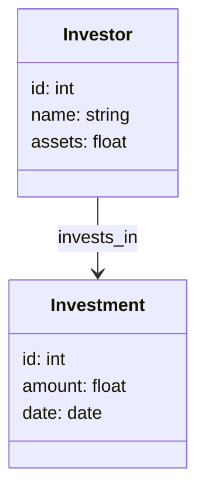
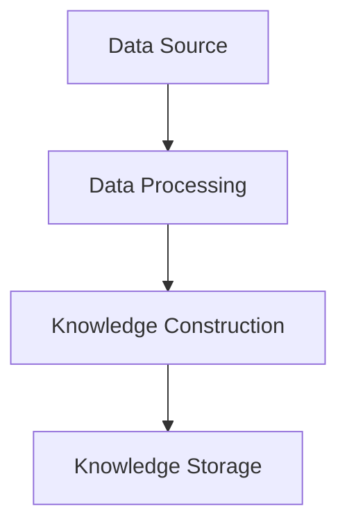
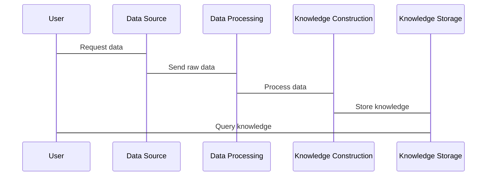

                 


# 打造全面的投资理财知识图谱：方法与工具

> 关键词：投资理财，知识图谱，数据处理，系统架构，项目实战

> 摘要：本文系统地介绍了如何构建全面的投资理财知识图谱，涵盖从数据收集到系统架构设计的全过程。通过详细分析知识图谱的概念、构建方法、投资理财数据的处理与分析、知识图谱的构建与应用、系统架构设计、项目实战、优化与扩展，以及案例分析，本文为读者提供了一个全面的投资理财知识图谱构建框架。文章还通过具体代码示例和图表展示，帮助读者更好地理解和应用相关方法。

---

## 第1章：投资理财知识图谱的背景与目标

### 1.1 投资理财的基本概念

#### 1.1.1 投资与理财的定义
投资是指将资金投入某个项目或资产，以期获得收益的行为。理财则是指对个人或家庭的财务进行管理，以实现财务目标的过程。两者相辅相成，共同构成了个人或机构的财务管理体系。

#### 1.1.2 投资理财的核心目标
投资理财的核心目标包括资产保值、增值、风险控制和财务自由。通过科学的投资策略和合理的资产配置，投资者可以在不同市场环境下实现收益最大化。

#### 1.1.3 知识图谱在投资理财中的作用
知识图谱通过结构化的数据表示，帮助投资者理解复杂的金融关系和市场动态，从而做出更明智的投资决策。

### 1.2 知识图谱的基本概念

#### 1.2.1 知识图谱的定义
知识图谱是一种以图结构表示知识的数据库，由节点（实体）和边（关系）组成，能够有效地表示实体间的复杂关系。

#### 1.2.2 知识图谱的特点
- **结构化**：数据以实体和关系的形式组织，便于计算机处理。
- **语义丰富**：能够表达复杂的语义关系，如“投资”、“风险”等。
- **动态更新**：能够实时更新，反映市场变化。

#### 1.2.3 知识图谱与传统数据库的对比
| 特性       | 知识图谱               | 传统数据库           |
|------------|-----------------------|----------------------|
| 数据结构   | 图结构（节点和边）     | 行列结构             |
| 查询能力   | 支持复杂语义查询       | 仅支持简单查询       |
| 应用场景   | 复杂关系分析           | 简单数据检索         |

### 1.3 投资理财知识图谱的构建目标

#### 1.3.1 知识图谱的构建目标
- 提供投资理财领域的知识结构，便于理解和分析。
- 帮助投资者识别潜在的投资机会和风险。

#### 1.3.2 知识图谱在投资理财中的应用场景
- 风险评估：通过分析实体间的关联关系，识别潜在风险。
- 投资决策：基于知识图谱进行智能推荐和决策支持。

#### 1.3.3 知识图谱的潜在价值
- 提高投资效率，降低决策风险。
- 为量化投资提供数据支持。

### 1.4 本章小结
本章介绍了投资理财的基本概念、知识图谱的定义及其在投资理财中的作用和应用场景。通过对比分析，明确了构建投资理财知识图谱的重要性和目标。

---

## 第2章：知识图谱的构建过程

### 2.1 知识图谱的构建步骤

#### 2.1.1 数据收集
- 数据来源包括金融市场数据、新闻资讯、学术论文等。
- 数据格式多样，包括文本、表格、图像等。

#### 2.1.2 数据预处理
- 数据清洗：去除冗余数据和错误信息。
- 数据标准化：统一数据格式和编码。

#### 2.1.3 知识抽取
- 实体识别：使用自然语言处理技术提取关键词。
- 关系抽取：识别实体间的关联关系。

#### 2.1.4 知识融合
- 数据清洗：去除重复和冲突的数据。
- 数据整合：将多个数据源的信息整合到一个知识图谱中。

#### 2.1.5 知识建模
- 设计实体和关系的层次结构。
- 使用本体论（Ontology）进行建模。

#### 2.1.6 知识存储
- 使用图数据库（如Neo4j）存储知识图谱。
- 数据存储格式包括RDF和JSON-LD。

### 2.2 知识图谱的表示方法

#### 2.2.1 实体与关系的定义
- 实体：如“公司”、“股票”。
- 关系：如“投资”、“持有”。

#### 2.2.2 知识图谱的表示形式
- 图结构：使用节点和边表示实体和关系。
- 本体论：使用类和属性描述实体。

#### 2.2.3 知识图谱的存储方式
- 图数据库：如Neo4j。
- 三元组存储：如RDF三元组。

### 2.3 知识图谱的构建工具

#### 2.3.1 常用知识图谱构建工具
- **RDF4J**：用于RDF数据的处理和存储。
- **Neo4j**：图数据库，支持Cypher查询语言。

#### 2.3.2 工具的优缺点对比
| 工具   | 优点                     | 缺点                     |
|--------|--------------------------|--------------------------|
| RDF4J  | 开源，支持多种数据格式    | 学习曲线较高             |
| Neo4j  | 图结构查询高效            | 对大规模数据存储资源消耗大 |

#### 2.3.3 工具的选择与使用
- 根据需求选择工具：数据量小选择RDF4J，数据量大选择Neo4j。
- 学习曲线：Neo4j的Cypher语言简单易学。

### 2.4 本章小结
本章详细介绍了知识图谱的构建步骤，包括数据收集、预处理、知识抽取、融合和建模，以及存储方式和常用工具的选择。

---

## 第3章：投资理财数据的处理与分析

### 3.1 数据来源

#### 3.1.1 金融数据的来源渠道
- **金融市场数据**：股票、基金、债券等实时数据。
- **新闻资讯**：财经新闻、公司公告。
- **学术论文**：金融理论和研究成果。

### 3.2 数据预处理

#### 3.2.1 数据清洗
```python
import pandas as pd
df = pd.read_csv('financial_data.csv')
df.dropna(inplace=True)  # 删除缺失值
```

#### 3.2.2 数据转换
```python
df['date'] = pd.to_datetime(df['date'])  # 转换日期格式
```

#### 3.2.3 数据增强
- 数据插值：使用均值或中位数填充缺失值。
- 数据标准化：归一化处理。

### 3.3 数据特征提取

#### 3.3.1 特征选择方法
- 主成分分析（PCA）：降低数据维度。
- 信息增益：选择信息量大的特征。

#### 3.3.2 特征工程的实现
```python
from sklearn.preprocessing import StandardScaler
scaler = StandardScaler()
df_scaled = scaler.fit_transform(df)  # 标准化处理
```

#### 3.3.3 特征的评估与优化
- 使用交叉验证评估特征重要性。
- 通过特征选择优化模型性能。

### 3.4 本章小结
本章介绍了投资理财数据的处理流程，包括数据来源、预处理方法和特征提取技术，为后续知识图谱的构建提供了基础数据支持。

---

## 第4章：投资理财知识图谱的构建方法

### 4.1 知识抽取技术

#### 4.1.1 实体识别
```python
import spacy
nlp = spacy.load('en_core_web_sm')
doc = nlp('Apple invests in Google.')
for ent in doc.ents:
    print(ent.text, ent.label_)
```

#### 4.1.2 关系抽取
- 使用关系抽取模型（如REToolkit）识别实体间的关系。

### 4.2 知识融合策略

#### 4.2.1 数据清洗与去重
```python
from itertools import groupby
df = df.drop_duplicates(subset='id')  # 删除重复数据
```

#### 4.2.2 知识冲突的处理
- 使用冲突解决算法（如协商算法）处理知识冲突。

### 4.3 知识建模方法

#### 4.3.1 实体与关系的建模
- 使用本体论建模，定义实体和关系的层次结构。

#### 4.3.2 知识图谱的层次划分
- 顶层：市场、行业。
- 中层：公司、产品。
- 底层：数据点。

### 4.4 本章小结
本章详细介绍了知识图谱的构建方法，包括实体识别、关系抽取、知识融合和建模等步骤。

---

## 第5章：系统架构设计

### 5.1 问题场景介绍
投资理财知识图谱的构建需要考虑数据源的多样性、数据处理的复杂性以及系统的可扩展性。

### 5.2 系统功能设计

#### 5.2.1 领域模型


### 5.3 系统架构设计

#### 5.3.1 模块划分


#### 5.3.2 系统交互流程


### 5.4 本章小结
本章通过系统架构设计，明确了各模块的功能和交互流程，为后续的系统实现提供了指导。

---

## 第6章：项目实战

### 6.1 环境安装

#### 6.1.1 安装必要的工具
```bash
pip install neo4j pandas spacy
```

### 6.2 系统核心实现源代码

#### 6.2.1 数据加载
```python
import neo4j
driver = neo4j.Driver("bolt://localhost:7687", auth=('neo4j', 'password'))
```

#### 6.2.2 知识图谱构建
```python
def create_knowledge_graph():
    with driver.session() as session:
        session.write_transaction(
            lambda tx: tx.run(
                "CREATE (:Investor {name: 'Alice'})"
            )
        )
```

#### 6.2.3 查询与可视化
```python
def query_investments():
    with driver.session() as session:
        result = session.read_transaction(
            lambda tx: tx.run("MATCH (i:Investor) RETURN i.name")
        )
        for record in result:
            print(record['i.name'])
```

### 6.3 项目小结
本章通过具体的项目实战，展示了如何使用Neo4j构建投资理财知识图谱，并通过查询和可视化功能进行分析。

---

## 第7章：优化与扩展

### 7.1 知识图谱的优化

#### 7.1.1 数据更新策略
- 定期更新数据，保持知识图谱的时效性。

#### 7.1.2 查询优化
- 使用索引优化查询性能。

### 7.2 知识图谱的扩展

#### 7.2.1 多模态数据融合
- 将文本、图像等多种数据类型整合到知识图谱中。

#### 7.2.2 多语言支持
- 支持多种语言的实体识别和关系抽取。

### 7.3 本章小结
本章讨论了知识图谱的优化与扩展策略，包括数据更新、查询优化和多模态数据融合。

---

## 第8章：案例分析与应用

### 8.1 案例分析

#### 8.1.1 案例背景
分析某公司的投资行为，构建其知识图谱。

#### 8.1.2 数据收集与处理
收集公司投资数据，进行清洗和特征提取。

#### 8.1.3 知识图谱构建
构建公司投资行为的知识图谱，分析其投资策略。

### 8.2 应用场景

#### 8.2.1 智能投顾
基于知识图谱进行智能投资推荐。

#### 8.2.2 风险管理
通过知识图谱识别潜在风险，制定风险管理策略。

### 8.3 本章小结
本章通过具体案例分析，展示了知识图谱在投资理财中的实际应用。

---

## 第9章：小结与展望

### 9.1 本章小结
本文系统地介绍了如何构建全面的投资理财知识图谱，从数据处理到系统架构设计，再到项目实战，提供了详细的实现方法。

### 9.2 未来展望
知识图谱在投资理财中的应用前景广阔，未来可以通过引入更多数据源和智能化算法，进一步提升其价值。

### 9.3 注意事项
- 数据隐私和安全问题需要重视。
- 知识图谱的构建和维护需要专业的技术支持。

### 9.4 拓展阅读
建议读者进一步阅读相关书籍和论文，深入了解知识图谱的高级应用。

---

## 作者：AI天才研究院/AI Genius Institute & 禅与计算机程序设计艺术 /Zen And The Art of Computer Programming

---

本文通过系统化的分析和实践，为读者提供了构建全面投资理财知识图谱的方法与工具。希望本文能够为投资理财领域的研究和实践提供有价值的参考和指导。

