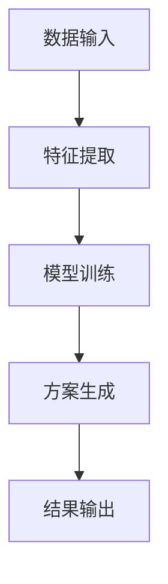
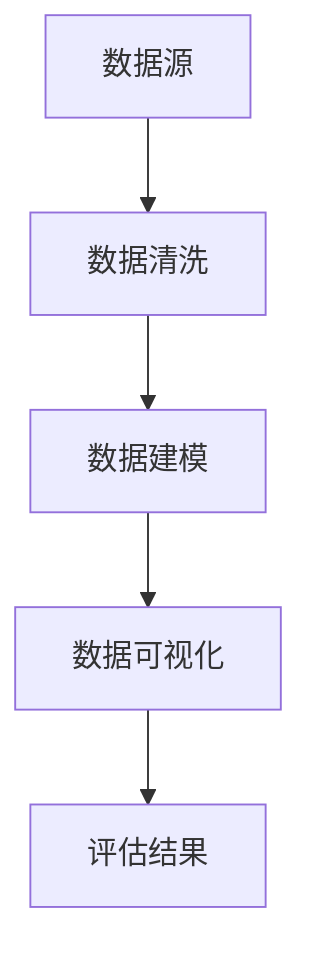
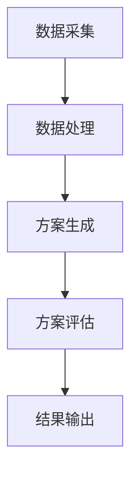
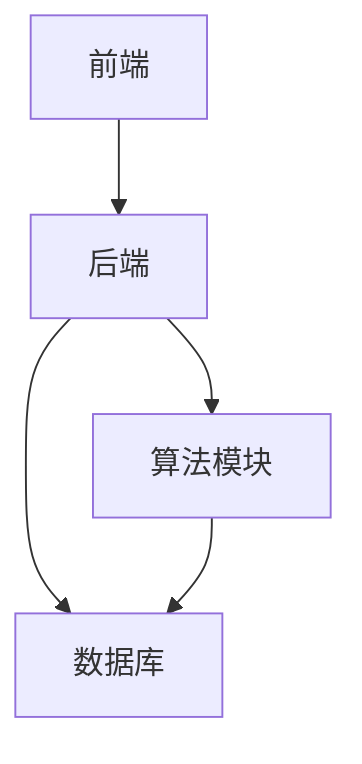
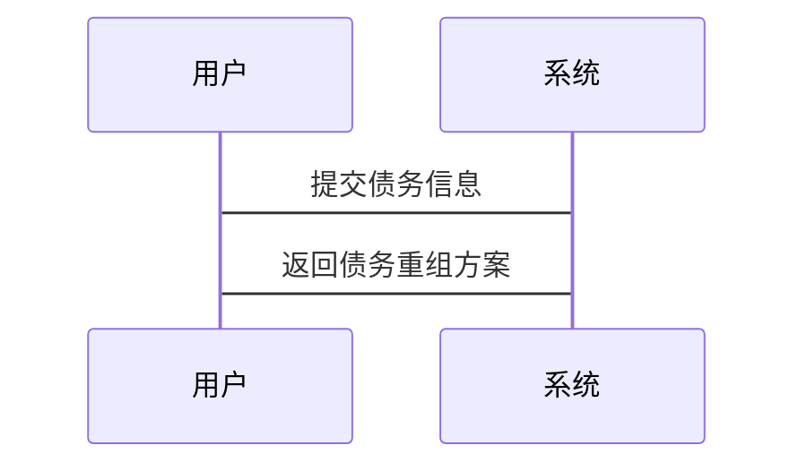
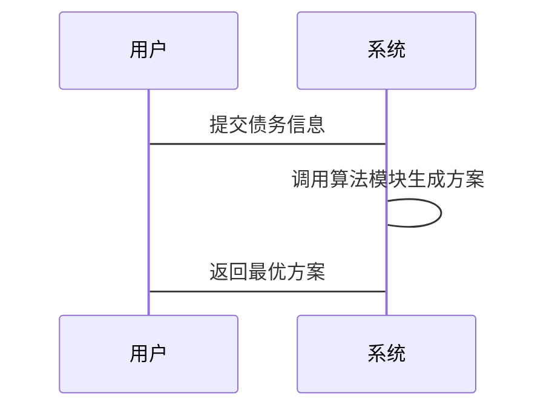

                 


# 智能债务重组方案生成与评估

## 关键词：债务重组、智能算法、大数据、风险管理、金融创新、机器学习

## 摘要：  
智能债务重组方案生成与评估是当前金融市场中的一个重要研究方向。随着人工智能和大数据技术的快速发展，传统的债务重组方法逐渐暴露出效率低下、风险难以控制等问题。本文将从智能债务重组的背景、核心概念、算法原理、系统架构设计以及项目实战等多方面展开深入探讨。通过结合实际案例，详细阐述如何利用机器学习、大数据分析等技术手段，实现高效、智能的债务重组方案生成与评估，从而为企业和个人提供更优质的债务管理解决方案。

---

# 第一部分: 智能债务重组方案生成与评估的背景与概念

## 第1章: 智能债务重组的背景与概念

### 1.1 债务重组的传统方法与挑战

#### 1.1.1 债务重组的基本概念
债务重组是指在债务人无法按时偿还债务的情况下，通过调整债务的本金、利息、还款期限等方式，优化债务结构，降低债务风险的过程。传统的债务重组方法通常依赖于人工分析和经验判断，这种方式效率较低，且难以应对复杂多变的市场环境。

#### 1.1.2 传统债务重组的主要方法
1. **债务展期**：延长还款期限，降低短期偿债压力。
2. **债务减免**：通过减免部分债务本金或利息，减轻债务负担。
3. **债务置换**：将现有债务替换为新的债务工具，优化债务结构。
4. **债转股**：将债务转换为股权，降低债务风险。

#### 1.1.3 传统债务重组的局限性与痛点
1. **效率低下**：传统债务重组过程复杂，涉及多方协商，耗时较长。
2. **风险控制不足**：人工判断可能导致风险评估不准确，难以全面覆盖潜在风险。
3. **缺乏数据支持**：传统方法依赖经验，难以充分利用数据进行决策。

### 1.2 智能债务重组的定义与特点

#### 1.2.1 智能债务重组的定义
智能债务重组是指利用人工智能、大数据分析等技术，结合企业的财务数据和市场信息，自动生成优化的债务重组方案，并对方案进行智能评估和优化的过程。

#### 1.2.2 智能债务重组的核心特点
1. **数据驱动**：基于海量数据进行分析和建模，生成最优方案。
2. **自动化**：通过算法自动完成债务重组方案的生成和优化。
3. **实时性**：能够实时调整方案，适应市场变化和企业需求。
4. **风险可控**：通过智能评估模型，降低债务重组中的风险。

#### 1.2.3 智能债务重组与传统债务重组的对比
| 对比维度       | 传统债务重组              | 智能债务重组              |
|----------------|--------------------------|--------------------------|
| 方法基础       | 人工经验与规则            | 数据分析与机器学习        |
| 效率           | 较低，耗时较长            | 高效，自动化处理          |
| 风险控制       | 依赖人工判断，风险较高    | 数据驱动，风险可控        |
| 适用场景       | 适用于简单债务结构        | 适用于复杂债务结构        |

### 1.3 智能债务重组的应用场景与价值

#### 1.3.1 智能债务重组的主要应用场景
1. **企业债务优化**：帮助企业优化债务结构，降低融资成本。
2. **个人债务管理**：为个人提供个性化的债务重组方案。
3. **金融机构风险管理**：帮助金融机构降低债务重组中的风险。

#### 1.3.2 智能债务重组对企业财务管理的价值
1. **提高效率**：通过自动化处理减少人工干预，提高效率。
2. **降低风险**：通过智能评估模型降低债务重组中的风险。
3. **优化成本**：通过数据驱动的方式优化债务结构，降低融资成本。

#### 1.3.3 智能债务重组对金融行业的潜在影响
1. **提升服务效率**：金融机构可以更快地为企业和个人提供债务重组方案。
2. **增强风险管理能力**：通过智能评估模型，金融机构可以更准确地评估债务重组的风险。
3. **推动金融创新**：智能债务重组将推动金融行业向更智能化、数据化的方向发展。

---

## 第2章: 智能债务重组的核心概念与原理

### 2.1 智能债务重组的核心概念

#### 2.1.1 数据驱动的债务重组
数据驱动的债务重组是指通过收集和分析企业的财务数据、市场数据等，利用大数据技术生成债务重组方案的过程。

#### 2.1.2 人工智能在债务重组中的应用
人工智能通过机器学习、自然语言处理等技术，帮助企业分析债务重组的可行性和优化方案。

#### 2.1.3 大数据技术在债务重组中的作用
大数据技术通过收集和分析海量数据，为企业提供全面的债务重组分析和决策支持。

### 2.2 智能债务重组的原理与流程

#### 2.2.1 数据收集与处理
1. **数据源**：包括企业的财务报表、市场数据、历史债务重组案例等。
2. **数据清洗**：对数据进行去噪和标准化处理。
3. **数据建模**：通过机器学习算法建立债务重组模型。

#### 2.2.2 数据分析与建模
1. **特征提取**：从数据中提取关键特征，如企业信用评分、还款能力等。
2. **模型训练**：使用机器学习算法（如随机森林、支持向量机等）训练模型。
3. **模型评估**：通过交叉验证等方法评估模型的准确性和稳定性。

#### 2.2.3 方案生成与优化
1. **方案生成**：基于训练好的模型生成多个债务重组方案。
2. **方案优化**：通过优化算法（如遗传算法）对方案进行优化，选择最优方案。

#### 2.2.4 方案评估与反馈
1. **风险评估**：评估方案的风险，如违约概率、流动性风险等。
2. **方案反馈**：将评估结果反馈到模型中，优化后续方案生成。

### 2.3 智能债务重组的核心要素对比

#### 2.3.1 核心要素对比表格
| 核心要素       | 传统债务重组            | 智能债务重组            |
|----------------|------------------------|------------------------|
| 数据来源       | 主要依赖人工经验        | 依赖大数据分析          |
| 方案生成       | 人工制定                | 自动化生成              |
| 风险评估       | 依赖人工判断            | 数据驱动自动评估        |

#### 2.3.2 ER实体关系图架构
```mermaid
erd
    左右括号
    左边
        左上角
            实体1：债务人
            属性：债务人ID、名称、信用评分
        中间
            实体2：债权人
            属性：债权人ID、名称、债权金额
        右上角
            实体3：债务方案
            属性：方案ID、方案名称、方案描述
    右边
        关系：债务人-债权人关系
            关系属性：债务金额、还款计划
        关系：债权人-债务方案关系
            关系属性：方案评估结果
```

---

## 第3章: 智能债务重组的算法原理

### 3.1 基于机器学习的债务重组方案生成

#### 3.1.1 机器学习在债务重组中的应用
1. **监督学习**：通过已知债务重组案例，训练分类模型，预测债务重组的成功概率。
2. **无监督学习**：通过聚类分析，识别不同类型的债务重组案例，优化方案生成。

#### 3.1.2 常见算法选择与对比
| 算法类型       | 适用场景               | 优缺点                   |
|----------------|-----------------------|-------------------------|
| 线性回归       | 简单线性关系预测       | 简单易用，但适用性有限   |
| 支持向量机（SVM）| 高维数据分类           | 适用于非线性关系，但计算复杂 |
| 随机森林       | 高维数据分类与回归     | 高精度，但解释性较差     |
| 神经网络       | 复杂非线性关系预测     | 强大但训练时间较长       |

#### 3.1.3 算法流程图


### 3.2 基于大数据分析的债务重组评估

#### 3.2.1 数据分析技术在债务重组中的应用
1. **数据挖掘**：通过数据挖掘技术发现隐藏在数据中的规律，优化债务重组方案。
2. **数据可视化**：通过可视化工具（如Tableau）展示数据，帮助理解债务重组的风险和收益。

#### 3.2.2 数据分析流程图


### 3.3 算法实现的数学模型与公式

#### 3.3.1 线性回归模型
$$ y = \beta_0 + \beta_1x + \epsilon $$
其中，$y$ 是目标变量，$x$ 是自变量，$\beta_0$ 和 $\beta_1$ 是模型参数，$\epsilon$ 是误差项。

#### 3.3.2 支持向量机模型
$$ \text{最大化} \  \gamma \geq 1 - y_i(w \cdot x_i + b) $$
其中，$w$ 是权重向量，$b$ 是偏置项，$\gamma$ 是惩罚参数。

#### 3.3.3 随机森林模型
随机森林是一种基于决策树的集成学习方法，通过训练多棵决策树并进行投票或平均，提高模型的准确性和鲁棒性。

---

## 第4章: 智能债务重组的系统架构设计

### 4.1 项目背景与需求分析

#### 4.1.1 项目背景
随着企业债务问题的日益复杂化，传统的债务重组方法已难以满足实际需求。智能债务重组系统通过结合人工智能和大数据技术，为企业和个人提供智能化的债务重组解决方案。

#### 4.1.2 项目需求
1. **需求分析**：分析企业的财务状况、市场环境等，生成个性化的债务重组方案。
2. **风险评估**：评估债务重组方案的风险，确保方案的可行性和安全性。
3. **系统优化**：通过反馈机制不断优化系统性能，提高方案生成效率。

### 4.2 系统功能设计

#### 4.2.1 系统功能模块
1. **数据采集模块**：负责采集企业的财务数据、市场数据等。
2. **数据处理模块**：对数据进行清洗、建模和分析。
3. **方案生成模块**：基于机器学习算法生成债务重组方案。
4. **方案评估模块**：对生成的方案进行风险评估和优化。
5. **用户界面模块**：提供友好的用户界面，方便用户查看和操作。

#### 4.2.2 系统功能流程图


### 4.3 系统架构设计

#### 4.3.1 系统架构图


#### 4.3.2 系统接口设计
1. **前端接口**：负责与用户的交互，接收输入并返回结果。
2. **后端接口**：负责处理业务逻辑，调用算法模块生成方案。
3. **数据库接口**：负责数据的存储和查询。

### 4.4 系统交互流程图

#### 4.4.1 用户登录与数据输入


#### 4.4.2 方案生成与优化


---

## 第5章: 智能债务重组的项目实战

### 5.1 环境安装与配置

#### 5.1.1 环境要求
1. **操作系统**：Windows 10 或更高版本，或 macOS 10.15 或更高版本。
2. **Python版本**：Python 3.6 或更高版本。
3. **开发工具**：建议使用PyCharm或Jupyter Notebook。

#### 5.1.2 安装依赖库
1. **机器学习库**：scikit-learn、xgboost。
2. **数据处理库**：pandas、numpy。
3. **可视化库**：matplotlib、seaborn。
4. **流程图绘制库**：graphviz。

### 5.2 核心代码实现

#### 5.2.1 数据预处理代码
```python
import pandas as pd
import numpy as np

# 加载数据
data = pd.read_csv('debt_data.csv')

# 数据清洗
data.dropna(inplace=True)
data = pd.get_dummies(data)
```

#### 5.2.2 机器学习模型训练代码
```python
from sklearn.model_selection import train_test_split
from sklearn.ensemble import RandomForestClassifier
from sklearn.metrics import accuracy_score

# 划分训练集和测试集
X_train, X_test, y_train, y_test = train_test_split(data.drop('target', axis=1), data['target'], test_size=0.2)

# 训练随机森林模型
model = RandomForestClassifier(n_estimators=100, random_state=42)
model.fit(X_train, y_train)

# 预测和评估
y_pred = model.predict(X_test)
print("Accuracy:", accuracy_score(y_test, y_pred))
```

#### 5.2.3 方案生成与优化代码
```python
import xgboost as xgb

# 数据转换为xgb格式
dtrain = xgb.DMatrix(X_train, label=y_train)
dtest = xgb.DMatrix(X_test, label=y_test)

# 设置参数
params = {
    'objective': 'binary:logistic',
    'max_depth': 6,
    'min_child_weight': 1,
    'gamma': 0,
    'subsample': 0.8,
    'colsample_bytree': 0.8,
    'eta': 0.3,
    'seed': 42
}

# 训练模型
model = xgb.train(params, dtrain, num_boost_round=20)

# 预测
y_pred = model.predict(dtest)
```

### 5.3 实际案例分析与解读

#### 5.3.1 案例背景
某企业因经营不善，面临高额债务，需要通过智能债务重组优化债务结构。

#### 5.3.2 数据分析与建模
通过机器学习模型分析企业的财务数据，生成多个债务重组方案。

#### 5.3.3 方案生成与优化
基于模型预测结果，生成最优债务重组方案，并进行风险评估。

#### 5.3.4 方案实施与反馈
实施债务重组方案，并通过反馈机制优化后续方案生成。

---

## 第6章: 智能债务重组的总结与展望

### 6.1 小结
智能债务重组通过结合人工智能和大数据技术，显著提高了债务重组的效率和准确性。与传统方法相比，智能债务重组具有数据驱动、自动化、实时性强、风险可控等优势。

### 6.2 注意事项
1. **数据隐私**：在处理企业数据时，需注意数据隐私和合规性。
2. **模型解释性**：复杂的机器学习模型可能缺乏解释性，需注意模型的可解释性。
3. **模型更新**：定期更新模型，确保模型的有效性和准确性。

### 6.3 拓展阅读
1. 《机器学习实战》——周志华
2. 《大数据分析与应用》——王伟
3. 《智能金融》——李明

---

## 作者：AI天才研究院/AI Genius Institute & 禅与计算机程序设计艺术/Zen And The Art of Computer Programming

---

通过以上目录和内容设计，我们希望能够为读者提供一个全面、系统地了解智能债务重组方案生成与评估的路径。从基础概念到算法实现，从系统架构到项目实战，每一部分都力求深入浅出，帮助读者掌握这一领域的核心技术和实践方法。

