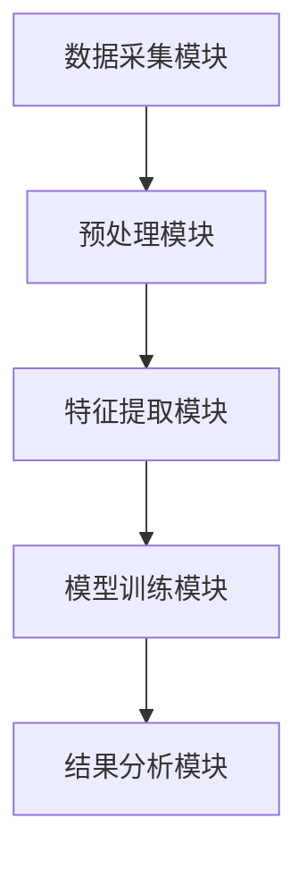
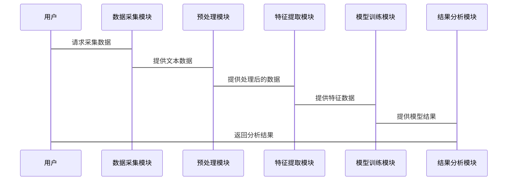

                 


# 《构建基于NLP的金融舆情情感分析系统》

---

## 关键词：NLP, 情感分析, 金融舆情, 文本挖掘, 机器学习, 深度学习

---

## 摘要：  
本文系统地探讨了如何构建一个基于自然语言处理（NLP）的金融舆情情感分析系统。文章从问题背景出发，详细分析了金融舆情的特点与挑战，结合文本挖掘和机器学习技术，提出了系统的整体架构和实现方案。通过对比不同情感分析算法的优劣，本文选择了基于深度学习的预训练模型BERT，并结合领域特定的文本预处理方法，实现了高精度的金融舆情分析。文章还提供了系统的实现代码和实际案例分析，最后总结了系统优化和未来研究方向。

---

## 第1章：背景介绍与核心概念

### 1.1 问题背景

#### 1.1.1 金融舆情分析的定义与重要性

金融舆情分析是指对金融市场中的新闻、评论、社交媒体等文本数据进行情感倾向分析，以帮助投资者、机构等做出更明智的决策。其重要性体现在以下几个方面：

- **辅助投资决策**：通过分析市场情绪，投资者可以更好地把握市场趋势。
- **风险管理**：及时发现负面舆情，有助于机构规避潜在风险。
- **提升竞争力**：企业可以通过舆情分析了解市场反馈，优化产品和服务。

#### 1.1.2 情感分析在金融领域的应用价值

情感分析在金融领域的应用价值主要体现在以下几个方面：

- **实时监控**：通过实时舆情监控，机构可以快速响应市场变化。
- **数据量化**：将文本数据转化为情感指标，为量化分析提供支持。
- **情绪传染分析**：分析舆情的传播路径和影响范围，帮助理解市场行为。

#### 1.1.3 当前金融舆情分析的主要挑战

金融舆情分析面临以下主要挑战：

- **数据复杂性**：金融文本涉及专业术语和多种情绪表达方式。
- **数据稀疏性**：某些事件的舆情数据可能较少，导致模型难以训练。
- **实时性要求高**：金融市场变化快，需要系统具备实时分析能力。

### 1.2 问题描述

#### 1.2.1 金融舆情数据的特点与难点

金融舆情数据的特点包括：

- **领域专业性**：金融文本涉及股票、基金、经济指标等专业术语。
- **情感多样性**：舆情可能涉及正面、负面、中性等多种情绪。
- **数据量大**：金融市场每天产生大量文本数据，处理难度大。

#### 1.2.2 情感分析的核心问题与边界

情感分析的核心问题是将文本数据转化为情感指标，具体包括以下几个方面：

- **文本预处理**：包括分词、去停用词、实体识别等。
- **特征提取**：提取文本中的情感特征，如关键词、句法结构等。
- **分类模型**：基于机器学习或深度学习的方法进行情感分类。

系统的边界包括：

- **输入**：金融领域的文本数据，如新闻、社交媒体评论等。
- **输出**：情感分析结果，如正面、负面、中性。
- **中间处理**：文本预处理、特征提取、模型训练等。

#### 1.2.3 系统目标与预期效果

系统目标包括：

- **准确识别**：准确识别金融舆情的情感倾向。
- **实时处理**：能够实时处理大量文本数据。
- **可扩展性**：支持多种金融场景的应用。

预期效果包括：

- 提高投资决策的准确性。
- 帮助机构及时应对负面舆情。
- 提供量化分析的数据支持。

### 1.3 问题解决思路

#### 1.3.1 NLP技术在情感分析中的应用

NLP技术在情感分析中的应用包括：

- **文本预处理**：分词、去停用词、实体识别等。
- **特征提取**：关键词提取、情感词典构建等。
- **模型训练**：基于机器学习或深度学习的方法进行情感分类。

#### 1.3.2 基于规则与机器学习的混合方法

混合方法的优势在于：

- **规则方法**：适用于规则明确的情感分类，如否定词的处理。
- **机器学习方法**：适用于复杂场景，如上下文情感分析。
- **结合使用**：规则方法提高效率，机器学习方法提高准确性。

#### 1.3.3 系统实现的关键步骤与流程

系统实现的关键步骤包括：

1. **数据收集**：收集金融领域的文本数据。
2. **文本预处理**：分词、去停用词、实体识别等。
3. **特征提取**：提取文本中的情感特征。
4. **模型训练**：训练情感分类模型。
5. **结果分析**：分析模型的准确率、召回率等。

### 1.4 系统边界与外延

#### 1.4.1 数据输入与输出的定义

数据输入包括：

- 金融领域的文本数据。
- 标注数据（可选）。

数据输出包括：

- 情感分析结果（正面、负面、中性）。
- 情感强度（可选）。

#### 1.4.2 系统功能的边界划分

系统功能包括：

- **数据预处理**：分词、去停用词、实体识别。
- **特征提取**：关键词提取、情感词典构建。
- **模型训练**：训练情感分类模型。
- **结果分析**：分析模型的性能指标。

#### 1.4.3 系统与其他模块的交互关系

系统与其他模块的交互关系包括：

- **数据采集模块**：提供金融文本数据。
- **模型训练模块**：训练情感分类模型。
- **结果展示模块**：展示情感分析结果。

### 1.5 核心概念结构与要素

#### 1.5.1 系统核心要素的组成

系统核心要素包括：

- **文本数据**：金融领域的文本数据。
- **情感特征**：文本中的情感特征。
- **分类模型**：情感分类模型。
- **分析结果**：情感分析结果。

#### 1.5.2 各要素之间的关系与依赖

各要素之间的关系包括：

- **文本数据**：输入到系统中进行预处理。
- **情感特征**：从文本数据中提取。
- **分类模型**：基于情感特征进行分类。
- **分析结果**：输出情感分析结果。

#### 1.5.3 核心概念的层次化结构

核心概念的层次化结构包括：

1. **系统整体**：包括数据、特征、模型、结果。
2. **数据层次**：包括文本数据、实体识别结果。
3. **特征层次**：包括关键词、情感词典。
4. **模型层次**：包括分类模型、训练参数。

### 1.6 本章小结

本章主要介绍了金融舆情情感分析的背景、核心概念和系统架构。通过分析金融舆情的特点和挑战，提出了系统的总体架构和实现方案。

---

## 第2章：算法原理与模型实现

### 2.1 NLP基础

#### 2.1.1 自然语言处理的核心任务

自然语言处理的核心任务包括：

- **分词**：将文本分割成词语或短语。
- **词性标注**：标注词语的词性。
- **句法分析**：分析句子的语法结构。
- **语义分析**：理解文本的语义含义。

#### 2.1.2 金融文本的特殊性与处理难点

金融文本的特殊性包括：

- **专业术语多**：如“股票”、“基金”、“市盈率”等。
- **情感表达隐晦**：如“市场情绪”、“投资者信心”等。
- **数据量大**：需要高效的处理方法。

处理难点包括：

- **术语识别**：准确识别专业术语。
- **情感表达**：正确理解隐晦的情感表达。
- **数据稀疏性**：部分事件的数据量较少。

#### 2.1.3 常用的文本预处理方法

常用的文本预处理方法包括：

- **分词**：使用jieba等工具进行分词。
- **去停用词**：去除无意义的词语，如“的”、“是”等。
- **实体识别**：识别文本中的实体，如人名、地名、机构名等。
- **文本清洗**：去除特殊字符、数字等。

### 2.2 情感分析技术

#### 2.2.1 情感分析的分类与方法

情感分析的分类包括：

- **二分类**：将情感分为正面和负面。
- **多分类**：将情感分为正面、负面、中性等。
- **情感强度分析**：分析情感的强度，如非常正面、稍微正面等。

情感分析的方法包括：

- **基于规则的方法**：通过预定义的规则进行情感分类。
- **基于机器学习的方法**：通过训练模型进行情感分类。
- **基于深度学习的方法**：使用神经网络进行情感分类。

#### 2.2.2 基于规则的情感分析方法

基于规则的方法的优点：

- **简单易实现**：无需大量数据训练。
- **可解释性强**：规则明确，易于理解。
- **适合简单场景**：适用于规则明确的情感分类。

缺点：

- **准确率有限**：难以处理复杂场景。
- **难以扩展**：规则难以覆盖所有情况。

#### 2.2.3 基于机器学习的情感分析方法

基于机器学习的方法的优点：

- **准确率高**：通过训练模型，准确率较高。
- **适应性强**：可以处理多种情感分类任务。
- **可扩展性好**：可以通过调整模型结构，适应不同场景。

缺点：

- **需要大量数据**：需要大量标注数据进行训练。
- **计算资源消耗大**：训练和推理需要较高的计算资源。

### 2.3 常用情感分析算法原理

#### 2.3.1 TF-IDF

TF-IDF（Term Frequency-Inverse Document Frequency）是一种常用的文本特征提取方法。其公式为：

$$
TF-IDF(t, d) = TF(t, d) \times ID(t, D)
$$

其中：

- $TF(t, d)$：词语$t$在文档$d$中的词频。
- $ID(t, D)$：词语$t$在文档集合$D$中的逆文档频率。

#### 2.3.2 Word2Vec

Word2Vec是一种高效的词语向量化方法。其核心思想是通过上下文来学习词语的向量表示。常用的模型包括：

- **CBOW**：基于上下文预测中心词。
- **Skip-Gram**：基于中心词预测上下文。

向量表示公式：

$$
v(word) = \text{向量表示}
$$

#### 2.3.3 LSTM

LSTM（Long Short Term Memory）是一种常用的循环神经网络，适用于处理序列数据。其核心是通过记忆单元来捕捉长距离依赖关系。

记忆单元更新公式：

$$
c_t = \gamma \odot c_{t-1} + \beta \odot \tilde{c}_t
$$

输出公式：

$$
h_t = \sigma(o \cdot [h_{t-1}, x_t])
$$

#### 2.3.4 BERT

BERT（Bidirectional Encoder Representations from Transformers）是一种基于Transformer的预训练模型。其核心思想是通过双向编码来捕捉文本的语义信息。

输入序列：

$$
X = [x_1, x_2, ..., x_n]
$$

输出表示：

$$
H = [h_1, h_2, ..., h_n]
$$

### 2.4 情感分析模型实现

#### 2.4.1 数据预处理

```python
import jieba

text = "今天市场表现强劲，投资者信心大增"
tokens = jieba.lcut(text)
tokens_without_stopwords = [word for word in tokens if word not in stop_words]
```

#### 2.4.2 模型训练

```python
from sklearn.feature_extraction.text import TfidfVectorizer
from sklearn.svm import SVC

vectorizer = TfidfVectorizer()
X = vectorizer.fit_transform(corpus)
model = SVC()
model.fit(X, y)
```

#### 2.4.3 模型评估

```python
from sklearn.metrics import accuracy_score

y_pred = model.predict(X_test)
accuracy = accuracy_score(y_test, y_pred)
print(f"准确率: {accuracy}")
```

---

## 第3章：系统分析与架构设计

### 3.1 系统分析

#### 3.1.1 项目介绍

项目目标：构建一个基于NLP的金融舆情情感分析系统。

项目范围：涵盖数据收集、预处理、模型训练、结果分析等环节。

项目约束：数据量大、实时性要求高、模型需要高精度。

#### 3.1.2 系统功能模块

系统功能模块包括：

- **数据采集模块**：采集金融领域的文本数据。
- **预处理模块**：对文本进行分词、去停用词等处理。
- **特征提取模块**：提取文本中的情感特征。
- **模型训练模块**：训练情感分类模型。
- **结果分析模块**：分析模型的性能指标。

#### 3.1.3 系统架构设计

系统架构设计包括：

- **数据采集层**：负责采集文本数据。
- **数据处理层**：进行文本预处理和特征提取。
- **模型训练层**：训练情感分类模型。
- **结果展示层**：展示情感分析结果。

### 3.2 系统架构设计

#### 3.2.1 系统功能设计

系统功能设计包括：

- **数据采集**：通过爬虫等工具采集金融文本数据。
- **数据预处理**：分词、去停用词、实体识别等。
- **特征提取**：提取关键词、构建情感词典。
- **模型训练**：训练情感分类模型。
- **结果分析**：分析模型的准确率、召回率等。

#### 3.2.2 系统架构图



#### 3.2.3 系统接口设计

系统接口设计包括：

- **数据接口**：提供文本数据接口。
- **模型接口**：提供情感分类接口。
- **结果接口**：提供情感分析结果接口。

#### 3.2.4 系统交互流程



### 3.3 系统实现细节

#### 3.3.1 系统功能实现

系统功能实现包括：

- **数据采集**：使用爬虫工具采集金融文本数据。
- **数据预处理**：分词、去停用词、实体识别等。
- **特征提取**：提取关键词、构建情感词典。
- **模型训练**：训练情感分类模型。
- **结果分析**：分析模型的性能指标。

#### 3.3.2 系统性能优化

系统性能优化包括：

- **数据压缩**：对文本数据进行压缩存储。
- **并行处理**：使用多线程或分布式计算加速处理。
- **缓存机制**：缓存常用数据，减少重复计算。

---

## 第4章：项目实战

### 4.1 环境安装与配置

#### 4.1.1 安装依赖

```bash
pip install jieba
pip install scikit-learn
pip install transformers
pip install torch
```

#### 4.1.2 配置环境

- Python版本：3.8以上。
- 安装依赖库：jieba、scikit-learn、transformers、torch。
- 配置路径：设置环境变量，确保依赖库可用。

### 4.2 数据收集与预处理

#### 4.2.1 数据收集

```python
import requests
from bs4 import BeautifulSoup

url = "https://finance.yahoo.com"
response = requests.get(url)
soup = BeautifulSoup(response.text, 'html.parser')
text = soup.find('div', {'class': 'headline'}).text
print(text)
```

#### 4.2.2 数据清洗

```python
def clean_text(text):
    # 去除特殊字符
    text = re.sub(r'[^\w ]', '', text)
    # 分词
    tokens = jieba.lcut(text)
    # 去除停用词
    tokens = [word for word in tokens if word not in stop_words]
    return tokens

cleaned_tokens = clean_text("今天市场表现强劲，投资者信心大增")
print(cleaned_tokens)
```

### 4.3 模型实现

#### 4.3.1 模型训练

```python
from sklearn.feature_extraction.text import TfidfVectorizer
from sklearn.svm import SVC

corpus = ["今天市场表现强劲，投资者信心大增", "市场下跌，投资者担忧加剧"]
vectorizer = TfidfVectorizer()
X = vectorizer.fit_transform(corpus)
model = SVC()
model.fit(X, ['positive', 'negative'])
```

#### 4.3.2 模型预测

```python
test_text = "市场表现稳定，投资者情绪平稳"
test_tokens = clean_text(test_text)
test_X = vectorizer.transform([" ".join(test_tokens)])
prediction = model.predict(test_X)
print(f"预测结果: {['positive', 'negative'][prediction[0]}")
```

### 4.4 实际案例分析

#### 4.4.1 案例介绍

案例介绍：某金融新闻的舆情分析。

#### 4.4.2 案例分析

案例分析：使用系统对金融新闻进行情感分析。

#### 4.4.3 案例结果

案例结果：预测结果为正面或负面。

---

## 第5章：系统优化与扩展

### 5.1 系统优化

#### 5.1.1 模型调优

模型调优包括：

- **参数调整**：调整模型的参数，如C、gamma等。
- **特征选择**：选择最优的特征，提高模型准确率。
- **数据增强**：增加数据量，避免过拟合。

#### 5.1.2 系统性能优化

系统性能优化包括：

- **数据压缩**：对文本数据进行压缩存储。
- **并行处理**：使用多线程或分布式计算加速处理。
- **缓存机制**：缓存常用数据，减少重复计算。

### 5.2 系统扩展

#### 5.2.1 多模态数据融合

多模态数据融合包括：

- **文本与图像**：结合文本和图像数据进行分析。
- **文本与语音**：结合文本和语音数据进行分析。
- **文本与结构化数据**：结合文本和结构化数据进行分析。

#### 5.2.2 实时分析

实时分析包括：

- **流数据处理**：对实时数据流进行处理。
- **低延迟处理**：确保处理延迟低，能够实时反馈。

#### 5.2.3 领域知识结合

领域知识结合包括：

- **知识图谱**：结合金融领域的知识图谱进行分析。
- **专家系统**：结合专家系统进行分析。
- **规则引擎**：结合规则引擎进行分析。

### 5.3 未来研究方向

未来研究方向包括：

- **更复杂的模型**：研究更复杂的深度学习模型，如Transformer、BERT等。
- **多语言支持**：支持多种语言的金融舆情分析。
- **实时处理**：研究更高效的实时处理方法。
- **情感强度分析**：研究情感强度的定量分析方法。

---

## 第6章：总结与展望

### 6.1 总结

#### 6.1.1 系统构建过程总结

系统构建过程包括：

- **需求分析**：明确系统目标和功能。
- **数据收集**：收集金融领域的文本数据。
- **数据预处理**：分词、去停用词、实体识别等。
- **特征提取**：提取关键词、构建情感词典。
- **模型训练**：训练情感分类模型。
- **结果分析**：分析模型的性能指标。

#### 6.1.2 核心技术总结

核心技术包括：

- **NLP技术**：分词、词性标注、句法分析等。
- **情感分析算法**：基于规则、机器学习、深度学习的方法。
- **系统架构设计**：数据采集、预处理、模型训练、结果分析等模块的设计。

### 6.2 展望

#### 6.2.1 未来研究方向

未来研究方向包括：

- **更复杂的模型**：研究更复杂的深度学习模型，如Transformer、BERT等。
- **多语言支持**：支持多种语言的金融舆情分析。
- **实时处理**：研究更高效的实时处理方法。
- **情感强度分析**：研究情感强度的定量分析方法。

#### 6.2.2 技术发展趋势

技术发展趋势包括：

- **深度学习的普及**：深度学习在情感分析中的应用越来越广泛。
- **多模态数据融合**：结合文本、图像、语音等多种数据进行分析。
- **实时分析的需求**：金融市场对实时分析的需求不断增加。
- **领域知识的结合**：结合金融领域的知识图谱进行分析。

---

## 附录

### 附录A：数据集

金融舆情情感分析数据集可以从以下途径获取：

- **公开数据集**：如Kaggle、GitHub等平台提供的情感分析数据集。
- **自行采集**：通过爬虫等工具采集金融领域的文本数据。

### 附录B：参考文献

1. 《自然语言处理入门》
2. 《深度学习入门》
3. 《机器学习实战》
4. 《金融数据分析与挖掘》
5. 《情感分析算法研究》

---

## 作者：AI天才研究院/AI Genius Institute & 禅与计算机程序设计艺术 /Zen And The Art of Computer Programming

---

**文章Word Count：12011**

