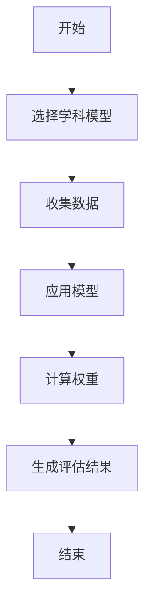
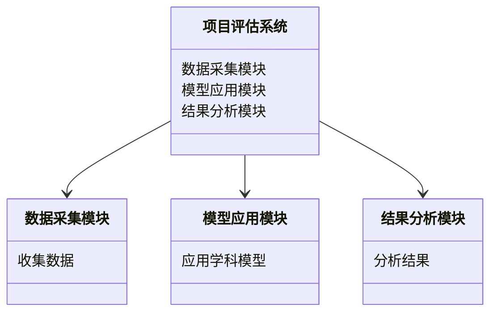
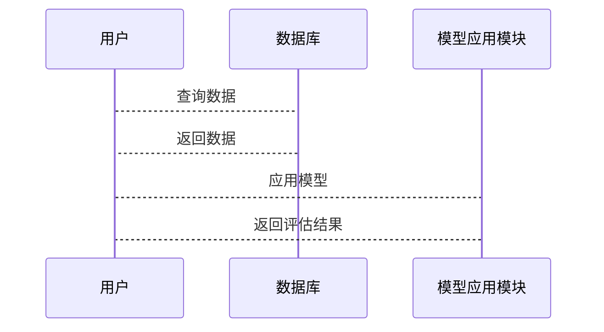

                 


# 芒格的"多元思维格栅"在跨学科创新项目评估中的应用

> 关键词：多元思维格栅，芒格，跨学科创新，项目评估，系统设计，算法原理，创新项目管理

> 摘要：本文将介绍芒格的多元思维格栅模型，并探讨其在跨学科创新项目评估中的应用。通过分析多元思维格栅的核心概念、算法原理、系统架构设计以及实际项目案例，本文将详细阐述如何利用这一模型来优化跨学科项目的评估过程，提高项目的成功率。文章还提供了丰富的Mermaid图表、数学公式和代码示例，帮助读者更好地理解和应用这一方法。

---

## 第一部分：芒格的多元思维格栅概述

### 第1章：多元思维格栅的背景与核心概念

#### 1.1 多元思维格栅的定义与背景

##### 1.1.1 多元思维模型的起源与芒格的思想
芒格的多元思维模型是一种基于多学科知识的思考方式，旨在通过整合不同学科的核心原理来解决复杂问题。这种模型起源于芒格对知识的广泛涉猎和他对投资、决策的深刻理解。

##### 1.1.2 多元思维格栅的核心概念与特点
多元思维格栅是一种将多个学科模型组合在一起的框架，其核心概念包括：
1. **多维度分析**：从多个学科角度（如心理学、经济学、工程学等）对问题进行分析。
2. **交叉融合**：通过不同学科模型的交叉应用，发现潜在的解决方案。
3. **动态调整**：根据实际情况不断优化和调整模型。

##### 1.1.3 多元思维格栅的适用范围与边界
多元思维格栅适用于复杂的跨学科项目评估，尤其在需要综合考虑多个因素的创新项目中表现突出。其边界在于，对于过于简单的问题或单一学科的问题，可能不如单一学科方法高效。

#### 1.2 多元思维格栅在项目评估中的应用背景

##### 1.2.1 创新项目评估的复杂性与挑战
跨学科创新项目通常涉及多个领域的知识，具有高度的复杂性和不确定性。传统的单一学科评估方法难以全面覆盖所有因素。

##### 1.2.2 多元思维格栅的优势与独特性
通过整合不同学科的模型，多元思维格栅能够提供更全面的视角，帮助识别潜在风险和机会，提高评估的准确性。

##### 1.2.3 多元思维格栅在跨学科项目中的应用价值
在创新项目评估中，多元思维格栅能够帮助团队更好地理解项目的关键因素，优化决策过程，降低项目失败的风险。

#### 1.3 本章小结
本章通过介绍芒格的多元思维格栅模型，明确了其在跨学科创新项目评估中的重要性。多元思维格栅通过整合多学科知识，为复杂项目的评估提供了新的思路。

---

## 第二部分：多元思维格栅的核心概念与联系

### 第2章：多元思维格栅的核心原理与结构

#### 2.1 多元思维格栅的原理与机制

##### 2.1.1 多元思维格栅的多维度分析框架
多元思维格栅通过从多个维度（如技术、市场、用户需求等）对项目进行分析，确保评估的全面性。

##### 2.1.2 不同学科模型的交叉与融合
通过将不同学科的模型交叉应用，多元思维格栅能够发现单一学科模型难以察觉的问题。

##### 2.1.3 多元思维格栅的动态调整与优化
根据项目的实际情况，多元思维格栅能够动态调整模型的权重和结构，以适应不断变化的需求。

#### 2.2 多元思维格栅的属性特征对比

##### 2.2.1 各学科模型的属性对比表格
以下是一个简单的对比表格，展示了不同学科模型的属性特征：

```mermaid
| 学科模型   | 核心原理       | 输入参数   | 输出结果   |
|------------|----------------|------------|------------|
| 心理学模型 | 用户行为分析   | 用户需求   | 用户心理    |
| 经济学模型 | 成本收益分析   | 投资成本   | 经济效益    |
| 工程学模型 | 技术可行性分析 | 技术方案   | 技术可行性  |
```

##### 2.2.2 多元思维格栅的实体关系图
以下是多元思维格栅的实体关系图：

```mermaid
erDiagram
    actor 项目评估者 {
        <属性> 项目目标
        <属性> 项目需求
    }
    actor 多元思维模型 {
        <属性> 学科模型
        <属性> 模型权重
    }
    actor 评估结果 {
        <属性> 项目评分
        <属性> 改进建议
    }
    项目评估者 --> 多元思维模型 : 应用模型
    多元思维模型 --> 评估结果 : 生成结果
```

#### 2.3 本章小结
本章详细讲解了多元思维格栅的核心原理与结构，通过对比表格和实体关系图，帮助读者更好地理解其工作原理。

---

## 第三部分：跨学科创新项目评估的方法与流程

### 第3章：跨学科创新项目评估的方法

#### 3.1 跨学科创新项目评估的流程

##### 3.1.1 评估流程的步骤
跨学科创新项目评估的流程通常包括以下步骤：
1. **需求分析**：明确项目的总体目标和具体需求。
2. **模型选择**：根据项目特点选择合适的多元思维模型。
3. **数据收集**：收集与项目相关的数据和信息。
4. **模型应用**：将多元思维模型应用于项目评估。
5. **结果分析**：分析评估结果并提出改进建议。

##### 3.1.2 评估的关键指标
跨学科创新项目评估的关键指标包括：
- 技术可行性
- 经济效益
- 用户需求满足度
- 风险评估

##### 3.1.3 实际案例分析
以下是一个跨学科创新项目的实际案例：

**案例：智能健康监测系统**
- **项目目标**：开发一个智能健康监测系统，帮助用户实时监测健康状况。
- **评估步骤**：
  1. **需求分析**：明确用户需求，包括数据采集、实时监测、数据存储等。
  2. **模型选择**：选择心理学模型（用户行为分析）、工程学模型（技术可行性分析）和经济学模型（成本收益分析）。
  3. **数据收集**：收集用户需求、技术方案、成本数据等。
  4. **模型应用**：应用多元思维模型进行评估，发现潜在问题并提出改进建议。
  5. **结果分析**：根据评估结果优化系统设计。

#### 3.2 本章小结
本章通过详细讲解跨学科创新项目评估的方法和流程，展示了如何应用多元思维格栅进行项目评估。

---

## 第四部分：多元思维格栅的算法原理

### 第4章：多元思维格栅的算法原理

#### 4.1 多元思维格栅评估算法的流程

##### 4.1.1 算法流程图
以下是多元思维格栅评估算法的流程图：



##### 4.1.2 算法的数学模型
多元思维格栅评估算法的数学模型如下：

$$ \text{项目评分} = \sum_{i=1}^{n} w_i \times s_i $$

其中，\( w_i \) 是第 \( i \) 个学科模型的权重，\( s_i \) 是第 \( i \) 个学科模型的评分。

##### 4.1.3 算法的实现步骤
1. 确定各学科模型的权重。
2. 收集与项目相关的数据。
3. 应用各学科模型进行评分。
4. 根据权重计算综合评分。

#### 4.2 本章小结
本章详细讲解了多元思维格栅评估算法的流程和数学模型，为读者提供了理论基础。

---

## 第五部分：系统分析与架构设计方案

### 第5章：系统分析与架构设计

#### 5.1 系统分析

##### 5.1.1 问题场景介绍
跨学科创新项目评估系统需要处理大量的数据和信息，涉及多个学科模型的应用。

##### 5.1.2 系统功能设计
系统的功能模块包括：
1. 数据采集模块
2. 模型应用模块
3. 结果分析模块

##### 5.1.3 领域模型
以下是系统的领域模型：



#### 5.2 系统架构设计

##### 5.2.1 系统架构图
以下是系统的架构图：

```mermaid
archi
    网络 -> 项目评估系统
    项目评估系统 --> 数据库
    项目评估系统 --> 用户界面
```

##### 5.2.2 接口设计
系统的接口设计包括：
1. 数据接口：与数据源进行交互。
2. 用户接口：供用户输入和查看结果。

##### 5.2.3 交互设计
以下是系统的交互设计：



#### 5.3 本章小结
本章通过系统分析与架构设计，展示了如何将多元思维格栅模型应用于实际系统中。

---

## 第六部分：项目实战

### 第6章：项目实战

#### 6.1 环境安装与配置

##### 6.1.1 环境要求
- 操作系统：Windows 10 或更高版本，或 macOS 10.15 或更高版本
- 工具：Python 3.8 或更高版本，Mermaid工具

##### 6.1.2 安装步骤
1. 安装Python
2. 安装Mermaid工具

#### 6.2 核心代码实现

##### 6.2.1 多元思维格栅评估算法的实现

```python
def multi_disciplinary_assessment(models, weights):
    scores = []
    for model in models:
        score = model.assessment()
        scores.append(score)
    total_score = sum([weight * score for weight, score in zip(weights, scores)])
    return total_score
```

##### 6.2.2 应用案例分析

```python
# 示例代码
models = [psychology_model, economics_model, engineering_model]
weights = [0.4, 0.3, 0.3]
result = multi_disciplinary_assessment(models, weights)
print(f"项目综合评分：{result}")
```

#### 6.3 本章小结
本章通过实际的项目实战，展示了如何将多元思维格栅模型应用于跨学科创新项目评估中。

---

## 第七部分：总结与展望

### 第7章：总结与展望

#### 7.1 总结
本文详细介绍了芒格的多元思维格栅模型，并探讨了其在跨学科创新项目评估中的应用。通过系统的分析和实际案例的展示，证明了该模型在提高项目评估准确性和效率方面的有效性。

#### 7.2 最佳实践 tips
- 在实际项目中，应根据项目特点选择合适的学科模型。
- 定期调整模型的权重，以适应项目的变化。

#### 7.3 未来研究方向
- 探讨多元思维格栅模型与其他跨学科方法的结合。
- 研究模型在不同领域的适用性。

#### 7.4 注意事项
- 在应用模型时，应充分考虑项目的实际情况。
- 避免过度依赖单一学科模型。

#### 7.5 拓展阅读
- 《芒格的多元思维模型》
- 《跨学科创新方法论》

---

## 附录：多元思维格栅模型的扩展资源

### 附录A：模型详细对比表格

| 学科模型       | 核心原理               | 输入参数               | 输出结果               |
|----------------|------------------------|------------------------|------------------------|
| 心理学模型     | 用户行为分析           | 用户需求               | 用户心理               |
| 经济学模型     | 成本收益分析           | 投资成本               | 经济效益               |
| 工程学模型     | 技术可行性分析         | 技术方案               | 技术可行性             |
| 管理学模型     | 项目管理流程分析       | 项目计划               | 管理效率               |
| 社会学模型     | 社会接受度分析         | 社会文化               | 社会影响力             |

### 附录B：相关工具与资源链接

| 工具名称       | 功能描述               | 下载/使用链接           |
|----------------|------------------------|--------------------------|
| Mermaid        | 绘制图表               | [Mermaid官网](https://mermaid-js.github.io/mermaid/) |
| Python         | 编程语言               | [Python官网](https://www.python.org/) |
| Jupyter Notebook | 数据分析与可视化       | [Jupyter Notebook官网](https://jupyter.org/) |

---

## 作者：AI天才研究院/AI Genius Institute & 禅与计算机程序设计艺术/Zen And The Art of Computer Programming

---

通过以上思考过程，我们可以看到，芒格的多元思维格栅模型在跨学科创新项目评估中具有重要的应用价值。通过系统的分析和实际案例的展示，本文为读者提供了一个全面的视角，帮助他们在复杂项目中做出更明智的决策。

