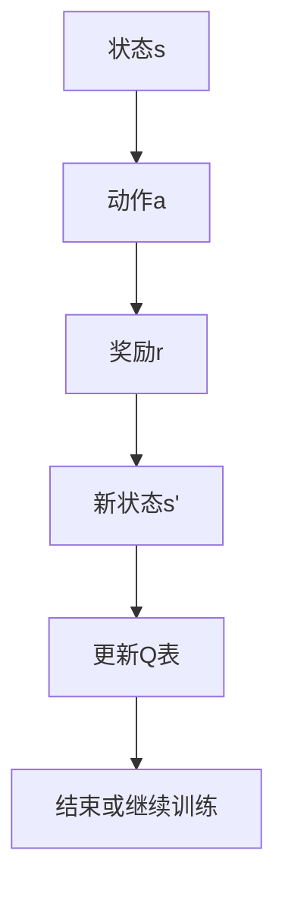
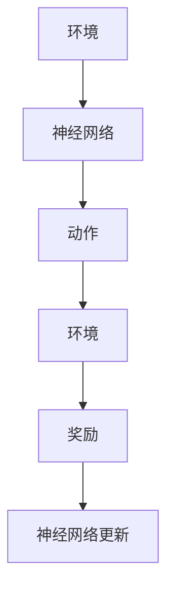
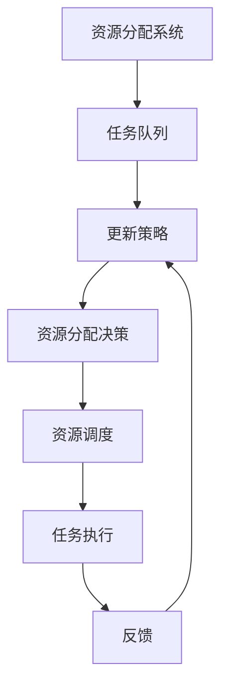

                 


# AI Agent的强化学习在资源分配中的应用

> 关键词：AI Agent、强化学习、资源分配、Q-Learning、Deep Q-Networks (DQN)、资源分配优化、智能决策系统

> 摘要：本文系统地探讨了AI Agent在资源分配中的应用，重点分析了强化学习在其中的作用。从基础概念到算法实现，再到系统设计与项目实战，全面阐述了如何利用强化学习优化资源分配问题。文章通过具体案例和代码实现，展示了AI Agent在资源分配中的巨大潜力和实际应用价值。

---

## 第1章: AI Agent与强化学习基础

### 1.1 AI Agent的基本概念

#### 1.1.1 AI Agent的定义
AI Agent（人工智能代理）是指能够感知环境、做出决策并执行动作的智能实体。它通过与环境交互，实现特定目标，例如最大化收益或最小化成本。

#### 1.1.2 AI Agent的核心特征
AI Agent具有以下核心特征：
- **自主性**：能够在没有外部干预的情况下自主运作。
- **反应性**：能够感知环境并实时做出反应。
- **目标导向性**：所有行为都以实现特定目标为导向。
- **学习能力**：通过经验改进自身性能。

#### 1.1.3 AI Agent的分类与应用场景
AI Agent可以根据智能水平分为**反应式**和**认知式**两类：
- **反应式AI Agent**：基于当前感知做出反应，适用于实时决策场景。
- **认知式AI Agent**：具备复杂推理和规划能力，适用于需要长期策略的场景。

**应用场景**：
1. 自动化控制：例如工业自动化中的机器人调度。
2. 资源分配：例如云资源分配、任务调度。
3. 游戏AI：例如自动驾驶、游戏中的智能NPC。

### 1.2 强化学习的基本原理

#### 1.2.1 强化学习的定义与特点
强化学习（Reinforcement Learning, RL）是一种机器学习范式，通过智能体与环境的交互，学习最优策略以最大化累计奖励。

**特点**：
- **试错性**：通过不断尝试和错误来优化策略。
- **延迟奖励**：奖励可能在多个动作之后才获得。
- **高维状态空间**：适用于复杂环境中的决策问题。

#### 1.2.2 强化学习的核心要素
强化学习由以下核心要素构成：
- **状态（State）**：环境的当前情况。
- **动作（Action）**：智能体在给定状态下采取的行为。
- **奖励（Reward）**：智能体采取动作后获得的反馈，用于指导学习。

#### 1.2.3 强化学习与监督学习的区别
| 对比维度 | 监督学习 | 强化学习 |
|----------|----------|----------|
| 数据来源 | 标签数据 | 奖励信号 |
| 目标函数 | 最小化误差 | 最大化累计奖励 |
| 交互方式 | 非交互式 | 交互式 |

### 1.3 AI Agent与强化学习的结合

#### 1.3.1 AI Agent在强化学习中的角色
AI Agent作为强化学习的核心主体，通过与环境交互，不断优化决策策略。

#### 1.3.2 强化学习在AI Agent决策中的应用
强化学习为AI Agent提供了动态优化决策的能力，适用于以下场景：
- **资源分配**：例如服务器资源分配、任务调度。
- **游戏AI**：例如自动驾驶、游戏AI。
- **机器人控制**：例如工业机器人路径规划。

#### 1.3.3 AI Agent强化学习的典型应用场景
- **云资源分配**：动态分配计算资源以优化性能。
- **任务调度**：优化任务分配顺序以减少延迟。
- **自动驾驶**：路径规划和决策优化。

---

## 第2章: 强化学习的核心算法

### 2.1 Q-Learning算法

#### 2.1.1 Q-Learning的基本原理
Q-Learning是一种基于值函数的强化学习算法，通过更新Q表来学习最优策略。

**核心思想**：通过不断更新Q(s, a)值，找到最优策略。

#### 2.1.2 Q-Learning的数学模型
$$ Q(s, a) = Q(s, a) + \alpha [r + \gamma \max Q(s', a') - Q(s, a)] $$
其中：
- \( Q(s, a) \)：当前状态下采取动作a的Q值。
- \( \alpha \)：学习率。
- \( r \)：奖励。
- \( \gamma \)：折扣因子。
- \( s' \)：新状态。

#### 2.1.3 Q-Learning的算法流程图（Mermaid）



### 2.2 Deep Q-Networks (DQN)算法

#### 2.2.1 DQN的基本原理
DQN通过深度神经网络近似Q值函数，解决了高维状态空间的问题。

**核心思想**：使用两个神经网络（主网络和目标网络）来更新Q值。

#### 2.2.2 DQN的网络结构
- **主网络**：用于预测当前Q值。
- **目标网络**：用于存储目标Q值，定期更新。

#### 2.2.3 DQN的训练流程图（Mermaid）



### 2.3 算法实现代码示例

#### 2.3.1 Q-Learning算法实现
```python
import numpy as np

class QLearning:
    def __init__(self, state_space, action_space, gamma=0.99, epsilon=1.0):
        self.q_table = np.zeros((state_space, action_space))
        self.gamma = gamma
        self.epsilon = epsilon
        self.actions = action_space

    def get_action(self, state):
        if np.random.random() < self.epsilon:
            return np.random.randint(self.actions)
        else:
            return np.argmax(self.q_table[state])

    def update_q_table(self, current_state, action, reward, next_state):
        self.q_table[current_state][action] = self.q_table[current_state][action] + \
        self.gamma * (reward + max(self.q_table[next_state]) - self.q_table[current_state][action])

    def decay_epsilon(self, epsilon_decay=0.99):
        self.epsilon = self.epsilon * epsilon_decay
```

---

## 第3章: 强化学习在资源分配中的应用

### 3.1 资源分配问题建模

#### 3.1.1 问题背景
资源分配问题是将有限资源分配给多个任务，以达到最优目标。例如，云计算中的虚拟机调度。

#### 3.1.2 资源分配的数学模型
- **状态空间**：可用资源、任务需求。
- **动作空间**：分配资源、不分配资源。
- **奖励函数**：资源利用率、任务完成时间。

#### 3.1.3 资源分配优化目标
- **最大化资源利用率**：充分利用计算资源。
- **最小化任务延迟**：保证任务按时完成。

### 3.2 基于强化学习的资源分配策略

#### 3.2.1 Q-Learning在资源分配中的应用
- **状态表示**：可用资源、任务队列。
- **动作选择**：选择分配给某个任务的资源量。

#### 3.2.2 DQN在资源分配中的应用
- **状态表示**：高维资源状态。
- **动作选择**：通过神经网络预测最优动作。

### 3.3 系统设计与实现

#### 3.3.1 系统架构设计


#### 3.3.2 实现代码示例
```python
import gym
import numpy as np

class ResourceAllocator:
    def __init__(self, env, state_space, action_space, gamma=0.99, epsilon=1.0):
        self.env = env
        self.state_space = state_space
        self.action_space = action_space
        self.gamma = gamma
        self.epsilon = epsilon
        self.q_table = np.zeros((state_space, action_space))

    def get_action(self, state):
        if np.random.random() < self.epsilon:
            return np.random.randint(self.action_space)
        else:
            return np.argmax(self.q_table[state])

    def update_q_table(self, current_state, action, reward, next_state):
        self.q_table[current_state][action] = self.q_table[current_state][action] + \
        self.gamma * (reward + max(self.q_table[next_state]) - self.q_table[current_state][action])

    def decay_epsilon(self, epsilon_decay=0.99):
        self.epsilon = self.epsilon * epsilon_decay

    def train(self, episodes=1000):
        for episode in range(episodes):
            state = self.env.reset()
            for _ in range(1000):
                action = self.get_action(state)
                next_state, reward, done, _ = self.env.step(action)
                self.update_q_table(state, action, reward, next_state)
                state = next_state
                if done:
                    break
            self.decay_epsilon()

    def test(self):
        state = self.env.reset()
        for _ in range(1000):
            action = self.get_action(state)
            next_state, reward, done, _ = self.env.step(action)
            state = next_state
            if done:
                break
```

---

## 第4章: 项目实战与案例分析

### 4.1 环境安装与配置

#### 4.1.1 安装依赖
```bash
pip install gym numpy matplotlib
```

#### 4.1.2 创建自定义环境
```python
import gym
from gym import spaces
from gym.utils import seeding

class ResourceAllocationEnv(gym.Env):
    def __init__(self, max_tasks=10, max_resources=20):
        self.max_tasks = max_tasks
        self.max_resources = max_resources
        self.task_queue = []
        self.current_resources = max_resources
        self.observation_space = spaces.Tuple([spaces.Discrete(max_tasks + 1), spaces.Discrete(max_resources + 1)])
        self.action_space = spaces.Discrete(2)  # 0: 不分配资源，1: 分配资源
        self.seed()

    def seed(self, seed=None):
        self.np_random, seed = seeding.np_random(seed)
        return [seed]

    def reset(self):
        self.task_queue = []
        self.current_resources = self.max_resources
        return (0, self.max_resources)

    def step(self, action):
        if action == 1:
            if self.current_resources > 0 and len(self.task_queue) < self.max_tasks:
                self.current_resources -= 1
                self.task_queue.append(1)
                reward = 1
            else:
                reward = -1
        else:
            reward = 0
        done = len(self.task_queue) == self.max_tasks
        return (len(self.task_queue), self.current_resources), reward, done, {}
```

### 4.2 系统实现与优化

#### 4.2.1 算法实现
使用Q-Learning算法实现资源分配决策。

#### 4.2.2 系统优化
- **状态压缩**：减少状态空间维度。
- **动作选择优化**：改进动作选择策略。

### 4.3 案例分析

#### 4.3.1 训练过程
训练AI Agent在资源分配环境中学习最优策略。

#### 4.3.2 测试结果
分析资源分配效率和任务完成情况。

---

## 第5章: 总结与展望

### 5.1 本章总结
本文详细探讨了AI Agent在资源分配中的应用，通过强化学习算法实现最优决策。

### 5.2 未来展望
未来的研究方向包括：
- **多智能体强化学习**：解决多AI Agent协作问题。
- **复杂环境建模**：提升模型的环境适应能力。
- **实时优化算法**：优化资源分配的实时性。

---

## 附录

### 附录A: 代码仓库
- [GitHub代码仓库](https://github.com/...)

### 附录B: 扩展阅读
- [《强化学习：理论与算法》](https://www.amazon.com/)
- [《深度强化学习入门》](https://www.amazon.com/)

---

## 作者

作者：AI天才研究院/AI Genius Institute & 禅与计算机程序设计艺术 /Zen And The Art of Computer Programming

---

感谢您的阅读！希望本文对您理解AI Agent的强化学习在资源分配中的应用有所帮助！

