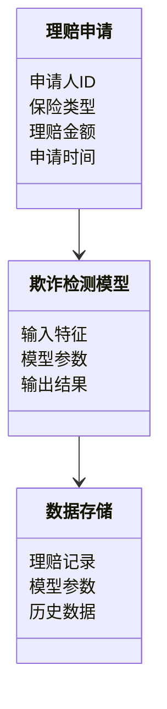
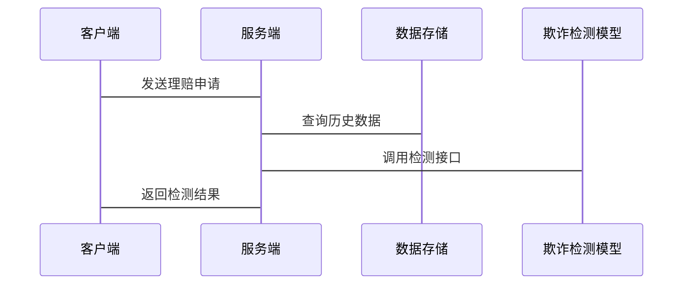

                 


# AI在保险理赔欺诈模式演化检测中的创新应用

## 关键词：保险欺诈检测，AI技术，模式演化，机器学习，深度学习

## 摘要：
保险欺诈是保险行业面临的重大挑战之一。随着技术的发展，欺诈手段也在不断进化，传统的欺诈检测方法难以应对复杂的欺诈模式。本文将探讨如何利用人工智能（AI）技术，特别是机器学习和深度学习，来检测和识别保险理赔中的欺诈模式的演化。文章将从保险行业的背景、欺诈模式的演化、AI技术的基本原理、算法实现、系统架构设计、项目实战和最佳实践等多个方面进行详细分析。通过结合实际案例和具体技术实现，本文将展示AI在保险欺诈检测中的创新应用和实际价值。

---

# 第1章: 保险理赔欺诈模式的背景与问题

## 1.1 保险行业的现状与挑战

### 1.1.1 保险行业的基本概念与运作模式
保险行业是金融行业的重要组成部分，通过承保风险和提供赔偿来保护个人和企业的财务安全。保险的运作模式主要包括承保、理赔和再保险三大环节。承保是保险公司接收客户投保并评估风险的过程，理赔是根据保险合同条款审核和支付赔款的过程。

### 1.1.2 保险理赔的核心流程与关键环节
保险理赔的核心流程包括报案、立案、审核、调查、赔付和归档等环节。其中，审核和调查环节是防止欺诈的关键点。审核人员需要分析理赔申请的合理性，调查人员需要核实是否存在虚构损失或其他欺诈行为。

### 1.1.3 保险欺诈的现状与经济损失
保险欺诈是指通过故意制造或夸大保险事故，以骗取保险赔偿的行为。近年来，随着保险市场的扩大，欺诈手段日益复杂化和多样化，给保险公司带来了巨大的经济损失。根据行业统计，保险欺诈的涉案金额每年高达数十亿美元。

## 1.2 保险欺诈的模式与特征

### 1.2.1 保险欺诈的主要类型
保险欺诈主要分为以下几种类型：
1. **故意制造事故**：投保人故意制造保险事故，如纵火、人为制造交通事故等。
2. **夸大损失**：投保人在事故发生后，夸大损失程度，以获取更多的赔偿。
3. **虚构保险事故**：投保人编造不存在的保险事故，如伪造医疗记录或虚构意外事件。
4. **重复理赔**：同一保险事故被多次理赔，以获取更多的赔偿。

### 1.2.2 各类保险欺诈的特征与行为模式
不同类型的保险欺诈具有不同的特征：
- **故意制造事故**：投保人通常会在保险生效后不久制造事故，且事故的时间和地点往往较为可疑。
- **夸大损失**：投保人提交的理赔金额与实际损失不符，且缺乏合理的解释。
- **虚构保险事故**：投保人提供的证据（如医疗记录、事故报告等）存在明显矛盾或不一致。

### 1.2.3 保险欺诈的演化趋势与复杂性
随着保险公司对传统欺诈手段的防范能力不断提高，欺诈行为也在不断进化。近年来，欺诈手段呈现出以下几个趋势：
- **技术化**：利用高科技手段（如伪造电子证据）进行欺诈。
- **隐蔽化**：欺诈行为更加隐蔽，难以通过传统手段发现。
- **团伙化**：欺诈行为逐渐从个体行为转向团伙作案，分工更加明确。

## 1.3 AI技术在保险欺诈检测中的应用前景

### 1.3.1 AI技术的基本概念与优势
人工智能（AI）技术是一种模拟人类智能的技术，包括机器学习、自然语言处理、计算机视觉等分支。AI技术在保险欺诈检测中的优势在于其强大的数据处理能力和模式识别能力。

### 1.3.2 AI技术在保险行业中的潜在应用场景
AI技术可以广泛应用于保险行业的多个领域，包括风险评估、理赔审核、欺诈检测等。特别是在欺诈检测方面，AI技术可以通过分析大量的历史数据，发现隐藏的欺诈模式。

### 1.3.3 保险欺诈检测中的AI创新与突破
近年来，AI技术在保险欺诈检测中的应用取得了显著突破。例如，基于深度学习的自然语言处理技术可以识别欺诈文本中的关键词和语义关系；基于无监督学习的聚类算法可以发现隐藏的欺诈群体。

## 1.4 本章小结
本章从保险行业的背景出发，分析了保险欺诈的主要类型和特征，探讨了保险欺诈的演化趋势，并介绍了AI技术在保险欺诈检测中的应用前景。通过本章的分析，我们可以看到，AI技术为保险行业解决欺诈问题提供了新的思路和工具。

---

# 第2章: 保险欺诈模式的演化与检测

## 2.1 保险欺诈模式的演化机制

### 2.1.1 欺诈模式的动态变化特征
欺诈模式的动态变化主要体现在以下两个方面：
1. **时间维度**：欺诈行为随着时间推移不断进化，新的欺诈手段层出不穷。
2. **空间维度**：不同地区、不同保险类型中的欺诈模式存在差异。

### 2.1.2 欺诈行为的演化驱动因素
欺诈行为的演化受到多种因素的驱动，包括技术进步、法律法规变化、社会经济环境等。例如，随着区块链技术的普及，欺诈者可能会利用区块链技术伪造保险记录。

### 2.1.3 模式演化对传统检测方法的挑战
传统的欺诈检测方法通常基于固定的规则和模式，难以应对欺诈模式的动态变化。例如，基于规则的欺诈检测系统只能识别已知的欺诈模式，而对新的欺诈手段往往无能为力。

## 2.2 欺诈模式的检测与识别

### 2.2.1 基于传统规则的欺诈检测方法
基于传统规则的欺诈检测方法主要依赖于预先设定的规则和阈值。例如，系统可能会设置一个理赔金额的阈值，超过该阈值的理赔申请将被标记为可疑。

### 2.2.2 传统方法的局限性与改进方向
传统方法的局限性主要体现在以下两个方面：
1. **规则的静态性**：传统规则无法应对欺诈模式的动态变化。
2. **计算效率**：随着数据量的增加，基于规则的检测方法的计算效率逐渐下降。

### 2.2.3 基于AI的模式识别新思路
基于AI的模式识别方法通过分析大量的历史数据，识别出隐藏的欺诈模式。例如，机器学习算法可以通过分析理赔申请的特征，自动识别潜在的欺诈行为。

## 2.3 模式演化检测中的关键问题

### 2.3.1 数据的动态变化对检测模型的影响
欺诈模式的动态变化对检测模型的影响主要体现在以下几个方面：
1. **模型失效**：随着时间推移，原有的模型可能会失效，无法识别新的欺诈模式。
2. **数据稀疏性**：新的欺诈模式可能在数据中占比较小，导致模型难以有效识别。

### 2.3.2 模型的可解释性与实时性要求
在保险欺诈检测中，模型的可解释性和实时性是两个重要的要求。可解释性是指模型能够清晰地解释其决策过程，以便保险公司能够理解并信任模型的判断。实时性是指模型能够快速处理实时数据，及时发现潜在的欺诈行为。

### 2.3.3 数据隐私与安全问题
在利用AI技术进行欺诈检测的过程中，数据隐私与安全问题也是一个不可忽视的挑战。保险公司需要处理大量的敏感数据，如客户的个人信息、医疗记录等，这些数据的泄露可能对客户造成重大损失。

## 2.4 本章小结
本章分析了保险欺诈模式的演化机制，探讨了传统检测方法的局限性，并介绍了基于AI的模式识别新思路。同时，本章还讨论了模式演化检测中的关键问题，包括数据动态变化对模型的影响、模型的可解释性与实时性要求以及数据隐私与安全问题。

---

# 第3章: AI技术在保险欺诈检测中的核心概念

## 3.1 AI技术的基本原理

### 3.1.1 机器学习与深度学习的定义与区别
机器学习是一种通过数据训练模型的技术，模型可以通过学习数据中的模式和特征，做出预测或决策。深度学习是机器学习的一个分支，主要依赖于神经网络模型，具有更强的特征提取能力。

### 3.1.2 监督学习、无监督学习与强化学习的适用场景
- **监督学习**：适用于有标签数据的情况，如分类和回归问题。
- **无监督学习**：适用于无标签数据的情况，如聚类和异常检测。
- **强化学习**：适用于需要通过试错机制进行决策的情况，如游戏和策略优化。

### 3.1.3 神经网络的基本结构与工作原理
神经网络是一种受生物神经元启发的计算模型，由输入层、隐藏层和输出层组成。神经网络通过调整权重和偏置，学习输入与输出之间的映射关系。

## 3.2 欺诈检测中的特征工程

### 3.2.1 特征选择与特征提取的基本概念
特征工程是将原始数据转换为模型可以使用的特征的过程。特征选择是指从原始数据中选择最重要的特征，特征提取是指通过某种算法生成新的特征。

### 3.2.2 基于AI的特征工程方法
基于AI的特征工程方法包括自动特征选择和特征生成。自动特征选择算法可以通过机器学习模型自动选择重要的特征，特征生成算法可以通过生成模型生成新的特征。

### 3.2.3 特征的动态变化与模型更新策略
在欺诈检测中，特征的动态变化要求模型能够不断更新，以适应新的欺诈模式。模型更新策略包括在线学习和离线重训练两种方式。

## 3.3 模型评估与优化

### 3.3.1 常见的模型评估指标与方法
常用的模型评估指标包括准确率、召回率、F1分数等。评估方法包括交叉验证和ROC曲线等。

### 3.3.2 模型调优与参数优化策略
模型调优是指通过调整模型参数和优化算法，提高模型的性能。参数优化策略包括网格搜索和随机搜索等。

### 3.3.3 模型的可解释性与结果解读
模型的可解释性是指模型能够清晰地解释其决策过程。对于保险欺诈检测，模型的可解释性可以帮助保险公司理解欺诈行为的特征和模式。

## 3.4 本章小结
本章从AI技术的基本原理出发，详细介绍了欺诈检测中的特征工程和模型评估与优化。通过本章的分析，我们可以看到，AI技术在保险欺诈检测中的应用不仅需要强大的技术能力，还需要对业务场景有深刻的理解。

---

# 第4章: 保险欺诈模式演化检测的算法原理

## 4.1 监督学习算法

### 4.1.1 逻辑回归与决策树的基本原理
- **逻辑回归**：适用于二分类问题，通过构建逻辑函数，将输入特征映射到概率空间。
- **决策树**：通过构建树状结构，将数据分成不同的区域，每个区域对应一个类别。

### 4.1.2 支持向量机（SVM）的适用场景与优势
SVM适用于小规模数据集的分类问题，具有良好的泛化能力和高维数据处理能力。

### 4.1.3 随机森林与梯度提升树（GBDT）的原理与特点
- **随机森林**：通过集成多个决策树，提高模型的准确性和稳定性。
- **GBDT**：通过梯度提升算法，逐步优化模型的预测能力。

## 4.2 无监督学习算法

### 4.2.1 K-means与聚类分析的基本概念
K-means是一种经典的聚类算法，适用于将数据分成K个簇。

### 4.2.2 异常检测算法
异常检测算法用于识别数据中的异常点，如Isolation Forest和One-Class SVM等。

### 4.2.3 无监督学习在欺诈检测中的应用
无监督学习适用于数据标签不足的情况，可以通过聚类和异常检测发现潜在的欺诈模式。

## 4.3 深度学习算法

### 4.3.1 神经网络在欺诈检测中的应用
神经网络可以通过多层结构提取复杂的特征，适用于高维数据的处理。

### 4.3.2 卷积神经网络（CNN）与循环神经网络（RNN）的应用
- **CNN**：适用于图像和序列数据的处理。
- **RNN**：适用于时间序列数据的处理。

## 4.4 本章小结
本章介绍了监督学习、无监督学习和深度学习算法在保险欺诈检测中的应用。通过不同算法的对比和分析，我们可以看到，AI技术在保险欺诈检测中的应用具有很大的潜力。

---

# 第5章: 系统分析与架构设计

## 5.1 问题场景介绍
保险欺诈检测系统需要处理大量的理赔数据，包括文本、图像和结构化数据。系统需要能够实时处理数据，并快速识别潜在的欺诈行为。

## 5.2 系统功能设计

### 5.2.1 领域模型类图


### 5.2.2 系统架构设计


### 5.2.3 系统接口设计


## 5.3 本章小结
本章通过系统分析和架构设计，明确了保险欺诈检测系统的功能需求和实现方案。通过领域模型类图和系统架构图，我们可以清晰地看到系统的各个部分及其交互关系。

---

# 第6章: 项目实战

## 6.1 环境安装与配置

### 6.1.1 安装Python与必要的库
```bash
pip install numpy
pip install pandas
pip install scikit-learn
pip install tensorflow
```

### 6.1.2 安装TensorFlow与Keras
```bash
pip install tensorflow
pip install keras
```

## 6.2 数据预处理与特征提取

### 6.2.1 数据清洗
```python
import pandas as pd
df = pd.read_csv('claims.csv')
df.dropna(inplace=True)
```

### 6.2.2 特征提取
```python
from sklearn.feature_selection import SelectKBest
selector = SelectKBest(k=10)
X_selected = selector.fit_transform(X, y)
```

## 6.3 模型训练与优化

### 6.3.1 构建神经网络模型
```python
import tensorflow as tf
from tensorflow.keras import layers

model = tf.keras.Sequential([
    layers.Dense(64, activation='relu'),
    layers.Dense(32, activation='relu'),
    layers.Dense(1, activation='sigmoid')
])

model.compile(optimizer='adam', loss='binary_crossentropy', metrics=['accuracy'])
```

### 6.3.2 模型训练
```python
model.fit(X_train, y_train, epochs=10, batch_size=32, validation_split=0.2)
```

## 6.4 模型部署与实时检测

### 6.4.1 服务端部署
```python
from flask import Flask, request, jsonify

app = Flask(__name__)

@app.route('/detect_fraud', methods=['POST'])
def detect_fraud():
    data = request.json
    prediction = model.predict(data)
    return jsonify({'is_fraud': prediction[0][0] > 0.5})
```

### 6.4.2 客户端调用
```javascript
fetch('/detect_fraud', {
    method: 'POST',
    headers: {
        'Content-Type': 'application/json'
    },
    body: JSON.stringify({ 'input': X })
}).then(response => response.json())
```

## 6.5 实际案例分析

### 6.5.1 数据分析与结果解读
```python
import matplotlib.pyplot as plt
importances = selector.importances_
plt.bar(range(len(importances)), importances)
plt.xticks(range(len(importances)), X.columns)
plt.show()
```

## 6.6 项目总结
通过本章的项目实战，我们可以看到AI技术在保险欺诈检测中的实际应用价值。通过数据预处理、模型训练和部署，我们可以快速识别潜在的欺诈行为，并为保险公司提供决策支持。

---

# 第7章: 最佳实践与总结

## 7.1 最佳实践 tips

### 7.1.1 数据质量管理
在欺诈检测中，数据质量直接影响模型的性能。需要确保数据的完整性、一致性和准确性。

### 7.1.2 模型迭代与更新
欺诈模式是动态变化的，需要定期更新模型，以应对新的欺诈手段。

### 7.1.3 模型可解释性
模型的可解释性是保险行业的重要要求，需要通过可视化和解释性工具，帮助保险公司理解模型的决策过程。

## 7.2 本章小结
通过本章的总结，我们可以看到，AI技术在保险欺诈检测中的应用不仅需要技术能力，还需要对业务场景的深刻理解。通过最佳实践，我们可以更好地利用AI技术，提升保险行业的风险管理能力。

---

# 作者：AI天才研究院 & 禅与计算机程序设计艺术

