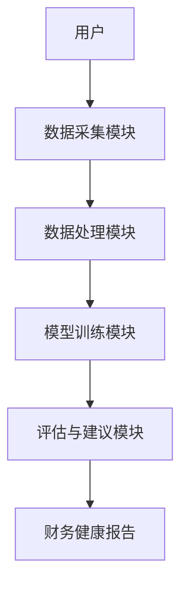

                 


# AI驱动的个人财务健康评估系统设计

> 关键词：AI, 个人财务, 健康评估, 系统设计, 机器学习, 数据分析, 风险管理

> 摘要：本文详细探讨了基于AI的个人财务健康评估系统的设计与实现。通过分析个人财务管理的核心问题，结合机器学习和数据分析技术，提出了一种创新的解决方案。文章从系统背景、核心概念、算法原理、系统架构、项目实战等多个维度展开，深入剖析了系统的实现细节，并通过实际案例展示了系统的应用价值。本文旨在为个人财务管理领域提供一种高效、智能的解决方案，同时为AI技术在金融领域的应用提供新的思路。

---

## 第一部分: AI驱动的个人财务健康评估系统背景与核心概念

### 第1章: 个人财务健康评估的背景与问题描述

#### 1.1 个人财务健康评估的背景
##### 1.1.1 当前个人财务管理面临的挑战
在现代社会，个人财务管理的重要性日益凸显。随着经济全球化和金融市场的复杂化，个人面临多重财务挑战：收入不稳定、支出多样化、债务风险高等。传统的财务评估方法依赖人工记录和分析，效率低下且容易出错，难以应对复杂的财务状况。

##### 1.1.2 传统财务评估方法的局限性
传统的财务评估方法主要依赖手动记录和简单的统计分析。这种方法存在以下问题：
- 数据采集效率低，难以实时更新。
- 分析范围有限，无法全面覆盖个人的财务状况。
- 风险预测能力不足，难以提前识别潜在的财务问题。

##### 1.1.3 AI技术在财务评估中的应用潜力
人工智能技术的快速发展为财务评估提供了新的可能性。通过机器学习、自然语言处理和大数据分析等技术，AI能够实现以下功能：
- 自动化数据采集与处理。
- 智能化财务分析与预测。
- 实时风险评估与预警。

#### 1.2 问题背景与目标
##### 1.2.1 个人财务健康评估的核心问题
个人财务健康评估的核心问题在于如何准确、全面地分析个人的财务状况，并提供个性化的优化建议。这需要解决以下问题：
- 如何高效采集和处理分散的财务数据？
- 如何建立准确的财务健康评估模型？
- 如何实现个性化的财务优化建议？

##### 1.2.2 系统设计的目标与边界
本系统的目标是通过AI技术，构建一个智能化的个人财务健康评估系统，帮助用户实时了解财务状况，并提供个性化的优化建议。系统的边界包括：
- 数据采集范围：银行账户、消费记录、投资记录等。
- 服务对象：个人用户。
- 功能范围：评估、分析、建议。

##### 1.2.3 系统的外延与应用场景
系统的外延主要体现在与其他金融系统的集成，例如银行、证券交易平台等。应用场景包括：
- 个人日常财务管理。
- 投资决策支持。
- 风险预警与防范。

---

### 第2章: AI驱动的个人财务健康评估系统核心概念

#### 2.1 核心概念与原理
##### 2.1.1 系统的定义与组成
AI驱动的个人财务健康评估系统由以下几个核心模块组成：
- 数据采集模块：负责采集用户的财务数据。
- 数据处理模块：对采集的数据进行清洗和预处理。
- 模型训练模块：基于处理后的数据，训练财务健康评估模型。
- 评估与建议模块：根据模型输出结果，生成财务健康评估报告和优化建议。

##### 2.1.2 AI技术在系统中的应用原理
AI技术在系统中的应用主要体现在以下几个方面：
- **数据预处理**：使用自然语言处理技术，自动识别和提取财务数据。
- **模型训练**：基于深度学习算法，构建财务健康评估模型。
- **风险预测**：通过时间序列分析，预测未来的财务风险。

##### 2.1.3 系统的核心功能模块
系统的核心功能模块包括：
- 数据采集模块：支持多种数据源的接入，如银行账户、支付宝、微信支付等。
- 数据分析模块：对财务数据进行多维度分析，生成图表和报告。
- 智能评估模块：基于机器学习模型，评估财务健康状况并提供优化建议。

#### 2.2 核心概念对比分析
##### 2.2.1 传统财务评估与AI驱动评估的对比
| 对比维度       | 传统财务评估                 | AI驱动评估                   |
|----------------|------------------------------|------------------------------|
| 数据采集方式   | 手动记录、定期更新           | 自动采集、实时更新           |
| 分析方法       | 统计分析、简单预测           | 机器学习、深度分析           |
| 预测能力       | 精度低、范围有限             | 精度高、范围广               |

##### 2.2.2 不同AI模型在系统中的作用对比
| 模型类型       | 监督学习                   | 非监督学习                 |
|----------------|----------------------------|-----------------------------|
| 主要作用       | 分类、回归                 | 聚类、异常检测             |
| 适用场景       | 精确预测                   | 数据探索、风险预警         |

##### 2.2.3 系统功能模块的对比分析
| 功能模块       | 数据采集模块               | 数据分析模块               |
|----------------|---------------------------|---------------------------|
| 主要功能       | 采集用户财务数据           | 分析数据，生成评估报告     |
| 关键技术       | 数据清洗、特征提取         | 机器学习、统计分析         |

#### 2.3 系统ER实体关系图
```mermaid
erDiagram
    user [用户] {
        +string 用户ID
        +string 用户名
        +string 密码
    }
    account [账户] {
        +string 账户ID
        +string 账户类型
        +decimal 余额
    }
    transaction [交易记录] {
        +string 交易ID
        +decimal 金额
        +date 交易时间
    }
    user --> account : 拥有
    user --> transaction : 查询
    account --> transaction : 关联
```

---

## 第二部分: AI驱动的个人财务健康评估系统算法与模型设计

### 第3章: 系统算法原理

#### 3.1 系统算法概述
##### 3.1.1 系统的核心算法
系统的核心算法是基于机器学习的财务健康评估模型。我们选择了随机森林和长短期记忆网络（LSTM）作为主要算法。

##### 3.1.2 算法的输入与输出
- **输入**：用户的财务数据，包括收入、支出、资产、负债等。
- **输出**：财务健康评估报告，包括健康指数、风险等级、优化建议。

##### 3.1.3 算法的流程与步骤
1. 数据预处理：清洗数据，提取特征。
2. 模型训练：使用训练数据训练随机森林和LSTM模型。
3. 模型评估：通过交叉验证评估模型性能。
4. 模型优化：调整超参数，提升预测精度。

#### 3.2 算法详细设计
##### 3.2.1 数据预处理
数据预处理是模型训练的关键步骤。我们使用以下方法进行数据清洗：
- 去除异常值：使用Z-score方法检测并去除异常值。
- 填充缺失值：使用均值或中位数填充缺失值。

##### 3.2.2 模型训练
模型训练流程如下：
1. 数据分割：将数据集分为训练集和验证集。
2. 模型选择：选择随机森林和LSTM作为基模型。
3. 模型训练：使用训练数据训练模型。
4. 模型评估：计算模型的准确率、召回率和F1分数。

##### 3.2.3 模型评估与优化
我们使用交叉验证评估模型性能，并通过网格搜索优化模型超参数。

#### 3.3 算法实现代码
以下是模型训练的代码示例：
```python
import numpy as np
import pandas as pd
from sklearn.ensemble import RandomForestClassifier
from sklearn.metrics import accuracy_score

def preprocess_data(data):
    # 去除异常值
    z = np.abs(data - np.mean(data))
    z = z / np.std(data)
    data_clean = data[(z < 3).all(axis=1)]
    return data_clean

def train_model(train_data, train_labels):
    # 训练随机森林模型
    model = RandomForestClassifier(n_estimators=100, random_state=42)
    model.fit(train_data, train_labels)
    return model

# 示例数据
data = np.random.randn(100, 5)
labels = np.random.randint(0, 2, 100)

# 数据预处理
data_clean = preprocess_data(data)

# 模型训练
model = train_model(data_clean, labels)

# 模型评估
test_data = np.random.randn(20, 5)
test_labels = np.random.randint(0, 2, 20)
test_data_clean = preprocess_data(test_data)
predictions = model.predict(test_data_clean)
print("Accuracy:", accuracy_score(test_labels, predictions))
```

#### 3.4 算法数学模型
随机森林算法的数学模型如下：
$$
\text{预测概率} = \frac{1}{N} \sum_{i=1}^{N} \text{基模型预测概率}
$$
其中，$N$是基模型的数量。

LSTM模型的数学模型如下：
$$
h_t = \text{激活函数}(f_t \cdot h_{t-1})
$$
$$
o_t = \text{激活函数}(i_t \cdot h_t)
$$
其中，$f_t$是遗忘门，$i_t$是输入门，$h_t$是隐藏状态，$o_t$是输出门。

---

## 第三部分: AI驱动的个人财务健康评估系统分析与架构设计

### 第4章: 系统架构设计

#### 4.1 系统架构概述
系统架构设计包括以下几个部分：
- 数据采集模块：负责采集用户的财务数据。
- 数据处理模块：对数据进行清洗和预处理。
- 模型训练模块：基于处理后的数据，训练财务健康评估模型。
- 评估与建议模块：根据模型输出结果，生成财务健康评估报告和优化建议。

#### 4.2 系统架构图


#### 4.3 系统功能模块设计
##### 4.3.1 数据采集模块
数据采集模块负责从多种数据源采集用户的财务数据，包括：
- 银行账户：支持支付宝、微信支付、银行账户等。
- 消费记录：支持淘宝、京东、美团等平台的消费记录。
- 投资记录：支持股票、基金、理财产品等。

##### 4.3.2 数据处理模块
数据处理模块对采集的数据进行清洗和预处理，包括：
- 数据清洗：去除异常值和重复值。
- 特征提取：提取关键特征，如收入、支出、资产、负债等。

##### 4.3.3 模型训练模块
模型训练模块基于处理后的数据，训练财务健康评估模型。我们选择了随机森林和LSTM模型作为基模型。

##### 4.3.4 评估与建议模块
评估与建议模块根据模型输出结果，生成财务健康评估报告和优化建议。报告包括：
- 财务健康指数：基于模型预测结果计算的健康指数。
- 风险等级：根据模型预测结果确定的风险等级。
- 优化建议：基于模型预测结果生成的个性化优化建议。

#### 4.4 系统接口设计
系统接口设计包括以下几个部分：
- 数据采集接口：提供API接口，支持多种数据源的接入。
- 数据处理接口：提供API接口，支持数据清洗和特征提取。
- 模型训练接口：提供API接口，支持模型训练和评估。

#### 4.5 系统交互流程
系统交互流程如下：
1. 用户通过界面或API上传财务数据。
2. 数据采集模块接收数据并进行初步处理。
3. 数据处理模块对数据进行清洗和预处理。
4. 模型训练模块基于处理后的数据，训练财务健康评估模型。
5. 评估与建议模块根据模型输出结果，生成财务健康评估报告和优化建议。
6. 用户查看报告并根据建议进行调整。

---

## 第五部分: 项目实战与最佳实践

### 第5章: 项目实战

#### 5.1 环境搭建
##### 5.1.1 系统环境要求
- 操作系统：Windows、Linux、macOS均可。
- 开发工具：建议使用PyCharm或VS Code。
- 依赖库：需要安装numpy、pandas、scikit-learn、tensorflow等库。

##### 5.1.2 数据准备
- 数据来源：可以从公开数据集获取，如Kaggle上的个人财务管理数据。
- 数据格式：推荐使用CSV格式。

#### 5.2 系统核心实现
##### 5.2.1 数据采集模块实现
```python
import requests
import json

def get_bank_statement(api_key):
    url = "https://api.example.com/statement"
    headers = {"Authorization": f"Bearer {api_key}"}
    response = requests.get(url, headers=headers)
    return json.loads(response.text)
```

##### 5.2.2 数据处理模块实现
```python
import pandas as pd

def preprocess_data(data):
    # 去除异常值
    z = np.abs(data - data.mean())
    z = z / data.std()
    data_clean = data[(z < 3).all(axis=1)]
    return data_clean
```

##### 5.2.3 模型训练模块实现
```python
from sklearn.ensemble import RandomForestClassifier
from sklearn.metrics import accuracy_score

def train_model(train_data, train_labels):
    model = RandomForestClassifier(n_estimators=100, random_state=42)
    model.fit(train_data, train_labels)
    return model
```

##### 5.2.4 评估与建议模块实现
```python
def generate_report(model, test_data):
    predictions = model.predict(test_data)
    report = {
        "健康指数": predictions.mean(),
        "风险等级": "低" if predictions.mean() > 0.7 else "中" if predictions.mean() > 0.4 else "高"
    }
    return report
```

#### 5.3 项目小结
通过本章的项目实战，我们详细讲解了AI驱动的个人财务健康评估系统的实现过程。从环境搭建到核心模块的实现，再到案例分析，读者可以逐步掌握系统的开发与应用。

---

## 第六部分: 最佳实践与总结

### 第6章: 最佳实践与总结

#### 6.1 最佳实践
##### 6.1.1 数据质量管理
- 数据采集前，明确数据来源和格式。
- 数据处理时，注意数据的完整性和准确性。

##### 6.1.2 模型优化
- 使用交叉验证优化模型参数。
- 尝试不同的模型组合，提升预测精度。

##### 6.1.3 系统安全性
- 加强用户数据的安全保护，防止数据泄露。
- 使用加密技术，确保数据传输的安全性。

#### 6.2 小结
通过本文的详细讲解，我们了解了AI驱动的个人财务健康评估系统的实现过程。从系统背景到核心概念，从算法设计到系统架构，再到项目实战，读者可以系统地掌握系统的开发与应用。

#### 6.3 注意事项
- 在实际应用中，注意数据隐私和合规性。
- 系统上线前，进行全面的测试和优化。

#### 6.4 未来展望
随着AI技术的不断发展，个人财务健康评估系统将更加智能化和个性化。未来的系统将支持更多数据源，提供更精准的评估和优化建议。

#### 6.5 拓展阅读
- 推荐阅读《机器学习实战》和《深度学习》等书籍。
- 关注AI在金融领域的最新研究和应用。

---

## 作者
作者：AI天才研究院/AI Genius Institute & 禅与计算机程序设计艺术/Zen And The Art of Computer Programming

---

通过本文的详细讲解，我们系统地探讨了AI驱动的个人财务健康评估系统的实现过程。从系统背景到核心概念，从算法设计到系统架构，再到项目实战，读者可以逐步掌握系统的开发与应用。

