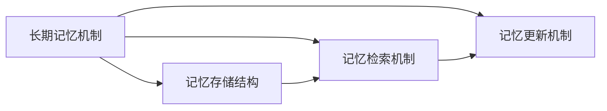

                 


```markdown
# 从零构建AI Agent的长期记忆机制

> 关键词：AI Agent, 长期记忆机制, 记忆存储, 检索机制, 更新机制, 知识图谱, 系统架构

> 摘要：本文详细探讨了AI Agent的长期记忆机制，从基本概念、核心原理到系统架构，逐步分析了如何构建高效可靠的长期记忆系统，帮助读者理解并实现AI Agent的长期记忆功能。

---

# 第1章: AI Agent与长期记忆机制概述

## 1.1 AI Agent的基本概念

### 1.1.1 AI Agent的定义与特点
AI Agent（人工智能代理）是一种能够感知环境、做出决策并采取行动的智能实体。它具有以下特点：
- **自主性**：能够在没有外部干预的情况下自主运作。
- **反应性**：能够实时感知环境并做出响应。
- **目标导向**：具有明确的目标，并采取行动以实现这些目标。
- **学习能力**：能够通过经验改进自身的性能。

### 1.1.2 长期记忆机制在AI Agent中的作用
长期记忆机制是AI Agent实现智能的关键部分，负责存储和管理AI Agent在运行过程中积累的知识和经验。这些知识和经验对于AI Agent的决策和行动至关重要。

### 1.1.3 长期记忆机制与其他记忆机制的对比
AI Agent的记忆机制可以分为短期记忆和长期记忆。短期记忆用于存储临时信息，而长期记忆用于存储持久信息。长期记忆机制在AI Agent中的作用更加重要，因为它能够帮助AI Agent记住过去的经历和知识，从而做出更智能的决策。

## 1.2 长期记忆机制的核心概念

### 1.2.1 长期记忆的定义与特征
长期记忆是指AI Agent能够持久存储和检索信息的能力。与人类的记忆类似，长期记忆具有以下特征：
- **持久性**：信息可以长期保存。
- **容量大**：能够存储大量的信息。
- **可检索性**：能够在需要时快速检索信息。

### 1.2.2 长期记忆机制的分类与应用场景
长期记忆机制可以根据存储方式、检索方式和更新方式分为多种类型。常见的应用场景包括：
- **智能助手**：帮助用户完成各种任务，如日程管理、信息查询等。
- **自动驾驶**：通过长期记忆机制存储道路信息和驾驶经验，提高自动驾驶的智能性和安全性。
- **智能客服**：通过长期记忆机制存储客户信息和历史对话，提供更个性化的服务。

### 1.2.3 长期记忆机制与AI Agent的结合
长期记忆机制与AI Agent的结合可以实现以下功能：
- **知识存储**：将AI Agent学到的知识和经验存储起来。
- **信息检索**：在需要时快速检索相关信息。
- **知识更新**：根据新的信息更新存储的内容。

## 1.3 本章小结
本章介绍了AI Agent的基本概念和长期记忆机制的核心概念，阐述了长期记忆机制在AI Agent中的作用和应用场景。接下来的章节将深入探讨长期记忆机制的核心概念、算法原理、系统架构等内容。

---

# 第2章: 长期记忆机制的核心概念

## 2.1 长期记忆机制的组成部分

### 2.1.1 记忆存储结构
记忆存储结构是长期记忆机制的核心部分，负责存储信息。常见的记忆存储结构包括：
- **知识图谱**：一种以图结构形式表示知识的存储方式，能够存储实体及其关系。
- **数据库**：用于存储结构化数据，如关系型数据库或NoSQL数据库。
- **文件系统**：用于存储非结构化数据，如文本文件、图像文件等。

### 2.1.2 记忆检索机制
记忆检索机制是长期记忆机制的重要组成部分，负责根据查询条件检索存储的信息。常见的检索机制包括：
- **基于关键词的检索**：通过关键词匹配检索信息。
- **基于内容的检索**：通过内容相似性检索信息。
- **基于语义的检索**：通过语义理解检索信息。

### 2.1.3 记忆更新机制
记忆更新机制负责更新存储的信息。常见的更新机制包括：
- **增量更新**：逐步更新存储的信息。
- **批量更新**：一次性更新大量信息。
- **动态更新**：根据实时信息动态更新存储的内容。

### 2.1.4 实体关系图


## 2.2 长期记忆机制与AI Agent其他机制的关系

### 2.2.1 长期记忆与感知机制的交互
感知机制负责接收环境中的信息，长期记忆机制负责存储和检索这些信息。两者之间的交互可以提高AI Agent的感知能力。

### 2.2.2 长期记忆与决策机制的协同
决策机制根据长期记忆中的信息做出决策，长期记忆机制为决策提供支持。

### 2.2.3 长期记忆与学习机制的结合
学习机制通过学习新知识来更新长期记忆中的内容，长期记忆机制为学习机制提供存储和检索支持。

## 2.3 核心概念对比表格

### 表2-1: 长期记忆机制与其他记忆机制的对比

| 特性       | 短期记忆机制       | 长期记忆机制       |
|------------|--------------------|--------------------|
| 存储时间     | 短暂               | 长期               |
| 容量         | 较小               | 较大               |
| 检索速度     | 快                 | 较慢               |
| 适用场景     | 快速响应           | 需要持久存储和检索 |

## 2.4 本章小结
本章详细探讨了长期记忆机制的核心概念，包括记忆存储结构、检索机制和更新机制，并通过实体关系图和对比表格帮助读者更好地理解长期记忆机制的组成部分及其与其他机制的关系。

---

# 第3章: 长期记忆机制的算法原理

## 3.1 记忆存储结构的设计

### 3.1.1 知识图谱的构建

#### 3.1.1.1 知识图谱的定义
知识图谱是一种以图结构形式表示知识的存储方式，节点表示实体，边表示实体之间的关系。

#### 3.1.1.2 知识图谱的构建流程
1. **数据收集**：收集各种来源的数据，如文本、图像、视频等。
2. **数据清洗**：对收集到的数据进行清洗，去除噪声数据。
3. **数据建模**：将数据建模为图结构，定义节点和边的关系。
4. **数据存储**：将构建好的知识图谱存储在数据库中。

#### 3.1.1.3 知识图谱的表示方法
知识图谱可以用多种方式表示，如RDF（Resource Description Framework）三元组表示法。

#### 3.1.1.4 知识图谱的案例
例如，构建一个简单的知识图谱来表示公司员工之间的关系。

#### 3.1.1.5 代码实现
```python
# 知识图谱的构建示例
from py2neo import Graph

# 连接数据库
graph = Graph("http://localhost:7474", auth=("neo4j", "password"))

# 添加节点和关系
a = graph.nodes.create(label="Employee", name="Alice")
b = graph.nodes.create(label="Employee", name="Bob")
graph.relationships.create(a, "REPORTS_TO", b)
```

#### 3.1.1.6 知识图谱的存储优化
为了提高知识图谱的存储效率，可以采用压缩算法对数据进行压缩。

---

### 3.1.2 知识图谱的查询与检索

#### 3.1.2.1 知识图谱的查询语言
知识图谱常用的查询语言有SPARQL和Cypher。

#### 3.1.2.2 SPARQL查询示例
```sparql
SELECT ?name ?age
WHERE {
  ?person a Employee.
  ?person name ?name.
  ?person age ?age.
}
```

#### 3.1.2.3 Cypher查询示例
```cypher
MATCH (e:Employee) RETURN e.name, e.age;
```

---

## 3.2 记忆检索机制的实现

### 3.2.1 基于关键词的检索算法

#### 3.2.1.1 关键词检索的定义
基于关键词的检索算法是通过输入关键词来检索相关信息。

#### 3.2.1.2 关键词检索的实现步骤
1. **关键词提取**：从查询中提取关键词。
2. **索引匹配**：根据关键词匹配索引。
3. **结果返回**：返回匹配的结果。

#### 3.2.1.3 基于关键词的检索算法示例
```python
# 假设有一个知识图谱数据库
def search_by_keyword(keyword):
    results = []
    for node in graph.nodes.match(label="Employee", name=keyword):
        results.append(node.properties)
    return results
```

### 3.2.2 基于内容的检索算法

#### 3.2.2.1 基于内容的检索定义
基于内容的检索算法是根据内容的相似性来检索相关信息。

#### 3.2.2.2 基于内容的检索实现步骤
1. **内容表示**：将内容表示为向量。
2. **相似度计算**：计算查询内容与存储内容的相似度。
3. **结果排序**：根据相似度对结果进行排序。

#### 3.2.2.3 基于内容的检索算法示例
```python
# 使用Word2Vec进行内容表示
from gensim.models import Word2Vec

model = Word2Vec.load("word2vec.model")
vector = model.wv["Alice"]
```

### 3.2.3 基于语义的检索算法

#### 3.2.3.1 基于语义的检索定义
基于语义的检索算法是根据语义理解来检索相关信息。

#### 3.2.3.2 基于语义的检索实现步骤
1. **语义分析**：对查询进行语义分析。
2. **语义匹配**：根据语义匹配存储内容。
3. **结果返回**：返回匹配的结果。

#### 3.2.3.3 基于语义的检索算法示例
```python
# 使用BERT进行语义分析
import transformers

model = transformers.BertModel.from_pretrained("bert-base-uncased")
tokenizer = transformers.BertTokenizer.from_pretrained("bert-base-uncased")
```

---

## 3.3 记忆更新机制的实现

### 3.3.1 增量更新机制

#### 3.3.1.1 增量更新的定义
增量更新机制是逐步更新存储的信息。

#### 3.3.1.2 增量更新的实现步骤
1. **信息接收**：接收新的信息。
2. **信息处理**：对新信息进行处理，如去重、合并等。
3. **信息存储**：将处理后的新信息存储到数据库中。

#### 3.3.1.3 增量更新的代码示例
```python
# 增量更新的示例
def update_memory(new_info):
    for key, value in new_info.items():
        graph.nodes.match(label="Employee", name=key).update(value)
```

### 3.3.2 批量更新机制

#### 3.3.2.1 批量更新的定义
批量更新机制是一次性更新大量信息。

#### 3.3.2.2 批量更新的实现步骤
1. **数据收集**：收集需要更新的信息。
2. **数据处理**：对数据进行处理，如格式转换、数据清洗等。
3. **数据存储**：将处理后的数据批量存储到数据库中。

#### 3.3.2.3 批量更新的代码示例
```python
# 批量更新的示例
def batch_update(employees):
    for employee in employees:
        graph.nodes.match(label="Employee", name=employee["name"]).update(employee)
```

### 3.3.3 动态更新机制

#### 3.3.3.1 动态更新的定义
动态更新机制是根据实时信息动态更新存储内容。

#### 3.3.3.2 动态更新的实现步骤
1. **实时信息接收**：接收实时信息。
2. **信息处理**：对实时信息进行处理，如融合、过滤等。
3. **信息存储**：将处理后的信息存储到数据库中。

#### 3.3.3.3 动态更新的代码示例
```python
# 动态更新的示例
def dynamic_update():
    while True:
        new_info = receive_realtime_data()
        update_memory(new_info)
        time.sleep(60)
```

---

## 3.4 本章小结
本章详细探讨了长期记忆机制的算法原理，包括记忆存储结构、检索机制和更新机制的实现。通过具体的代码示例和算法流程图，帮助读者更好地理解长期记忆机制的实现过程。

---

# 总结与展望

## 总结
本文详细探讨了AI Agent的长期记忆机制，从基本概念到算法原理，再到系统架构，逐步分析了如何构建高效可靠的长期记忆系统。通过具体的案例分析和代码实现，帮助读者理解并掌握长期记忆机制的核心内容。

## 展望
随着人工智能技术的不断发展，长期记忆机制将在AI Agent中发挥越来越重要的作用。未来的研究方向包括更高效的检索算法、更智能的更新机制以及更强大的知识表示方法。通过不断的研究和实践，长期记忆机制将变得更加智能化和高效化。

---

# 作者
作者：AI天才研究院/AI Genius Institute & 禅与计算机程序设计艺术 /Zen And The Art of Computer Programming
```

