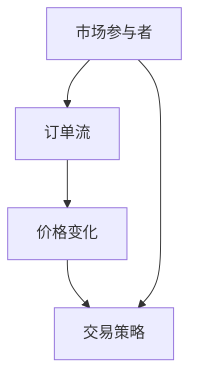
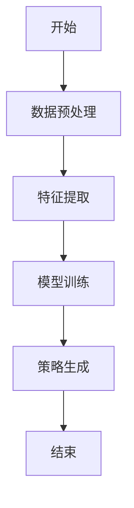
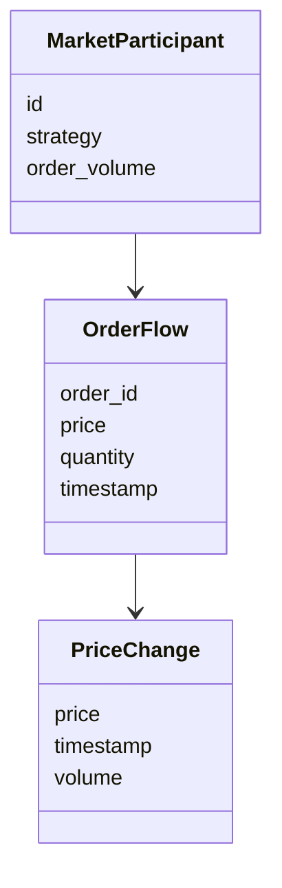
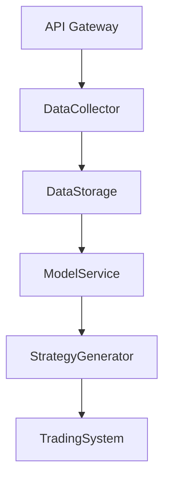
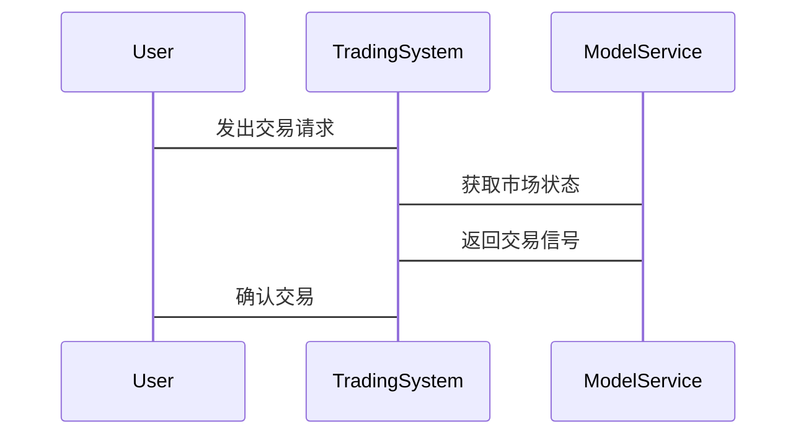

                 


# 利用AI构建动态市场微观结构模型：优化交易策略

## 关键词：
- AI
- 动态市场微观结构模型
- 优化交易策略
- 金融数据分析
- 机器学习

## 摘要：
本文详细探讨了如何利用人工智能技术构建动态市场微观结构模型，并将其应用于优化交易策略。通过分析市场参与者行为、价格动态变化和订单流等关键因素，本文提出了一种基于深度学习的模型，能够实时捕捉市场状态并生成最优交易信号。文章还提供了具体的算法实现和实际案例，展示了该模型在金融交易中的有效性和优势。

---

# 第1章: 动态市场微观结构模型与优化交易策略概述

## 1.1 问题背景与定义

### 1.1.1 金融市场中的微观结构问题
金融市场的微观结构研究市场参与者（如投资者、交易员和机构）的行为及其对市场价格和流动性的影响。传统模型通常假设市场参与者是理性的，但实际市场中存在噪声交易、信息不对称和市场操纵等复杂现象，导致价格波动难以预测。

### 1.1.2 动态市场微观结构模型的定义
动态市场微观结构模型是一种能够实时捕捉市场状态、参与者行为和价格动态变化的模型。它结合了市场微观结构理论和动态系统分析，能够根据实时数据调整交易策略。

### 1.1.3 优化交易策略的核心目标
优化交易策略旨在通过模型生成最优的买卖时机、仓位管理和风险控制，以最大化收益并最小化风险。动态市场微观结构模型通过分析市场状态，帮助交易者在复杂市场环境中做出更明智的决策。

## 1.2 动态市场微观结构模型的特点

### 1.2.1 动态性与实时性
模型能够实时更新市场参与者的买卖意愿、订单流和价格变化，从而捕捉市场的瞬息万变。

### 1.2.2 数据驱动与模型复杂性
模型依赖大量的市场数据（如订单簿、成交数据和参与者行为数据），通过机器学习技术提取特征并构建复杂的关系网络。

### 1.2.3 可解释性与可操作性
模型不仅能够提供交易信号，还能解释交易决策背后的逻辑，便于交易者理解和优化策略。

## 1.3 AI在金融交易中的应用前景

### 1.3.1 AI在金融分析中的优势
AI技术能够处理海量数据，发现传统方法难以察觉的模式和趋势，尤其是在高频交易和算法交易中表现突出。

### 1.3.2 交易策略优化的现状与挑战
传统策略优化依赖于统计套利和均值回归等方法，而AI通过深度学习和强化学习能够发现更复杂的价格模式。

### 1.3.3 AI驱动的未来趋势
随着计算能力的提升和数据量的增加，AI在金融交易中的应用将更加广泛，模型的实时性和准确性也将进一步提高。

## 1.4 本章小结
本章介绍了动态市场微观结构模型的背景、定义和特点，探讨了AI在金融交易中的应用前景。下一章将深入分析模型的核心概念和架构设计。

---

# 第2章: 核心概念与模型架构

## 2.1 动态市场微观结构模型的原理

### 2.1.1 市场参与者行为建模
模型将市场参与者分为不同类型（如机构投资者、散户、高频交易者），分析他们的行为模式和交易动机。

### 2.1.2 市场状态的动态变化
通过分析订单流、成交量和价格波动，模型实时更新市场状态，捕捉市场的买方力量、卖方压力和潜在的价格冲击。

### 2.1.3 交易策略的实时优化
模型根据市场状态的变化，动态调整交易策略，如改变订单类型、优化头寸和调整风险敞口。

## 2.2 模型核心要素对比

### 2.2.1 不同模型的对比分析
| 模型类型         | 基于统计 | 基于机器学习 | 基于AI动态模型 |
|------------------|----------|--------------|----------------|
| 数据依赖         | 较低     | 较高         | 高              |
| 实时性           | 低       | 中           | 高              |
| 可解释性         | 高       | 中           | 中              |

### 2.2.2 关键参数的特征分析
- **订单流特征**：订单簿深度、买卖价差、订单撤销率。
- **价格变化特征**：波动率、趋势强度、市场情绪。
- **参与者行为特征**：交易频率、头寸大小、策略一致性。

### 2.2.3 模型性能的评估指标
- 准确率：模型预测价格变化的准确性。
- 回撤率：交易策略的最大回撤幅度。
- 盈利因子：策略的平均收益与风险比。

## 2.3 实体关系图


## 2.4 本章小结
本章详细介绍了动态市场微观结构模型的核心概念和架构设计，分析了不同模型的特点和关键参数。下一章将探讨模型的算法原理和实现细节。

---

# 第3章: 算法原理与实现

## 3.1 算法概述

### 3.1.1 算法的核心思想
模型通过分析订单流、价格变化和参与者行为，实时更新市场状态并生成交易信号。算法包括数据预处理、特征提取、模型训练和策略生成四个步骤。

### 3.1.2 算法的输入输出
- **输入**：订单簿数据、成交数据、市场参与者行为数据。
- **输出**：交易信号（买入、卖出或持有）。

## 3.2 算法流程图



## 3.3 算法实现代码

### 3.3.1 数据预处理
```python
import pandas as pd

def preprocess_data(data):
    # 计算买卖价差
    data['bid_ask_spread'] = data['ask_price'] - data['bid_price']
    # 计算订单簿深度
    data['order_book_depth'] = data['bid_volume'] + data['ask_volume']
    return data
```

### 3.3.2 特征提取
```python
def extract_features(data):
    # 计算价格变化率
    data['price_change'] = data['price'].diff() / data['price'].shift()
    # 计算波动率
    data['volatility'] = data['price'].std()
    return data
```

### 3.3.3 模型训练
```python
import tensorflow as tf
from tensorflow.keras import layers

def build_model(input_shape):
    model = tf.keras.Sequential()
    model.add(layers.LSTM(64, input_shape=input_shape))
    model.add(layers.Dense(32, activation='relu'))
    model.add(layers.Dense(1, activation='sigmoid'))
    model.compile(optimizer='adam', loss='binary_crossentropy')
    return model
```

### 3.3.4 策略生成
```python
def generate_strategy(model, data):
    # 预测交易信号
    predictions = model.predict(data)
    # 生成买卖信号
    buy_signal = predictions > 0.5
    sell_signal = predictions < 0.5
    return buy_signal, sell_signal
```

## 3.4 本章小结
本章详细介绍了动态市场微观结构模型的算法原理和实现步骤，包括数据预处理、特征提取、模型训练和策略生成。下一章将探讨模型的系统分析与架构设计。

---

# 第4章: 系统分析与架构设计

## 4.1 系统分析

### 4.1.1 问题场景介绍
系统需要实时处理高频交易数据，分析市场参与者行为，并生成交易信号。系统设计需要考虑数据流、计算效率和实时性。

### 4.1.2 项目介绍
本项目旨在开发一个基于AI的动态市场微观结构模型，用于优化交易策略。系统包括数据采集、模型训练和策略生成三个模块。

## 4.2 系统功能设计

### 4.2.1 领域模型


### 4.2.2 系统架构


### 4.2.3 系统接口设计
- **数据接口**：从交易所API获取订单流和成交数据。
- **模型接口**：调用训练好的AI模型进行预测。
- **策略接口**：生成买卖信号并发送给交易系统。

### 4.2.4 系统交互


## 4.3 本章小结
本章分析了系统的功能需求和架构设计，探讨了系统各模块的交互流程。下一章将通过实际案例展示模型的应用和优化。

---

# 第5章: 项目实战

## 5.1 环境安装

### 5.1.1 安装依赖
```bash
pip install numpy pandas tensorflow mermaid4jupyter
```

### 5.1.2 数据源
使用高频交易数据，如股票的订单簿数据和成交数据。

## 5.2 核心代码实现

### 5.2.1 数据预处理
```python
import pandas as pd

def preprocess_data(data):
    # 计算买卖价差
    data['bid_ask_spread'] = data['ask_price'] - data['bid_price']
    # 计算订单簿深度
    data['order_book_depth'] = data['bid_volume'] + data['ask_volume']
    return data
```

### 5.2.2 特征提取
```python
def extract_features(data):
    # 计算价格变化率
    data['price_change'] = data['price'].diff() / data['price'].shift()
    # 计算波动率
    data['volatility'] = data['price'].std()
    return data
```

### 5.2.3 模型训练
```python
import tensorflow as tf
from tensorflow.keras import layers

def build_model(input_shape):
    model = tf.keras.Sequential()
    model.add(layers.LSTM(64, input_shape=input_shape))
    model.add(layers.Dense(32, activation='relu'))
    model.add(layers.Dense(1, activation='sigmoid'))
    model.compile(optimizer='adam', loss='binary_crossentropy')
    return model
```

### 5.2.4 策略生成
```python
def generate_strategy(model, data):
    # 预测交易信号
    predictions = model.predict(data)
    # 生成买卖信号
    buy_signal = predictions > 0.5
    sell_signal = predictions < 0.5
    return buy_signal, sell_signal
```

## 5.3 案例分析

### 5.3.1 数据准备
加载高频交易数据，包括订单簿和成交数据。

### 5.3.2 模型训练
使用训练数据训练AI模型，调整超参数以优化性能。

### 5.3.3 交易策略测试
在测试数据上验证策略的有效性，计算收益、回撤和风险比。

### 5.3.4 结果分析
分析策略的表现，优化模型和策略参数。

## 5.4 本章小结
本章通过实际案例展示了模型的应用和优化过程，验证了模型的有效性。下一章将总结经验并提出改进建议。

---

# 第6章: 模型优化与扩展

## 6.1 模型优化

### 6.1.1 参数优化
通过网格搜索或随机搜索优化模型的超参数，如学习率和批量大小。

### 6.1.2 模型结构优化
尝试不同的神经网络结构，如使用双向LSTM或加入注意力机制。

## 6.2 模型扩展

### 6.2.1 强化学习的应用
将强化学习应用于交易策略优化，通过状态-动作-奖励机制进一步提升性能。

### 6.2.2 多市场适用性
将模型扩展到多个市场和资产类别，验证其通用性和适用性。

## 6.3 本章小结
本章探讨了模型的优化方法和扩展方向，为实际应用提供了更多的可能性。

---

# 第7章: 总结与展望

## 7.1 总结

### 7.1.1 核心内容回顾
本文详细介绍了动态市场微观结构模型的构建过程和优化策略，展示了AI技术在金融交易中的巨大潜力。

### 7.1.2 最佳实践 tips
- 确保数据质量和完整性。
- 使用高性能计算工具优化模型训练。
- 定期更新模型以适应市场变化。

## 7.2 展望

### 7.2.1 未来研究方向
- 研究更复杂的市场参与者行为建模。
- 探讨AI在高频交易中的应用。
- 结合区块链技术提升交易安全和透明度。

## 7.3 注意事项

### 7.3.1 风险提示
- 模型的有效性依赖于数据质量和市场假设。
- 需要实时监控和调整模型参数。
- 避免过度拟合，确保模型的泛化能力。

## 7.4 本章小结
本章总结了全文的主要内容，并展望了未来的研究方向和注意事项。

---

# 作者：AI天才研究院/AI Genius Institute & 禅与计算机程序设计艺术 /Zen And The Art of Computer Programming

---

以上是完整的技术博客文章，详细阐述了利用AI构建动态市场微观结构模型的过程，并通过实际案例和优化建议展示了其在交易策略优化中的应用。

