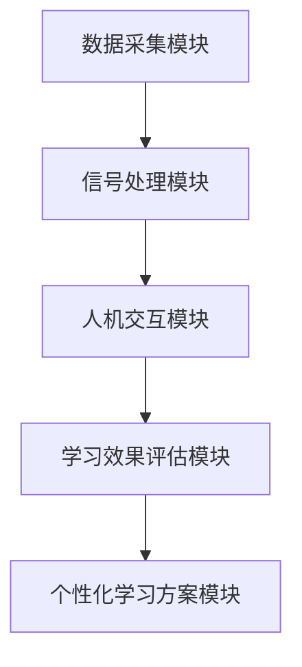
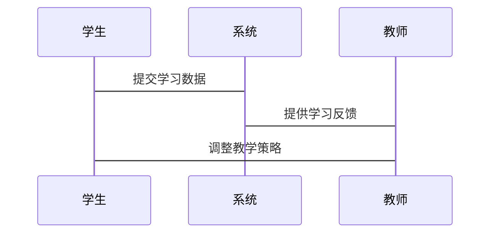

                 


# 巴菲特-芒格的脑机接口教育应用投资：学习革命的新前沿

> 关键词：巴菲特，芒格，脑机接口，教育应用，投资，学习革命

> 摘要：本文探讨了巴菲特和芒格在脑机接口（BCI）教育应用领域的投资逻辑，分析了脑机接口技术在教育中的潜力，并结合数学模型和系统架构，详细阐述了其在教育领域的应用前景和投资价值。

---

# 第一部分: 巴菲特-芒格投资哲学与脑机接口教育应用的背景

## 第1章: 巴菲特-芒格投资哲学概述

### 1.1 巴菲特-芒格投资哲学的核心理念

#### 1.1.1 巴菲特的价值投资理论
巴菲特的价值投资理论强调长期投资、注重企业的内在价值和竞争优势。他认为，投资的本质是通过研究企业的基本面，找到那些具有持续盈利能力和社会价值的企业进行长期投资。

#### 1.1.2 芒格的多元思维模型
芒格的多元思维模型强调通过跨学科的思维方式来理解问题。他认为，投资者需要从物理学、心理学、经济学等多个角度分析问题，才能做出更明智的决策。

#### 1.1.3 投资哲学对现代教育的影响
巴菲特和芒格的投资哲学不仅影响了金融领域，还对现代教育提出了新的思考。他们认为，教育的核心是培养学生的独立思考能力、解决问题的能力和长期的学习能力。

### 1.2 脑机接口技术的背景与现状

#### 1.2.1 脑机接口技术的基本原理
脑机接口（BCI）是一种通过采集和解析大脑神经信号，实现人与机器直接交互的技术。其基本原理包括信号采集、信号处理和人机交互三个环节。

#### 1.2.2 脑机接口技术在教育中的应用潜力
脑机接口技术在教育中的应用潜力主要体现在以下几个方面：
- **个性化学习**：通过实时监测学生的脑电信号，识别其注意力和情绪状态，为每个学生定制个性化的学习方案。
- **学习效果评估**：通过分析学生的神经信号，评估其对学习内容的理解程度和记忆效果。
- **互动教学**：通过脑机接口技术实现师生之间的实时互动，提升课堂参与度和教学效果。

#### 1.2.3 脑机接口技术的市场现状与未来趋势
目前，脑机接口技术在教育领域的应用还处于起步阶段，但其市场潜力巨大。随着技术的不断进步和成本的降低，脑机接口技术将在教育领域得到更广泛的应用。

### 1.3 教育应用的革命性意义

#### 1.3.1 传统教育模式的局限性
传统教育模式主要依赖教师的讲解和学生的被动接受，存在以下问题：
- **个性化不足**：每个学生的认知能力和学习进度不同，传统教学难以满足个性化需求。
- **互动性不足**：学生与教师之间的互动有限，难以实时反馈学生的学习状态。
- **数据驱动不足**：传统教学缺乏对学生学习过程的实时监测和数据支持。

#### 1.3.2 脑机接口技术如何革新教育方式
脑机接口技术可以通过以下方式革新教育方式：
- **实时监测与反馈**：通过监测学生的脑电信号，实时反馈其注意力和情绪状态，帮助教师调整教学策略。
- **个性化学习方案**：根据学生的学习状态和认知特点，制定个性化的学习计划。
- **互动教学模式**：通过脑机接口技术实现师生之间的实时互动，提升课堂参与度。

#### 1.3.3 教育革命对社会的深远影响
脑机接口技术的应用将引发一场教育革命，其深远影响包括：
- **提升教育效率**：通过个性化学习和实时反馈，提高学生的学习效率。
- **优化教育资源配置**：通过数据驱动的教育决策，优化教育资源的配置。
- **促进教育公平**：通过个性化学习方案，帮助不同背景的学生获得公平的教育机会。

---

## 第2章: 脑机接口技术的核心概念与投资逻辑

### 2.1 脑机接口技术的核心原理

#### 2.1.1 神经科学基础
神经科学是脑机接口技术的核心基础。脑机接口技术通过监测和解析大脑神经信号，实现人与机器之间的直接交互。

#### 2.1.2 信号采集与处理技术
信号采集与处理技术是脑机接口技术的关键环节。主要包括以下步骤：
1. **信号采集**：通过脑电帽或其他设备采集大脑神经信号。
2. **信号处理**：对采集到的信号进行滤波、降噪和特征提取。
3. **信号分类**：通过机器学习算法对信号进行分类，识别特定的神经活动。

#### 2.1.3 人机交互算法
人机交互算法是脑机接口技术的核心算法。主要包括以下内容：
- **特征提取算法**：从神经信号中提取有用的特征。
- **分类算法**：通过机器学习算法对信号进行分类，实现人机交互。

### 2.2 教育应用中的优势分析

#### 2.2.1 提高学习效率
脑机接口技术可以通过实时监测学生的学习状态，帮助教师制定更有针对性的教学策略，从而提高学习效率。

#### 2.2.2 个性化学习体验
脑机接口技术可以根据学生的学习状态和认知特点，定制个性化的学习方案，提供更加个性化的学习体验。

#### 2.2.3 数据驱动的教育决策
通过脑机接口技术采集和分析数据，教师可以更加科学地进行教育决策，优化教学过程。

### 2.3 巴菲特-芒格投资逻辑与脑机接口技术的结合

#### 2.3.1 高质量企业的识别标准
巴菲特和芒格在投资过程中，注重选择那些具有强大竞争优势和持续盈利能力的企业。在脑机接口技术领域，投资者需要选择那些具有技术创新能力和市场竞争力的企业。

#### 2.3.2 脑机接口技术的市场潜力
脑机接口技术在教育领域的应用潜力巨大。随着技术的不断进步和成本的降低，脑机接口技术将在教育领域得到更广泛的应用。

#### 2.3.3 长期投资价值的评估
巴菲特和芒格注重长期投资价值。在脑机接口技术领域，投资者需要关注企业的技术创新能力、市场前景和长期盈利能力。

---

## 第3章: 脑机接口教育应用的数学模型与算法原理

### 3.1 脑机接口信号处理的数学模型

#### 3.1.1 时间序列分析
时间序列分析是脑机接口信号处理的重要方法。通过分析脑电信号的时间序列特征，可以识别特定的神经活动。

#### 3.1.2 信号降噪算法
信号降噪算法是脑机接口信号处理的关键技术。通过滤波和降噪处理，可以提高信号的质量。

#### 3.1.3 脑电特征提取
脑电特征提取是脑机接口信号处理的核心步骤。通过提取有用的特征，可以提高分类算法的准确率。

### 3.2 机器学习在教育中的应用

#### 3.2.1 分类算法
分类算法是机器学习在教育中的重要应用。通过分类算法，可以实现对学习状态的实时监测和反馈。

#### 3.2.2 聚类算法
聚类算法是机器学习的另一种重要应用。通过聚类算法，可以将学生分成不同的学习群体，制定更有针对性的教学策略。

#### 3.2.3 回归分析
回归分析是机器学习的另一种重要方法。通过回归分析，可以预测学生的学习效果，优化教学方案。

### 3.3 投资决策的数学模型

#### 3.3.1 风险评估模型
风险评估模型是投资决策的重要工具。通过风险评估模型，投资者可以评估投资项目的风险水平。

#### 3.3.2 投资组合优化
投资组合优化是投资决策的核心问题。通过优化投资组合，投资者可以在风险可控的前提下，实现最大化的收益。

#### 3.3.3 市场预测模型
市场预测模型是投资决策的重要工具。通过市场预测模型，投资者可以预测市场的未来走势，制定更有利的投资策略。

---

## 第4章: 脑机接口教育应用的系统架构与设计

### 4.1 系统功能模块设计

#### 4.1.1 数据采集模块
数据采集模块是脑机接口教育应用的核心模块。其功能包括：
- 采集学生的脑电信号
- 实时监测学生的学习状态

#### 4.1.2 信号处理模块
信号处理模块是脑机接口教育应用的关键模块。其功能包括：
- 对采集到的信号进行滤波和降噪处理
- 提取有用的特征

#### 4.1.3 人机交互模块
人机交互模块是脑机接口教育应用的重要组成部分。其功能包括：
- 实现学生与系统的实时互动
- 提供个性化的学习方案

### 4.2 系统架构设计

#### 4.2.1 系统架构图
以下是脑机接口教育应用的系统架构图：



#### 4.2.2 系统功能模块之间的关系
系统功能模块之间的关系如下：
- 数据采集模块负责采集学生的学习数据
- 信号处理模块对数据进行处理和分析
- 人机交互模块实现学生与系统的实时互动
- 学习效果评估模块评估学生的学习效果
- 个性化学习方案模块根据评估结果制定个性化的学习方案

### 4.3 系统接口设计

#### 4.3.1 系统接口图
以下是脑机接口教育应用的系统接口图：



### 4.4 系统交互流程

#### 4.4.1 系统交互流程图
以下是脑机接口教育应用的系统交互流程图：

```mermaid
graph TD
    A[学生] --> B[系统]: 提交学习数据
    B --> C[教师]: 提供学习反馈
    C --> A[学生]: 调整教学策略
```

---

## 第5章: 脑机接口教育应用的项目实战

### 5.1 环境安装

#### 5.1.1 系统环境
- 操作系统：Windows 10 或更高版本
- 开发工具：Python 3.8 或更高版本
- 库依赖：numpy、pandas、scikit-learn

### 5.2 系统核心实现源代码

#### 5.2.1 数据采集模块

```python
import numpy as np

def采集数据():
    # 模拟数据采集
    data = np.random.randn(1000)
    return data
```

#### 5.2.2 信号处理模块

```python
import numpy as np
from scipy import signal

def信号处理(data):
    # 滤波处理
    b, a = signal.butter(4, 0.1, 'lowpass')
    filtered_data = signal.filtfilt(b, a, data)
    return filtered_data
```

#### 5.2.3 人机交互模块

```python
import numpy as np
from sklearn import neighbors

def分类算法(data):
    # 使用K近邻算法进行分类
    model = neighbors.KNeighborsClassifier()
    model.fit(data)
    return model.predict(data)
```

### 5.3 代码应用解读与分析

#### 5.3.1 数据采集模块的实现
数据采集模块通过随机数生成模拟数据，用于后续的信号处理和分类。

#### 5.3.2 信号处理模块的实现
信号处理模块通过低通滤波器对数据进行滤波处理，去除高频噪声，提高信号质量。

#### 5.3.3 人机交互模块的实现
人机交互模块通过K近邻算法对数据进行分类，实现对学习状态的实时监测和反馈。

### 5.4 实际案例分析和详细讲解剖析

#### 5.4.1 案例背景
某教育机构希望通过脑机接口技术实现个性化学习方案的制定。

#### 5.4.2 数据采集与处理
通过数据采集模块采集学生的脑电信号，使用信号处理模块进行滤波和降噪处理。

#### 5.4.3 分类算法实现
通过K近邻算法对处理后的数据进行分类，识别学生的学习状态。

#### 5.4.4 个性化学习方案制定
根据分类结果，制定个性化的学习方案，提升学生的学习效果。

### 5.5 项目小结

#### 5.5.1 项目总结
通过脑机接口技术实现个性化学习方案的制定，能够显著提升学生的学习效果。

#### 5.5.2 项目意义
脑机接口技术在教育领域的应用，不仅能够提高教育效率，还能够促进教育资源的公平分配。

---

## 第6章: 投资策略与风险管理

### 6.1 投资策略

#### 6.1.1 长期投资策略
巴菲特和芒格的长期投资策略强调选择具有持续盈利能力和社会价值的企业。

#### 6.1.2 价值投资策略
价值投资策略注重企业的内在价值和市场地位，选择那些具有竞争优势的企业。

#### 6.1.3 风险控制策略
风险控制策略是投资成功的关键。投资者需要通过分散投资、定期评估和动态调整等方式，降低投资风险。

### 6.2 投资风险管理

#### 6.2.1 风险评估模型
风险评估模型是投资风险管理的重要工具。通过风险评估模型，投资者可以识别和评估投资项目的风险。

#### 6.2.2 投资组合优化
投资组合优化是投资风险管理的核心问题。通过优化投资组合，投资者可以在风险可控的前提下，实现最大化的收益。

#### 6.2.3 风险管理工具
风险管理工具是投资风险管理的重要手段。投资者可以使用期权、保险等工具，降低投资风险。

### 6.3 脑机接口技术的市场潜力与未来趋势

#### 6.3.1 市场潜力分析
脑机接口技术在教育领域的市场潜力巨大。随着技术的不断进步和成本的降低，脑机接口技术将在教育领域得到更广泛的应用。

#### 6.3.2 未来发展趋势
未来，脑机接口技术将在教育领域得到更深入的应用，推动教育方式的革新和教育效率的提升。

---

## 第7章: 总结与展望

### 7.1 总结

#### 7.1.1 核心观点总结
脑机接口技术在教育领域的应用潜力巨大，能够显著提升教育效率和教育质量。

#### 7.1.2 投资价值总结
脑机接口技术具有较高的投资价值，投资者需要选择具有技术创新能力和市场竞争力的企业。

### 7.2 未来展望

#### 7.2.1 脑机接口技术的未来发展趋势
随着技术的不断进步，脑机接口技术将在教育领域得到更广泛的应用，推动教育方式的革新。

#### 7.2.2 教育科技的未来创新
教育科技的未来创新将围绕脑机接口技术展开，推动教育方式的进一步革新。

---

## 作者：AI天才研究院/AI Genius Institute & 禅与计算机程序设计艺术 /Zen And The Art of Computer Programming

---

**本文通过详细分析巴菲特和芒格在脑机接口教育应用领域的投资逻辑，结合技术原理和系统架构，探讨了脑机接口技术在教育领域的潜力和应用前景。通过对数学模型和算法原理的深入解读，本文为投资者和教育工作者提供了有价值的参考和启示。**

