                 

# 巴菲特的宏观经济分析：数字化转型对传统产业的影响

## 关键词：
- 巴菲特宏观经济分析
- 数字化转型
- 传统产业
- 投资策略
- 经济影响

## 摘要：
本文从巴菲特的宏观经济分析视角出发，探讨数字化转型对传统产业的影响。通过分析数字化转型的核心概念、技术驱动因素以及对制造业、金融、零售等传统产业的具体影响，结合巴菲特的价值投资理念，揭示数字化转型如何改变传统产业的竞争力和投资价值。本文还提出了企业在数字化转型中的应对策略和风险管理方法，为投资者和企业管理者提供参考。

---

# 第一部分: 巴菲特的宏观经济分析基础

## 第1章: 巴菲特宏观经济分析概述

### 1.1 巴菲特投资理念的核心思想

#### 1.1.1 价值投资的定义与核心要素
价值投资是一种以内在价值为导向的投资方法，核心在于寻找市场价格低于其内在价值的股票。巴菲特的价值投资理念强调以下几个核心要素：
1. **安全边际**：购买价格低于内在价值，确保足够的安全空间。
2. **企业基本面**：关注企业的盈利能力、财务状况和竞争优势。
3. **长期视角**：投资于具有持续竞争优势的企业，而非短期波动。

**核心概念结构图（Mermaid）：**
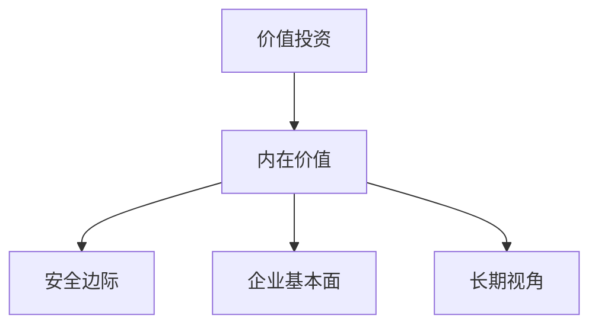

#### 1.1.2 巴菲特的“经济护城河”理论
经济护城河是指企业在行业中形成的持久竞争优势，使其能够长期保持高利润率。巴菲特认为，具有宽厚经济护城河的企业能够在宏观经济波动中保持稳健增长。

**经济护城河的核心要素（对比表格）：**
| 经济护城河类型 | 核心特征 | 示例行业 |
|----------------|----------|-----------|
| 成本优势       | 低成本生产模式 | 制造业 |
| 网络效应       | 用户越多，价值越高 | 社交媒体、电商平台 |
| 品牌影响力     | 强大品牌带来的客户忠诚度 | 快消品、奢侈品 |
| 技术壁垒       | 独特技术形成的竞争优势 | 高科技行业 |

#### 1.1.3 巴菲特分析框架的逻辑结构
巴菲特的分析框架以“护城河”为核心，结合宏观环境、行业趋势和企业基本面，构建投资决策模型。

**分析框架流程图（Mermaid）：**
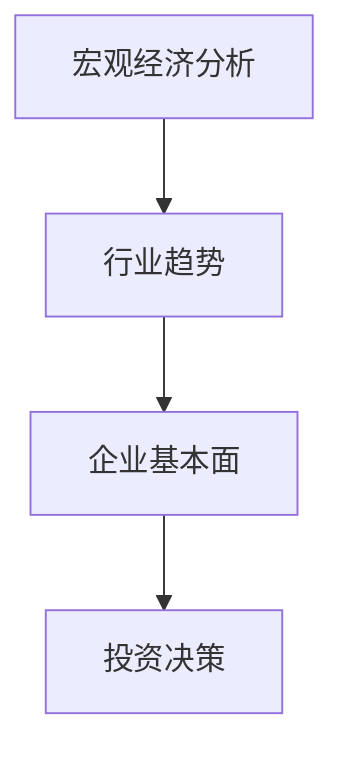

### 1.2 宏观经济分析的基本概念

#### 1.2.1 宏观经济的主要指标
宏观经济学主要关注GDP、失业率、通胀率、利率等指标，这些指标反映了经济的整体状况。

**常用宏观经济指标（对比表格）：**
| 指标类型 | 指标名称 | 定义 | 作用 |
|----------|----------|------|------|
| 经济增长 | GDP | 国内生产总值 | 衡量经济规模和增长 |
| 就业 | 失业率 | 失业人口占劳动力的比例 | 衡量就业市场健康 |
| 价格 | 通胀率 | 货币购买力下降的速度 | 衡量货币政策效果 |

#### 1.2.2 宏观经济周期的特征
经济周期分为衰退、复苏、繁荣和衰退四个阶段，不同阶段对企业投资的影响不同。

**经济周期的特征（Mermaid图）：**
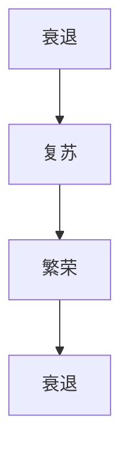

#### 1.2.3 巴菲特视角下的宏观经济分析
巴菲特认为，宏观经济分析是投资决策的重要组成部分。他特别关注利率、通胀和经济周期对企业盈利的影响。

**巴菲特宏观经济分析框架（Mermaid图）：**
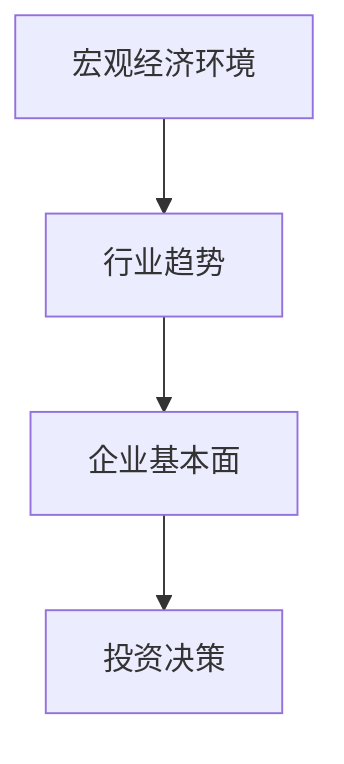

### 1.3 巴菲特分析方法的实践案例

#### 1.3.1 巴菲特的经典投资案例分析
**可口可乐案例：**
- **行业分析**：饮料行业具有稳定的消费需求和宽厚的经济护城河。
- **企业基本面**：可口可乐拥有强大的品牌影响力和全球分销网络。
- **投资决策**：巴菲特长期持有可口可乐股票，因其具备稳定的现金流和分红能力。

#### 1.3.2 巴菲特分析框架的实际应用
巴菲特的分析框架包括以下几个步骤：
1. **宏观经济分析**：评估当前经济环境和趋势。
2. **行业分析**：选择具有增长潜力的行业。
3. **企业分析**：筛选具有宽厚经济护城河的企业。
4. **估值分析**：计算企业的内在价值，确保安全边际。

#### 1.3.3 巴菲特分析框架的局限性
尽管巴菲特的分析框架在长期投资中表现出色，但在短期市场波动中可能表现不佳。此外，其方法依赖于对企业基本面的深入分析，这对普通投资者来说可能较为复杂。

### 1.4 本章小结
本章介绍了巴菲特的价值投资理念、经济护城河理论和宏观经济分析框架。这些理论为后续分析数字化转型对传统产业的影响奠定了基础。

---

## 第2章: 数字化转型的定义与特征

### 2.1 数字化转型的内涵与外延

#### 2.1.1 数字化转型的定义
数字化转型是指企业利用数字技术（如人工智能、大数据、云计算等）改造业务模式、流程、组织结构和文化，以实现创新和价值增长。

**数字化转型的核心要素（对比表格）：**
| 核心要素 | 定义 | 作用 |
|----------|------|------|
| 技术驱动 | 数字技术的应用 | 改善效率和创新 |
| 业务模式 | 数字化商业模式 | 提高客户体验和价值 |
| 组织文化 | 数字化文化 | 促进创新和协作 |

#### 2.1.2 数字化转型的核心特征
1. **数据驱动**：利用数据进行决策和优化。
2. **技术创新**：采用新兴技术（如AI、区块链）推动业务创新。
3. **客户-centric**：以客户为中心，提供个性化服务。

**数字化转型的特征（Mermaid图）：**
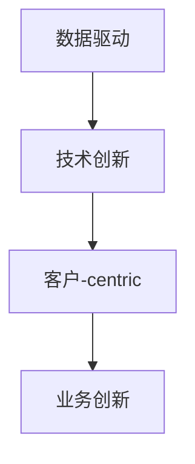

#### 2.1.3 数字化转型与传统转型的区别
传统转型通常关注流程优化，而数字化转型更注重技术驱动和业务模式创新。

**数字化转型与传统转型的对比（对比表格）：**
| 方面 | 传统转型 | 数字化转型 |
|------|----------|------------|
| 核心驱动力 | 流程优化 | 技术创新 |
| 重点 | 运营效率 | 业务模式创新 |
| 结果 | 局部优化 | 整体价值提升 |

### 2.2 数字化转型的技术驱动因素

#### 2.2.1 人工智能与大数据
人工智能（AI）和大数据技术为企业提供了智能化决策和个性化服务的能力。

**人工智能在数字化转型中的应用（Mermaid图）：**
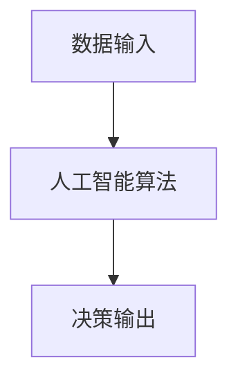

#### 2.2.2 云计算与物联网
云计算提供了弹性计算资源，物联网（IoT）实现了设备间的连接与数据共享。

**云计算与物联网的协同作用（Mermaid图）：**
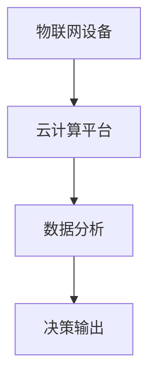

#### 2.2.3 区块链与数字支付
区块链技术提供了安全的交易记录和信任机制，数字支付则提高了交易效率。

**区块链在数字化转型中的应用（Mermaid图）：**
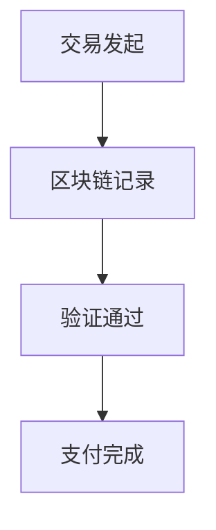

### 2.3 数字化转型对产业结构的影响

#### 2.3.1 数字化转型对传统产业的冲击
1. **制造行业**：传统制造企业面临智能化竞争的压力。
2. **零售行业**：线上零售冲击线下门店。
3. **金融行业**：互联网金融平台分流传统银行客户。

#### 2.3.2 数字化转型催生的新产业
1. **数字经济**：以数据为生产要素的新经济形态。
2. **数字服务**：基于数字技术的服务业。

#### 2.3.3 数字化转型对就业市场的重构
1. **低技能岗位减少**：自动化技术替代重复性工作。
2. **高技能岗位增加**：技术岗位需求上升。
3. **新兴职业出现**：数据分析师、AI工程师等新职业。

### 2.4 本章小结
本章从技术驱动和产业结构变化的角度，分析了数字化转型的定义、特征及其对传统产业的影响。数字化转型不仅是技术的应用，更是商业模式和组织结构的深刻变革。

---

## 第3章: 数字化转型对传统产业的影响

### 3.1 制造业的数字化转型

#### 3.1.1 制造业数字化转型的背景与现状
1. **背景**：全球制造业正经历智能化转型，工业4.0推动制造流程优化。
2. **现状**：部分企业已实现智能化生产，但中小企业仍面临技术鸿沟。

#### 3.1.2 制造业数字化转型的核心技术
1. **工业互联网**：实现设备、生产线、工厂、供应商、客户间的全面连接。
2. **智能制造**：通过自动化和AI优化生产流程。
3. **数字孪生**：构建虚拟模型进行预测性维护。

**工业互联网架构（Mermaid图）：**
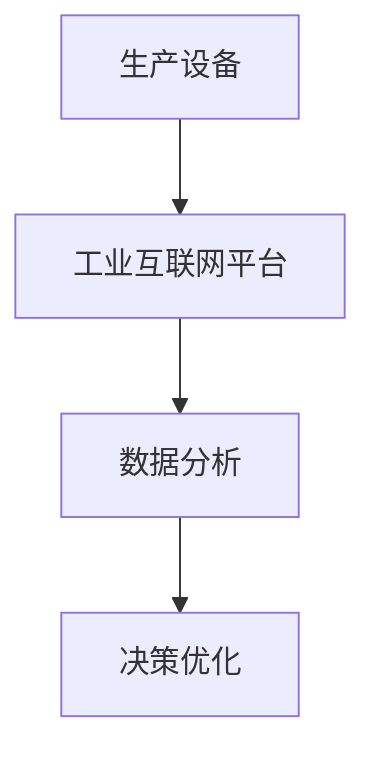

#### 3.1.3 制造业数字化转型的经济效益
1. **成本降低**：通过自动化减少人工成本。
2. **效率提升**：优化生产流程提高产出。
3. **创新能力强**：支持快速产品迭代。

### 3.2 金融行业的数字化转型

#### 3.2.1 金融行业数字化转型的背景
1. **背景**：传统金融机构面临互联网金融的挑战。
2. **现状**：部分银行已实现数字化服务，但风控和客户体验仍需提升。

#### 3.2.2 数字化转型对金融业务的影响
1. **客户体验**：线上银行、移动支付提升用户体验。
2. **风险管理**：大数据和AI优化信用评估和欺诈检测。
3. **运营效率**：自动化流程减少人工干预。

**金融数字化转型的流程优化（Mermaid图）：**
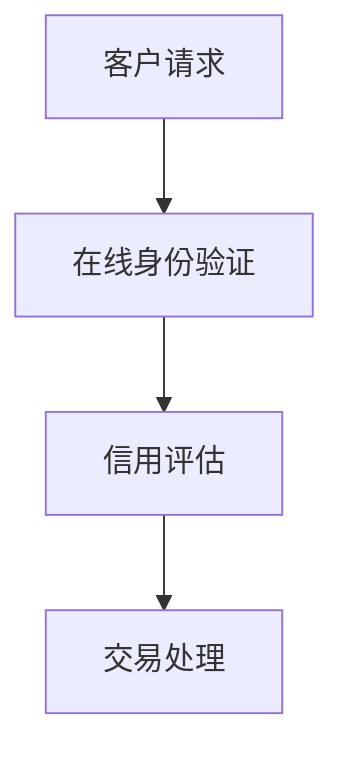

#### 3.2.3 金融行业数字化转型的挑战
1. **数据安全**：客户数据泄露风险增加。
2. **监管合规**：数字化转型需符合金融监管要求。
3. **技术投入**：需要大量资金和人力资源投入。

### 3.3 零售行业的数字化转型

#### 3.3.1 零售行业数字化转型的背景
1. **背景**：电商冲击传统零售模式。
2. **现状**：部分零售企业通过O2O（线上线下融合）提升竞争力。

#### 3.3.2 数字化转型对零售业务的影响
1. **客户画像**：通过大数据分析客户行为，实现精准营销。
2. **供应链优化**：数字化库存管理提高效率。
3. **全渠道服务**：整合线上线下的销售渠道。

**零售行业数字化转型的客户画像（Mermaid图）：**
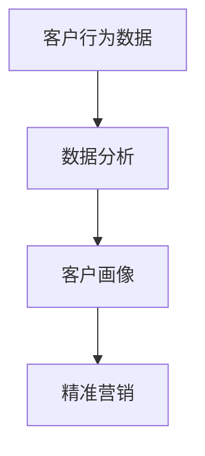

#### 3.3.3 零售行业数字化转型的成功案例
**案例：亚马逊**
- **数字化转型策略**：亚马逊通过大数据和AI优化供应链和客户体验。
- **成果**：实现高效的库存管理和个性化推荐。

### 3.4 本章小结
本章分析了制造业、金融和零售行业的数字化转型，探讨了技术应用、业务模式创新和经济效益。数字化转型不仅改变了传统产业的运营方式，还催生了新的商业机会。

---

## 第4章: 企业应对数字化转型的策略

### 4.1 数字化转型中的战略调整

#### 4.1.1 明确数字化转型目标
1. **短期目标**：优化现有业务流程。
2. **长期目标**：构建数字化竞争优势。

#### 4.1.2 制定数字化转型战略
1. **技术路线**：选择适合企业需求的技术架构。
2. **资源分配**：合理配置资金、人才和时间。

### 4.2 数字化转型中的组织变革

#### 4.2.1 组织结构优化
1. **扁平化管理**：减少层级，提高效率。
2. **跨部门协作**：建立跨部门团队推动数字化项目。

#### 4.2.2 人才培养与引进
1. **内部培训**：提升员工数字技能。
2. **外部招聘**：引进数字化人才。

### 4.3 数字化转型中的技术应用

#### 4.3.1 技术选型
1. **云计算**：选择适合企业的云服务提供商。
2. **大数据分析**：采用开源工具或商业软件进行数据分析。

#### 4.3.2 系统集成
1. **API集成**：通过API实现不同系统间的数据互通。
2. **数据可视化**：使用工具如Tableau进行数据展示。

### 4.4 数字化转型中的风险管理

#### 4.4.1 风险识别
1. **技术风险**：技术选型不当可能导致系统崩溃。
2. **数据风险**：数据泄露可能引发法律和财务问题。

#### 4.4.2 风险管理策略
1. **制定应急预案**：应对可能出现的技术故障。
2. **建立风险管理团队**：定期评估和优化风险管理措施。

### 4.5 本章小结
本章从战略、组织、技术和风险管理四个方面，探讨了企业在数字化转型中的应对策略。企业需要结合自身特点，制定切实可行的转型计划。

---

## 第5章: 巴菲特视角下的投资机会与风险管理

### 5.1 数字化转型下的投资机会

#### 5.1.1 投资机会识别
1. **技术驱动型行业**：如人工智能、云计算等领域。
2. **传统行业数字化转型**：如数字化制造、金融科技等。

#### 5.1.2 投资价值评估
1. **护城河分析**：选择具有宽厚经济护城河的企业。
2. **估值模型**：使用DCF模型评估企业价值。

**DCF模型公式（LaTeX）：**
$$
DCF = \frac{CF}{(1 + r)^t}
$$
其中，CF为现金流，r为贴现率，t为时间。

### 5.2 巴菲特视角下的风险管理

#### 5.2.1 风险识别
1. **市场风险**：宏观经济波动影响企业盈利。
2. **技术风险**：数字化转型的技术失败可能导致投资损失。

#### 5.2.2 风险管理策略
1. **分散投资**：通过投资不同行业和企业降低风险。
2. **长期持有**：避免短期波动带来的损失。

### 5.3 本章小结
本章从巴菲特的视角，分析了数字化转型中的投资机会和风险管理策略。投资者需要结合宏观经济分析和企业基本面，选择具有长期竞争优势的企业进行投资。

---

## 第6章: 总结与展望

### 6.1 本书总结
本书从巴菲特的宏观经济分析出发，探讨了数字化转型对传统产业的影响。通过分析制造业、金融和零售行业的数字化转型，提出了企业在数字化转型中的应对策略和投资机会。

### 6.2 对未来的展望
随着技术的不断进步，数字化转型将继续改变传统产业的商业模式和竞争格局。未来，企业需要更加注重技术创新和组织变革，以应对数字化转型带来的挑战和机遇。

### 6.3 作者建议
1. **持续学习**：关注数字化转型的最新技术和案例。
2. **实践应用**：将理论应用于实际投资和企业管理中。
3. **风险管理**：保持谨慎，避免盲目跟风。

---

## 作者信息

**作者：AI天才研究院/AI Genius Institute & 禅与计算机程序设计艺术 /Zen And The Art of Computer Programming**

---

以上是《巴菲特的宏观经济分析：数字化转型对传统产业的影响》的完整目录和文章内容，涵盖了从理论到实践、从分析到策略的全面探讨。希望对您有所帮助！

