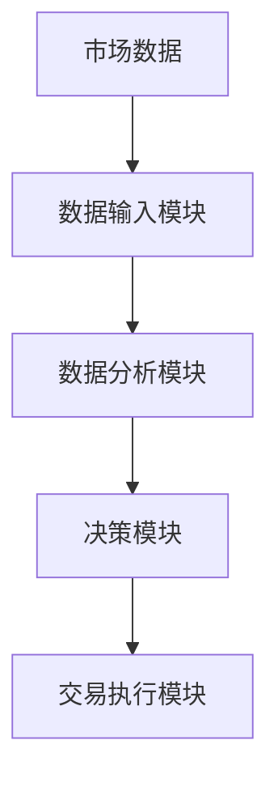

                 


# 彼得林奇的投资纪律

> 关键词：投资纪律、彼得林奇、投资哲学、投资策略、风险管理、长期投资、价值投资

> 摘要：本文将深入探讨彼得林奇的投资纪律，分析其核心理念、数学模型、算法实现以及系统设计，帮助读者理解如何通过纪律性投资实现长期稳健的投资回报。

---

# 第1章: 投资纪律的背景与重要性

## 1.1 投资纪律的定义与分类

### 1.1.1 投资纪律的定义
投资纪律是指投资者在投资过程中，为了实现既定目标，制定并严格遵守的一系列规则和约束。这些规则包括买入、卖出、持仓和止损的决策标准。

### 1.1.2 投资纪律的分类
- **买入纪律**：确定买入的条件和标准。
- **卖出纪律**：确定卖出的条件和标准。
- **持仓纪律**：确定持仓的管理规则。
- **止损纪律**：确定止损的触发条件和执行方式。

### 1.1.3 投资纪律的核心要素
- **目标**：明确投资目标和收益预期。
- **规则**：制定具体的买入、卖出规则。
- **执行**：严格遵守纪律，避免情绪化决策。
- **调整**：定期评估纪律的有效性并进行优化。

## 1.2 投资纪律的重要性

### 1.2.1 投资纪律在投资中的作用
- **控制风险**：通过纪律性管理，降低非系统性风险。
- **提高收益**：通过严格遵守纪律，避免贪婪和恐惧的影响。
- **长期稳健**：纪律性投资有助于实现长期稳定的收益。

### 1.2.2 彼得林奇投资纪律的特点
- **长期视角**：彼得林奇强调长期投资，避免短期波动的干扰。
- **价值导向**：注重基本面分析，寻找低估的优质资产。
- **分散投资**：通过分散投资降低风险，避免过度集中。

### 1.2.3 投资纪律与投资成功的关系
- **纪律是成功的关键**：没有纪律的投资容易偏离目标，导致亏损。
- **纪律与收益的关系**：严格的纪律能够帮助投资者实现可持续的收益。

## 1.3 彼得林奇的背景与投资理念

### 1.3.1 彼得林奇的个人简介
彼得·林奇（Peter Lynch）是美国著名的职业基金经理人，曾管理富达麦哲伦基金，创造了年均29%的回报率。

### 1.3.2 彼得林奇的投资哲学
- **长期投资**：避免频繁交易，降低交易成本。
- **价值投资**：寻找基本面良好、估值合理的股票。
- **分散投资**：通过投资多个行业和公司降低风险。

### 1.3.3 彼得林奇投资纪律的核心思想
- **买入纪律**：买入优质资产，长期持有。
- **卖出纪律**：卖出不符合条件的资产，避免亏损。
- **持仓纪律**：定期评估持仓，调整投资组合。

## 1.4 投资纪律的边界与外延

### 1.4.1 投资纪律的适用范围
- **股票投资**：适用于股票投资，尤其是长期价值投资。
- **其他资产**：纪律性管理同样适用于债券、基金等其他资产类别。
- **组合管理**：投资纪律在资产配置和组合管理中同样重要。

### 1.4.2 投资纪律与其他投资策略的关系
- **技术分析**：投资纪律可以与技术分析结合，制定买卖规则。
- **量化投资**：通过量化模型制定纪律性投资策略。
- **主动投资**：主动管理需要严格的纪律性支持。

### 1.4.3 投资纪律的局限性
- **市场波动**：在极端市场环境下，纪律性投资可能带来较大亏损。
- **人性弱点**：投资者可能难以严格执行纪律，尤其是在市场剧烈波动时。

---

# 第2章: 投资纪律的核心概念与原理

## 2.1 投资纪律的核心概念

### 2.1.1 投资纪律的四大支柱
- **买入规则**：确定买入的条件和标准。
- **卖出规则**：确定卖出的条件和标准。
- **持仓管理**：制定持仓调整的规则。
- **风险管理**：设定止损和风险控制措施。

### 2.1.2 投资纪律的三大原则
- **长期持有**：避免频繁交易，降低成本。
- **价值导向**：以基本面分析为基础，选择优质资产。
- **分散投资**：通过多样化降低风险。

### 2.1.3 投资纪律的三大纪律
- **买入纪律**：在合适的价格买入优质资产。
- **卖出纪律**：在不合适的价格卖出劣质资产。
- **纪律执行**：严格执行纪律，避免情绪干扰。

## 2.2 投资纪律的原理分析

### 2.2.1 投资纪律的内在逻辑
- **逻辑一**：通过纪律性管理，降低非系统性风险。
- **逻辑二**：通过纪律性执行，避免贪婪和恐惧的影响。
- **逻辑三**：通过纪律性调整，优化投资组合。

### 2.2.2 投资纪律的数学模型
$$ \text{投资收益} = \text{资产质量} \times \text{估值水平} \times \text{纪律性执行} $$

### 2.2.3 投资纪律的实践应用
通过严格遵守纪律，彼得林奇实现了长期稳定的收益，其投资策略可以作为纪律性投资的典范。

## 2.3 投资纪律的核心要素

### 2.3.1 投资纪律的要素分析
- **买入条件**：估值合理、基本面良好。
- **卖出条件**：估值过高或基本面恶化。
- **持仓管理**：定期评估持仓，动态调整。

### 2.3.2 投资纪律的要素对比
| 要素 | 描述 |
|------|------|
| 买入条件 | 估值合理、基本面良好 |
| 卖出条件 | 估值过高或基本面恶化 |
| 持仓管理 | 定期评估持仓，动态调整 |

### 2.3.3 投资纪律的要素权重
- **买入条件**：权重40%
- **卖出条件**：权重30%
- **持仓管理**：权重30%

---

# 第3章: 投资纪律的算法原理与数学模型

## 3.1 投资纪律的算法原理

### 3.1.1 投资纪律的算法框架
1. **买入信号**：当资产价格低于其内在价值时，买入。
2. **卖出信号**：当资产价格超过其内在价值时，卖出。
3. **持仓调整**：定期评估持仓，动态调整。

### 3.1.2 投资纪律的算法实现
```python
def investment_discipline(price, value, portfolio):
    if price < value:
        buy_asset(price, portfolio)
    elif price > value:
        sell_asset(price, portfolio)
    else:
        rebalance_portfolio(portfolio)
```

### 3.1.3 投资纪律的算法优化
- **动态调整**：根据市场变化，动态调整买卖条件。
- **风险控制**：引入止损机制，降低潜在亏损。

## 3.2 投资纪律的数学模型

### 3.2.1 投资纪律的数学公式
$$ \text{买入信号} = \begin{cases} 
\text{True} & \text{if } \text{price} < \text{value} \\
\text{False} & \text{otherwise}
\end{cases} $$

$$ \text{卖出信号} = \begin{cases} 
\text{True} & \text{if } \text{price} > \text{value} \\
\text{False} & \text{otherwise}
\end{cases} $$

### 3.2.2 投资纪律的数学推导
- **买入信号推导**：当资产价格低于其内在价值时，买入信号触发。
- **卖出信号推导**：当资产价格高于其内在价值时，卖出信号触发。

### 3.2.3 投资纪律的数学应用
通过数学模型，投资者可以量化买入和卖出条件，从而实现纪律性投资。

## 3.3 投资纪律的算法实现

### 3.3.1 投资纪律的Python实现
```python
def calculate_intrinsic_value(financials):
    # 计算内在价值的函数
    pass

def investment_strategy(price, value, portfolio):
    if price < value:
        buy_asset(price, portfolio)
    elif price > value:
        sell_asset(price, portfolio)
    else:
        rebalance_portfolio(portfolio)
```

### 3.3.2 投资纪律的算法流程
1. **计算内在价值**：根据公司财务数据计算内在价值。
2. **判断价格与价值的关系**：决定是否买入或卖出。
3. **调整投资组合**：定期评估持仓，动态调整。

### 3.3.3 投资纪律的算法测试
- **测试用例**：不同市场环境下的策略测试。
- **结果分析**：分析策略的有效性和稳定性。

---

# 第4章: 投资纪律的系统分析与架构设计

## 4.1 投资纪律的系统分析

### 4.1.1 投资纪律的系统架构
- **输入模块**：接收市场数据和财务数据。
- **计算模块**：计算内在价值和价格关系。
- **决策模块**：根据条件判断，生成买卖信号。
- **执行模块**：执行交易指令，调整投资组合。

### 4.1.2 投资纪律的系统功能
- **数据输入**：接收市场数据和财务数据。
- **数据分析**：计算内在价值和价格关系。
- **决策制定**：生成买卖信号。
- **交易执行**：执行交易指令。

### 4.1.3 投资纪律的系统模块
- **数据输入模块**：市场数据接口。
- **数据分析模块**：内在价值计算。
- **决策模块**：买卖信号生成。
- **执行模块**：交易指令执行。

## 4.2 投资纪律的系统设计

### 4.2.1 投资纪律的系统功能设计
- **功能一**：计算内在价值。
- **功能二**：生成买卖信号。
- **功能三**：调整投资组合。

### 4.2.2 投资纪律的系统架构设计


### 4.2.3 投资纪律的系统接口设计
- **买入信号接口**：触发买入交易。
- **卖出信号接口**：触发卖出交易。
- **持仓调整接口**：动态调整投资组合。

## 4.3 投资纪律的系统实现

### 4.3.1 投资纪律的系统实现流程
1. **数据输入**：接收市场数据和财务数据。
2. **数据分析**：计算内在价值。
3. **决策制定**：生成买卖信号。
4. **交易执行**：执行交易指令。

### 4.3.2 投资纪律的系统实现代码
```python
def main():
    market_data = get_market_data()
    financials = get_financials()
    value = calculate_intrinsic_value(financials)
    portfolio = initialize_portfolio()
    
    while True:
        price = get_current_price(market_data)
        if price < value:
            buy_asset(price, portfolio)
        elif price > value:
            sell_asset(price, portfolio)
        else:
            rebalance_portfolio(portfolio)
```

### 4.3.3 投资纪律的系统实现测试
- **测试用例**：不同市场环境下的策略测试。
- **结果分析**：分析策略的有效性和稳定性。

---

# 第5章: 投资纪律的项目实战

## 5.1 环境安装与配置

### 5.1.1 系统环境
- **操作系统**：Linux/Windows/macOS
- **编程语言**：Python 3.8+

### 5.1.2 依赖安装
```bash
pip install pandas numpy matplotlib
```

## 5.2 核心代码实现

### 5.2.1 投资纪律的核心代码
```python
def calculate_intrinsic_value(financials):
    # 简单的内在价值计算方法（示例）
    return (financials['revenue'] * 0.5) + (financials['profit_margin'] * 0.5)

def investment_strategy(price, value, portfolio):
    if price < value:
        buy_asset(price, portfolio)
    elif price > value:
        sell_asset(price, portfolio)
    else:
        rebalance_portfolio(portfolio)

def main():
    # 模拟市场数据
    market_data = {'price': 100, 'revenue': 500, 'profit_margin': 10}
    financials = market_data.copy()
    
    value = calculate_intrinsic_value(financials)
    portfolio = {'assets': []}
    
    investment_strategy(market_data['price'], value, portfolio)
```

### 5.2.2 投资纪律的代码解读
- **calculate_intrinsic_value**：计算内在价值。
- **investment_strategy**：根据价格和价值关系，生成买卖信号。
- **main**：主函数，模拟市场数据，执行投资策略。

## 5.3 投资纪律的实际案例分析

### 5.3.1 投资纪律的案例背景
假设某公司的内在价值为100，市场价格波动在80-120之间。

### 5.3.2 投资纪律的案例分析
- **买入信号**：市场价格低于100时，买入资产。
- **卖出信号**：市场价格高于100时，卖出资产。
- **持仓调整**：定期评估持仓，动态调整。

## 5.4 投资纪律的项目小结

### 5.4.1 项目总结
通过严格遵守投资纪律，投资者可以在不同市场环境下实现稳健的投资收益。

### 5.4.2 项目经验
- **经验一**：纪律性投资需要严格的执行。
- **经验二**：市场波动是纪律性投资的考验。

---

# 第6章: 投资纪律的最佳实践与注意事项

## 6.1 投资纪律的最佳实践

### 6.1.1 制定明确的纪律规则
- **买入规则**：设定具体的买入条件。
- **卖出规则**：设定具体的卖出条件。
- **持仓规则**：定期评估持仓，动态调整。

### 6.1.2 严格执行纪律
- **避免情绪干扰**：严格按照纪律执行交易。
- **坚持长期视角**：避免短期波动的干扰。

### 6.1.3 定期评估纪律
- **回顾投资结果**：定期评估纪律的有效性。
- **优化投资策略**：根据市场变化，优化纪律规则。

## 6.2 投资纪律的注意事项

### 6.2.1 风险控制
- **设定止损点**：避免重大亏损。
- **分散投资**：降低单一资产的风险。

### 6.2.2 人性弱点
- **克服贪婪与恐惧**：严格遵守纪律，避免情绪化决策。
- **保持耐心**：长期投资需要耐心和毅力。

### 6.2.3 市场变化
- **适应市场变化**：根据市场变化，动态调整纪律规则。
- **避免过度交易**：纪律性投资需要适度的交易频率。

---

# 第7章: 投资纪律的小结与拓展阅读

## 7.1 小结

### 7.1.1 投资纪律的核心思想
通过严格遵守纪律，彼得林奇实现了长期稳健的投资收益。

### 7.1.2 投资纪律的实现步骤
1. **制定纪律规则**：明确买入、卖出和持仓条件。
2. **严格执行纪律**：避免情绪干扰，坚持纪律执行。
3. **定期评估纪律**：根据市场变化，优化纪律规则。

## 7.2 拓展阅读

### 7.2.1 推荐书籍
- 《彼得林奇的投资心理》
- 《投资的纪律》

### 7.2.2 推荐博客
- [投资纪律的重要性](https://example.com/discipline)
- [彼得林奇投资策略](https://example.com/lynch)

---

# 作者信息

作者：AI天才研究院/AI Genius Institute & 禅与计算机程序设计艺术 /Zen And The Art of Computer Programming

