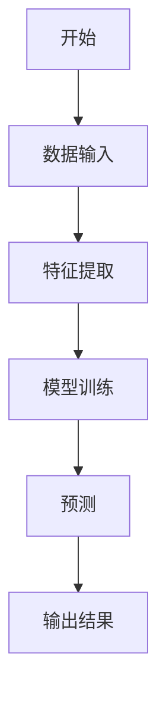
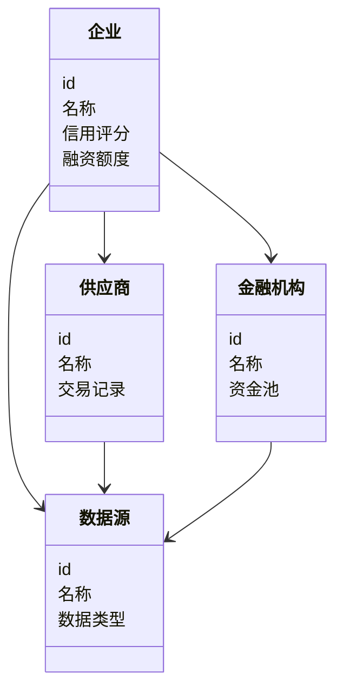
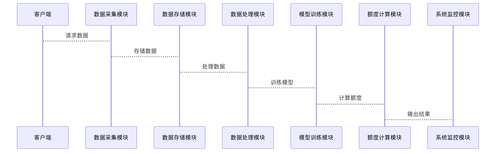

                 


# 智能供应链金融额度管理平台

**关键词**：智能供应链金融、额度管理、信用评估、机器学习、系统架构、项目实战

**摘要**：本文将详细介绍智能供应链金融额度管理平台的构建过程，涵盖从背景介绍到项目实战的各个方面。通过分析供应链金融的现状与挑战，探讨智能供应链金融的核心概念与算法原理，详细讲解系统架构设计与项目实战，最终为读者提供一套完整的解决方案。

---

# 第一部分：智能供应链金融额度管理平台概述

## 第1章：智能供应链金融额度管理平台背景介绍

### 1.1 供应链金融的现状与挑战
#### 1.1.1 供应链金融的定义与特点
供应链金融是指通过整合供应链上下游企业，利用金融机构提供的资金支持，优化企业间的资金流动和资源配置。其特点包括高效性、协同性和风险可控性。

#### 1.1.2 传统供应链金融的痛点
传统供应链金融存在以下问题：
- 信息不对称，导致信用评估困难。
- 资金流动效率低，难以满足企业实时需求。
- 缺乏智能化手段，难以实现精准的额度管理。

#### 1.1.3 智能化技术在供应链金融中的应用前景
随着人工智能、大数据和区块链等技术的发展，智能化技术为供应链金融带来了新的机遇，能够有效解决传统模式中的痛点。

### 1.2 智能供应链金融的定义与核心要素
#### 1.2.1 智能供应链金融的定义
智能供应链金融是通过智能化技术手段，优化供应链上下游企业的资金流动和信用评估，实现高效、精准的金融服务。

#### 1.2.2 核心要素：企业、供应商、金融机构、数据源
智能供应链金融的核心要素包括：
- **企业**：供应链中的核心企业。
- **供应商**：提供原材料或服务的企业。
- **金融机构**：提供资金支持的银行或金融科技公司。
- **数据源**：包括供应链交易数据、企业信用数据等。

#### 1.2.3 平台的功能与目标
平台的功能包括：
- 数据采集与整合。
- 信用评估与风险控制。
- 额度计算与动态调整。
- 资金分配与监控。

平台的目标是实现供应链金融的智能化、高效化和透明化。

### 1.3 供应链金融额度管理的重要性
#### 1.3.1 供应链金融额度管理的定义
额度管理是指根据企业的信用状况和供应链的交易数据，动态调整其可获得的融资额度。

#### 1.3.2 额度管理的核心问题与挑战
- 如何准确评估企业的信用风险。
- 如何动态调整额度以适应供应链的变化。
- 如何确保额度管理的实时性和准确性。

#### 1.3.3 智能化额度管理的优势
智能化额度管理能够通过机器学习算法，实时分析供应链数据，实现精准的额度计算和动态调整。

### 1.4 本章小结
本章介绍了供应链金融的现状与挑战，提出了智能供应链金融的概念，并详细阐述了额度管理的重要性和智能化的优势。

---

## 第2章：智能供应链金融额度管理平台的核心概念与联系

### 2.1 核心概念原理
#### 2.1.1 供应链金融的三要素：信用、数据、资金
供应链金融的核心要素包括：
- **信用**：企业的信用状况是融资的基础。
- **数据**：供应链中的交易数据是信用评估的重要依据。
- **资金**：金融机构提供的融资资金是供应链运行的关键。

#### 2.1.2 智能额度管理的算法原理
智能额度管理通过机器学习算法，结合供应链数据和企业信用数据，计算企业的融资额度。

#### 2.1.3 平台的业务流程与逻辑
平台的业务流程包括：
1. 数据采集：整合供应链中的交易数据和企业信用数据。
2. 信用评估：基于机器学习模型评估企业的信用风险。
3. 额度计算：根据信用评估结果和供应链数据计算融资额度。
4. 动态调整：根据实时数据动态调整融资额度。

### 2.2 核心概念属性特征对比
#### 2.2.1 供应链金融与传统金融的对比
| 对比维度 | 供应链金融 | 传统金融 |
|----------|------------|-----------|
| 服务对象 | 供应链上下游企业 | 单一企业或个人 |
| 资金流动 | 高效、协同 | 低效、分散 |

#### 2.2.2 智能平台与传统平台的对比
| 对比维度 | 智能平台 | 传统平台 |
|----------|----------|-----------|
| 技术手段 | 人工智能、大数据 | 人工审核、线下流程 |
| 处理效率 | 高效、实时 | 低效、滞后 |

#### 2.2.3 额度管理的动态调整机制
动态调整机制包括：
- 基于时间序列的预测模型。
- 基于实时数据的调整算法。

### 2.3 ER实体关系图
```mermaid
erDiagram
    actor 企业
    actor 供应商
    actor 金融机构
    actor 数据源
    boundary 智能供应链金融平台
    database 供应链数据
    database 企业信用数据
    database 交易数据
    boundary 智能额度管理系统
    database 额度计算模型
    boundary 用户界面
    boundary API接口
    actor 管理员
    actor 客户
    actor 第三方服务
    智能供应链金融平台 --> 供应链数据
    智能供应链金融平台 --> 企业信用数据
    智能供应链金融平台 --> 交易数据
    智能供应链金融平台 --> 额度计算模型
    智能供应链金融平台 --> 用户界面
    智能供应链金融平台 --> API接口
```

### 2.4 本章小结
本章详细阐述了智能供应链金融的核心概念和原理，并通过对比分析和实体关系图展示了各要素之间的联系。

---

## 第3章：智能供应链金融额度管理平台的算法原理

### 3.1 额度计算算法概述
#### 3.1.1 基于信用评估的额度计算
信用评估是额度计算的核心，常用的方法包括：
- **线性回归模型**：用于预测企业的信用评分。
- **随机森林模型**：用于分类企业的信用风险。

#### 3.1.2 基于交易数据的动态调整
动态调整算法能够根据实时交易数据，实时调整企业的融资额度。

#### 3.1.3 基于机器学习的预测模型
机器学习模型可以用于预测企业的未来信用状况，从而优化融资额度。

### 3.2 信用评估算法
#### 3.2.1 信用评分模型
信用评分模型的数学公式如下：
$$ \text{信用评分} = \alpha \cdot \text{历史信用记录} + \beta \cdot \text{当前交易数据} + \gamma \cdot \text{其他因素} $$

#### 3.2.2 机器学习算法（如随机森林、XGBoost）
随机森林算法的实现步骤如下：
1. 数据预处理：清洗和特征提取。
2. 模型训练：使用随机森林算法训练信用评估模型。
3. 模型预测：根据输入数据预测企业的信用评分。

#### 3.2.3 算法实现步骤
```python
import pandas as pd
from sklearn.ensemble import RandomForestClassifier
from sklearn.metrics import accuracy_score

# 数据预处理
data = pd.read_csv('credit_data.csv')
X = data.drop('target', axis=1)
y = data['target']

# 模型训练
model = RandomForestClassifier()
model.fit(X, y)

# 模型预测
predicted = model.predict(X)
print("准确率：", accuracy_score(y, predicted))
```

### 3.3 动态调整算法
#### 3.3.1 基于时间序列的预测
时间序列预测模型的数学公式如下：
$$ \hat{y}_t = \alpha \cdot y_{t-1} + \beta \cdot y_{t-2} + \gamma \cdot \text{其他因素} $$

#### 3.3.2 基于实时数据的调整
实时数据调整算法的实现步骤如下：
1. 数据采集：实时采集供应链中的交易数据。
2. 数据处理：清洗和特征提取。
3. 额度调整：根据实时数据动态调整企业的融资额度。

### 3.4 算法流程图


### 3.5 本章小结
本章详细介绍了智能供应链金融额度管理平台的算法原理，包括信用评估算法和动态调整算法，并通过代码和流程图展示了算法的实现过程。

---

## 第4章：智能供应链金融额度管理平台的系统架构设计

### 4.1 问题场景介绍
供应链金融额度管理平台需要处理以下问题：
- 数据来源多样，数据格式不统一。
- 系统需要实时处理大量数据，对性能要求高。
- 系统需要具备良好的扩展性和可维护性。

### 4.2 项目介绍
本项目旨在构建一个智能供应链金融额度管理平台，实现以下功能：
- 数据采集与整合。
- 信用评估与风险控制。
- 额度计算与动态调整。
- 系统监控与维护。

### 4.3 系统功能设计
#### 4.3.1 领域模型mermaid类图


#### 4.3.2 系统架构设计mermaid架构图


#### 4.3.3 系统接口设计
系统接口包括：
- 数据接口：与数据源对接，获取供应链数据。
- API接口：提供给外部系统调用，获取融资额度。

#### 4.3.4 系统交互mermaid序列图


### 4.4 本章小结
本章详细介绍了智能供应链金融额度管理平台的系统架构设计，包括领域模型、系统架构、接口设计和系统交互。

---

## 第5章：智能供应链金融额度管理平台的项目实战

### 5.1 环境安装
项目实战需要以下环境：
- Python 3.8及以上版本
- Jupyter Notebook
- 数据库：MySQL或PostgreSQL
- 开发工具：PyCharm或VS Code

### 5.2 系统核心实现源代码
#### 5.2.1 数据采集模块
```python
import requests
import json

def get_supply_chain_data():
    response = requests.get('http://data_source/api')
    data = json.loads(response.text)
    return data
```

#### 5.2.2 数据处理模块
```python
import pandas as pd

def process_data(data):
    df = pd.DataFrame(data)
    df.dropna(inplace=True)
    return df
```

#### 5.2.3 模型训练模块
```python
from sklearn.ensemble import RandomForestClassifier

def train_model(data):
    X = data.drop('target', axis=1)
    y = data['target']
    model = RandomForestClassifier()
    model.fit(X, y)
    return model
```

#### 5.2.4 额度计算模块
```python
def calculate_credit_limit(model, new_data):
    predicted = model.predict(new_data)
    credit_limit = predicted * 100000  # 示例：将预测结果转换为融资额度
    return credit_limit
```

### 5.3 案例分析
#### 5.3.1 数据分析与建模
案例分析步骤：
1. 数据清洗：去除缺失值和异常值。
2. 特征提取：提取关键特征变量。
3. 模型训练：训练随机森林模型。
4. 模型预测：预测企业的信用评分和融资额度。

#### 5.3.2 案例解读
案例解读：
- 数据来源：某制造企业的供应链数据。
- 数据处理：清洗和特征提取。
- 模型训练：随机森林模型。
- 模型预测：企业的信用评分为0.8，融资额度为500万元。

### 5.4 项目小结
本章通过项目实战展示了智能供应链金融额度管理平台的实现过程，包括环境安装、核心代码实现和案例分析。

---

## 第6章：智能供应链金融额度管理平台的最佳实践、小结与注意事项

### 6.1 最佳实践
- 数据质量管理：确保数据的准确性和完整性。
- 模型优化：通过调参和优化模型提高预测精度。
- 系统维护：定期更新模型和监控系统运行状态。

### 6.2 小结
本章总结了智能供应链金融额度管理平台的构建过程，包括算法原理、系统架构和项目实战。

### 6.3 注意事项
- 数据隐私和安全问题。
- 模型的可解释性和透明度。
- 系统的可扩展性和维护性。

### 6.4 拓展阅读
- 供应链金融的最新研究。
- 机器学习在金融领域的应用。
- 大数据技术在供应链管理中的应用。

---

# 作者：AI天才研究院/AI Genius Institute & 禅与计算机程序设计艺术 /Zen And The Art of Computer Programming

