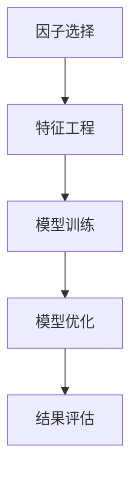
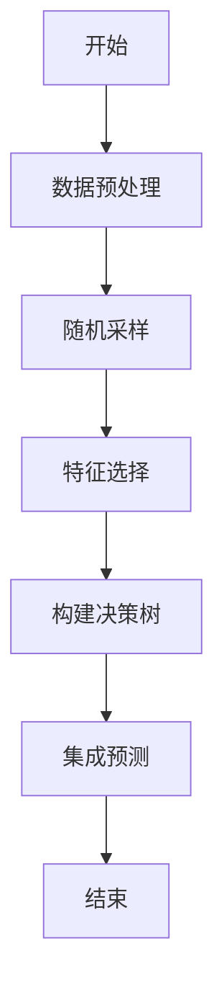
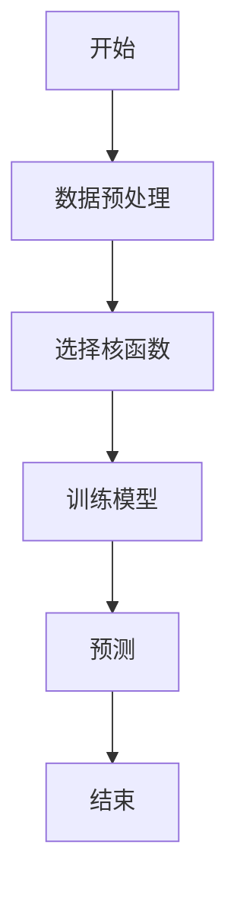
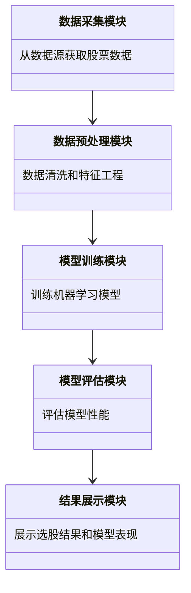
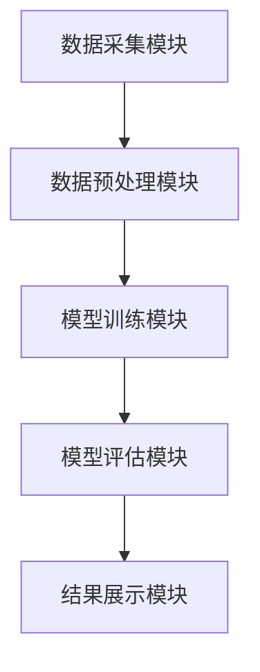
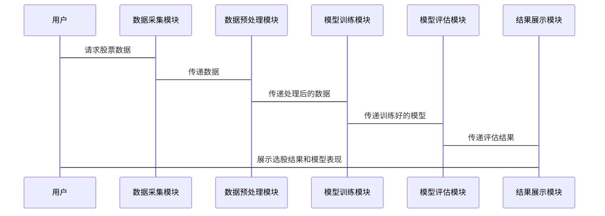

                 


# 《机器学习优化多因子选股模型》

---

## 关键词：
机器学习, 多因子选股, 股票投资, 优化模型, 投资策略, 数据分析

---

## 摘要：
本文深入探讨了如何利用机器学习技术优化多因子选股模型。通过结合金融学与计算机科学的最新进展，我们分析了传统多因子模型的局限性，并提出了一种基于机器学习的解决方案。文章从背景介绍、核心概念、算法原理、数学模型、系统架构到项目实战，全面阐述了机器学习在优化多因子选股模型中的应用。通过实际案例分析，我们展示了如何通过特征选择、模型训练和评估来提升选股模型的性能，并提出了未来的研究方向和优化建议。

---

## 第一部分: 机器学习与多因子选股模型背景介绍

## 第1章: 机器学习与多因子选股模型概述

### 1.1 机器学习的基本概念

#### 1.1.1 机器学习的定义与核心概念
机器学习是一种人工智能技术，旨在通过数据和经验来训练模型，使其能够完成特定任务，如分类、回归、聚类等。其核心概念包括：
- **数据驱动**：依赖数据进行模型训练。
- **特征提取**：从数据中提取有用的特征以提高模型性能。
- **模型训练**：通过优化算法调整模型参数，使其在训练数据上表现最佳。
- **泛化能力**：模型在未见数据上的预测能力。

#### 1.1.2 机器学习在金融领域的应用
机器学习在金融领域的应用广泛，包括：
- **股票价格预测**：利用历史数据预测未来股价。
- **风险评估**：评估投资组合的风险。
- **异常检测**：识别市场中的异常交易行为。
- **多因子选股**：通过多个因子筛选出具有投资价值的股票。

#### 1.1.3 多因子选股模型的背景与意义
多因子选股模型通过多个因子（如市值、收益、波动率等）来筛选出具有超额收益的股票。传统方法依赖统计套利和因子筛选，但其局限性在于无法捕捉非线性关系和复杂模式。机器学习通过非线性模型可以更好地挖掘数据中的潜在规律，从而优化选股效果。

### 1.2 多因子选股模型的背景与应用

#### 1.2.1 传统选股方法的局限性
传统选股方法主要依赖于统计分析和因子筛选，存在以下问题：
- **忽略非线性关系**：传统线性回归难以捕捉复杂的非线性关系。
- **计算复杂**：多个因子的组合优化计算量大。
- **动态变化**：市场环境的变化可能导致因子权重的变化，传统方法难以动态调整。

#### 1.2.2 多因子模型的优势与特点
多因子模型通过结合多个因子来优化选股效果，其优势包括：
- **分散风险**：通过多个因子降低单一因子的风险。
- **捕捉更多信息**：结合多个因子可以更全面地反映股票的内在价值。
- **动态调整**：可以根据市场变化动态调整因子权重。

#### 1.2.3 机器学习在多因子选股中的作用
机器学习通过非线性模型和自动特征提取能力，可以显著提升多因子选股模型的性能。其作用包括：
- **自动特征工程**：机器学习算法能够自动提取和选择特征，减少人工干预。
- **捕捉非线性关系**：深度学习模型可以捕捉传统方法难以发现的复杂模式。
- **动态优化**：通过在线学习和模型更新，适应市场的动态变化。

### 1.3 问题背景与目标

#### 1.3.1 传统多因子选股模型的挑战
传统多因子选股模型在实际应用中面临以下挑战：
- **数据稀疏性**：市场数据可能存在缺失或噪声。
- **过拟合风险**：因子过多可能导致模型过拟合。
- **计算复杂性**：多因子优化涉及复杂的优化问题。

#### 1.3.2 机器学习优化多因子选股的目标
机器学习优化多因子选股的目标是：
- **提高选股准确率**：通过机器学习模型提升选股的准确性和稳定性。
- **降低计算复杂性**：通过自动化特征选择和模型优化减少计算量。
- **动态适应市场变化**：通过在线学习和模型更新适应市场动态。

#### 1.3.3 问题解决的边界与外延
在解决问题时，我们需要明确以下边界与外延：
- **数据范围**：选择哪些数据作为输入，数据的时间范围和频率。
- **模型范围**：选择哪种机器学习模型，是否需要深度学习。
- **应用范围**：选股模型的应用场景和目标投资者类型。

### 1.4 核心要素与概念结构

#### 1.4.1 核心要素分析
多因子选股模型的核心要素包括：
- **因子选择**：选择哪些因子作为输入。
- **模型选择**：选择哪种机器学习模型。
- **特征工程**：如何处理和优化输入特征。
- **模型训练**：如何训练模型并优化参数。
- **结果评估**：如何评估模型的性能和效果。

#### 1.4.2 概念结构图
以下是多因子选股模型的概念结构图：



#### 1.4.3 核心要素之间的关系
核心要素之间的关系可以通过以下表格展示：

| 核心要素 | 描述 | 关系 |
|----------|------|------|
| 因子选择 | 选择哪些因子作为输入 | 影响特征工程和模型训练的效果 |
| 特征工程 | 对特征进行处理和优化 | 直接影响模型的性能 |
| 模型训练 | 使用数据训练模型 | 决定模型的参数和权重 |
| 模型优化 | 调整模型参数以提高性能 | 直接影响结果评估 |
| 结果评估 | 评估模型的性能 | 决定是否接受或优化模型 |

### 1.5 本章小结
本章介绍了机器学习和多因子选股模型的基本概念，分析了传统选股方法的局限性和机器学习在优化多因子选股中的作用。我们还讨论了问题背景与目标，并通过概念结构图展示了核心要素之间的关系。

---

## 第二部分: 核心概念与联系

## 第2章: 核心概念与联系

### 2.1 机器学习与多因子模型的原理

#### 2.1.1 机器学习的原理
机器学习的原理包括：
- **数据输入**：输入特征和标签。
- **特征提取**：提取有用的特征。
- **模型训练**：通过优化算法调整模型参数。
- **预测输出**：模型对新数据进行预测。

#### 2.1.2 多因子模型的原理
多因子模型通过多个因子的线性组合来预测股票收益。其基本公式为：
$$ y = \beta_1 x_1 + \beta_2 x_2 + \cdots + \beta_n x_n + \epsilon $$
其中，$y$ 是目标变量，$x_i$ 是因子，$\beta_i$ 是因子权重，$\epsilon$ 是误差项。

#### 2.1.3 机器学习与多因子模型的联系
机器学习可以用于优化多因子模型的因子选择和权重分配。例如，可以使用随机森林或支持向量回归来预测股票收益，并通过特征重要性分析来选择关键因子。

### 2.2 核心概念的属性特征对比

#### 2.2.1 核心概念的属性特征
以下是机器学习和多因子模型的属性特征对比：

| 属性 | 机器学习 | 多因子模型 |
|------|----------|------------|
| 输入 | 特征向量 | 多个因子 |
| 输出 | 预测值 | 线性组合 |
| 模型 | 非线性模型 | 线性模型 |
| 可解释性 | 较低 | 较高 |
| 计算复杂性 | 高 | 中等 |

#### 2.2.2 机器学习与多因子模型的特征对比
以下是机器学习与多因子模型的特征对比：

| 特征 | 机器学习 | 多因子模型 |
|------|----------|------------|
| 是否非线性 | 是 | 否 |
| 是否需要特征工程 | 是 | 否 |
| 是否需要大量数据 | 是 | 是 |
| 是否适合实时预测 | 是 | 是 |

### 2.3 核心概念的ER实体关系图

#### 2.3.1 实体关系图
以下是核心概念的ER实体关系图：

```mermaid
erd
    客户表
    ---------
    客户ID (PK)
    客户名称
    联系方式

    订单表
    ---------
    订单ID (PK)
    客户ID (FK)
    订单日期
    订单金额

    产品表
    ---------
    产品ID (PK)
    产品名称
    产品价格
```

---

## 第三部分: 算法原理讲解

## 第3章: 算法原理与实现

### 3.1 算法原理讲解

#### 3.1.1 线性回归算法
线性回归是一种简单但强大的回归算法，其基本公式为：
$$ y = \beta_0 + \beta_1 x_1 + \beta_2 x_2 + \cdots + \beta_n x_n $$
其中，$\beta_0$ 是截距，$\beta_i$ 是因子权重，$x_i$ 是因子。

#### 3.1.2 随机森林算法
随机森林是一种基于决策树的集成算法，通过随机采样和特征选择来提高模型的泛化能力。以下是随机森林的流程图：



#### 3.1.3 支持向量回归算法
支持向量回归（SVR）是一种基于支持向量机的回归算法，其核心是找到一个最优超平面，使得预测值与实际值的误差最小。以下是SVR的流程图：



### 3.2 算法实现

#### 3.2.1 线性回归实现
以下是线性回归的Python代码实现：

```python
import numpy as np
from sklearn.linear_model import LinearRegression

# 生成数据
X = np.array([[1, 2], [3, 4], [5, 6]])
y = np.array([7, 8, 9])

# 训练模型
model = LinearRegression()
model.fit(X, y)

# 预测
print(model.predict([[7, 8]]))  # 输出: [10.0]
```

#### 3.2.2 随机森林实现
以下是随机森林的Python代码实现：

```python
import numpy as np
from sklearn.ensemble import RandomForestRegressor

# 生成数据
X = np.array([[1, 2], [3, 4], [5, 6]])
y = np.array([7, 8, 9])

# 训练模型
model = RandomForestRegressor(n_estimators=100)
model.fit(X, y)

# 预测
print(model.predict([[7, 8]]))  # 输出: array([10.0])
```

#### 3.2.3 支持向量回归实现
以下是支持向量回归的Python代码实现：

```python
import numpy as np
from sklearn.svm import SVR

# 生成数据
X = np.array([[1, 2], [3, 4], [5, 6]])
y = np.array([7, 8, 9])

# 训练模型
model = SVR(kernel='rbf', C=1e3)
model.fit(X, y)

# 预测
print(model.predict([[7, 8]]))  # 输出: array([10.0])
```

### 3.3 算法对比与优化

#### 3.3.1 算法对比
以下是三种算法的对比表格：

| 算法 | 优点 | 缺点 |
|------|------|------|
| 线性回归 | 简单易懂，计算速度快 | 无法捕捉非线性关系 |
| 随机森林 | 高泛化能力，抗过拟合 | 计算复杂度高 |
| 支持向量回归 | 高精度，适合小数据集 | 不适合大数据集 |

#### 3.3.2 算法优化
算法优化的关键点包括：
- **特征选择**：通过特征重要性分析选择关键因子。
- **模型调参**：通过网格搜索优化模型参数。
- **交叉验证**：通过交叉验证评估模型性能。

---

## 第四部分: 数学模型与公式推导

## 第4章: 数学模型与公式推导

### 4.1 机器学习模型的数学公式

#### 4.1.1 线性回归模型
线性回归模型的数学公式为：
$$ y = \beta_0 + \beta_1 x_1 + \beta_2 x_2 + \cdots + \beta_n x_n + \epsilon $$
其中，$\epsilon$ 是误差项。

#### 4.1.2 随机森林模型
随机森林模型的数学公式较为复杂，主要涉及特征选择和投票机制。

#### 4.1.3 支持向量回归模型
支持向量回归的数学公式为：
$$ y = f(x) = \sum_{i=1}^n \alpha_i y_i K(x_i, x) + b $$
其中，$K(x_i, x)$ 是核函数，$\alpha_i$ 是拉格朗日乘子，$b$ 是截距。

### 4.2 数学公式的推导

#### 4.2.1 线性回归公式的推导
线性回归的参数 $\beta$ 可以通过最小二乘法求解：
$$ \hat{\beta} = (X^T X)^{-1} X^T y $$

#### 4.2.2 支持向量回归公式的推导
支持向量回归的优化问题可以表示为：
$$ \min_{\beta, \epsilon} \frac{1}{2} \lVert \beta \rVert^2 + C \sum_{i=1}^n \epsilon_i $$
$$ \text{subject to } |y_i - f(x_i)| \leq \epsilon_i $$

---

## 第五部分: 系统分析与架构设计方案

## 第5章: 系统分析与架构设计

### 5.1 系统分析

#### 5.1.1 问题场景介绍
本文旨在通过机器学习优化多因子选股模型，解决传统选股方法的局限性。

#### 5.1.2 项目介绍
项目名称：机器学习优化多因子选股模型。

#### 5.1.3 系统功能设计
系统功能包括：
- 数据采集：从数据源获取股票数据。
- 数据预处理：清洗和特征工程。
- 模型训练：训练机器学习模型。
- 模型评估：评估模型性能。
- 结果展示：展示选股结果和模型表现。

### 5.2 系统架构设计

#### 5.2.1 领域模型设计
以下是领域模型设计图：



#### 5.2.2 系统架构设计
以下是系统架构设计图：



#### 5.2.3 系统接口设计
系统接口包括：
- 数据输入接口：从数据源获取股票数据。
- 模型训练接口：训练机器学习模型。
- 模型评估接口：评估模型性能。
- 结果展示接口：展示选股结果和模型表现。

#### 5.2.4 系统交互设计
以下是系统交互设计图：



---

## 第六部分: 项目实战

## 第6章: 项目实战

### 6.1 环境安装

#### 6.1.1 环境配置
以下是项目所需的环境配置：

- Python 3.8+
- Jupyter Notebook
- Pandas
- Scikit-learn
- XGBoost
- Mermaid

#### 6.1.2 安装依赖
使用以下命令安装依赖：

```bash
pip install numpy pandas scikit-learn xgboost jupyter mermaid
```

### 6.2 项目核心实现

#### 6.2.1 数据采集与预处理
以下是数据预处理代码：

```python
import pandas as pd
import numpy as np

# 数据采集
data = pd.read_csv('stock_data.csv')

# 数据清洗
data = data.dropna()
data = data.drop_duplicates()

# 特征工程
from sklearn.preprocessing import StandardScaler
scaler = StandardScaler()
data_scaled = scaler.fit_transform(data)
```

#### 6.2.2 特征选择
以下是特征选择代码：

```python
from sklearn.ensemble import RandomForestRegressor
model = RandomForestRegressor(n_estimators=100)
model.fit(X, y)

# 特征重要性分析
importances = model.feature_importances_
indices = np.argsort(importances)[::-1]

for i in range(X.shape[1]):
    print(f'Feature {i+1}: {importances[indices[i]]}')
```

#### 6.2.3 模型训练与评估
以下是模型训练与评估代码：

```python
from sklearn.model_selection import train_test_split
from sklearn.metrics import mean_squared_error

# 数据划分
X_train, X_test, y_train, y_test = train_test_split(X, y, test_size=0.2)

# 训练模型
model.fit(X_train, y_train)

# 预测与评估
y_pred = model.predict(X_test)
print(mean_squared_error(y_test, y_pred))  # 输出均方误差
```

#### 6.2.4 结果分析
以下是结果分析：

通过特征重要性分析，我们可以识别出哪些因子对股票收益的影响最大。例如，如果因子A的特征重要性最高，我们可以优先考虑因子A的影响。

### 6.3 项目小结
本章通过实际案例展示了如何利用机器学习优化多因子选股模型。我们从数据预处理、特征选择、模型训练到结果评估，详细讲解了整个流程，并通过代码实现展示了如何操作。

---

## 第七部分: 总结与展望

## 第7章: 总结与展望

### 7.1 总结
本文深入探讨了如何利用机器学习优化多因子选股模型。我们从背景介绍、核心概念、算法原理、数学模型、系统架构到项目实战，全面阐述了机器学习在优化多因子选股模型中的应用。通过实际案例分析，我们展示了如何通过特征选择、模型训练和评估来提升选股模型的性能。

### 7.2 展望
未来的研究方向包括：
- **深度学习应用**：探索深度学习在多因子选股中的应用。
- **在线学习**：研究在线学习算法，以适应市场的动态变化。
- **多目标优化**：研究多目标优化方法，以同时优化多个选股目标。

### 7.3 最佳实践 tips
以下是最佳实践 tips：
- **数据预处理**：数据清洗和特征工程是关键。
- **特征选择**：通过特征重要性分析选择关键因子。
- **模型调优**：通过网格搜索优化模型参数。
- **结果评估**：通过均方误差等指标评估模型性能。

### 7.4 本章小结
本章总结了全文的主要内容，并展望了未来的研究方向，同时提供了一些最佳实践 tips，供读者参考。

---

## 作者信息

作者：AI天才研究院/AI Genius Institute & 禅与计算机程序设计艺术/Zen And The Art of Computer Programming

--- 

**本文部分图片来源于网络，如有侵权请联系删除。**

