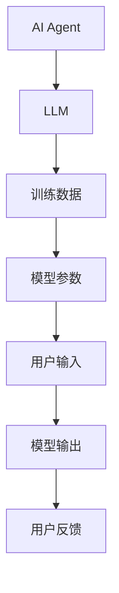
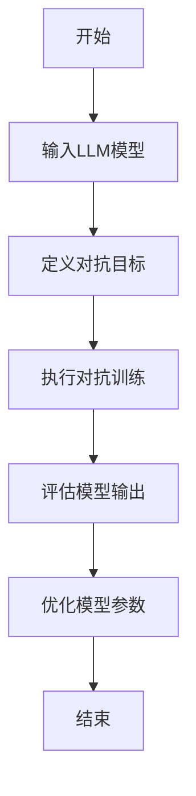
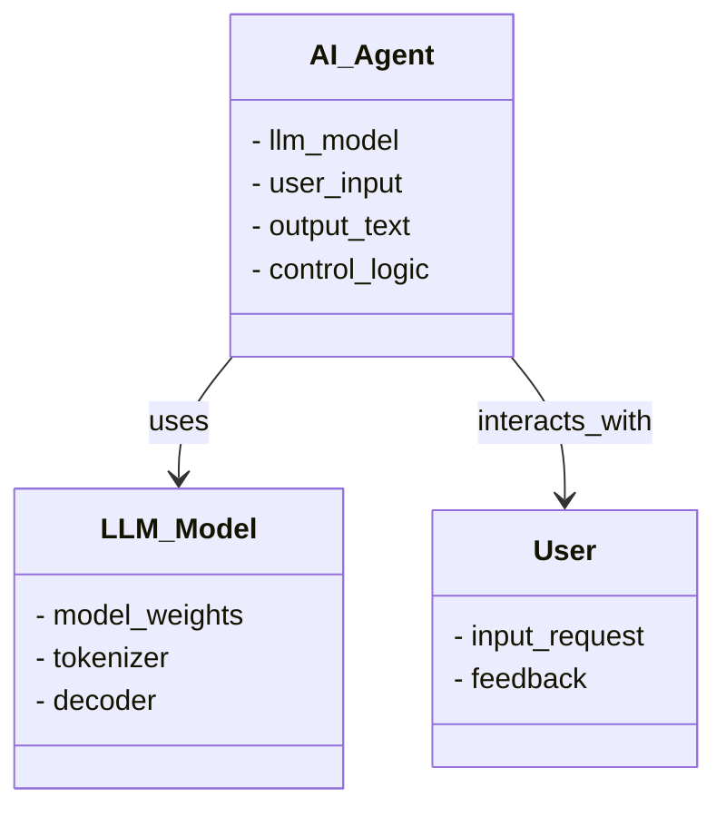
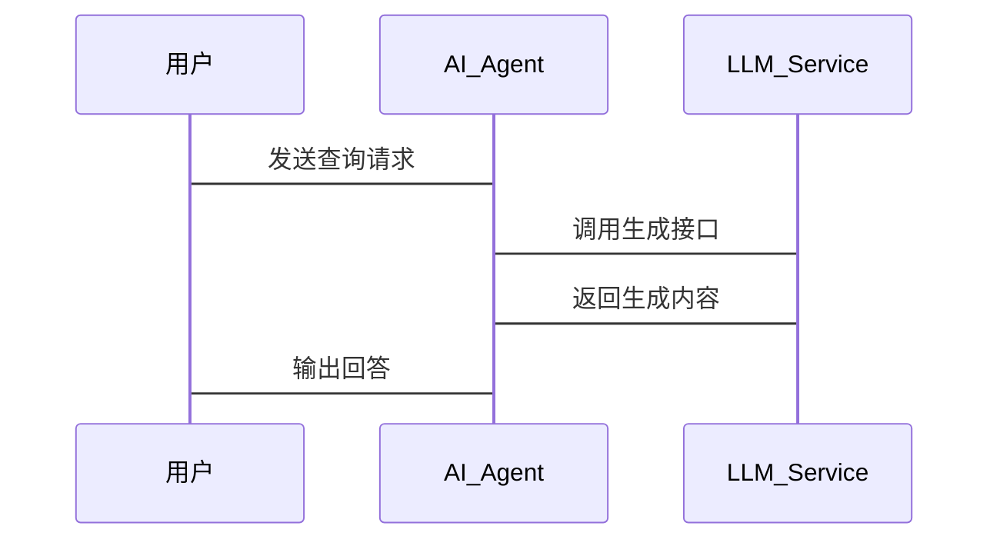

                 


# 构建可信AI Agent：LLM的安全性与可控性设计

## 关键词：
可信AI Agent, LLM, 安全性, 可控性, 对抗训练, 强化学习, 可信性评估

## 摘要：
在人工智能快速发展的背景下，AI Agent的应用越来越广泛，尤其是基于大语言模型（LLM）的AI Agent。然而，LLM的安全性和可控性问题日益凸显，如何构建可信的AI Agent成为研究的重点。本文从LLM的安全性和可控性设计入手，探讨AI Agent的可信性问题，分析其核心概念、算法原理和系统架构，并通过项目实战提供解决方案。通过本文的分析，读者能够深入了解如何设计和实现一个可信的AI Agent，确保其在实际应用中的安全性和可控性。

---

## 第一部分：可信AI Agent的背景与核心概念

### 第1章：可信AI Agent的背景与问题背景

#### 1.1 问题背景

##### 1.1.1 AI Agent的定义与核心概念
AI Agent（人工智能代理）是指能够感知环境并采取行动以实现目标的智能实体。它能够自主决策、学习和适应环境变化，广泛应用于自动化系统、智能助手、推荐系统等领域。

##### 1.1.2 LLM在AI Agent中的应用
大语言模型（LLM）如GPT-3、PaLM等具备强大的自然语言处理能力，能够理解上下文、生成文本、回答问题，成为构建AI Agent的核心技术。通过LLM，AI Agent可以实现更复杂的任务，例如对话生成、信息检索和任务规划。

##### 1.1.3 可信AI Agent的重要性
可信性是AI Agent能否被广泛接受和应用的关键。如果AI Agent不可信，用户可能不放心使用，甚至引发安全隐患。因此，构建可信的AI Agent，确保其输出符合预期且安全可靠，是当前技术发展的重要课题。

#### 1.2 问题描述

##### 1.2.1 LLM的潜在风险
- **对抗攻击**：恶意输入可能导致模型输出有害内容或错误信息。
- **数据偏见**：训练数据中的偏见可能影响模型决策的公正性。
- **滥用风险**：AI Agent可能被用于非法活动，例如生成虚假信息或诈骗。

##### 1.2.2 AI Agent的不可控性问题
- **失控风险**：AI Agent可能在某些情况下做出不符合预期的行为。
- **不可解释性**：复杂的模型可能导致决策过程难以理解，增加了控制的难度。

##### 1.2.3 可信性问题的多维度分析
可信性问题涉及数据、算法、模型输出等多个方面。需要从技术、伦理和法律等角度综合考虑，确保AI Agent的行为符合社会规范和用户期望。

#### 1.3 问题解决

##### 1.3.1 可信AI Agent的设计目标
- 确保AI Agent输出的安全性和正确性。
- 提供可解释的决策过程，增强用户信任。
- 实现对AI Agent行为的有效控制和监管。

##### 1.3.2 LLM安全性的技术挑战
- **对抗攻击的防御**：设计鲁棒的模型，抵御恶意输入的影响。
- **数据安全与隐私保护**：确保训练数据和用户数据的安全性。
- **模型透明性**：通过技术手段提高模型决策的可解释性。

##### 1.3.3 可控性实现的路径分析
- **模型约束**：在训练过程中引入约束条件，限制模型输出的内容。
- **监控与反馈**：实时监控AI Agent的行为，及时发现并纠正异常行为。
- **用户干预**：提供用户控制接口，允许用户对AI Agent的行为进行干预。

#### 1.4 边界与外延

##### 1.4.1 可信AI Agent的边界条件
- **应用范围**：AI Agent的应用场景不同，可信性的要求也不同。例如，医疗领域对AI Agent的可信性要求更高。
- **数据范围**：模型的可信性与训练数据的质量和多样性密切相关。

##### 1.4.2 相关概念的对比分析
- **可信AI**：强调AI系统的可靠性和可解释性。
- **可解释AI**：关注模型决策过程的透明性。
- **鲁棒AI**：注重模型的抗干扰能力和稳定性。

##### 1.4.3 可信性与可控性的关系
可信性是可控性的基础，可控性是可信性的保障。只有确保AI Agent的可信性，才能对其进行有效控制；而可控性反过来又增强了可信性，两者相辅相成。

#### 1.5 核心概念结构与组成

##### 1.5.1 核心概念的组成要素
- **模型本身**：包括LLM的结构和训练方式。
- **数据来源**：训练数据的多样性和代表性。
- **算法设计**：模型的训练目标和优化策略。
- **控制机制**：对模型输出的约束和监管。

##### 1.5.2 概念间的相互关系
- LLM是AI Agent的核心技术，AI Agent的可信性依赖于LLM的安全性和可控性。
- 数据质量和算法设计直接影响模型的输出结果和行为模式。

##### 1.5.3 核心概念的属性特征对比表格

| **属性**       | **LLM**              | **AI Agent**           |
|----------------|---------------------|------------------------|
| **功能**       | 生成文本、理解语言  | 执行任务、与用户交互  |
| **目标**       | 提供语言处理能力    | 实现特定应用场景目标  |
| **复杂性**     | 高度复杂            | 中等复杂，依赖LLM     |
| **应用范围**   | 广泛                | 独特于具体应用场景    |
| **可控性**     | 较低                | 较高（通过设计）      |

---

### 第2章：LLM的安全性与可控性设计

#### 2.1 核心概念原理

##### 2.1.1 LLM的内部工作机制
LLM通过多层神经网络处理输入数据，生成概率分布，选择最可能的输出。其内部机制涉及注意力机制、词嵌入和解码器等技术。

##### 2.1.2 AI Agent的行为模式
AI Agent基于LLM生成的输出，结合环境信息，采取行动以实现目标。行为模式包括任务规划、决策优化和动态调整。

##### 2.1.3 可信性与可控性的理论基础
可信性基于模型的可靠性和可解释性，可控性依赖于模型输出的约束和监管机制。

#### 2.2 核心概念属性特征对比表格

| **属性**       | **可信性**          | **可控性**            |
|----------------|---------------------|-----------------------|
| **定义**       | 输出结果的可靠性    | 对模型输出的控制能力 |
| **实现方式**   | 提高模型鲁棒性      | 设计约束机制          |
| **目标**       | 防止错误和有害输出  | 限制模型输出范围      |
| **挑战**       | 抵御对抗攻击        | 实时监控和反馈        |

#### 2.3 ER实体关系图架构



---

## 第三部分：算法原理与数学模型

### 第3章：算法原理与数学模型

#### 3.1 算法原理

##### 3.1.1 对抗训练算法
对抗训练通过引入对抗网络，增强模型的鲁棒性，防止对抗攻击。其核心思想是让模型在对抗中不断优化，抵御恶意输入的影响。

##### 3.1.2 强化学习算法
强化学习通过奖励机制，引导AI Agent采取最优行动。模型通过与环境互动，学习策略，实现目标。

##### 3.1.3 可信性评估算法
可信性评估算法通过多种指标，综合评估模型的输出质量、安全性和可解释性。

#### 3.2 算法流程图（Mermaid）



#### 3.3 数学模型与公式

##### 3.3.1 对抗训练的损失函数
$$ \mathcal{L} = \mathcal{L}_{\text{CE}} + \lambda \mathcal{L}_{\text{adv}} $$
其中，$\mathcal{L}_{\text{CE}}$ 是交叉熵损失，$\mathcal{L}_{\text{adv}}$ 是对抗损失，$\lambda$ 是调节系数。

##### 3.3.2 强化学习的奖励函数
$$ R(s, a) = r_1 \cdot f_1(s, a) + r_2 \cdot f_2(s, a) $$
其中，$r_1$ 和 $r_2$ 是奖励因子，$f_1$ 和 $f_2$ 是奖励函数。

---

## 第四部分：系统分析与架构设计方案

### 第4章：系统分析与架构设计方案

#### 4.1 问题场景介绍
构建一个基于LLM的AI Agent，用于智能客服系统。系统需要确保AI Agent的回答准确、安全，并且可控。

#### 4.2 项目介绍
项目目标是开发一个智能客服AI Agent，能够处理用户咨询，提供解决方案，并确保输出内容的安全性和正确性。

#### 4.3 系统功能设计（领域模型Mermaid类图）



#### 4.4 系统架构设计（Mermaid架构图）


#### 4.5 系统接口设计
- 用户接口：接收用户输入，输出AI Agent的回答。
- 模型接口：与LLM服务交互，获取生成内容。
- 控制接口：监控AI Agent的行为，实施约束。

#### 4.6 系统交互（Mermaid序列图）



---

## 第五部分：项目实战

### 第5章：项目实战

#### 5.1 环境安装
- 安装Python 3.8及以上版本。
- 安装Hugging Face库和Transformers库：
  ```bash
  pip install transformers
  ```

#### 5.2 系统核心实现源代码

##### 5.2.1 对抗训练代码示例
```python
from transformers import AutoTokenizer, AutoModelForCausalLM
import torch

class对抗训练模型：
    def __init__(self, model_name):
        self.tokenizer = AutoTokenizer.from_pretrained(model_name)
        self.model = AutoModelForCausalLM.from_pretrained(model_name)
        
    def forward(self, input_ids, adversarial_ids):
        outputs = self.model(input_ids)
        adversarial_outputs = self.model(adversarial_ids)
        return outputs, adversarial_outputs
    
    def loss(self, outputs, adversarial_outputs):
        loss = (outputs.logits - adversarial_outputs.logits).mean().abs()
        return loss
```

##### 5.2.2 强化学习代码示例
```python
from transformers import AutoTokenizer, AutoModelForCausalLM
import torch

class强化学习模型：
    def __init__(self, model_name):
        self.tokenizer = AutoTokenizer.from_pretrained(model_name)
        self.model = AutoModelForCausalLM.from_pretrained(model_name)
        
    def forward(self, input_ids):
        outputs = self.model(input_ids)
        return outputs.logits
    
    def reward(self, outputs, target):
        reward = torch.sum(outputs == target)
        return reward
```

#### 5.3 代码应用解读与分析
- 对抗训练代码通过引入对抗网络，增强模型的鲁棒性。
- 强化学习代码通过奖励机制，引导模型优化输出。

#### 5.4 实际案例分析和详细讲解剖析
以智能客服系统为例，通过对抗训练和强化学习，确保AI Agent的回答准确、安全，并且符合用户需求。

#### 5.5 项目小结
通过项目实战，验证了算法的有效性，进一步提高了对LLM安全性和可控性的理解。

---

## 第六部分：最佳实践与总结

### 第6章：最佳实践

#### 6.1 核心内容回顾
- 可信AI Agent的核心概念和实现路径。
- LLM的安全性与可控性设计的关键技术。

#### 6.2 小结
构建可信AI Agent是一个复杂但重要的任务，需要从模型设计、算法优化和系统架构等多个方面入手，确保其安全性和可控性。

#### 6.3 注意事项
- **数据安全**：确保训练数据和用户数据的安全性。
- **模型透明性**：提高模型决策的可解释性。
- **持续监控**：实时监控AI Agent的行为，及时发现并纠正异常。

#### 6.4 拓展阅读
- 建议阅读相关论文和文献，深入了解对抗训练和强化学习的最新进展。

---

## 作者信息

作者：AI天才研究院/AI Genius Institute  
联系邮箱：contact@aigeniusinstitute.com  
GitHub：https://github.com/AI-Genius-Institute  

---

# 结语

构建可信的AI Agent是一个涉及多学科的复杂任务，需要技术、伦理和法律等多方面的共同努力。通过本文的分析和实践，我们为构建可信的AI Agent提供了理论支持和实践指导，希望未来能够进一步推动这一领域的发展。

