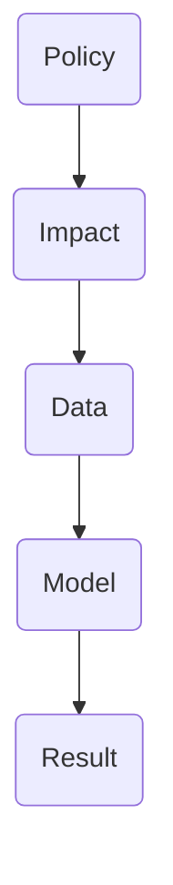
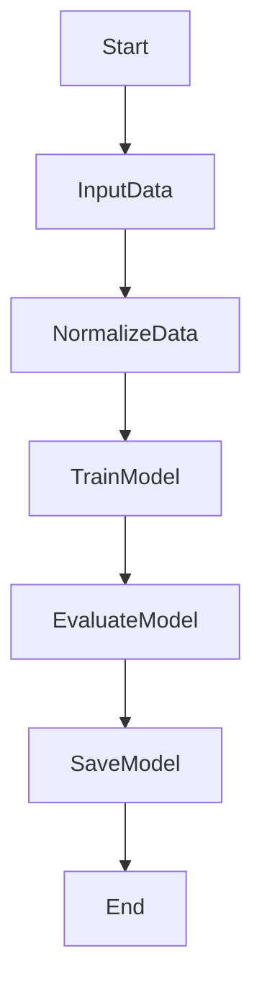
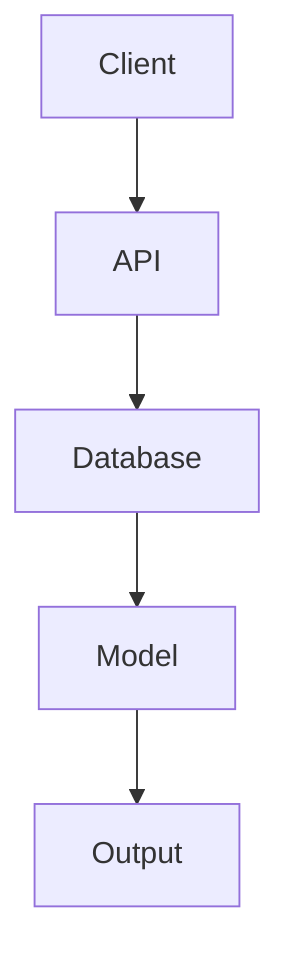

                 


# 《金融政策影响定量评估模型》

## 关键词：
金融政策、定量评估、模型构建、算法原理、系统分析、项目实战

## 摘要：
本文旨在构建一个用于评估金融政策影响的定量模型，通过系统化的分析和建模方法，量化金融政策对金融市场和经济主体的具体影响。文章从金融政策的背景与概念出发，详细探讨了模型的核心要素、算法原理、系统架构，并通过实战案例验证了模型的有效性。本文将为金融分析师、政策制定者及技术开发者提供理论支持与实践指导。

---

## 第1章: 金融政策影响定量评估模型的背景与概念

### 1.1 金融政策影响定量评估模型的定义与作用
#### 1.1.1 什么是金融政策影响定量评估模型
金融政策影响定量评估模型是一种通过数学方法和数据分析技术，量化金融政策对金融市场、经济主体及整体经济影响的工具。其核心在于将复杂的金融政策转化为可量化的指标，并通过模型预测其效果。

#### 1.1.2 模型在金融分析中的作用
- **政策效果预测**：帮助政策制定者预估政策实施后的效果。
- **风险评估**：识别政策实施过程中可能产生的风险。
- **决策支持**：为金融机构和投资者提供数据支持，优化决策。

#### 1.1.3 模型的适用场景与边界
- **适用场景**：
  - 货币政策调整（如加息、降息）对股市、债市的影响。
  - 财政政策（如税收调整、政府支出）对宏观经济的影响。
  - 监管政策（如资本流动限制）对金融市场稳定性的影响。
- **边界**：
  - 模型仅适用于可量化的金融变量，无法完全解释非量化因素（如政策制定者的主观判断）。
  - 模型假设条件限制了其在极端情况下的适用性。

### 1.2 金融政策的类型与影响
#### 1.2.1 货币政策、财政政策与监管政策
- **货币政策**：通过调整利率、货币供应量等手段影响市场流动性。
- **财政政策**：通过调整政府支出、税收等手段影响经济活动。
- **监管政策**：通过制定金融法规、监管力度影响市场行为。

#### 1.2.2 不同政策对金融市场的具体影响
- **货币政策**：
  - 利率调整对债券价格的影响。
  - 货币供应量变化对资产价格的影响。
- **财政政策**：
  - 政府支出增加对GDP增长的推动作用。
  - 税收政策对企业投资行为的影响。
- **监管政策**：
  - 资本流动限制对汇率波动的影响。
  - 金融衍生品监管对市场风险的影响。

#### 1.2.3 政策的传导机制与路径
- **货币政策传导机制**：
  - 利率→企业融资成本→投资行为→经济活动。
  - 货币供应量→资产价格→财富效应→消费行为。
- **财政政策传导机制**：
  - 政府支出→总需求→企业生产→就业。
  - 税收→企业利润→投资→经济增长。

### 1.3 定量评估模型的核心要素
#### 1.3.1 数据来源与特征
- **数据来源**：
  - 历史金融数据（如股票价格、债券收益率、汇率）。
  - 宏观经济数据（如GDP、失业率、通胀率）。
  - 政策变量（如利率、税率、监管强度）。
- **数据特征**：
  - 时间序列性：金融数据通常具有很强的时间依赖性。
  - 多维性：涉及多个经济指标和政策变量。
  - 非线性关系：金融变量之间的关系 often 具有非线性特征。

#### 1.3.2 模型结构与假设
- **模型结构**：
  - 线性回归模型：适用于线性关系的分析。
  - 机器学习模型：适用于复杂非线性关系的分析。
  - 时间序列模型：适用于具有时间依赖性的数据。
- **模型假设**：
  - 数据的可量性：政策变量和经济指标必须可量化。
  - 因果关系的可识别性：模型假设政策变量与经济指标之间存在明确的因果关系。

#### 1.3.3 评估指标与标准
- **评估指标**：
  - 模型拟合度（R-squared）。
  - 预测误差（MAE、RMSE）。
  - 模型稳定性（回测结果的一致性）。
- **评估标准**：
  - 模型在历史数据上的表现。
  - 模型在不同政策环境下的适用性。
  - 模型的可解释性与准确性。

### 1.4 本章小结
#### 1.4.1 核心概念回顾
- 金融政策影响定量评估模型的定义与作用。
- 不同金融政策的类型及其影响路径。
- 模型的核心要素与假设条件。

#### 1.4.2 模型构建的关键要素
- 数据来源与特征。
- 模型结构与假设。
- 评估指标与标准。

#### 1.4.3 后续章节的逻辑框架
- 第2章从核心概念的原理分析出发，探讨模型构建的关键联系。
- 第3章深入算法原理，结合具体算法和代码实现，详细讲解模型的构建过程。
- 第4章从系统角度分析模型的架构设计与实现。
- 第5章通过实战案例验证模型的有效性。
- 第6章总结模型的应用价值与未来发展方向。

---

## 第2章: 金融政策影响定量评估模型的核心概念与联系

### 2.1 模型核心概念的原理分析
#### 2.1.1 数据驱动的金融分析
- 数据驱动的金融分析通过大量历史数据，利用统计方法和机器学习算法，识别数据中的模式和趋势。
- 数据驱动方法的优势在于能够捕捉复杂金融现象中的非线性关系。

#### 2.1.2 政策变量的量化方法
- **量化方法**：
  - 将政策变量（如利率、税率）转化为可量化的指标。
  - 对政策变量进行标准化处理，使其适用于模型输入。
- **量化挑战**：
  - 不同政策变量的量纲不同，需要进行标准化处理。
  - 政策变量的动态变化需要实时更新模型。

#### 2.1.3 模型的因果关系推断
- **因果关系推断**：
  - 通过模型构建，识别政策变量与经济指标之间的因果关系。
  - 使用因果推断方法（如工具变量法）验证因果关系的可靠性。

### 2.2 核心概念的属性特征对比
#### 2.2.1 不同政策工具的特征对比
| 政策工具 | 特征         | 适用场景                 |
|----------|--------------|--------------------------|
| 货币政策 | 影响流动性   | 股票市场、债券市场       |
| 财政政策 | 影响总收入   | 宏观经济、企业投资       |
| 监管政策 | 影响市场行为 | 金融市场稳定性、风险控制 |

#### 2.2.2 数据类型与模型适用性的关系
| 数据类型 | 模型适用性                     |
|----------|-------------------------------|
| 时间序列数据 | 适用于时间序列模型（如ARIMA、LSTM） |
| 截面数据   | 适用于横截面回归模型          |
| 非结构化数据 | 需要特征提取后适用（如NLP处理文本数据） |

#### 2.2.3 模型的可解释性与准确性
| 模型类型       | 可解释性 | 准确性   |
|----------------|----------|----------|
| 线性回归模型   | 高       | 中       |
| 机器学习模型   | 低       | 高       |
| 时间序列模型   | 中       | 中       |

### 2.3 ER实体关系图架构


### 2.4 本章小结
#### 2.4.1 核心概念的系统性分析
- 从数据驱动的金融分析到政策变量的量化方法。
- 从因果关系推断到模型的可解释性与准确性。

#### 2.4.2 模型构建的关键联系
- 数据与模型的双向互动关系。
- 政策变量与经济指标的动态关联。

#### 2.4.3 后续章节的逻辑延伸
- 第3章从算法原理出发，详细讲解模型的构建过程。
- 第4章从系统架构设计的角度，探讨模型的实现与优化。

---

## 第3章: 金融政策影响定量评估模型的算法原理

### 3.1 算法原理概述
#### 3.1.1 常见的金融影响评估算法
- 线性回归模型。
- 机器学习算法（如随机森林、XGBoost）。
- 时间序列模型（如ARIMA、LSTM）。

#### 3.1.2 线性回归模型的适用性
- **优点**：
  - 模型简单，易于解释。
  - 计算效率高，适合实时分析。
- **缺点**：
  - 无法捕捉复杂非线性关系。
  - 对异常值敏感。

#### 3.1.3 机器学习算法的优缺点
- **优点**：
  - 能够捕捉复杂非线性关系。
  - 高准确性。
- **缺点**：
  - 可解释性较差。
  - 计算资源消耗较高。

### 3.2 线性回归模型的详细讲解
#### 3.2.1 线性回归的基本原理
线性回归模型假设因变量与自变量之间存在线性关系，其数学表达式如下：
$$ y = \beta_0 + \beta_1x_1 + \beta_2x_2 + \cdots + \beta_nx_n + \epsilon $$
其中，$y$ 是因变量，$x_i$ 是自变量，$\beta_i$ 是回归系数，$\epsilon$ 是误差项。

#### 3.2.2 模型的数学表达式
线性回归模型的目标是最小化预测值与实际值之间的平方误差之和：
$$ \min_{\beta} \sum_{i=1}^n (y_i - \hat{y}_i)^2 $$
其中，$\hat{y}_i = \beta_0 + \beta_1x_{i1} + \beta_2x_{i2} + \cdots + \beta_nx_{in}$。

#### 3.2.3 模型的优缺点
- **优点**：
  - 模型简单，易于实现。
  - 计算效率高，适合实时分析。
- **缺点**：
  - 无法捕捉复杂非线性关系。
  - 对异常值敏感。

### 3.3 算法流程图


### 3.4 线性回归模型的Python实现
```python
import pandas as pd
import numpy as np
from sklearn.linear_model import LinearRegression
from sklearn.metrics import mean_absolute_error, mean_squared_error

# 加载数据
data = pd.read_csv('financial_policy_data.csv')

# 数据预处理
X = data[['interest_rate', 'tax_rate']]
y = data['stock_price']

# 模型训练
model = LinearRegression()
model.fit(X, y)

# 模型预测
y_pred = model.predict(X)

# 模型评估
mae = mean_absolute_error(y, y_pred)
rmse = np.sqrt(mean_squared_error(y, y_pred))
print(f"MAE: {mae}")
print(f"RMSE: {rmse}")
```

### 3.5 本章小结
#### 3.5.1 算法原理的系统性分析
- 线性回归模型的基本原理与数学表达式。
- 算法流程图的详细解读。
- 模型的优缺点分析。

#### 3.5.2 模型实现的关键步骤
- 数据预处理：数据加载、特征提取、数据归一化。
- 模型训练：模型参数估计、训练过程。
- 模型评估：预测误差计算、模型性能分析。

#### 3.5.3 后续章节的逻辑延伸
- 第4章从系统架构设计的角度，探讨模型的实现与优化。
- 第5章通过实战案例验证模型的有效性。

---

## 第4章: 金融政策影响定量评估模型的系统分析与架构设计

### 4.1 系统分析
#### 4.1.1 问题场景介绍
- **问题场景**：
  - 如何量化货币政策对股市的影响？
  - 如何评估财政政策对企业投资行为的影响？
- **数据来源**：
  - 股票价格、债券收益率、汇率、GDP、失业率、政策变量。

#### 4.1.2 项目介绍
- **项目目标**：
  - 构建一个能够量化金融政策影响的模型。
  - 提供政策效果预测和风险评估功能。
- **项目范围**：
  - 数据采集、模型训练、结果分析。

### 4.2 系统功能设计
#### 4.2.1 领域模型类图


#### 4.2.2 系统架构设计


#### 4.2.3 系统接口设计
- **输入接口**：
  - 数据输入接口：接收金融数据和政策变量。
  - 参数配置接口：配置模型参数和超参数。
- **输出接口**：
  - 结果输出接口：输出模型预测结果和评估指标。
  - 日志输出接口：输出模型运行日志。

#### 4.2.4 系统交互序列图
```mermaid
graph TD
    Client --> API: 发送请求
    API --> Database: 查询数据
    Database --> API: 返回数据
    API --> Model: 调用模型
    Model --> API: 返回结果
    API --> Client: 返回响应
```

### 4.3 本章小结
#### 4.3.1 系统分析的关键点
- 问题场景的系统化分析。
- 系统功能设计的模块化划分。

#### 4.3.2 系统架构设计的核心要素
- 领域模型类图的构建。
- 系统架构图的设计。
- 系统接口与交互的详细描述。

#### 4.3.3 后续章节的逻辑延伸
- 第5章从项目实战的角度，详细讲解系统的实现与应用。

---

## 第5章: 金融政策影响定量评估模型的项目实战

### 5.1 环境安装与配置
#### 5.1.1 安装必要的库
- **Python库**：
  - `pandas`：数据处理。
  - `numpy`：数值计算。
  - `scikit-learn`：机器学习算法。
  - `matplotlib`：数据可视化。

```bash
pip install pandas numpy scikit-learn matplotlib
```

#### 5.1.2 配置开发环境
- **推荐工具**：
  - Jupyter Notebook：数据探索与建模。
  - PyCharm：代码开发。
  - Git：版本控制。

### 5.2 系统核心实现
#### 5.2.1 数据加载与预处理
```python
import pandas as pd
import numpy as np
from sklearn.linear_model import LinearRegression
from sklearn.metrics import mean_absolute_error, mean_squared_error

# 加载数据
data = pd.read_csv('financial_policy_data.csv')

# 数据预处理
X = data[['interest_rate', 'tax_rate']]
y = data['stock_price']

# 数据归一化
from sklearn.preprocessing import StandardScaler
scaler = StandardScaler()
X_scaled = scaler.fit_transform(X)
```

#### 5.2.2 模型训练与评估
```python
# 模型训练
model = LinearRegression()
model.fit(X_scaled, y)

# 模型预测
y_pred = model.predict(X_scaled)

# 模型评估
mae = mean_absolute_error(y, y_pred)
rmse = np.sqrt(mean_squared_error(y, y_pred))
print(f"MAE: {mae}")
print(f"RMSE: {rmse}")
```

#### 5.2.3 模型解释
- **回归系数的解释**：
  - 回归系数表示政策变量对因变量的影响方向和大小。
  - 例如，$\beta_1$ 表示利率每增加1个百分点，股票价格的变化幅度。

### 5.3 实际案例分析
#### 5.3.1 案例背景
- **案例目标**：评估某次降息政策对股市的影响。
- **数据来源**：历史股票价格、利率数据。

#### 5.3.2 模型实现
```python
# 数据加载与预处理（同上）

# 模型训练与预测（同上）

# 政策变量变化模拟
new_interest_rate = np.array([[2.5]])  # 模拟的降息政策
new_input = scaler.transform(new_interest_rate)
predicted_stock_price = model.predict(new_input)
print(f"预测的股票价格变化：{predicted_stock_price}")
```

#### 5.3.3 结果分析
- **预测结果**：
  - 预测股票价格上涨，表明降息政策对股市有正面影响。
- **结果解释**：
  - 回归系数为正，表明利率降低会导致股票价格上涨。

### 5.4 本章小结
#### 5.4.1 项目实战的核心步骤
- 环境安装与配置。
- 数据加载与预处理。
- 模型训练与评估。
- 实际案例分析与结果解释。

#### 5.4.2 模型实现的关键点
- 数据预处理的重要性。
- 模型选择与调优。
- 实际案例的可解释性。

#### 5.4.3 后续章节的逻辑延伸
- 第6章总结模型的应用价值与未来发展方向。

---

## 第6章: 金融政策影响定量评估模型的最佳实践

### 6.1 最佳实践
#### 6.1.1 小结
- 模型构建的核心要素：数据、算法、评估指标。
- 系统实现的关键步骤：数据预处理、模型训练、结果分析。

#### 6.1.2 注意事项
- **数据质量问题**：
  - 数据的完整性和准确性直接影响模型效果。
- **模型选择与调优**：
  - 根据具体场景选择合适的算法。
  - 通过交叉验证优化模型参数。
- **模型解释性与可操作性**：
  - 模型结果需要能够被政策制定者和金融市场参与者理解。
  - 模型需要具备一定的可操作性，能够在实际场景中快速响应。

#### 6.1.3 拓展阅读
- **推荐书籍**：
  - 《金融时间序列分析》。
  - 《机器学习实战》。
- **推荐论文**：
  - 《货币政策对资产价格的影响：基于机器学习的实证研究》。

### 6.2 本章小结
#### 6.2.1 最佳实践的核心要点
- 数据质量管理。
- 模型选择与调优。
- 模型解释性与可操作性。

#### 6.2.2 模型应用的未来展望
- 随着人工智能技术的发展，金融政策影响评估模型将更加智能化和自动化。
- 多模态数据的引入将提升模型的预测精度和可解释性。

#### 6.2.3 结语
- 金融政策影响定量评估模型是金融分析与政策制定的重要工具。
- 通过不断优化模型结构与算法，可以更好地服务于金融市场和宏观经济管理。

---

## 作者：AI天才研究院/AI Genius Institute & 禅与计算机程序设计艺术/Zen And The Art of Computer Programming

