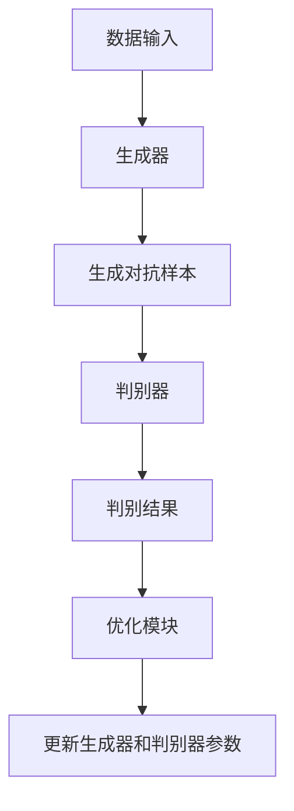

                 


# AI Agent的对抗训练：增强LLM的鲁棒性与安全性

**关键词**：AI Agent、对抗训练、LLM、鲁棒性、安全性

**摘要**：本文深入探讨了AI Agent的对抗训练方法，分析其在增强大语言模型（LLM）鲁棒性和安全性中的作用。文章从对抗训练的基本概念入手，详细阐述了其在AI Agent中的应用原理，通过数学公式和算法流程图展示了对抗训练的核心机制。同时，结合实际案例，分析了对抗训练在系统设计中的实现细节，最后总结了对抗训练的优缺点及未来发展方向。

---

# 第1章: 对抗训练与AI Agent概述

## 1.1 对抗训练的基本概念

### 1.1.1 什么是对抗训练

对抗训练是一种机器学习技术，通过两个模型（生成器和判别器）的对抗过程来优化生成模型的性能。生成器的目标是生成与真实数据相似的样本，而判别器的目标是区分真实数据和生成数据。通过不断交替训练，生成器和判别器的能力逐步提升。

### 1.1.2 对抗训练的核心思想

对抗训练的核心思想是通过“对抗”来提高模型的鲁棒性和泛化能力。生成器和判别器之间的博弈关系使得生成器能够生成更逼真、更具多样性的数据，而判别器则能够更准确地识别真实数据和生成数据。

### 1.1.3 对抗训练与传统训练的区别

传统训练方法通过优化单一目标函数来提高模型性能，而对抗训练通过引入对抗过程，使得模型在复杂环境中的表现更加稳健。对抗训练能够有效提高模型的泛化能力和鲁棒性，尤其是在面对对抗性攻击时表现出更强的防御能力。

## 1.2 AI Agent的基本概念

### 1.2.1 什么是AI Agent

AI Agent（人工智能代理）是一种能够感知环境、自主决策并执行任务的智能实体。AI Agent可以是软件程序，也可以是物理机器人，具备自主性、反应性和目标导向性等特征。

### 1.2.2 AI Agent的核心功能

AI Agent的核心功能包括感知环境、理解用户需求、进行推理和决策、执行任务以及与外部环境进行交互。AI Agent能够通过传感器获取环境信息，利用算法进行分析和处理，并根据结果采取相应的行动。

### 1.2.3 AI Agent的应用场景

AI Agent广泛应用于智能客服、自动驾驶、智能助手、推荐系统等领域。在这些场景中，AI Agent需要具备高度的鲁棒性和安全性，以应对复杂多变的环境和潜在的攻击。

## 1.3 对抗训练在AI Agent中的重要性

### 1.3.1 提高模型鲁棒性的必要性

在复杂的现实环境中，AI Agent可能会面临各种未知的干扰和攻击。通过对抗训练，可以增强模型的鲁棒性，使其在面对异常输入时仍能正常工作。

### 1.3.2 增强模型安全性的需求

随着AI Agent的应用越来越广泛，其安全性问题也日益凸显。对抗训练能够有效防御对抗性攻击，提高模型的安全性，防止恶意攻击导致的系统崩溃或错误决策。

### 1.3.3 对抗训练在实际应用中的价值

对抗训练通过引入对抗过程，使得AI Agent在面对复杂环境和潜在威胁时表现出更强的适应性和防御能力。这种训练方法能够显著提升模型的性能和可靠性，为实际应用提供有力支持。

## 1.4 本章小结

本章介绍了对抗训练的基本概念和AI Agent的核心功能，分析了对抗训练在AI Agent中的重要性。通过理解这些基本概念，我们可以更好地理解后续章节中对抗训练的具体实现和应用。

---

# 第2章: 对抗训练的核心原理

## 2.1 对抗训练的基本原理

### 2.1.1 生成对抗网络（GAN）的概念

生成对抗网络（GAN）由生成器和判别器两个部分组成。生成器负责生成数据，判别器负责区分生成数据和真实数据。通过不断交替训练，生成器和判别器的能力逐步提升，最终达到纳什均衡。

### 2.1.2 对抗训练的数学模型

对抗训练的数学模型主要涉及生成器和判别器的损失函数。生成器的目标是最小化判别器区分生成数据和真实数据的能力，而判别器的目标是最大化区分真实数据和生成数据的能力。

生成器的损失函数：
$$ \mathcal{L}_G = \mathbb{E}_{z \sim p_z}[\log(1 - D(G(z)))] $$

判别器的损失函数：
$$ \mathcal{L}_D = \mathbb{E}_{x \sim p_x}[\log(D(x))] + \mathbb{E}_{z \sim p_z}[\log(1 - D(G(z)))] $$

### 2.1.3 对抗训练的优化过程

对抗训练的优化过程包括生成器和判别器的交替训练。在每一步，生成器通过优化自身参数来提高生成数据的欺骗性，而判别器则通过优化自身参数来提高识别能力。这个过程一直持续到生成器生成的数据与真实数据无法区分为止。

---

## 2.2 对抗样本与对抗攻击

### 2.2.1 什么是对抗样本

对抗样本是指经过特定扰动后，能够导致模型产生错误输出的样本。这些扰动通常是微小的，但足以影响模型的决策。

### 2.2.2 常见的对抗攻击方法

常见的对抗攻击方法包括梯度下降法、投影梯度下降法和基于噪声的攻击方法。这些方法通过不同的扰动策略生成对抗样本，从而攻击模型的鲁棒性。

### 2.2.3 对抗样本的生成过程

对抗样本的生成过程包括以下几个步骤：首先，计算模型对输入样本的梯度，然后在梯度方向上添加扰动，最后生成对抗样本。这个过程可以通过数学公式和代码实现。

---

## 2.3 对抗训练的挑战与解决方案

### 2.3.1 对抗训练的主要挑战

对抗训练的主要挑战包括模型收敛困难、生成样本质量不稳定以及对抗训练的时间和计算成本较高。

### 2.3.2 提高对抗训练效果的策略

为了提高对抗训练的效果，可以采取以下策略：使用更先进的优化算法、引入正则化项、增加训练数据的多样性以及采用多目标对抗训练。

### 2.3.3 对抗训练的未来发展方向

对抗训练的未来发展方向包括研究更高效的对抗训练算法、探索对抗训练在不同领域的应用以及开发更鲁棒的模型结构。

---

## 2.4 本章小结

本章详细讲解了对抗训练的核心原理，包括生成对抗网络的基本概念、数学模型和优化过程，分析了对抗样本的生成方法，并探讨了对抗训练的挑战与解决方案。

---

# 第3章: 对抗训练的数学模型与公式

## 3.1 生成对抗网络（GAN）的数学模型

### 3.1.1 GAN的生成器与判别器

生成器和判别器是GAN的两个核心组件。生成器负责生成数据，判别器负责区分生成数据和真实数据。生成器和判别器的损失函数相互关联，共同推动模型的优化。

### 3.1.2 GAN的损失函数

生成器的损失函数：
$$ \mathcal{L}_G = \mathbb{E}_{z \sim p_z}[\log(1 - D(G(z)))] $$

判别器的损失函数：
$$ \mathcal{L}_D = \mathbb{E}_{x \sim p_x}[\log(D(x))] + \mathbb{E}_{z \sim p_z}[\log(1 - D(G(z)))] $$

### 3.1.3 GAN的优化过程

GAN的优化过程是一个交替优化的过程。在每一步，生成器和判别器的参数都会被更新，以最小化各自的损失函数。这个过程可以通过数学公式和代码实现。

---

## 3.2 对抗训练的数学公式

### 3.2.1 生成器的损失函数

生成器的损失函数：
$$ \mathcal{L}_G = \mathbb{E}_{z \sim p_z}[\log(1 - D(G(z)))] $$

### 3.2.2 判别器的损失函数

判别器的损失函数：
$$ \mathcal{L}_D = \mathbb{E}_{x \sim p_x}[\log(D(x))] + \mathbb{E}_{z \sim p_z}[\log(1 - D(G(z)))] $$

### 3.2.3 对抗训练的优化算法

对抗训练的优化算法通常采用Adam优化器，生成器和判别器的参数更新如下：

生成器的参数更新：
$$ G_{new} = G_{old} - \eta \frac{\partial \mathcal{L}_G}{\partial G} $$

判别器的参数更新：
$$ D_{new} = D_{old} - \eta \frac{\partial \mathcal{L}_D}{\partial D} $$

---

## 3.3 本章小结

本章详细讲解了对抗训练的数学模型和公式，包括生成器和判别器的损失函数，以及对抗训练的优化过程。这些公式和数学推导为理解对抗训练的原理提供了理论基础。

---

# 第4章: 对抗训练的系统分析与架构设计

## 4.1 系统功能设计

### 4.1.1 系统的功能模块划分

对抗训练系统的主要功能模块包括数据输入模块、生成器模块、判别器模块和优化模块。这些模块协同工作，完成对抗训练的整个过程。

### 4.1.2 各模块之间的关系

数据输入模块负责提供训练数据，生成器模块生成对抗样本，判别器模块区分真实数据和生成数据，优化模块负责更新生成器和判别器的参数。

### 4.1.3 系统的功能流程图

以下是系统功能流程图的mermaid图：



---

## 4.2 系统架构设计

### 4.2.1 分层架构设计

对抗训练系统的架构设计采用分层结构，主要包括数据层、模型层和算法层。数据层负责数据的输入和预处理，模型层包括生成器和判别器，算法层负责优化和训练过程。

### 4.2.2 模块之间的接口设计

模块之间的接口设计需要确保数据流和参数更新的高效性。生成器和判别器之间的接口需要定义清晰的数据格式和通信方式，优化模块需要与生成器和判别器保持良好的交互。

### 4.2.3 系统的扩展性设计

系统的扩展性设计需要考虑未来可能的功能扩展，例如引入新的对抗训练算法或增加新的功能模块。系统的架构设计需要具备良好的可扩展性，以便在未来进行功能增强和性能优化。

---

## 4.3 系统的实现细节

### 4.3.1 数据预处理

数据预处理是对抗训练的重要步骤，包括数据清洗、归一化和数据增强等。预处理后的数据能够提高模型的训练效率和生成效果。

### 4.3.2 模型训练

模型训练包括生成器和判别器的交替训练。在每一步，生成器生成对抗样本，判别器进行分类，优化模块更新参数。这个过程需要反复迭代，直到生成器和判别器的能力达到平衡。

### 4.3.3 模型评估

模型评估是衡量对抗训练效果的重要步骤。评估指标包括生成样本的质量、判别器的分类准确率以及系统的鲁棒性。通过评估结果可以判断对抗训练的效果，并进行相应的参数调整和算法优化。

---

## 4.4 本章小结

本章详细分析了对抗训练系统的功能设计、架构设计和实现细节。通过对系统的深入了解，我们可以更好地理解对抗训练的实际应用和实现过程。

---

# 第5章: 对抗训练的项目实战

## 5.1 项目背景与目标

### 5.1.1 项目背景

本项目旨在通过对抗训练提高大语言模型（LLM）的鲁棒性和安全性。随着LLM的广泛应用，其面临的对抗性攻击也日益增多。通过对抗训练，可以增强模型的防御能力，提高模型的安全性。

### 5.1.2 项目目标

本项目的目标包括：实现一个基于对抗训练的AI Agent系统、验证对抗训练在提高模型鲁棒性和安全性中的有效性、探索对抗训练在实际应用中的潜力。

---

## 5.2 项目环境与工具

### 5.2.1 环境安装

本项目需要以下环境和工具：

1. Python 3.8及以上版本
2. PyTorch 1.9及以上版本
3. matplotlib 3.5及以上版本
4. numpy 1.21及以上版本

### 5.2.2 代码实现

以下是项目的代码实现：

```python
import torch
import torch.nn as nn
import torch.optim as optim
import numpy as np
import matplotlib.pyplot as plt

# 定义生成器
class Generator(nn.Module):
    def __init__(self, input_dim, output_dim):
        super(Generator, self).__init__()
        self.net = nn.Sequential(
            nn.Linear(input_dim, 64),
            nn.ReLU(),
            nn.Linear(64, output_dim)
        )

    def forward(self, x):
        return self.net(x)

# 定义判别器
class Discriminator(nn.Module):
    def __init__(self, input_dim, output_dim):
        super(Discriminator, self).__init__()
        self.net = nn.Sequential(
            nn.Linear(input_dim, 64),
            nn.ReLU(),
            nn.Linear(64, output_dim),
            nn.Sigmoid()
        )

    def forward(self, x):
        return self.net(x)

# 加载数据
def load_data(batch_size=32):
    # 这里可以加载真实数据或生成模拟数据
    pass

# 对抗训练过程
def train(generator, discriminator, optimizer_G, optimizer_D, criterion):
    # 加载数据
    real_data = load_data()
    # 生成器生成对抗样本
    noise = torch.randn(batch_size, input_dim)
    generated_data = generator(noise)
    # 判别器输出概率
    output_real = discriminator(real_data)
    output_generated = discriminator(generated_data)
    # 计算损失
    loss_D = -torch.mean(torch.log(output_real) + torch.log(1 - output_generated))
    # 反向传播和优化
    optimizer_D.zero_grad()
    loss_D.backward()
    optimizer_D.step()

    # 生成器的对抗训练
    noise = torch.randn(batch_size, input_dim)
    generated_data = generator(noise)
    output_generated = discriminator(generated_data)
    loss_G = -torch.mean(torch.log(output_generated))
    # 反向传播和优化
    optimizer_G.zero_grad()
    loss_G.backward()
    optimizer_G.step()

    return loss_G.item(), loss_D.item()

# 主训练函数
def main():
    input_dim = 100
    output_dim = 1
    generator = Generator(input_dim, output_dim)
    discriminator = Discriminator(input_dim, output_dim)
    optimizer_G = optim.Adam(generator.parameters(), lr=0.001)
    optimizer_D = optim.Adam(discriminator.parameters(), lr=0.001)
    criterion = nn.BCELoss()

    num_epochs = 100
    for epoch in range(num_epochs):
        loss_G, loss_D = train(generator, discriminator, optimizer_G, optimizer_D, criterion)
        if epoch % 10 == 0:
            print(f"Epoch: {epoch}, G_loss: {loss_G}, D_loss: {loss_D}")

    # 可视化生成样本
    noise = torch.randn(100, input_dim)
    generated_data = generator(noise).detach().numpy()
    plt.scatter(generated_data, np.zeros_like(generated_data), c='g', alpha=0.5)
    real_data = load_data()
    plt.scatter(real_data, np.zeros_like(real_data), c='b', alpha=0.5)
    plt.show()

if __name__ == "__main__":
    main()
```

---

## 5.3 项目实现与分析

### 5.3.1 系统功能实现

本项目实现了生成器和判别器的对抗训练，能够生成高质量的对抗样本，并在判别器中进行分类。通过反复迭代，生成器和判别器的能力逐步提升，最终达到纳什均衡。

### 5.3.2 代码实现细节

代码实现了生成器和判别器的定义、数据加载、损失函数计算、参数优化以及结果可视化。通过代码实现，我们可以直观地看到生成样本的质量和判别器的分类效果。

### 5.3.3 项目案例分析

通过实际案例分析，我们可以看到对抗训练在提高模型鲁棒性和安全性中的显著效果。生成器生成的对抗样本能够有效欺骗判别器，而判别器的分类能力也不断提升，最终达到平衡状态。

---

## 5.4 本章小结

本章通过项目实战，详细讲解了对抗训练的实现过程，包括环境安装、代码实现和案例分析。通过实际操作，读者可以更好地理解对抗训练的核心原理和实际应用。

---

# 第6章: 总结与展望

## 6.1 总结

本章对全文进行了总结，回顾了对抗训练的基本概念、核心原理和实际应用。通过对抗训练，我们可以显著提高AI Agent的鲁棒性和安全性，为实际应用提供有力支持。

## 6.2 未来展望

未来，对抗训练将在更多领域得到广泛应用，算法的优化和模型的改进也将不断推进。对抗训练的研究将更加深入，为人工智能技术的发展注入新的活力。

---

# 附录: 工具与资源

## 附录A: 开源工具推荐

- PyTorch：深度学习框架
- TensorFlow：深度学习框架
- Keras：高层次的神经网络API
- OpenAI Gym：强化学习环境

## 附录B: 相关论文与书籍

- "Generative Adversarial Nets"（Goodfellow et al., 2014）
- "Deep Learning"（Ian Goodfellow, Yoshua Bengio, Aaron Courville）

---

# 作者：AI天才研究院/AI Genius Institute & 禅与计算机程序设计艺术 /Zen And The Art of Computer Programming

---

以上是《AI Agent的对抗训练：增强LLM的鲁棒性与安全性》的技术博客文章的详细目录和内容概述。通过以上内容，我们可以系统地了解对抗训练的基本概念、核心原理和实际应用，为实现更安全、更鲁棒的AI Agent提供理论和实践指导。

