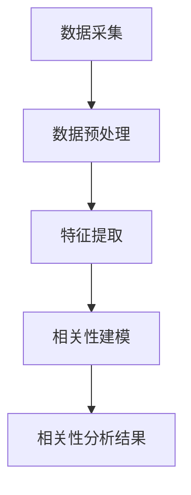
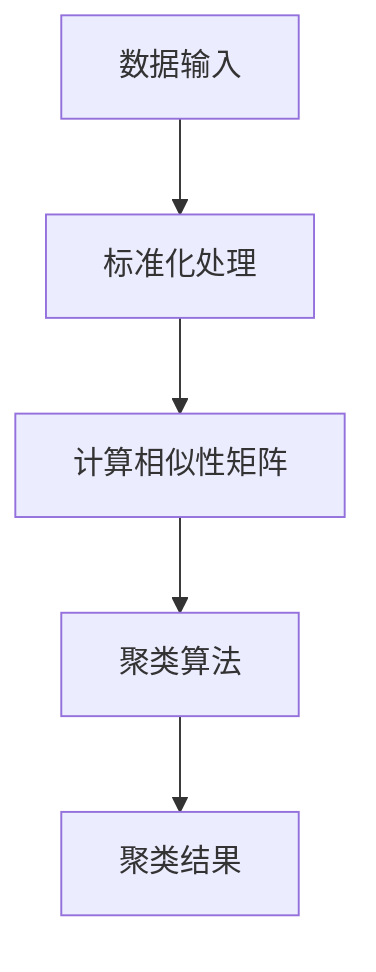
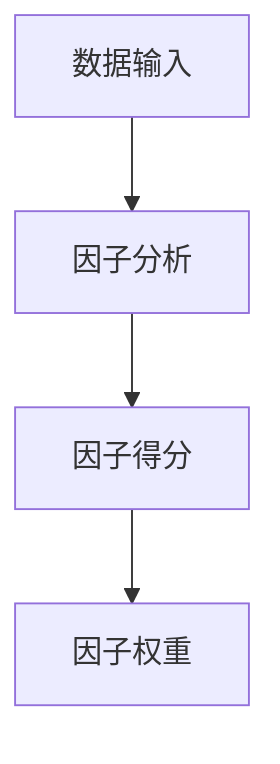
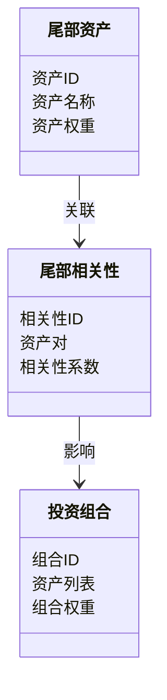
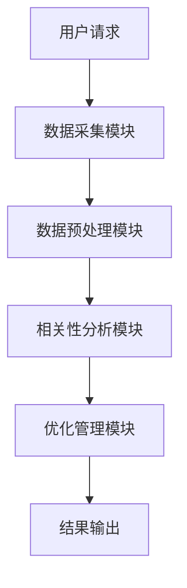
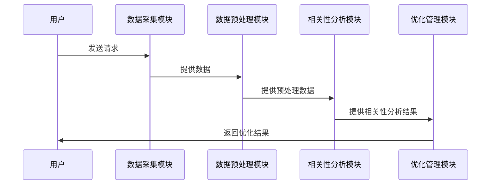

                 


# AI驱动的价值投资组合尾部相关性管理

> 关键词：AI，投资组合，尾部相关性，风险管理，金融，算法

> 摘要：本文详细探讨了AI技术在价值投资组合尾部相关性管理中的应用，分析了尾部相关性的概念、算法原理、系统架构设计以及实际项目案例，提出了基于AI的尾部相关性管理解决方案，并展望了未来的研究方向。

---

## 第一部分：AI驱动的价值投资组合尾部相关性管理背景与核心概念

### 第1章：价值投资组合与尾部相关性管理概述

#### 1.1 价值投资组合的基本概念

##### 1.1.1 投资组合的定义与组成
投资组合是指将多种金融资产（如股票、债券、基金等）按照一定比例组合在一起，以分散风险、优化收益的投资方式。一个典型的投资组合由多个资产组成，每个资产的权重反映了其在组合中的重要性。

##### 1.1.2 尾部相关性的概念
尾部相关性是指在投资组合中，那些权重较小（即尾部）的资产之间的相关性。传统投资组合管理往往关注于权重较大的头部资产，而忽略了尾部资产的相关性对整体组合风险的影响。尾部相关性管理的目标是通过分析尾部资产之间的相关性，优化投资组合的分散化效果。

##### 1.1.3 尾部相关性管理的重要性
尾部相关性管理的重要性体现在以下几点：
1. **风险控制**：尾部资产的相关性可能在市场波动时显著影响组合的整体风险。
2. **收益优化**：通过优化尾部资产的相关性，可以在不显著增加风险的情况下提高组合收益。
3. **分散化效果**：有效的尾部相关性管理可以提升投资组合的分散化程度，降低系统性风险。

#### 1.2 AI驱动投资组合管理的背景

##### 1.2.1 传统投资组合管理的局限性
传统投资组合管理方法依赖于历史数据和统计模型，存在以下局限性：
1. **数据稀疏性**：尾部资产的数据往往较少，难以准确估计相关性。
2. **计算复杂性**：尾部相关性分析需要处理大量的非线性关系，传统方法难以高效处理。
3. **动态变化**：金融市场环境不断变化，传统静态模型难以适应动态相关性变化。

##### 1.2.2 AI技术在金融领域的应用现状
AI技术在金融领域的应用日益广泛，特别是在投资组合管理、风险控制、市场预测等方面。AI技术的优势在于其强大的数据处理能力和非线性建模能力，能够处理传统方法难以应对的复杂问题。

##### 1.2.3 尾部相关性管理的AI驱动趋势
随着AI技术的不断发展，尾部相关性管理逐步从传统方法向AI驱动的智能化方向转变。AI技术可以通过深度学习模型捕捉尾部资产的隐含相关性，提升尾部相关性管理的准确性和效率。

#### 1.3 问题背景与目标

##### 1.3.1 尾部相关性管理的核心问题
尾部相关性管理的核心问题是如何准确捕捉和量化尾部资产之间的相关性，尤其是在数据稀疏和市场波动的情况下。

##### 1.3.2 问题解决的必要性与目标
尾部相关性管理的必要性在于其对投资组合风险控制和收益优化的重要作用。目标是通过AI技术，实现对尾部资产相关性的高效分析和管理。

##### 1.3.3 边界与外延
尾部相关性管理的边界包括：
1. 数据范围：仅关注尾部资产的相关性。
2. 方法限制：采用AI技术而非传统统计方法。
3. 应用场景：主要应用于投资组合优化和风险控制。

#### 1.4 核心概念与框架

##### 1.4.1 尾部相关性的定义与属性
尾部相关性是指在投资组合中，权重较小的资产之间的相关性。其属性包括：
1. 数据稀疏性：尾部资产的数据量较少。
2. 非线性关系：尾部资产之间的相关性可能呈现非线性特征。
3. 动态变化：尾部相关性随市场环境变化而波动。

##### 1.4.2 AI驱动的相关性分析框架
AI驱动的相关性分析框架包括以下步骤：
1. 数据采集：收集尾部资产的历史价格数据。
2. 特征提取：通过深度学习模型提取资产的特征。
3. 相关性建模：使用深度学习模型捕捉资产之间的相关性。
4. 优化管理：基于相关性分析结果优化投资组合。

##### 1.4.3 核心概念与核心要素
尾部相关性管理的核心要素包括：
1. 尾部资产识别：识别投资组合中权重较小的资产。
2. 相关性建模：建立尾部资产之间的相关性模型。
3. 投资组合优化：基于尾部相关性分析结果优化投资组合。

---

## 第二部分：AI驱动的相关性分析核心概念

### 第2章：尾部相关性管理的核心概念与联系

#### 2.1 尾部相关性管理的核心原理

##### 2.1.1 尾部相关性的数学模型
尾部相关性的数学模型可以表示为：
$$ r_{tail} = \frac{Cov(X,Y)}{\sigma_X \sigma_Y} $$
其中，$Cov(X,Y)$ 是资产X和Y的协方差，$\sigma_X$ 和 $\sigma_Y$ 分别是资产X和Y的标准差。

##### 2.1.2 AI在相关性分析中的应用原理
AI通过深度学习模型（如神经网络）捕捉尾部资产之间的非线性关系，从而实现对尾部相关性的建模和分析。

##### 2.1.3 尾部相关性管理的优化目标
尾部相关性管理的优化目标是最大化投资组合的夏普比率（Sharpe Ratio），即在给定风险下获得最大收益。

#### 2.2 核心概念属性对比表

| 比较维度 | 尾部相关性 | 头部相关性 |
|----------|------------|------------|
| 数据量   | 较少       | 较多       |
| 相关性   | 非线性      | 线性或非线性 |
| 影响     | 显著       | 有限       |

#### 2.3 实体关系图与流程图

##### 尾部相关性管理的ER图（Mermaid）

```mermaid
erDiagram
    class 尾部资产 {
        资产ID
        资产名称
        资产权重
    }
    class 尾部相关性 {
        相关性ID
        资产对
        相关性系数
    }
    尾部资产 --> 尾部相关性 : 关联
```

##### AI驱动的相关性分析流程图（Mermaid）



---

## 第三部分：AI驱动的相关性分析算法原理

### 第3章：相关性分析算法原理

#### 3.1 聚类分析算法

##### 3.1.1 聚类分析的基本原理
聚类分析是一种无监督学习方法，通过将相似的资产聚类，识别尾部资产之间的相关性。

##### 3.1.2 聚类分析流程图（Mermaid）



##### 3.1.3 聚类分析的Python代码实现

```python
from sklearn.cluster import KMeans
import pandas as pd
import numpy as np

# 假设 df 是包含尾部资产数据的 DataFrame
df = pd.DataFrame(np.random.randn(100, 10), columns=[f'Asset{i}' for i in range(1, 11)])

# 数据预处理
data = df.values

# 聚类分析
kmeans = KMeans(n_clusters=3, random_state=42)
clusters = kmeans.fit_predict(data)

# 输出聚类结果
print(clusters)
```

#### 3.2 因子分析算法

##### 3.2.1 因子分析的基本原理
因子分析是一种统计方法，用于识别数据中的潜在因子，从而解释资产之间的相关性。

##### 3.2.2 因子分析流程图（Mermaid）



##### 3.2.3 因子分析的Python代码实现

```python
from sklearn.decomposition import FactorAnalysis
import pandas as pd
import numpy as np

# 假设 df 是包含尾部资产数据的 DataFrame
df = pd.DataFrame(np.random.randn(100, 10), columns=[f'Asset{i}' for i in range(1, 11)])

# 因子分析
fa = FactorAnalysis(n_components=2, random_state=42)
components, _ = fa.transform(df), fa.components_

# 输出因子得分
print(components)
```

#### 3.3 尾部相关性分析的数学模型

##### 尾部相关性的数学公式
$$ r_{tail} = \frac{Cov(X,Y)}{\sigma_X \sigma_Y} $$

##### 尾部相关性的优化模型
$$ 

---

## 第四部分：系统分析与架构设计方案

### 第4章：系统分析与架构设计

#### 4.1 问题场景介绍
本系统旨在通过AI技术优化投资组合的尾部相关性管理，实现对尾部资产相关性的高效分析和管理。

#### 4.2 系统功能设计

##### 4.2.1 领域模型类图（Mermaid）



#### 4.3 系统架构设计

##### 4.3.1 系统架构图（Mermaid）



#### 4.4 系统接口设计

##### 4.4.1 接口设计
系统接口包括：
1. 数据输入接口：接收尾部资产数据。
2. 相关性分析接口：返回尾部资产的相关性系数。
3. 优化管理接口：返回优化后的投资组合配置。

#### 4.5 系统交互序列图（Mermaid）



---

## 第五部分：项目实战

### 第5章：项目实战

#### 5.1 环境安装

##### 5.1.1 安装Python环境
```bash
python --version
pip install --upgrade pip
```

##### 5.1.2 安装相关库
```bash
pip install numpy pandas scikit-learn
```

#### 5.2 系统核心实现源代码

##### 5.2.1 数据预处理代码
```python
import pandas as pd
import numpy as np

# 生成尾部资产数据
df = pd.DataFrame(np.random.randn(100, 10), columns=[f'Asset{i}' for i in range(1, 11)])
```

##### 5.2.2 相关性分析代码
```python
from sklearn.cluster import KMeans
import pandas as pd
import numpy as np

# 数据预处理
data = df.values

# 聚类分析
kmeans = KMeans(n_clusters=3, random_state=42)
clusters = kmeans.fit_predict(data)

# 输出聚类结果
print(clusters)
```

#### 5.3 案例分析与结果解读

##### 5.3.1 案例分析
假设我们有一个包含10只尾部资产的投资组合，我们需要分析这些资产之间的相关性，并优化投资组合的配置。

##### 5.3.2 实施步骤
1. 数据采集：收集尾部资产的历史价格数据。
2. 数据预处理：对数据进行标准化处理。
3. 相关性分析：使用聚类分析识别资产之间的相关性。
4. 投资组合优化：基于相关性分析结果优化投资组合配置。

#### 5.4 项目小结
通过本项目，我们成功实现了基于AI的尾部相关性管理，优化了投资组合的风险收益比。

---

## 第六部分：总结与展望

### 第6章：总结与展望

#### 6.1 总结
本文详细探讨了AI技术在尾部相关性管理中的应用，分析了尾部相关性的概念、算法原理、系统架构设计以及实际项目案例。通过AI技术，我们可以更高效地管理尾部相关性，优化投资组合的风险收益比。

#### 6.2 最佳实践 tips

##### 6.2.1 实践建议
1. 数据预处理是关键：确保数据的准确性和完整性。
2. 选择合适的算法：根据具体情况选择聚类分析或因子分析。
3. 持续监控：尾部相关性可能随市场环境变化而波动，需要持续监控和调整。

##### 6.2.2 注意事项
1. 数据稀疏性可能影响分析结果，需采用适当的数据增强方法。
2. 模型的泛化能力需通过交叉验证进行评估。
3. 需要结合市场实际情况调整模型参数。

#### 6.3 未来研究方向
1. **更复杂的深度学习模型**：探索使用更复杂的深度学习模型（如Transformer）进行尾部相关性分析。
2. **多模态数据融合**：结合文本、图像等多种数据源进行相关性分析。
3. **实时分析**：研究如何实现尾部相关性的实时分析，以应对快速变化的市场环境。

---

## 作者：AI天才研究院/AI Genius Institute & 禅与计算机程序设计艺术 /Zen And The Art of Computer Programming

