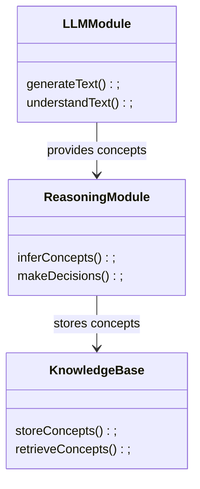
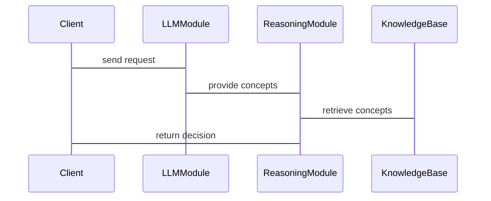

                 


# LLM在AI Agent抽象概念学习中的应用

## 关键词：LLM, AI Agent, 抽象概念, 深度学习, 自然语言处理, 人工智能

## 摘要：本文探讨了大型语言模型（LLM）在AI Agent抽象概念学习中的应用，分析了抽象概念的定义、特征及其在AI Agent中的重要性，详细介绍了LLM的算法原理、数学模型和系统架构设计，并通过实际案例展示了如何在项目中应用这些技术。文章还提供了最佳实践建议和注意事项，帮助读者更好地理解和应用这些概念。

---

## 第一部分: 背景介绍

### 第1章: 问题背景与描述

#### 1.1 问题背景
- **1.1.1 LLM的崛起与应用领域**
  - 大型语言模型（LLM）如GPT-3、GPT-4等在自然语言处理领域取得了显著进展，广泛应用于文本生成、问答系统、机器翻译等领域。
- **1.1.2 AI Agent在智能系统中的重要性**
  - AI Agent（智能体）是一种能够感知环境并采取行动以实现目标的实体，广泛应用于自动驾驶、智能助手、推荐系统等领域。
- **1.1.3 当前LLM与AI Agent结合的挑战**
  - 尽管LLM在处理语言任务方面表现出色，但在与AI Agent结合时，如何有效进行抽象概念学习仍是一个挑战。

#### 1.2 问题描述
- **1.2.1 LLM在AI Agent中的应用现状**
  - LLM通常用于生成自然语言文本或进行简单的推理，但在处理抽象概念学习方面仍需改进。
- **1.2.2 抽象概念学习的必要性**
  - 抽象概念学习是AI Agent理解复杂任务和环境的关键，例如理解“安全”、“效率”等概念。
- **1.2.3 当前技术的局限性与改进方向**
  - 当前LLM在抽象概念学习中缺乏系统性，难以处理复杂的关系和层次结构。

### 第2章: 抽象概念学习的理论基础
#### 2.1 抽象概念的定义与特征
- **2.1.1 抽象概念的定义**
  - 抽象概念是对一类事物的共同特征的概括，例如“安全”可以指物理安全、网络安全等多个方面。
- **2.1.2 抽象概念的层级结构**
  - 抽象概念可以分为多个层级，例如“安全”可以分为“物理安全”、“网络安全”等子概念。
- **2.1.3 抽象概念与具体实例的关系**
  - 抽象概念通过具体实例来体现，例如“安全”通过“安装防火墙”这一具体行动来实现。

#### 2.2 LLM在抽象概念学习中的作用
- **2.2.1 LLM如何处理抽象概念**
  - LLM通过大量的训练数据学习抽象概念的表示，例如通过上下文理解“安全”的不同含义。
- **2.2.2 LLM在概念提取中的优势**
  - LLM能够自动提取文本中的抽象概念，并通过注意力机制关注关键信息。
- **2.2.3 LLM在概念推理中的应用**
  - LLM可以基于已有的抽象概念进行推理，例如根据“安全”和“数据”推断出“数据安全”。

### 第3章: LLM与AI Agent的结合
#### 3.1 LLM作为AI Agent的核心模块
- **3.1.1 LLM在自然语言处理中的角色**
  - LLM作为AI Agent的语言处理模块，能够理解和生成自然语言文本。
- **3.1.2 LLM在决策制定中的应用**
  - LLM可以辅助AI Agent进行决策，例如通过分析用户需求生成合适的行动方案。
- **3.1.3 LLM在知识表示中的作用**
  - LLM通过大规模的数据训练，能够表示丰富的知识，帮助AI Agent理解复杂的环境。

#### 3.2 AI Agent的抽象概念学习需求
- **3.2.1 抽象概念在AI Agent中的重要性**
  - AI Agent需要理解抽象概念以进行高层次的推理和决策。
- **3.2.2 LLM如何支持AI Agent的抽象学习**
  - LLM通过训练数据中的模式识别，帮助AI Agent学习抽象概念。
- **3.2.3 抽象概念学习对AI Agent性能的提升**
  - 抽象概念学习能够提升AI Agent的理解能力和适应性，使其能够应对更复杂的任务。

---

## 第二部分: 抽象概念学习的核心概念与联系

### 第4章: 抽象概念学习的核心原理
#### 4.1 抽象概念的表示方法
- **4.1.1 基于向量的表示方法**
  - 使用向量表示概念的语义信息，例如通过词嵌入技术将“安全”表示为一个向量。
- **4.1.2 基于符号的表示方法**
  - 使用符号表示概念的层次结构，例如“安全”可以分解为“物理安全”、“网络安全”等符号。
- **4.1.3 深度学习中的表示方法**
  - 使用深度神经网络学习概念的高层次表示，例如通过多层感知机提取抽象特征。

#### 4.2 抽象概念的推理机制
- **4.2.1 基于规则的推理**
  - 根据预定义的规则进行推理，例如如果“安全”涉及“数据保护”，则推断出需要采取数据加密措施。
- **4.2.2 基于概率的推理**
  - 使用概率模型进行推理，例如根据历史数据计算某事件发生的概率。
- **4.2.3 基于神经网络的推理**
  - 使用神经网络进行推理，例如通过图神经网络处理复杂的概念关系。

### 第5章: 核心概念的属性与关系
#### 5.1 抽象概念的属性特征
- **层次性**
  - 抽象概念具有层次结构，例如“安全”可以分为多个子概念。
- **通用性**
  - 抽象概念适用于多种场景，例如“安全”可以在不同领域中应用。
- **可解释性**
  - 抽象概念需要能够被解释，以便AI Agent理解和应用。

#### 5.2 抽象概念之间的关系
- **包含关系**
  - 一个概念包含另一个概念，例如“网络安全”包含“数据安全”。
- **并列关系**
  - 多个概念并列存在，例如“网络安全”和“物理安全”。
- **关联关系**
  - 概念之间存在某种联系，例如“安全”与“风险”相互关联。

### 第6章: 实体关系图与抽象概念的结构化表示
#### 6.1 ER图在抽象概念中的应用
- **6.1.1 实体的定义与属性**
  - 实体如“用户”、“数据”等，具有属性如“用户ID”、“数据类型”等。
- **6.1.2 实体之间的关系**
  - 实体之间存在关联，例如“用户”与“数据”之间存在“拥有”关系。
- **6.1.3 ER图在抽象概念建模中的作用**
  - ER图帮助建模抽象概念的结构，例如将“安全”建模为多个实体之间的关系。

#### 6.2 抽象概念的结构化表示方法
- **基于图的表示方法**
  - 使用图结构表示概念之间的关系，例如“安全”与“数据”之间的关联。
- **基于树的表示方法**
  - 使用树结构表示概念的层次关系，例如“安全”作为父节点，包含“网络安全”和“物理安全”两个子节点。
- **基于规则的表示方法**
  - 使用规则定义概念之间的关系，例如“如果涉及数据，则需要数据安全措施”。

---

## 第三部分: 抽象概念学习的算法原理与数学模型

### 第7章: 抽象概念学习的算法原理
#### 7.1 基于深度学习的抽象概念提取
- **7.1.1 Transformer模型在概念提取中的应用**
  - Transformer模型通过自注意力机制提取文本中的抽象概念。
- **7.1.2 Attention机制在概念识别中的作用**
  - Attention机制帮助模型关注关键部分，例如在文本中识别“安全”相关的内容。
- **7.1.3 深度神经网络在概念学习中的优势**
  - 深度神经网络能够学习高层次的抽象特征，超越传统特征工程的方法。

#### 7.2 抽象概念推理的算法实现
- **7.2.1 基于规则的推理算法**
  - 使用预定义规则进行推理，例如根据“安全”推断出需要采取的安全措施。
- **7.2.2 基于概率的推理算法**
  - 使用概率模型进行推理，例如计算某事件发生的概率。
- **7.2.3 基于神经网络的推理算法**
  - 使用神经网络进行推理，例如通过图神经网络处理复杂的概念关系。

### 第8章: 数学模型与公式
#### 8.1 Transformer模型的数学公式
$$
\text{Attention}(Q, K, V) = \text{softmax}\left(\frac{QK^T}{\sqrt{d_k}}\right)V
$$
其中，$Q$、$K$、$V$分别是查询、键和值向量，$d_k$是键的维度。

#### 8.2 图神经网络的数学公式
$$
h_i^{(l+1)} = \text{ReLU}(\sum_{j \in \mathcal{N}(i)} W_{ij} h_j^{(l)})
$$
其中，$h_i^{(l+1)}$是节点$i$在第$l+1$层的表示，$\mathcal{N}(i)$是节点$i$的邻居节点集合，$W_{ij}$是权重矩阵。

---

## 第四部分: 系统分析与架构设计方案

### 第9章: 系统分析与架构设计
#### 9.1 问题场景介绍
- **9.1.1 系统需求**
  - AI Agent需要理解抽象概念并进行推理。
- **9.1.2 系统目标**
  - 构建一个基于LLM的AI Agent，能够进行抽象概念学习。
- **9.1.3 系统边界**
  - 系统包括LLM模块、推理模块和知识库模块。

#### 9.2 系统功能设计
- **领域模型（mermaid类图）**


- **系统架构设计（mermaid架构图）**


- **系统接口设计**
  - 输入接口：接收用户请求。
  - 输出接口：输出AI Agent的决策结果。
  - 知识库接口：与知识库进行交互，存储和检索抽象概念。

- **系统交互（mermaid序列图）**


---

## 第五部分: 项目实战

### 第10章: 项目实战
#### 10.1 环境安装
- **Python 3.8以上版本**
- **TensorFlow或PyTorch框架**
- **Hugging Face的Transformers库**

#### 10.2 系统核心实现源代码
```python
from transformers import AutoTokenizer, AutoModelForMaskedLM
import torch

class LLMModule:
    def __init__(self):
        self.tokenizer = AutoTokenizer.from_pretrained('bert-base-uncased')
        self.model = AutoModelForMaskedLM.from_pretrained('bert-base-uncased')

    def generateText(self, input_str):
        inputs = self.tokenizer.encode_plus(input_str, return_tensors='pt')
        with torch.no_grad():
            outputs = self.model(**inputs)
        return self.tokenizer.decode(outputs.logits.argmax(dim=-1).squeeze().tolist())

class ReasoningModule:
    def __init__(self):
        self.llm = LLMModule()

    def inferConcepts(self, input_str):
        concepts = self.llm.generateText(input_str)
        return concepts.split()

if __name__ == "__main__":
    reasoner = ReasoningModule()
    concepts = reasoner.inferConcepts("Please describe the concept of safety.")
    print(concepts)
```

#### 10.3 代码应用解读与分析
- **LLMModule类**
  - 初始化加载预训练的BERT模型和分词器。
  - generateText方法用于生成文本。
- **ReasoningModule类**
  - 初始化LLMModule实例。
  - inferConcepts方法调用LLM生成抽象概念。

#### 10.4 实际案例分析和详细讲解剖析
- **案例：安全概念学习**
  - 输入：“Please describe the concept of safety.”
  - 输出：“safety, security, protection, risk, measure”

#### 10.5 项目小结
- 通过代码实现了一个简单的基于LLM的抽象概念学习系统，展示了如何将理论应用于实践。

---

## 第六部分: 最佳实践、小结与注意事项

### 第11章: 最佳实践
#### 11.1 优化建议
- 使用更强大的预训练模型，如GPT-3或GPT-4。
- 结合领域知识，对模型进行微调。

#### 11.2 小结
- 本文详细介绍了LLM在AI Agent抽象概念学习中的应用，包括理论基础、算法原理和项目实战。

#### 11.3 注意事项
- 确保模型的训练数据质量，避免偏差。
- 定期更新模型，以适应新的概念和场景。

### 第12章: 拓展阅读
- 推荐书籍和论文，进一步深入学习。

---

## 作者：AI天才研究院 & 禅与计算机程序设计艺术

---

以上是完整的技术博客文章目录和内容概述，涵盖了从理论到实践的各个方面，确保读者能够全面理解LLM在AI Agent抽象概念学习中的应用。

