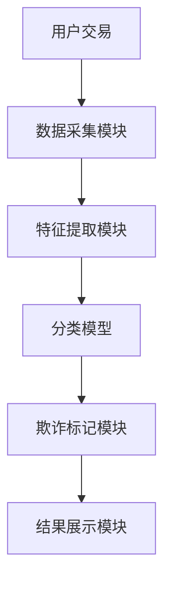

                 


# 在AI应用中遵守金融法规的重要性与方法

> 关键词：AI应用，金融法规，数据隐私，算法透明，金融合规，风险管理

> 摘要：随着人工智能技术在金融领域的广泛应用，合规性问题日益重要。本文深入分析了AI在金融中的应用现状，探讨了金融法规的核心要求，详细讲解了数据隐私保护和算法可解释性等技术实现方法，并通过实际案例展示了如何在项目中确保合规性。文章最后总结了最佳实践，为读者提供了全面的指导。

---

# 第一部分: 引言

# 第1章: AI在金融领域的应用现状与挑战

## 1.1 AI在金融中的典型应用

### 1.1.1 信用评估与风险管理

AI技术在信用评估中广泛应用，通过机器学习算法分析客户的信用历史、收入状况和消费行为，预测其还款能力。例如，使用逻辑回归（Logistic Regression）模型评估客户的违约风险。

### 1.1.2 智能投顾与财富管理

智能投顾系统利用AI算法为用户提供个性化的投资建议，如使用强化学习（Reinforcement Learning）优化投资组合。这些系统能够根据市场波动和用户风险偏好动态调整投资策略。

### 1.1.3 欺诈检测与预防

AI通过分析交易数据中的异常行为，识别潜在的欺诈交易。常用技术包括聚类分析（Clustering）和异常检测算法（Anomaly Detection），如Isolation Forest。

## 1.2 金融法规的基本概念与重要性

### 1.2.1 金融法规的核心概念

金融法规是指由监管机构制定的法律和规则，旨在维护金融市场秩序、保护投资者利益和促进金融稳定。核心包括反洗钱（AML）、反欺诈、数据隐私保护等方面。

### 1.2.2 金融法规在现代金融体系中的作用

- **维护市场秩序**：确保金融机构的运营透明和合规。
- **保护消费者权益**：防止欺诈和不当销售行为。
- **促进金融稳定**：通过监管防止系统性风险。

### 1.2.3 金融法规与技术创新的关系

技术进步推动金融创新，但同时也带来新的合规挑战。例如，AI的应用提高了效率，但也可能引发算法歧视或不透明性问题。

## 1.3 AI应用中的金融法规合规问题

### 1.3.1 AI在金融应用中的潜在风险

- **算法偏见**：AI模型可能基于历史数据中的偏差做出不公平决策。
- **数据隐私泄露**：在处理敏感金融数据时，可能违反隐私保护法规。
- **不透明性**：复杂的AI模型可能难以解释其决策过程，导致合规困难。

### 1.3.2 合规性要求对AI应用的约束

- **数据使用限制**：必须遵守GDPR等数据保护法规，确保数据处理的合法性。
- **算法可解释性要求**：监管机构需要理解AI决策的依据。
- **责任归属问题**：当AI系统导致损失时，责任认定可能复杂。

### 1.3.3 违反金融法规的法律后果

包括罚款、业务限制、声誉损失，甚至刑事责任。例如，未能有效防止洗钱行为可能导致机构被罚款数百万美元。

## 1.4 本章小结

本章介绍了AI在金融领域的广泛应用及其带来的合规挑战。强调了金融法规的重要性，并指出了AI应用中可能引发的法律风险和合规要求。

---

# 第二部分: AI应用中的金融法规合规性分析

# 第2章: 金融法规对AI应用的核心要求

## 2.1 数据隐私与安全要求

### 2.1.1 数据隐私保护的法律框架

- **欧盟GDPR**：要求数据处理者明确数据处理目的，并获得数据主体的同意。
- **美国CCPA**：赋予消费者对其个人数据的更多控制权。

### 2.1.2 数据安全的技术要求

- **数据加密**：使用AES算法对敏感数据进行加密，确保传输和存储的安全。
- **访问控制**：通过RBAC（基于角色的访问控制）限制数据访问权限。

### 2.1.3 数据使用中的合规性原则

- **最小化原则**：只收集实现目的所必需的数据。
- **目的限制原则**：数据处理必须符合授权目的。

## 2.2 算法透明性与可解释性

### 2.2.1 算法透明性的法律要求

- **白盒模型**：要求AI系统的设计者能够解释其决策过程。
- **可解释性标准**：如美国NIST发布的AI可解释性框架。

### 2.2.2 算法可解释性的技术实现

- **模型简化的技术**：例如，将复杂的深度学习模型转换为易于解释的规则集。
- **特征重要性分析**：通过SHAP值（SHapley Additive exPlanations）识别关键特征。

### 2.2.3 不可解释性算法的法律风险

- **黑箱模型的限制**：在需要解释性的情况下，如贷款审批，可能无法使用复杂的神经网络模型。
- **合规性挑战**：难以证明模型决策的合法性。

## 2.3 AI决策的合规性与责任归属

### 2.3.1 AI决策的法律责任

- **过失责任**：如果AI系统的设计或部署存在明显缺陷，开发者和金融机构可能需要承担法律责任。
- **严格责任**：在某些情况下，可能需要承担无过错责任。

### 2.3.2 决策过程中的证据留存

- **日志记录**：保存所有AI决策的记录，包括输入数据、模型输出和决策结果。
- **可追溯性**：确保在需要时能够追溯到具体决策的原因。

### 2.3.3 责任划分的法律框架

- **合同条款**：明确AI系统在不同情况下的责任归属。
- **监管机构的指导**：遵循各国监管机构发布的AI合规指南。

## 2.4 本章小结

本章分析了金融法规对AI应用的核心要求，重点探讨了数据隐私、算法透明性和责任归属等关键问题，强调了合规性对AI系统设计和部署的重要性。

---

# 第三部分: AI应用中的金融法规合规性技术实现

# 第3章: 数据隐私保护技术

## 3.1 数据加密与脱敏技术

### 3.1.1 数据加密的基本原理

- **加密算法**：对称加密（如AES）和非对称加密（如RSA）。
- **数据保护**：在传输和存储过程中，确保数据的机密性和完整性。

### 3.1.2 数据脱敏的技术实现

- **数据替换**：用虚拟值替换敏感信息，如将真实姓名替换为代号。
- **数据变形**：对数据进行数学变换，如对日期进行偏移处理。

### 3.1.3 加密与脱敏的合规性验证

- **合规标准**：验证是否符合GDPR等数据保护法规。
- **测试方法**：通过模拟攻击测试数据的安全性。

## 3.2 数据共享与联邦学习

### 3.2.1 联邦学习的概念与特点

- **联邦学习**：多个机构在不共享原始数据的情况下，联合训练模型。
- **隐私保护**：通过加密和差分隐私技术确保数据安全。

### 3.2.2 联邦学习的合规性优势

- **数据隐私**：符合数据保护法规，避免数据泄露风险。
- **合作效率**：在不共享数据的情况下，实现模型的联合优化。

### 3.2.3 联邦学习的实际应用案例

- **反欺诈系统**：多个银行联合训练欺诈检测模型，提高检测准确率。
- **信用评分模型**：金融机构共享脱敏数据，提高模型泛化能力。

## 3.3 数据安全的合规性评估

### 3.3.1 数据安全评估的指标体系

- **技术指标**：加密算法的强度、访问控制的完善性。
- **管理指标**：安全策略的制定、员工培训情况。

### 3.3.2 合规性评估的方法与流程

1. **风险识别**：识别可能的数据泄露风险点。
2. **评估标准**：根据法规要求，制定评估标准。
3. **评估实施**：对系统进行全面的安全评估，记录问题和改进措施。
4. **持续监控**：定期复查，确保合规性。

### 3.3.3 评估结果的改进措施

- **技术改进**：升级加密算法，增强访问控制。
- **管理优化**：完善安全管理制度，加强员工培训。

## 3.4 本章小结

本章探讨了数据隐私保护技术，介绍了数据加密、脱敏和联邦学习等方法，强调了在AI应用中保护数据隐私的重要性，并提出了合规性评估和改进措施。

---

# 第4章: 算法可解释性

## 4.1 算法透明性的实现方法

### 4.1.1 简化模型复杂度

- **线性回归**：简单、可解释性强。
- **决策树**：通过树结构直观展示决策过程。

### 4.1.2 提供解释性报告

- **特征重要性**：列出影响决策的关键特征及其权重。
- **决策路径**：展示AI系统做出决策的具体步骤。

## 4.2 算法可解释性的技术实现

### 4.2.1 SHAP值

- **SHAP值**：用于解释模型的预测结果，显示每个特征对最终决策的贡献程度。
- **实现方法**：通过Python库如`shap`计算和可视化SHAP值。

### 4.2.2 LIME解释方法

- **LIME**：通过生成近邻数据点，拟合简单模型解释复杂模型的预测。
- **实现步骤**：选择解释点，生成近邻，拟合模型，可视化结果。

## 4.3 可解释性模型设计

### 4.3.1 规则基模型

- **规则集**：将AI决策过程转化为一系列可读的规则，如“如果收入超过50万，且信用评分高于700，则批准贷款。”

### 4.3.2 可视化工具

- **模型解释图**：通过图表展示模型的决策逻辑，如决策树的树状图。

## 4.4 本章小结

本章介绍了算法透明性和可解释性的实现方法，探讨了如何通过简化模型、生成解释性报告和使用SHAP值等技术手段提高AI决策的透明度。

---

# 第四部分: 项目实战

# 第5章: 项目实战——构建AI反欺诈系统

## 5.1 项目背景与目标

### 5.1.1 项目背景

- **欺诈问题**：金融交易中的欺诈行为日益猖獗，传统方法难以及时 detection。
- **项目目标**：构建一个基于AI的反欺诈系统，实时检测和预防欺诈交易。

## 5.2 系统设计

### 5.2.1 系统功能设计

- **数据采集**：实时采集交易数据，包括交易金额、时间、地点、用户行为等。
- **特征提取**：从交易数据中提取有用的特征，如交易频率、金额分布、地理位置变化等。
- **模型训练**：使用训练数据训练分类模型，识别正常交易和欺诈交易。
- **实时检测**：对实时交易进行分类，标记可能的欺诈交易。

### 5.2.2 系统架构设计



## 5.3 环境搭建

### 5.3.1 安装必要的库

```bash
pip install numpy pandas scikit-learn xgboost
```

### 5.3.2 数据准备

```python
import pandas as pd
import numpy as np

# 生成模拟数据
data = {
    '交易金额': np.random.uniform(0, 1000, 1000),
    '交易时间': np.random.choice(['早', '午', '晚'], 1000),
    '地理位置': np.random.choice(['北京', '上海', '广州'], 1000),
    '交易类型': ['普通交易'] * 500 + ['异常交易'] * 500
}
df = pd.DataFrame(data)
```

## 5.4 核心代码实现

### 5.4.1 特征工程

```python
from sklearn.preprocessing import StandardScaler

# 特征选择
features = ['交易金额', '交易时间', '地理位置']
X = df[features]
y = df['交易类型'].apply(lambda x: 1 if x == '异常交易' else 0)

# 标准化处理
scaler = StandardScaler()
X_scaled = scaler.fit_transform(X)
```

### 5.4.2 模型训练

```python
from xgboost import XGBClassifier
from sklearn.metrics import accuracy_score

# 训练模型
model = XGBClassifier()
model.fit(X_scaled, y)

# 预测
y_pred = model.predict(X_scaled)
print("准确率:", accuracy_score(y, y_pred))
```

### 5.4.3 模型解释

```python
import shap

# 选择一个解释点
explainer = shap.TreeExplainer(model)
shap_values = explainer.shap_values(X_scaled)

# 可视化解释
shap.summary_plot(shap_values, X, plot_type="bar")
```

## 5.5 项目总结

### 5.5.1 实践总结

- **优势**：提高了欺诈检测的准确性，减少了误报和漏报。
- **挑战**：模型的可解释性仍需进一步提高，数据隐私保护需要加强。

### 5.5.2 注意事项

- **数据质量**：确保数据的完整性和准确性，避免影响模型性能。
- **模型更新**：定期更新模型，适应欺诈手段的变化。
- **合规性检查**：确保整个系统符合相关金融法规，特别是数据隐私和算法透明性方面。

## 5.5.3 未来展望

随着AI技术的不断发展，反欺诈系统将更加智能化和高效化。未来可能结合区块链技术，进一步提高系统的安全性和透明度。

---

# 第五部分: 最佳实践与注意事项

# 第6章: 最佳实践

## 6.1 合规性原则

### 6.1.1 数据最小化原则

- **只收集必要的数据**：避免收集与业务无关的个人信息。
- **数据使用目的明确**：确保数据处理有明确的法律依据。

### 6.1.2 算法透明性原则

- **选择可解释的模型**：优先使用线性回归、决策树等可解释性较强的模型。
- **提供解释性报告**：向监管机构和用户提供模型决策的解释。

## 6.2 数据安全最佳实践

### 6.2.1 数据加密

- **传输层加密**：使用HTTPS确保数据传输的安全性。
- **存储层加密**：对敏感数据进行加密存储，如加密数据库。

### 6.2.2 访问控制

- **RBAC模型**：基于角色分配权限，确保不同角色的用户只能访问其权限范围内的数据。
- **最小权限原则**：授予用户最低级别的权限，以完成其工作职责。

## 6.3 风险管理

### 6.3.1 风险评估

- **定期风险评估**：识别系统中的潜在风险点，评估其影响和可能性。
- **风险缓解措施**：制定应对策略，降低风险发生的可能性。

### 6.3.2 应急计划

- **制定应急预案**：在发生数据泄露或系统故障时，能够迅速响应，减少损失。
- **演练与更新**：定期进行应急演练，更新应急预案，确保其有效性和可操作性。

## 6.4 本章小结

本章总结了在AI应用中遵守金融法规的最佳实践，包括数据最小化、算法透明性、数据安全和风险管理等方面，为读者提供了实用的指导和建议。

---

# 结语

随着人工智能技术的不断进步，其在金融领域的应用前景广阔。然而，合规性问题也随之而来，成为影响AI技术应用的关键因素。本文从多个角度探讨了在AI应用中遵守金融法规的重要性与方法，包括数据隐私保护、算法透明性、责任归属等方面，并通过实际案例展示了如何在项目中实现合规性。希望本文能够为读者提供有价值的参考，帮助他们在AI应用中更好地遵守金融法规，推动技术与合规的协调发展。

---

**作者：AI天才研究院/AI Genius Institute & 禅与计算机程序设计艺术 /Zen And The Art of Computer Programming**

