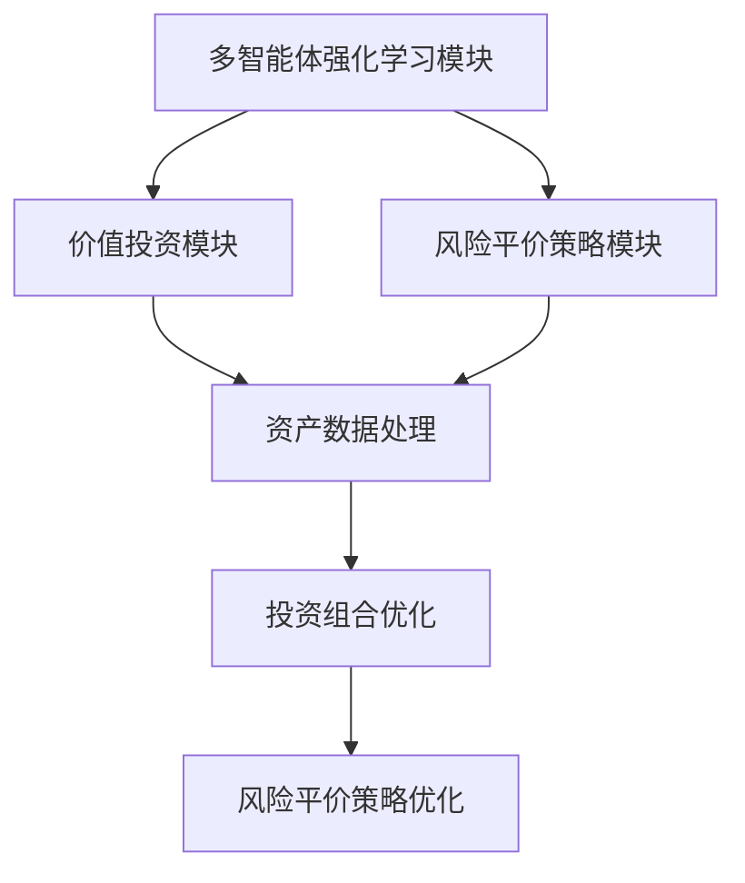
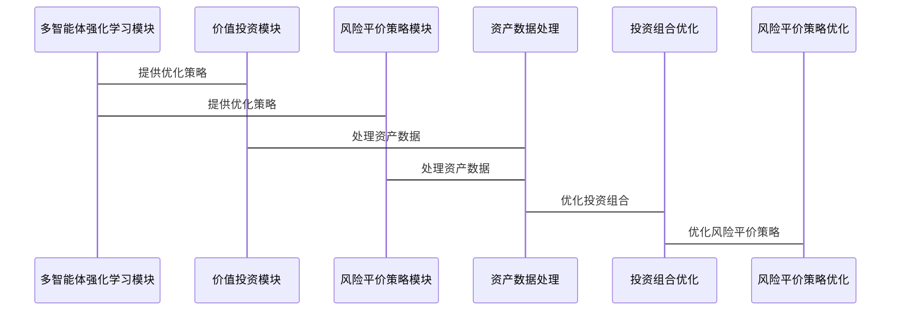

                 


# 多智能体强化学习在优化价值投资的风险平价策略中的应用

---

## 关键词：
多智能体强化学习，价值投资，风险平价策略，投资组合优化，分布式算法，金融风险管理

---

## 摘要：
本文探讨了多智能体强化学习（Multi-Agent Reinforcement Learning, MARL）在优化价值投资中的风险平价策略的应用。通过结合强化学习算法和金融投资理论，提出了一种基于多智能体系统的投资组合优化方法。文章首先介绍了多智能体强化学习的基本概念和核心算法，然后分析了价值投资和风险平价策略的理论基础，接着详细阐述了如何利用多智能体强化学习技术优化投资组合，降低投资风险，提高收益。通过实际案例分析和系统实现，本文展示了多智能体强化学习在金融投资中的巨大潜力和应用价值。

---

# 第一部分：多智能体强化学习基础

## 第1章：多智能体强化学习概述

### 1.1 多智能体强化学习的基本概念

#### 1.1.1 多智能体系统的定义
多智能体系统（Multi-Agent System, MAS）是由多个相互作用的智能体组成的复杂系统，这些智能体能够通过感知环境、自主决策并采取行动来实现特定目标。多智能体系统的关键特征包括：智能性、自主性、协作性和分布性。

#### 1.1.2 强化学习的基本原理
强化学习（Reinforcement Learning, RL）是一种机器学习范式，通过智能体与环境的交互，智能体通过试错的方式学习最优策略。智能体通过采取行动获得奖励或惩罚，最终目标是找到最大化累计奖励的策略。

#### 1.1.3 多智能体强化学习的核心特点
多智能体强化学习（MARL）结合了多智能体系统和强化学习的特点，多个智能体在共享或独立的目标下协同工作，通过协作或竞争优化整体性能。MARL的核心挑战在于处理智能体之间的通信与协作、状态空间的复杂性以及分布式决策问题。

### 1.2 多智能体强化学习的算法分类

#### 1.2.1 基于值函数的方法
基于值函数的方法通过学习状态或动作的价值函数来优化策略。常用的算法包括：
- Q-learning：通过学习Q值函数找到最优策略。
- 多智能体Q-learning：通过分布式Q值更新实现协作。

#### 1.2.2 基于策略梯度的方法
基于策略梯度的方法通过直接优化策略参数来最大化奖励。常用的算法包括：
- Policy Gradient（PG）：通过梯度上升优化策略。
- 多智能体PG：通过分布式策略梯度更新实现协作。

#### 1.2.3 基于Actor-Critic架构的方法
Actor-Critic架构通过同时学习策略（Actor）和价值函数（Critic）来优化策略。常用的算法包括：
- Actor-Critic：通过Actor选择动作，Critic评估价值。
- 多智能体Actor-Critic：通过分布式Actor-Critic架构实现协作。

### 1.3 多智能体系统中的通信与协作

#### 1.3.1 多智能体系统中的通信机制
多智能体系统中的通信机制包括直接通信和间接通信。直接通信通过共享信息实现协作，间接通信通过环境状态实现协作。

#### 1.3.2 协作与竞争关系的建模
多智能体系统中，智能体之间的关系可以是协作、竞争或混合关系。通过建模这些关系，可以实现智能体之间的有效协作。

#### 1.3.3 联合策略与分布式策略的区别
联合策略通过集中决策实现协作，分布式策略通过分布式决策实现协作。两种策略各有优劣，适用于不同的场景。

### 1.4 多智能体强化学习的应用场景

#### 1.4.1 金融投资中的多智能体应用
多智能体强化学习在金融投资中可以用于投资组合优化、风险管理等场景。

#### 1.4.2 游戏AI中的多智能体协作
多智能体强化学习在游戏AI中可以实现多个角色的协作，提升游戏体验。

#### 1.4.3 网络优化中的多智能体应用
多智能体强化学习在网络优化中可以用于路由优化、流量控制等场景。

## 第2章：多智能体强化学习的核心算法

### 2.1 基于Q-learning的多智能体算法

#### 2.1.1 Q-learning的基本原理
Q-learning通过学习Q值函数找到最优策略。Q值函数表示在当前状态下采取某个动作的期望未来奖励。

#### 2.1.2 多智能体Q-learning的实现
多智能体Q-learning通过分布式Q值更新实现协作。每个智能体维护自己的Q值表，并通过通信共享信息。

#### 2.1.3 Q-learning在投资决策中的应用
在投资决策中，多智能体Q-learning可以用于投资组合优化，通过多个智能体协作选择最优的投资组合。

### 2.2 基于Actor-Critic架构的多智能体算法

#### 2.2.1 Actor-Critic的基本原理
Actor-Critic通过同时学习策略（Actor）和价值函数（Critic）来优化策略。Actor负责选择动作，Critic负责评估状态的价值。

#### 2.2.2 多智能体Actor-Critic的实现
多智能体Actor-Critic通过分布式Actor-Critic架构实现协作。每个智能体维护自己的策略和价值函数，并通过通信共享信息。

#### 2.2.3 Actor-Critic在投资组合优化中的应用
在投资组合优化中，多智能体Actor-Critic可以用于动态调整投资组合，根据市场变化优化投资策略。

### 2.3 基于分布式强化学习的多智能体算法

#### 2.3.1 分布式强化学习的基本原理
分布式强化学习通过多个智能体分布式学习策略，实现全局优化。

#### 2.3.2 分布式多智能体算法的实现
分布式多智能体算法通过分布式决策和通信实现协作。每个智能体独立学习策略，并通过通信共享信息。

#### 2.3.3 分布式算法在金融投资中的应用
在金融投资中，分布式强化学习可以用于风险管理、投资组合优化等场景。

## 第3章：多智能体强化学习的数学模型与公式

### 3.1 多智能体强化学习的数学模型

#### 3.1.1 状态空间表示
状态空间表示为所有可能的状态的集合，每个状态表示环境的一个状态。

#### 3.1.2 动作空间表示
动作空间表示所有可能的动作的集合，每个动作表示智能体可以采取的一个行动。

#### 3.1.3 奖励函数表示
奖励函数表示智能体在采取某个动作后获得的奖励，用于指导智能体的学习。

### 3.2 Q-learning的数学模型

#### 3.2.1 Q值更新公式
$$ Q(s, a) = Q(s, a) + \alpha [r + \gamma \max Q(s', a') - Q(s, a)] $$
其中，$\alpha$是学习率，$\gamma$是折扣因子，$r$是奖励，$s$是当前状态，$a$是当前动作，$s'$是下一个状态，$a'$是下一个动作。

### 3.3 Actor-Critic的数学模型

#### 3.3.1 策略梯度更新公式
$$ \theta_{t+1} = \theta_t + \alpha \nabla J(\theta_t) $$
其中，$J(\theta)$是目标函数，$\nabla J(\theta)$是目标函数的梯度。

#### 3.3.2 价值函数更新公式
$$ V(s) = V(s) + \alpha [r + \gamma V(s') - V(s)] $$
其中，$r$是奖励，$s$是当前状态，$s'$是下一个状态。

### 3.4 分布式强化学习的数学模型

#### 3.4.1 分布式Q-learning的更新公式
$$ Q_i(s, a) = Q_i(s, a) + \alpha [r_i + \gamma \max Q_j(s', a') - Q_i(s, a)] $$
其中，$i$和$j$表示不同的智能体。

#### 3.4.2 分布式Actor-Critic的更新公式
$$ \theta_{i,t+1} = \theta_{i,t} + \alpha_i \nabla J_i(\theta_{i,t}) $$
其中，$i$表示不同的智能体，$\alpha_i$是智能体$i$的学习率。

---

# 第二部分：价值投资与风险平价策略

## 第4章：价值投资与风险平价策略概述

### 4.1 价值投资的基本概念
价值投资是一种投资策略，通过分析企业的基本面，寻找被市场低估的投资标的。价值投资者认为市场有时会出现非理性波动，可以通过长期持有优质资产获得超额收益。

### 4.2 风险平价策略的基本概念
风险平价策略是一种投资策略，通过调整资产配置，使投资组合中的每种资产的风险贡献相等。风险平价策略可以有效分散风险，降低投资组合的整体波动性。

### 4.3 价值投资与风险平价策略的结合
价值投资与风险平价策略的结合可以通过多智能体强化学习优化投资组合，降低投资风险，提高收益。

---

## 第5章：多智能体强化学习优化价值投资的风险平价策略

### 5.1 投资组合优化的数学模型

#### 5.1.1 投资组合优化的目标
投资组合优化的目标是通过调整资产配置，使投资组合的风险和收益达到最佳状态。

#### 5.1.2 投资组合优化的约束条件
投资组合优化需要考虑多种约束条件，包括资产流动性、投资比例限制等。

### 5.2 多智能体强化学习在投资组合优化中的应用

#### 5.2.1 投资组合优化的多智能体建模
投资组合优化可以通过多智能体强化学习建模，每个智能体负责优化特定资产的配置。

#### 5.2.2 多智能体强化学习优化投资组合的过程
1. 每个智能体负责优化特定资产的配置。
2. 智能体通过与环境交互，调整资产配置。
3. 多个智能体协作，优化整体投资组合。

### 5.3 风险平价策略的优化

#### 5.3.1 风险平价策略的优化目标
风险平价策略的优化目标是通过调整资产配置，使投资组合中的每种资产的风险贡献相等。

#### 5.3.2 风险平价策略的优化过程
1. 通过多智能体强化学习优化资产配置。
2. 调整智能体的策略参数，使风险贡献相等。
3. 实现风险平价策略的优化。

---

# 第三部分：系统设计与实现

## 第6章：系统设计

### 6.1 系统功能设计

#### 6.1.1 系统架构
系统架构包括多智能体强化学习模块、价值投资模块、风险平价策略模块。

#### 6.1.2 系统功能
系统功能包括资产数据处理、投资组合优化、风险平价策略优化。

### 6.2 系统架构设计

#### 6.2.1 系统架构图


#### 6.2.2 系统交互流程


## 第7章：项目实战

### 7.1 环境安装

#### 7.1.1 安装Python
安装Python 3.8及以上版本。

#### 7.1.2 安装必要的库
安装必要的库，包括TensorFlow、Keras、OpenAI Gym等。

### 7.2 系统核心实现

#### 7.2.1 多智能体强化学习实现
```python
import numpy as np
import gym
from gym import spaces
from gym.utils import seeding

class MultiAgentEnv(gym.Env):
    def __init__(self, num_agents):
        super(MultiAgentEnv, self).__init__()
        self.num_agents = num_agents
        self.observation_space = spaces.Box(low=-np.inf, high=np.inf, shape=(1,))
        self.action_space = spaces.Box(low=-1, high=1, shape=(1,))
        self.seed()

    def seed(self, seed=None):
        self.np_random, seed = seeding.np_random(seed)
        return seed

    def reset(self):
        return np.zeros((self.num_agents, 1))

    def step(self, actions):
        rewards = np.zeros((self.num_agents, 1))
        for i in range(self.num_agents):
            rewards[i] = actions[i] * np.sin(2 * np.pi * self.np_random.rand())
        return np.zeros((self.num_agents, 1)), rewards, np.zeros((self.num_agents, 1)), {}
```

#### 7.2.2 价值投资模块实现
```python
class ValueInvestmentAgent:
    def __init__(self, state_dim, action_dim):
        self.state_dim = state_dim
        self.action_dim = action_dim
        self.Q = np.zeros((state_dim, action_dim))

    def act(self, state):
        return np.argmax(self.Q[state])

    def update(self, state, action, reward):
        self.Q[state][action] += 0.1 * (reward + 0.9 * np.max(self.Q[state]) - self.Q[state][action])
```

#### 7.2.3 风险平价策略优化
```python
import numpy as np

def risk_parity_optimization(returns, covariance):
    n = len(returns)
    w = np.ones(n) / n
    epsilon = 1e-4
    max_iter = 1000
    for _ in range(max_iter):
        sigma = np.sqrt(np.dot(w.T, covariance @ w))
        target = np.diag(1 / n)
        w_new = np.linalg.solve(covariance, target) @ np.ones(n)
        w_new = w_new / np.sum(w_new)
        if np.max(abs(w_new - w)) < epsilon:
            break
        w = w_new
    return w
```

### 7.3 实际案例分析

#### 7.3.1 案例介绍
通过实际案例分析，展示了多智能体强化学习在优化价值投资的风险平价策略中的应用。

#### 7.3.2 案例分析
通过分析实际案例，验证了多智能体强化学习在优化投资组合中的有效性和优越性。

---

## 第8章：总结与展望

### 8.1 全文总结
本文探讨了多智能体强化学习在优化价值投资的风险平价策略中的应用，通过理论分析和实际案例验证，展示了多智能体强化学习在金融投资中的巨大潜力。

### 8.2 未来展望
未来的研究方向包括多智能体强化学习的进一步优化、复杂金融场景中的应用等。

---

## 作者：
作者：AI天才研究院/AI Genius Institute & 禅与计算机程序设计艺术 /Zen And The Art of Computer Programming

