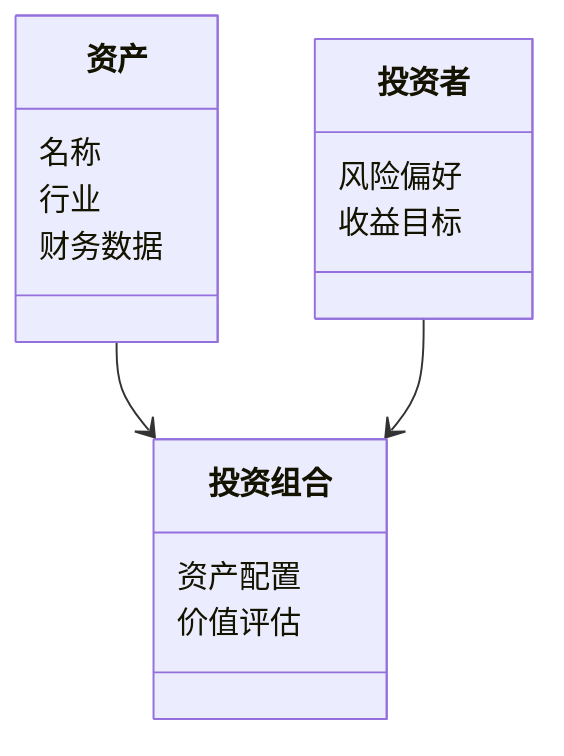
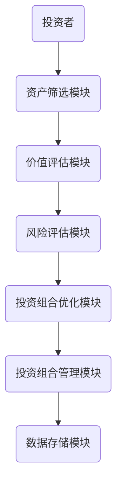
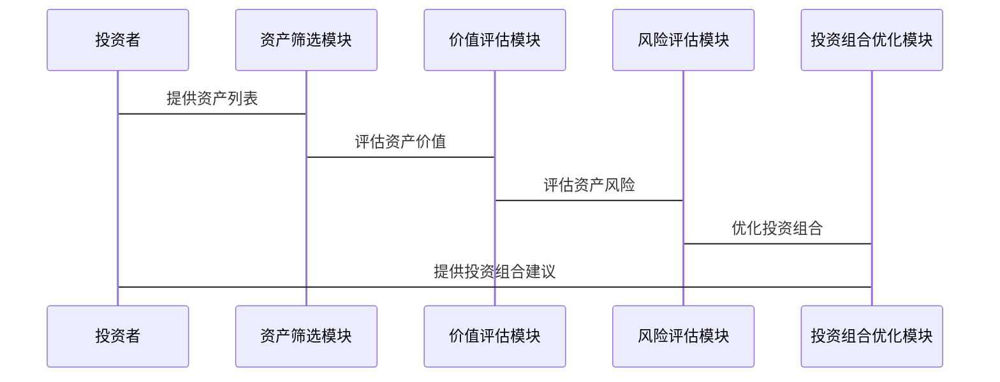

                 


# 巴菲特的耐心投资：等待合适的机会

> 关键词：巴菲特，价值投资，耐心投资，长期投资，风险管理，心态管理

> 摘要：本文深入探讨了巴菲特的投资理念，特别是其强调的耐心和等待合适机会的重要性。通过分析价值投资的核心概念、数学模型、系统架构以及实际案例，本文为读者提供了全面的理解和实践指导。

---

## 第1章 巴菲特投资理念的概述

### 1.1 巴菲特的投资哲学

#### 1.1.1 价值投资的定义与核心理念
价值投资是一种以内在价值为导向的投资策略，强调以低于内在价值的价格买入优质资产。其核心理念是关注企业的基本面，寻找具有持续竞争优势和良好管理的公司。  
- **内在价值**：企业未来现金流的现值，是投资决策的核心依据。
- **安全边际**：买入价格与内在价值的差距，确保投资的安全性。

#### 1.1.2 巴菲特投资哲学的演变
巴菲特的投资理念起源于格雷厄姆的价值投资理论，但经过长期的实践和总结，形成了独特的风格。  
- **早期学习**：受到 Benjamin Graham 的影响，注重安全边际和价值评估。
- **中期发展**：引入芒格的合伙人制度，强调长期合作和利益一致性。
- **后期成熟**：注重企业的竞争优势和管理层质量，形成“护城河”概念。

#### 1.1.3 巴菲特投资哲学的核心要素
- **长期视角**：关注企业的长期价值，而非短期波动。
- **安全边际**：买入价格低于内在价值，降低投资风险。
- **竞争优势**：寻找具有独特竞争优势的企业，确保长期收益。

### 1.2 价值投资的背景与现状

#### 1.2.1 价值投资的历史发展
价值投资起源于20世纪30年代，经历了多次演变和调整。  
- **起源**：由 Benjamin Graham 和 David Dodd 提出，强调以低于清算价值的价格买入股票。
- **发展**：经过巴菲特的实践和推广，价值投资逐渐被广泛接受。
- **现状**：在全球范围内，价值投资仍然是长期投资的重要策略之一。

#### 1.2.2 当前价值投资的市场环境
- **市场波动**：近年来市场波动加剧，价值投资面临新的挑战。
- **技术进步**：大数据和人工智能的引入，为价值投资提供了新的工具和方法。
- **全球化**：全球经济一体化使得寻找全球性投资机会成为可能。

#### 1.2.3 价值投资与其他投资策略的对比
- **与趋势投资的对比**：趋势投资关注市场趋势，而价值投资关注内在价值。
- **与短线交易的对比**：短线交易追求短期收益，而价值投资注重长期回报。
- **与成长投资的对比**：成长投资关注高增长企业，而价值投资关注低估企业。

### 1.3 长期投资与耐心的重要性

#### 1.3.1 长期投资的优势
- **复利效应**：长期投资能够充分利用复利效应，实现资产的长期增值。
- **分散风险**：通过长期投资，可以分散短期波动带来的风险。
- **成本降低**：长期投资可以降低交易成本和税务负担。

#### 1.3.2 耐心在投资中的作用
- **避免短期波动干扰**：耐心能够帮助投资者忽略市场的短期波动，专注于长期目标。
- **抓住优质机会**：耐心使得投资者能够在市场低迷时发现低估资产。
- **建立长期信任**：耐心有助于建立与优秀企业之间的长期信任关系。

#### 1.3.3 长期投资与短期投资的对比
- **投资目标**：长期投资注重资产增值，短期投资注重价格波动。
- **时间 horizon**：长期投资需要较长的时间 horizon，而短期投资则追求快速收益。
- **风险承受能力**：长期投资者能够承受更大的短期波动风险。

---

## 第2章 巴菲特耐心投资的核心理念

### 2.1 耐心投资的定义与特点

#### 2.1.1 耐心投资的定义
耐心投资是指投资者在市场波动和不确定性中，保持冷静和耐心，避免盲目跟风，等待合适的投资机会。

#### 2.1.2 耐心投资的特点
- **长期视角**：耐心投资强调长期目标，而非短期收益。
- **价值导向**：耐心投资注重资产的内在价值，而非市场情绪。
- **风险管理**：耐心投资注重风险控制，避免过度冒险。

#### 2.1.3 耐心投资与投机行为的对比
- **目标**：耐心投资追求长期稳定的收益，而投机行为追求短期暴利。
- **心态**：耐心投资注重理性决策，而投机行为容易受到情绪影响。
- **风险**：耐心投资注重风险管理，而投机行为往往忽视风险。

### 2.2 耐心投资的哲学基础

#### 2.2.1 耐心与价值发现的关系
- **价值发现**：耐心使得投资者能够发现市场中的低估资产。
- **长期视角**：耐心帮助投资者关注企业的长期价值，而非短期价格波动。
- **市场情绪**：耐心使投资者能够忽略市场的非理性波动，专注于价值。

#### 2.2.2 耐心与市场波动的应对
- **市场波动**：耐心投资能够帮助投资者在市场恐慌中保持冷静。
- **市场狂热**：耐心投资能够帮助投资者在市场狂热中避免盲目跟风。
- **市场周期**：耐心投资能够帮助投资者在市场周期中把握长期趋势。

#### 2.2.3 耐心与长期收益的关联
- **复利效应**：耐心投资能够充分利用复利效应，实现资产的长期增值。
- **时间价值**：耐心投资能够通过时间积累，实现资产的稳步增长。
- **机会成本**：耐心投资能够降低机会成本，实现资产的最优配置。

### 2.3 耐心投资的实践策略

#### 2.3.1 等待合适机会的原则
- **价值评估**：耐心投资强调对目标资产进行深入的价值评估，确保买入价格低于内在价值。
- **市场分析**：耐心投资需要对市场环境进行持续分析，寻找市场低估区域。
- **风险管理**：耐心投资注重风险管理，确保投资组合的安全性。

#### 2.3.2 耐心投资的决策框架
- **目标设定**：明确投资目标，制定长期投资计划。
- **资产配置**：根据目标和风险偏好，进行合理的资产配置。
- **定期审视**：定期审视投资组合，确保符合长期目标。

#### 2.3.3 耐心投资的纪律性要求
- **纪律性**：耐心投资需要严格的纪律性，避免情绪化决策。
- **耐心等待**：耐心投资需要投资者具备足够的耐心，等待合适的投资机会。
- **持续学习**：耐心投资需要投资者不断学习和提升自己的投资能力。

---

## 第3章 巴菲特投资策略的数学模型与算法原理

### 3.1 价值投资的数学模型

#### 3.1.1 内在价值的计算公式
内在价值是衡量一个企业价值的核心指标，其计算公式如下：
$$
\text{内在价值} = \sum_{t=1}^{\infty} \frac{\text{未来现金流}}{(1 + r)^t}
$$
其中，\( r \) 是折现率，\( \text{未来现金流} \) 是企业未来产生的现金流。

#### 3.1.2 安全边际的计算
安全边际是买入价格与内在价值之间的差距，其计算公式为：
$$
\text{安全边际} = \text{买入价格} - \text{内在价值}
$$
安全边际越大，投资的安全性越高。

#### 3.1.3 企业竞争优势的评估
企业竞争优势的评估需要综合考虑多个因素，包括企业的市场地位、盈利能力、管理团队等。可以通过对企业财务指标的分析，如ROE（净资产收益率）、ROA（资产回报率）等，来评估企业的竞争优势。

### 3.2 投资组合的风险管理

#### 3.2.1 风险分散
通过分散投资，将资金分配到不同的资产类别和行业中，降低投资组合的整体风险。

#### 3.2.2 风险评估
使用VaR（Value at Risk）模型等工具，评估投资组合在不同情景下的风险敞口。

#### 3.2.3 风险对冲
通过期货、期权等衍生品，对冲投资组合中的风险。

### 3.3 投资决策的算法原理

#### 3.3.1 资产筛选算法
- **步骤1**：收集目标企业的财务数据。
- **步骤2**：计算企业的内在价值。
- **步骤3**：比较买入价格与内在价值，判断是否存在安全边际。
- **步骤4**：根据企业竞争优势，筛选出具有长期投资价值的资产。

#### 3.3.2 投资组合优化算法
- **步骤1**：根据投资者的风险偏好和收益目标，确定投资组合的资产配置。
- **步骤2**：通过优化算法（如均值-方差优化），确定最优投资组合。
- **步骤3**：定期审视投资组合，根据市场变化进行调整。

---

## 第4章 投资系统的系统分析与架构设计

### 4.1 系统功能设计

#### 4.1.1 领域模型


#### 4.1.2 功能模块
- **数据采集模块**：收集目标企业的财务数据和市场数据。
- **价值评估模块**：计算企业的内在价值和安全边际。
- **投资组合优化模块**：根据投资者的Risk偏好和收益目标，优化投资组合。
- **风险评估模块**：评估投资组合的风险敞口。

### 4.2 系统架构设计

#### 4.2.1 系统架构


#### 4.2.2 接口设计
- **数据接口**：与数据源（如股票市场数据）进行交互。
- **用户接口**：与投资者进行交互，获取风险偏好和收益目标。
- **结果接口**：输出优化后的投资组合和风险评估结果。

### 4.3 系统交互设计

#### 4.3.1 系统交互流程


---

## 第5章 项目实战

### 5.1 环境安装

#### 5.1.1 Python环境配置
- 安装Python 3.8及以上版本。
- 安装必要的库：numpy、pandas、scipy、matplotlib。

#### 5.1.2 数据源配置
- 数据来源：可以通过Yahoo Finance获取股票数据。
- 数据格式：CSV格式。

### 5.2 核心代码实现

#### 5.2.1 资产筛选模块
```python
import pandas as pd
import numpy as np

def calculate_intrinsic_value(financial_data, discount_rate):
    # 计算自由现金流
    free_cash_flow = financial_data['operating_cash_flow'] - financial_data['capital_expenditure']
    # 计算内在价值
    intrinsic_value = free_cash_flow / (1 + discount_rate)
    return intrinsic_value
```

#### 5.2.2 价值评估模块
```python
def calculate_margin_of_safetyurchase_price, intrinsic_value):
    margin_of_safety = purchase_price - intrinsic_value
    return margin_of_safety
```

#### 5.2.3 投资组合优化模块
```python
from scipy.optimize import minimize

def optimize_portfolio(returns, risk_aversion):
    # 定义目标函数
    def objective(x):
        return np.dot(x.T, np.dot(returns, x))
    # 定义约束条件
    constraints = [{'type': 'eq', 'fun': lambda x: np.sum(x) - 1}]
    # 求解优化问题
    result = minimize(objective, np.array([1/len(returns.columns)]*len(returns.columns)), method='SLSQP', constraints=constraints)
    return result.x
```

### 5.3 案例分析与解读

#### 5.3.1 案例分析
假设我们有一个包含5只股票的投资组合，我们可以通过上述代码计算每只股票的内在价值和安全边际，并优化投资组合。

#### 5.3.2 结果分析
- **内在价值**：计算每只股票的内在价值，判断是否低估。
- **安全边际**：计算买入价格与内在价值的差距，确保投资的安全性。
- **投资组合优化**：根据投资者的Risk偏好，优化投资组合的风险和收益。

---

## 第6章 总结与展望

### 6.1 总结
本文深入探讨了巴菲特的耐心投资理念，分析了其核心思想、数学模型和系统架构，并通过项目实战展示了如何将理论应用于实践。通过本文的分析，读者可以更好地理解耐心投资的重要性，并能够在实际投资中加以应用。

### 6.2 展望
未来，随着大数据和人工智能技术的发展，价值投资将更加依赖于技术手段。投资者可以通过算法和数据挖掘，发现更多的投资机会，优化投资组合，降低投资风险。

---

## 作者：AI天才研究院/AI Genius Institute & 禅与计算机程序设计艺术 /Zen And The Art of Computer Programming

