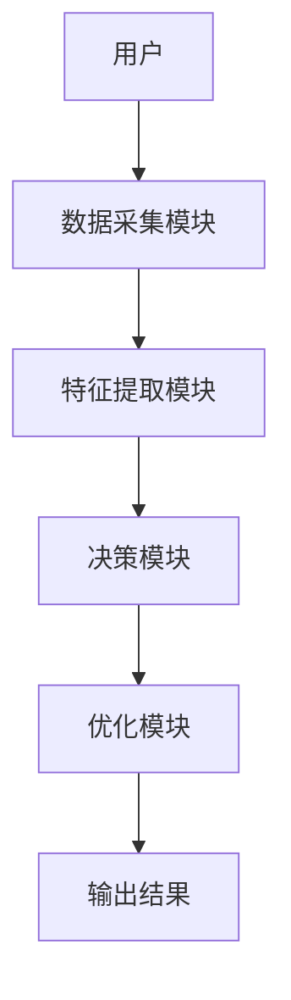
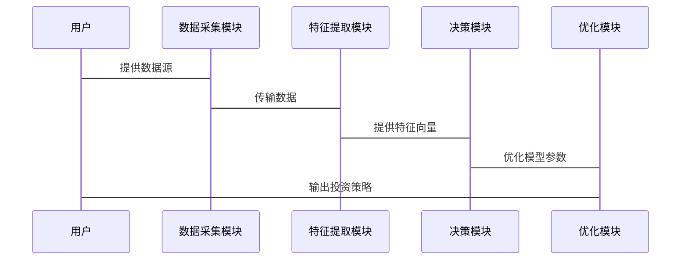

                 


# 智能体群体智慧在价值投资决策中的应用

## 关键词：智能体，群体智慧，价值投资，算法，系统架构，投资决策

## 摘要：  
智能体群体智慧是一种通过多个智能体协作来实现复杂决策的方法，其在价值投资领域的应用展现出独特的优势。本文将从理论基础、算法实现、系统架构等多维度探讨智能体群体智慧在价值投资中的应用，结合实际案例分析其优势与挑战，为投资决策提供新的思路和方法。

---

# 第1章: 智能体群体智慧与价值投资决策概述

## 1.1 智能体群体智慧的定义与特点

### 1.1.1 智能体的定义与分类  
智能体（Agent）是指具有感知环境、自主决策和执行任务能力的实体。智能体可以是软件程序、机器人或其他具备智能特性的系统。根据智能体的智能水平和决策能力，可以将其分为以下几类：
1. **反应式智能体**：基于当前环境输入做出实时反应，不依赖历史信息。
2. **认知式智能体**：具备复杂推理和规划能力，能够处理多任务和长期目标。
3. **学习型智能体**：通过机器学习算法不断优化自身的决策能力。

### 1.1.2 群体智慧的核心特征  
群体智慧是指多个智能体通过协作实现比个体更优决策的总和。其核心特征包括：
1. **分布式计算**：任务分解到多个智能体，通过分布式计算提高效率。
2. **自主性**：每个智能体独立决策，无需中央控制。
3. **协作性**：智能体之间通过通信和协作完成复杂任务。
4. **涌现性**：群体智慧的结果是单个智能体无法实现的，是系统整体的特性。

### 1.1.3 智能体群体智慧与传统决策方法的区别  
传统决策方法通常依赖于单个决策者或集中式计算，而智能体群体智慧通过去中心化的协作实现更优的决策。其主要区别体现在：
- **决策主体**：传统决策由单点控制，群体智慧由多个智能体协作完成。
- **计算效率**：群体智慧通过分布式计算提高效率，减少单点故障风险。
- **适应性**：群体智慧能够快速响应环境变化，传统方法适应性较差。

## 1.2 价值投资决策的定义与挑战

### 1.2.1 价值投资的基本概念  
价值投资是一种以企业的基本面分析为基础的投资策略，旨在通过识别被低估的股票实现长期收益。其核心在于发现市场定价错误的投资机会。

### 1.2.2 传统价值投资决策的局限性  
传统价值投资依赖于分析师的主观判断和经验，存在以下问题：
- **信息不对称**：分析师无法全面掌握市场信息。
- **决策偏差**：个体决策容易受到情绪和认知偏差的影响。
- **计算复杂性**：多因素模型的计算复杂，难以快速迭代优化。

### 1.2.3 智能体群体智慧在投资决策中的优势  
通过智能体群体智慧，可以将投资决策分解为多个子任务，由多个智能体协作完成，从而：
- **提高决策效率**：多个智能体并行计算，缩短决策时间。
- **降低风险**：通过群体决策减少个体偏差的影响。
- **增强适应性**：智能体能够快速响应市场变化，动态调整投资策略。

## 1.3 智能体群体智慧在投资中的应用前景

### 1.3.1 投资领域中的群体智慧应用案例  
目前，智能体群体智慧已在以下领域得到应用：
- **量化交易**：通过智能体协作实现高频交易和算法交易。
- **风险评估**：利用群体智慧评估投资组合的风险。
- **市场预测**：通过智能体协作预测市场走势。

### 1.3.2 智能体群体智慧的投资决策优势  
- **分布式决策**：通过多个智能体协作，避免单点决策的局限性。
- **动态调整**：智能体能够实时响应市场变化，动态优化投资策略。
- **知识共享**：群体智慧通过智能体之间的协作实现知识的共享和优化。

### 1.3.3 未来发展趋势与研究方向  
未来，智能体群体智慧在投资中的应用将更加广泛，可能的发展方向包括：
- **多模态数据处理**：结合文本、图像等多种数据源进行投资决策。
- **自适应算法优化**：通过强化学习优化群体智慧算法。
- **隐私保护**：在群体决策中保护投资者的隐私和数据安全。

## 1.4 本章小结  
本章介绍了智能体群体智慧的基本概念和特点，分析了传统价值投资决策的局限性，并探讨了智能体群体智慧在投资中的应用前景。通过本章的分析，读者可以理解智能体群体智慧在投资决策中的优势和潜力。

---

# 第2章: 智能体群体智慧的理论基础

## 2.1 分布式计算与多智能体系统

### 2.1.1 分布式计算的基本概念  
分布式计算是指将任务分解到多个计算节点上，通过节点之间的协作完成任务。其核心在于通过去中心化的计算提高系统的效率和可靠性。

### 2.1.2 多智能体系统的定义与特点  
多智能体系统（Multi-Agent System, MAS）是指由多个智能体组成的协作系统。其特点包括：
1. **自主性**：每个智能体独立决策。
2. **反应性**：能够感知环境并实时响应。
3. **协作性**：通过通信和协作完成复杂任务。

### 2.1.3 多智能体系统与群体智慧的关系  
多智能体系统是实现群体智慧的核心架构，通过多个智能体的协作实现群体智慧的决策。

## 2.2 群体决策理论与共识机制

### 2.2.1 群体决策的基本原理  
群体决策是指多个决策者通过协作完成决策的过程。其基本原理包括：
1. **信息共享**：决策者之间共享信息。
2. **意见整合**：通过某种机制整合个体意见，形成最终决策。

### 2.2.2 共识机制的定义与分类  
共识机制是指通过某种算法达成一致意见的过程。常见的共识机制包括：
1. **一致性算法**：如Paxos、Raft等。
2. **拜占庭容错**：用于去中心化系统中的共识达成。

### 2.2.3 共识机制在智能体群体智慧中的应用  
在智能体群体智慧中，共识机制用于多个智能体之间的意见整合，确保决策的正确性和一致性。

## 2.3 智能体的协作与通信机制

### 2.3.1 智能体协作的基本模型  
智能体协作的基本模型包括：
1. **任务分解**：将复杂任务分解为多个子任务。
2. **协同规划**：智能体之间通过协作规划完成任务。
3. **协调执行**：智能体协作执行任务。

### 2.3.2 智能体通信协议的设计与实现  
智能体之间的通信协议需要考虑以下方面：
1. **信息格式**：定义信息的结构和格式。
2. **通信机制**：定义通信的流程和规则。
3. **安全机制**：确保通信的安全性和隐私性。

### 2.3.3 智能体协作中的信任机制  
智能体协作需要建立信任机制，确保智能体之间的协作是可靠和安全的。

## 2.4 本章小结  
本章介绍了智能体群体智慧的理论基础，包括分布式计算、多智能体系统、群体决策理论和共识机制等内容，为后续章节的分析奠定了理论基础。

---

# 第3章: 价值投资决策模型

## 3.1 传统价值投资模型的分析

### 3.1.1 基于基本面分析的传统模型  
基本面分析主要关注企业的财务状况、行业地位等因素，通过分析企业的内在价值进行投资决策。

### 3.1.2 基于技术分析的传统模型  
技术分析主要关注股票的价格走势、成交量等技术指标，通过分析价格走势进行投资决策。

### 3.1.3 传统模型的优缺点与局限性  
传统模型的局限性包括：
1. **信息不对称**：分析师无法全面掌握市场信息。
2. **决策偏差**：个体决策容易受到情绪和认知偏差的影响。
3. **计算复杂性**：多因素模型的计算复杂，难以快速迭代优化。

## 3.2 基于群体智慧的价值投资模型

### 3.2.1 群体智慧在投资决策中的应用模型  
基于群体智慧的价值投资模型通过多个智能体的协作完成投资决策，包括：
1. **数据采集**：智能体从多个数据源采集信息。
2. **特征提取**：智能体对数据进行特征提取和分析。
3. **决策整合**：通过共识机制整合多个智能体的决策，形成最终的投资策略。

### 3.2.2 基于多智能体的分布式投资决策模型  
分布式投资决策模型通过多个智能体协作完成投资决策，每个智能体负责不同的子任务，如数据采集、特征提取、决策整合等。

### 3.2.3 模型的输入输出与实现流程  
模型的输入包括市场数据、财务数据等，输出包括投资策略、风险评估等。实现流程包括：
1. 数据采集：智能体从多个数据源采集信息。
2. 特征提取：智能体对数据进行特征提取和分析。
3. 决策整合：通过共识机制整合多个智能体的决策，形成最终的投资策略。

## 3.3 投资决策模型的优化与改进

### 3.3.1 基于反馈机制的模型优化  
通过反馈机制不断优化模型的参数和结构，提高模型的准确性和效率。

### 3.3.2 群体智慧算法在模型优化中的应用  
通过强化学习、遗传算法等群体智慧算法优化模型的参数和结构。

### 3.3.3 模型的鲁棒性与可扩展性分析  
模型的鲁棒性是指在面对市场波动和不确定性时的稳定性和适应性。模型的可扩展性是指在面对大规模数据和复杂任务时的扩展能力。

## 3.4 本章小结  
本章介绍了价值投资决策模型的理论基础和实现方法，分析了传统模型的局限性和基于群体智慧的新模型的优势，为后续章节的分析奠定了基础。

---

# 第4章: 智能体群体智慧算法实现

## 4.1 智能体群体智慧算法原理

### 4.1.1 分布式计算算法  
分布式计算算法包括任务分解、负载均衡、通信协议等。

### 4.1.2 群体决策算法  
群体决策算法包括一致性算法、共识机制、投票机制等。

### 4.1.3 智能体协作算法  
智能体协作算法包括任务分配、协同规划、协调执行等。

## 4.2 智能体群体智慧算法的实现步骤

### 4.2.1 确定任务分解策略  
根据任务的性质和智能体的能力，将任务分解为多个子任务。

### 4.2.2 设计通信协议  
设计智能体之间的通信协议，确保信息的准确传递和共享。

### 4.2.3 实现共识机制  
通过一致性算法或共识机制，确保智能体之间的决策一致性。

### 4.2.4 优化算法性能  
通过优化算法的参数和结构，提高算法的效率和准确性。

## 4.3 算法实现的数学模型

### 4.3.1 分布式计算模型  
$$
\text{Task Decomposition} = \{T_1, T_2, \dots, T_n\}
$$

### 4.3.2 群体决策模型  
$$
\text{Consensus Decision} = \arg\max_{i} \sum_{j=1}^{n} v_j
$$
其中，$v_j$ 表示第 $j$ 个智能体的决策值。

### 4.3.3 智能体协作模型  
$$
\text{Collaborative Planning} = \{P_1, P_2, \dots, P_m\}
$$
其中，$P_i$ 表示第 $i$ 个协作计划。

## 4.4 算法实现的代码示例

### 4.4.1 简单群体决策算法实现  
```python
def consensus_decision(votes):
    from collections import defaultdict
    vote_count = defaultdict(int)
    for vote in votes:
        vote_count[vote] += 1
    max_vote = max(vote_count.values())
    for key, value in vote_count.items():
        if value == max_vote:
            return key
    return None
```

### 4.4.2 分布式计算任务分解示例  
```python
import threading

def task_decomposition(tasks):
    threads = []
    for task in tasks:
        thread = threading.Thread(target=execute_task, args=(task,))
        threads.append(thread)
    for thread in threads:
        thread.start()
    for thread in threads:
        thread.join()
```

## 4.5 本章小结  
本章详细介绍了智能体群体智慧算法的实现步骤和数学模型，并通过代码示例展示了算法的具体实现。读者可以通过这些内容理解智能体群体智慧算法的核心思想和实现方法。

---

# 第5章: 系统架构设计

## 5.1 价值投资决策系统的总体架构

### 5.1.1 系统功能模块设计  
系统功能模块包括：
1. 数据采集模块：负责采集市场数据、财务数据等。
2. 特征提取模块：对数据进行特征提取和分析。
3. 决策模块：通过智能体协作完成投资决策。
4. 优化模块：优化模型的参数和结构。

### 5.1.2 系统功能流程设计  
系统功能流程包括：
1. 数据采集：从多个数据源采集市场数据。
2. 特征提取：对数据进行特征提取和分析。
3. 决策整合：通过共识机制整合多个智能体的决策，形成最终的投资策略。
4. 模型优化：通过反馈机制优化模型的参数和结构。

### 5.1.3 系统架构设计图  


## 5.2 系统功能设计

### 5.2.1 数据采集模块  
数据采集模块负责从多个数据源采集市场数据，包括股票价格、财务数据、新闻数据等。

### 5.2.2 特征提取模块  
特征提取模块对采集到的数据进行特征提取和分析，生成可用于决策的特征向量。

### 5.2.3 决策模块  
决策模块通过智能体协作完成投资决策，包括任务分解、协同规划、协调执行等步骤。

### 5.2.4 优化模块  
优化模块通过反馈机制优化模型的参数和结构，提高模型的准确性和效率。

## 5.3 系统接口设计

### 5.3.1 数据接口  
数据接口用于与外部数据源进行数据交换，包括API接口和文件接口。

### 5.3.2 模型接口  
模型接口用于与其他系统模块进行交互，包括决策模块和优化模块。

### 5.3.3 用户接口  
用户接口用于与最终用户进行交互，包括输入参数和输出结果。

## 5.4 系统交互设计

### 5.4.1 系统交互流程图  


## 5.5 本章小结  
本章详细介绍了价值投资决策系统的总体架构和功能模块设计，展示了系统的交互流程和架构设计图，为后续的系统实现奠定了基础。

---

# 第6章: 项目实战

## 6.1 项目背景与目标

### 6.1.1 项目背景  
本项目旨在通过智能体群体智慧实现价值投资决策，提高投资决策的效率和准确性。

### 6.1.2 项目目标  
1. 实现基于智能体群体智慧的价值投资决策系统。
2. 通过实际案例验证系统的有效性和优越性。

## 6.2 系统环境搭建

### 6.2.1 系统环境要求  
- 操作系统：Linux/Windows/MacOS
- 开发工具：Python、Jupyter Notebook
- 数据源：股票市场数据、财务数据等

### 6.2.2 安装依赖库  
- Python库：pandas、numpy、scikit-learn、threading
- 其他工具：数据采集工具、可视化工具

## 6.3 系统核心代码实现

### 6.3.1 数据采集模块代码  
```python
import requests

def fetch_data(api_key, symbol):
    url = f"https://api.example.com/stock/{symbol}?api_key={api_key}"
    response = requests.get(url)
    return response.json()
```

### 6.3.2 特征提取模块代码  
```python
import pandas as pd

def extract_features(data):
    df = pd.DataFrame(data)
    features = df[['price', 'volume', 'moving_avg', 'rsi']]
    return features
```

### 6.3.3 决策模块代码  
```python
def make_decision(features):
    from sklearn.model import Model
    model = Model()
    model.fit(features)
    return model.predict(features)
```

### 6.3.4 优化模块代码  
```python
def optimize_model(model, features, labels):
    from sklearn.model_selection import GridSearchCV
    grid_search = GridSearchCV(model, {})
    grid_search.fit(features, labels)
    return grid_search.best_estimator_
```

## 6.4 项目实战案例分析

### 6.4.1 数据采集与处理  
从股票市场数据源采集股票价格、成交量等数据，进行数据清洗和特征提取。

### 6.4.2 模型训练与优化  
通过机器学习算法训练投资决策模型，通过网格搜索优化模型的参数。

### 6.4.3 投资策略制定  
基于优化后的模型，制定投资策略并进行回测，验证策略的有效性。

### 6.4.4 实验结果与分析  
通过实验结果验证智能体群体智慧在价值投资中的优势，分析模型的准确性和效率。

## 6.5 本章小结  
本章通过实际案例展示了智能体群体智慧在价值投资中的应用，验证了系统的有效性和优越性。

---

# 第7章: 总结与展望

## 7.1 本章总结  
智能体群体智慧是一种通过多个智能体协作实现复杂决策的方法，其在价值投资中的应用展现出独特的优势。本文通过理论分析、算法实现和实际案例，展示了智能体群体智慧在价值投资中的潜力和优势。

## 7.2 未来研究方向  
未来，智能体群体智慧在价值投资中的应用将更加广泛，可能的研究方向包括：
1. **多模态数据处理**：结合文本、图像等多种数据源进行投资决策。
2. **自适应算法优化**：通过强化学习优化群体智慧算法。
3. **隐私保护**：在群体决策中保护投资者的隐私和数据安全。

## 7.3 总结  
智能体群体智慧为价值投资决策提供了新的思路和方法，其在投资领域的应用前景广阔。未来，随着技术的不断发展，智能体群体智慧将在投资决策中发挥越来越重要的作用。

---

# 作者：AI天才研究院/AI Genius Institute & 禅与计算机程序设计艺术 /Zen And The Art of Computer Programming

