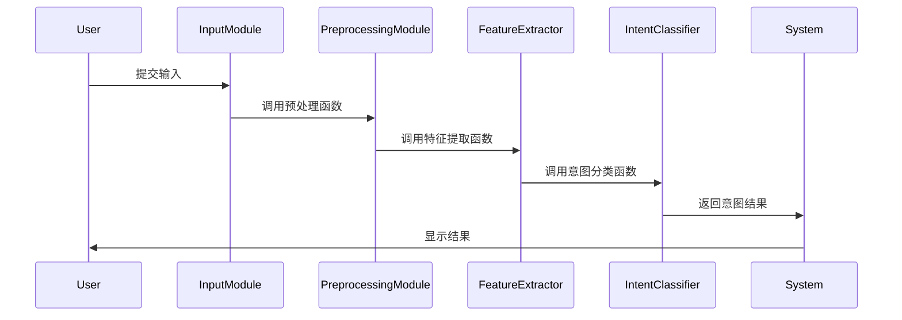

                 


# 构建AI Agent的对话意图识别系统

## 关键词：对话意图识别、AI Agent、自然语言处理、深度学习、机器学习、系统架构

## 摘要：  
对话意图识别是自然语言处理领域的重要任务，旨在理解用户在对话中的意图。本文将详细探讨如何构建一个基于AI Agent的对话意图识别系统，涵盖从理论到实践的全过程。我们将从基本概念入手，分析对话意图识别的核心原理，介绍常用的算法和技术，设计系统的架构，并通过项目实战展示如何实现一个高效的意图识别系统。最后，我们将总结经验，提供最佳实践建议，帮助读者更好地理解和应用对话意图识别技术。

---

## 第一部分: 对话意图识别系统概述

### 第1章: 对话意图识别系统背景介绍

#### 1.1 对话意图识别的基本概念
##### 1.1.1 问题背景与问题描述
对话意图识别是自然语言处理（NLP）的核心任务之一，旨在通过分析用户输入的文本，识别其背后的目的或意图。例如，当用户说“我想预订明天的机票”，系统需要识别出用户的意图是“预订机票”。  

##### 1.1.2 对话意图识别的核心目标
- 理解用户输入的语义含义。  
- 区分不同的意图类别。  
- 提供基于意图的智能响应。  

##### 1.1.3 对话意图识别的边界与外延
对话意图识别的边界在于识别意图，而不涉及后续的具体操作（如 booking机票的具体流程）。其外延则包括对上下文的理解和多轮对话的支持。  

##### 1.1.4 概念结构与核心要素组成
对话意图识别的系统通常由以下要素组成：  
1. **输入文本**：用户的原始输入。  
2. **意图分类器**：用于识别意图的模型。  
3. **特征提取器**：从文本中提取有用的特征。  
4. **训练数据**：用于训练意图分类器的数据集。  

#### 1.2 AI Agent的定义与特点
##### 1.2.1 AI Agent的基本概念
AI Agent（智能体）是指能够感知环境并采取行动以实现目标的实体。在对话系统中，AI Agent通常表现为智能助手（如Siri、Alexa等）。  

##### 1.2.2 AI Agent的核心特点
- **自主性**：能够独立决策。  
- **反应性**：能够实时响应用户输入。  
- **学习能力**：能够通过数据优化自身性能。  

##### 1.2.3 AI Agent与对话意图识别的关系
对话意图识别是AI Agent实现智能交互的核心技术之一，通过识别用户的意图，AI Agent能够提供更精准的服务。  

#### 1.3 对话意图识别的技术背景
##### 1.3.1 自然语言处理技术的发展
NLP技术的进步为对话意图识别提供了坚实的基础，尤其是深度学习的兴起，使得意图识别的准确率大幅提升。  

##### 1.3.2 深度学习在对话系统中的应用
深度学习模型（如RNN、LSTM、Transformer）在对话意图识别中表现出色，能够捕捉复杂的语言模式。  

##### 1.3.3 对话意图识别的技术挑战
- 数据质量：需要大量标注数据。  
- 多义性：用户的表达可能存在歧义。  
- 上下文依赖：意图识别需要考虑对话历史。  

#### 1.4 对话意图识别的应用领域
##### 1.4.1 智能客服系统
通过意图识别，智能客服能够快速理解用户需求，提供精准的服务。  

##### 1.4.2 智能音箱与助手
如Siri、Alexa等设备通过意图识别实现语音交互。  

##### 1.4.3 智能推荐系统
意图识别能够帮助系统为用户推荐相关内容（如电影、商品）。  

##### 1.4.4 其他应用场景
包括教育、医疗、金融等领域的智能交互系统。  

#### 1.5 本章小结  
本章从背景和技术角度介绍了对话意图识别的重要性，并探讨了其在AI Agent中的应用。

---

## 第二部分: 对话意图识别的核心概念与联系

### 第2章: 对话意图识别的核心概念原理

#### 2.1 对话意图识别的原理
##### 2.1.1 对话上下文的理解
意图识别不仅依赖于单条文本，还需要考虑对话的上下文。例如，用户说“我饿了”，系统需要结合上下文判断用户是否需要推荐餐厅。  

##### 2.1.2 用户意图的分类
意图可以分为显式意图（如“我要预订机票”）和隐式意图（如“我需要放松，给我推荐电影”）。  

##### 2.1.3 意图识别的流程
1. **文本预处理**：分词、去停用词等。  
2. **特征提取**：提取文本的关键词、句式特征等。  
3. **意图分类**：基于特征进行意图预测。  

#### 2.2 对话意图识别的关键技术
##### 2.2.1 文本特征提取
- **关键词提取**：如TF-IDF。  
- **句法特征**：如句子的主谓结构。  

##### 2.2.2 意图分类器
常用的分类器包括朴素贝叶斯、支持向量机（SVM）、随机森林等。  

##### 2.2.3 模型训练与优化
通过标注数据训练分类器，并使用交叉验证优化模型性能。  

#### 2.3 对话意图识别的属性特征对比
| 方法              | 优点                           | 缺点                           |
|-------------------|--------------------------------|--------------------------------|
| 基于规则的方法    | 实现简单，适合特定场景         | 需要手动编写规则，扩展性差     |
| 基于统计的方法    | 可以自动学习数据中的模式       | 对特征工程依赖较高             |
| 基于深度学习的方法 | 准确率高，能够捕捉复杂模式     | 计算资源消耗大，需要大量数据   |

#### 2.4 对话意图识别的ER实体关系图
```mermaid
graph LR
    User-> Intent: 提出请求
    Intent-> Feature: 包含
    Feature-> Classifier: 用于分类
    Classifier-> Result: 输出意图
```

---

### 第3章: 对话意图识别的算法原理

#### 3.1 朴素贝叶斯算法
##### 3.1.1 算法原理
朴素贝叶斯基于条件概率公式进行分类，常用公式为：
$$ P(y|x) = \frac{P(x|y)P(y)}{P(x)} $$
其中，$y$ 是意图类别，$x$ 是输入文本。  

##### 3.1.2 实现步骤
1. 文本预处理：分词、去除停用词。  
2. 特征提取：统计词袋模型。  
3. 训练模型：计算各类别的概率和条件概率。  
4. 预测意图：基于概率最大化的原则进行分类。  

##### 3.1.3 代码示例
```python
from sklearn.naive_bayes import MultinomialNB
from sklearn.feature_extraction.text import TfidfVectorizer

# 数据预处理
text = "I want to book a flight"
vectorizer = TfidfVectorizer()
X = vectorizer.fit_transform([text])

# 训练模型
model = MultinomialNB()
model.fit(X, y)

# 预测意图
new_X = vectorizer.transform([text])
y_pred = model.predict(new_X)
print(y_pred)
```

#### 3.2 支持向量机（SVM）
##### 3.2.1 算法原理
SVM通过构建超平面将数据点分为不同类别，常用核函数包括线性核、RBF核等。  

##### 3.2.2 实现步骤
1. 特征提取：使用TF-IDF提取文本特征。  
2. 数据标准化：归一化特征值。  
3. 训练模型：使用SVM算法进行训练。  
4. 预测意图：基于训练好的模型进行分类。  

##### 3.2.3 代码示例
```python
from sklearn import svm

# 特征提取与标准化
X_train = ...  # 特征矩阵
y_train = ...  # 标签

model = svm.SVC(kernel='rbf')
model.fit(X_train, y_train)

# 预测意图
X_test = ...  # 测试特征矩阵
y_pred = model.predict(X_test)
print(y_pred)
```

#### 3.3 深度学习模型（如LSTM）
##### 3.3.1 算法原理
LSTM通过长短期记忆机制处理序列数据，适合处理对话上下文。  

##### 3.3.2 实现步骤
1. 数据预处理：将文本转换为序列数据。  
2. 构建模型：定义LSTM网络结构。  
3. 训练模型：使用反向传播优化权重。  
4. 预测意图：基于训练好的模型进行分类。  

##### 3.3.3 代码示例
```python
import tensorflow as tf
from tensorflow.keras import layers

# 构建模型
model = tf.keras.Sequential([
    layers.Embedding(input_dim=vocabulary_size, output_dim=embedding_dim),
    layers.LSTM(64),
    layers.Dense(num_classes, activation='softmax')
])
model.compile(optimizer='adam', loss='sparse_categorical_crossentropy', metrics=['accuracy'])
model.fit(X_train, y_train, epochs=10, batch_size=32)

# 预测意图
y_pred = model.predict(X_test)
print(y_pred)
```

---

## 第三部分: 对话意图识别系统的架构设计

### 第4章: 系统分析与架构设计方案

#### 4.1 问题场景介绍
我们假设用户与AI Agent进行多轮对话，系统需要实时识别用户的意图。  

#### 4.2 系统功能设计
##### 4.2.1 功能模块
- **输入模块**：接收用户输入。  
- **预处理模块**：文本清洗、分词。  
- **特征提取模块**：提取文本特征。  
- **意图分类模块**：基于特征进行意图分类。  
- **反馈模块**：返回分类结果或提示信息。  

##### 4.2.2 领域模型类图
```mermaid
classDiagram
    class User {
        +string input
        +void sendInput()
    }
    class IntentClassifier {
        +string[] features
        +string predictIntent(string input)
    }
    class System {
        +void processInput(string input)
    }
    User -> IntentClassifier: sendInput
    IntentClassifier -> System: predictIntent
```

#### 4.3 系统架构设计
##### 4.3.1 系统架构图
```mermaid
graph LR
    User->InputModule: 提交输入
    InputModule->PreprocessingModule: 进行文本清洗
    PreprocessingModule->FeatureExtractor: 提取特征
    FeatureExtractor->IntentClassifier: 进行意图分类
    IntentClassifier->System: 返回意图结果
```

##### 4.3.2 系统接口设计
- **输入接口**：接收用户输入的文本。  
- **输出接口**：返回意图分类结果。  

##### 4.3.3 系统交互流程


---

## 第四部分: 项目实战

### 第5章: 对话意图识别系统的实现

#### 5.1 环境配置
- 安装Python和必要的库（如scikit-learn、TensorFlow）。  

#### 5.2 系统核心实现
##### 5.2.1 数据预处理
```python
import pandas as pd
from sklearn.feature_extraction.text import TfidfVectorizer

# 加载数据
data = pd.read_csv('intent_data.csv')
text = data['text']
label = data['label']

# 特征提取
vectorizer = TfidfVectorizer()
X = vectorizer.fit_transform(text)
```

##### 5.2.2 特征提取与分类器实现
```python
from sklearn.model_selection import train_test_split
from sklearn.naive_bayes import MultinomialNB

# 划分训练集和测试集
X_train, X_test, y_train, y_test = train_test_split(X, label, test_size=0.2)

# 训练模型
model = MultinomialNB()
model.fit(X_train, y_train)

# 预测结果
y_pred = model.predict(X_test)
print(accuracy_score(y_test, y_pred))
```

#### 5.3 实际案例分析
以用户输入“我需要预订机票”为例，系统识别意图并返回结果。  

#### 5.4 项目小结  
本章通过实际案例展示了对话意图识别系统的实现过程，包括数据预处理、特征提取和模型训练。

---

## 第五部分: 最佳实践与总结

### 第6章: 对话意图识别系统的优化与维护

#### 6.1 最佳实践
- **数据质量**：确保训练数据的多样性和代表性。  
- **模型调优**：尝试不同的算法和超参数优化。  
- **上下文理解**：引入对话历史信息提升准确率。  

#### 6.2 小结与注意事项
- 对话意图识别是AI Agent实现智能交互的核心技术。  
- 系统设计需要考虑数据、算法和架构的综合优化。  

#### 6.3 拓展阅读
推荐阅读《自然语言处理实战》和《深度学习入门》等书籍，以深入理解相关技术。

---

## 作者：AI天才研究院/AI Genius Institute & 禅与计算机程序设计艺术 /Zen And The Art of Computer Programming

